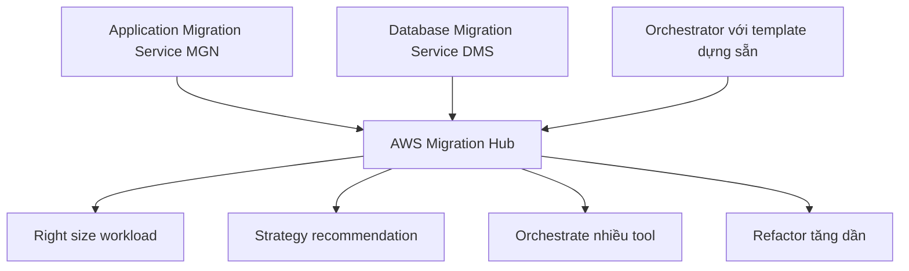

# 🗂️ AWS Migration Hub — trung tâm theo dõi mọi cuộc migration

> Nguồn: `248-AWS-Migration-Hub.txt` · [Udemy](https://ua.udemy.com/course/aws-certified-cloud-practitioner-new/learn/lecture/40425490)

Khi doanh nghiệp của bạn có hàng trăm server và ứng dụng cần chuyển lên AWS, bạn sẽ cần một nơi để nhìn thấy **toàn bộ bức tranh**. Đó chính là **AWS Migration Hub** — và trong đề thi, đây là đáp án cho mọi câu hỏi về "central location" (địa điểm tập trung) cho migration.

---

### 🗂️ Migration Hub là gì?

Migration Hub là một **hub (trung tâm)**, tức là một **central location (địa điểm tập trung)** để bạn **thu thập dữ liệu inventory (kiểm kê) của server và ứng dụng** phục vụ cho việc:

* **Assessment (đánh giá)**
* **Planning (lập kế hoạch)**
* **Tracking (theo dõi)** các cuộc migration lên AWS

Ý tưởng là mọi thứ được **tập trung hóa**, giúp bạn **tăng tốc migration** lên AWS và **tự động hóa quá trình lift-and-shift**.

---

### 🧩 Migration Hub Orchestrator

Migration Hub có một tính năng con tên là **AWS Migration Hub Orchestrator**, cho phép bạn dùng **pre-built templates (mẫu dựng sẵn)** để **tiết kiệm thời gian và công sức** khi migrate các enterprise app như:

* **SAP**
* **Microsoft SQL Server**
* ...và nhiều ứng dụng khác.

---

### 🔗 Tích hợp với các dịch vụ migration khác

Migration Hub được tích hợp với những dịch vụ chúng ta đã học, ví dụ:

* **Application Migration Service (MGN)**
* **Database Migration Service (DMS)**

*Mẹo thi cực quan trọng:* khi đề hỏi về **central location để discover, assess, plan và track migration cùng modernization**, đừng nghĩ ngợi gì nữa — đáp án là **Migration Hub**. Từ đó, bạn có thể:

* Nhìn thấy toàn bộ server và ứng dụng ở một nơi.
* **Right size workload** và nhận **strategy recommendation** (gợi ý chiến lược).
* **Orchestrate migrations** giữa nhiều công cụ khác nhau.
* **Refactor ứng dụng tăng dần (incrementally)** để chuyển chúng lên AWS.

---

### 🎯 Tự kiểm tra nhanh

**Câu 1:** AWS Migration Hub là gì?

<b>Xem đáp án</b>

**Đáp án:** Một central location để thu thập dữ liệu inventory của server và ứng dụng phục vụ assessment, planning và tracking migration.

Giải thích: Từ khóa "central location" trong đề thi trỏ thẳng đến Migration Hub.

Tham chiếu: Mục Migration Hub là gì.

**Câu 2:** Migration Hub Orchestrator dùng gì để tiết kiệm thời gian và công sức?

<b>Xem đáp án</b>

**Đáp án:** Pre-built templates (mẫu dựng sẵn).

Giải thích: Dùng cho các enterprise app như SAP, Microsoft SQL Server.

Tham chiếu: Mục Migration Hub Orchestrator.

**Câu 3:** Migration Hub được tích hợp với những dịch vụ nào đã học?

<b>Xem đáp án</b>

**Đáp án:** Application Migration Service (MGN) và Database Migration Service (DMS).

Giải thích: Đây là các dịch vụ migration quen thuộc được kết nối vào hub.

Tham chiếu: Mục Tích hợp với các dịch vụ migration khác.

**Câu 4:** Migration Hub giúp gì cho workload của bạn?

<b>Xem đáp án</b>

**Đáp án:** Right size workload và đưa ra strategy recommendation.

Giải thích: Cùng với orchestrate giữa nhiều tool và refactor tăng dần.

Tham chiếu: Mục Tích hợp với các dịch vụ migration khác.

**Câu 5:** Từ khóa nào trong đề thi khiến bạn nghĩ ngay đến Migration Hub?

<b>Xem đáp án</b>

**Đáp án:** Central location để discover, assess, plan và track migration và modernization.

Giải thích: Đây là định vị chính của dịch vụ.

Tham chiếu: Mục Tích hợp với các dịch vụ migration khác.

---

Vậy là các bạn đã nắm **AWS Migration Hub**: nơi tập trung mọi dữ liệu inventory, theo dõi và điều phối migration, với **Orchestrator** và các template dựng sẵn cho SAP, SQL Server. Ở bài tiếp theo, chúng ta sẽ tìm hiểu **AWS Fault Injection Simulator (FIS)** — dịch vụ "gây lỗi có chủ đích" để hệ thống vững vàng hơn. Hẹn gặp lại! 🚀
