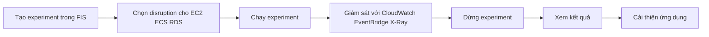

# 🧪 AWS Fault Injection Simulator (FIS) — gây "chaos" để hệ thống vững vàng hơn

> Nguồn: `249-AWS-Fault-Injection-Simulator-FIS.txt` · [Udemy](https://ua.udemy.com/course/aws-certified-cloud-practitioner-new/learn/lecture/29487050)

Hầu hết dịch vụ AWS giúp hệ thống chạy ổn định — còn **AWS Fault Injection Simulator (FIS)** thì ngược lại: nó **cố tình gây lỗi** để xem ứng dụng của bạn chịu đựng được đến đâu. Nghe lạ, nhưng đây là cách rất thông minh để tìm ra điểm yếu trước khi sự cố thật xảy ra.

---

### 💥 Chaos Engineering — nghệ thuật tạo ra hỗn loạn

**AWS Fault Injection Simulator (FIS)** là cách để bạn chạy các **fault injection experiments (thí nghiệm tiêm lỗi)** trên workload AWS. Dịch vụ này dựa trên khái niệm gọi là **Chaos Engineering (kỹ thuật hỗn loạn)**: bạn muốn **gây áp lực lên ứng dụng bằng những sự kiện cực kỳ phá hoại**, ví dụ:

* **CPU tăng vọt (skyrocketing)**
* **Memory bị hết (out of memory)**
* **Database gặp lỗi (failure)**
* ...và những tình huống tương tự.

Bạn muốn xem **toàn bộ application stack của mình phản ứng thế nào với các thảm họa này** — đó là lý do nó được gọi là Chaos Engineering: bạn thực sự **tạo ra hỗn loạn trong hạ tầng của mình**.

---

### 🎯 Vì sao phải tự tay phá hệ thống?

Mục đích là để **chắc chắn ứng dụng của bạn thực sự vững chắc**. Nhờ các thí nghiệm này, bạn có thể:

* **Phát hiện những bug ẩn (hidden bugs)** mà bình thường không bao giờ lộ ra.
* **Tìm ra performance bottlenecks (điểm nghẽn hiệu năng)**.

*Đây chính là tư duy "phòng bệnh hơn chữa bệnh" — thà phát hiện lỗi trong môi trường có kiểm soát còn hơn để sự cố thật đánh sập hệ thống.*

---

### 🧰 FIS hỗ trợ những dịch vụ nào?

FIS hiện hỗ trợ một số dịch vụ — *các bạn không cần nhớ hết danh sách, vì có thể sẽ còn bổ sung thêm theo thời gian*. Một vài ví dụ:

* **EC2** — chấm dứt (terminate) EC2 instance.
* **ECS** — dừng (stop) ECS task.
* **EKS** — dừng một Kubernetes task.
* **RDS** — gây lỗi (failure) trên database.

---

### ⚙️ Một thí nghiệm FIS diễn ra thế nào?

Quy trình gồm các bước:

1. **Tạo experiment** trong FIS, có thể dùng **pre-built templates (mẫu dựng sẵn)** để tạo các gián đoạn.
2. Chọn **disruption (gián đoạn)** sẽ áp lên tài nguyên: điều gì xảy ra với **EC2 instance**, **ECS cluster**, **RDS database**...
3. **Chạy experiment** — tài nguyên bị gián đoạn, và bạn quan sát ứng dụng phản ứng ra sao.
4. **Giám sát** bằng **CloudWatch**, **EventBridge**, **X-Ray** hoặc bất kỳ công cụ nào bạn muốn.
5. **Dừng experiment** và xem kết quả.

Sau khi xem kết quả, bạn tự hỏi: **có vấn đề hiệu năng không? Có vấn đề observability (khả năng quan sát) hay resiliency (khả năng phục hồi) không?** Từ đó, bạn cải thiện ứng dụng và xử lý các điểm nghẽn.

*FIS là dạng monitoring và debugging nâng cao — nhưng cực kỳ hữu ích, và mình rất mừng vì AWS đã đưa nó thành tính năng native ngay trong nền tảng.*

---

### 🎯 Tự kiểm tra nhanh

**Câu 1:** FIS dựa trên khái niệm nào?

<b>Xem đáp án</b>

**Đáp án:** Chaos Engineering.

Giải thích: Bạn chủ động tạo ra hỗn loạn trong hạ tầng để kiểm tra ứng dụng.

Tham chiếu: Mục Chaos Engineering.

**Câu 2:** Mục đích của FIS là gì?

<b>Xem đáp án</b>

**Đáp án:** Phát hiện bug ẩn và performance bottleneck để làm ứng dụng vững chắc hơn.

Giải thích: Thí nghiệm tiêm lỗi cho thấy cách toàn bộ stack phản ứng với thảm họa.

Tham chiếu: Mục Vì sao phải tự tay phá hệ thống.

**Câu 3:** Kể tên một số dịch vụ mà FIS hỗ trợ gây lỗi.

<b>Xem đáp án</b>

**Đáp án:** EC2 (terminate instance), ECS (stop task), EKS (dừng Kubernetes task), RDS (gây failure).

Giải thích: Không cần nhớ hết danh sách vì có thể còn bổ sung thêm.

Tham chiếu: Mục FIS hỗ trợ những dịch vụ nào.

**Câu 4:** Bạn có thể giám sát thí nghiệm FIS bằng những công cụ nào?

<b>Xem đáp án</b>

**Đáp án:** CloudWatch, EventBridge, X-Ray hoặc bất kỳ công cụ nào bạn muốn.

Giải thích: Mục đích là quan sát cách ứng dụng phản ứng khi bị gián đoạn.

Tham chiếu: Mục Một thí nghiệm FIS diễn ra thế nào.

**Câu 5:** Sau khi dừng experiment, bạn nên làm gì?

<b>Xem đáp án</b>

**Đáp án:** Xem kết quả để tìm vấn đề performance, observability, resiliency rồi cải thiện ứng dụng và xử lý bottleneck.

Giải thích: Đây là giá trị chính mà FIS mang lại.

Tham chiếu: Mục Một thí nghiệm FIS diễn ra thế nào.

---

Vậy là các bạn đã nắm **AWS Fault Injection Simulator**: tạo experiment, dùng template gây gián đoạn trên EC2/ECS/EKS/RDS, giám sát bằng CloudWatch, EventBridge hay X-Ray, rồi cải thiện ứng dụng. Ở bài tiếp theo, chúng ta tìm hiểu **AWS Step Functions** — công cụ dựng workflow trực quan. Hẹn gặp lại! 🚀
