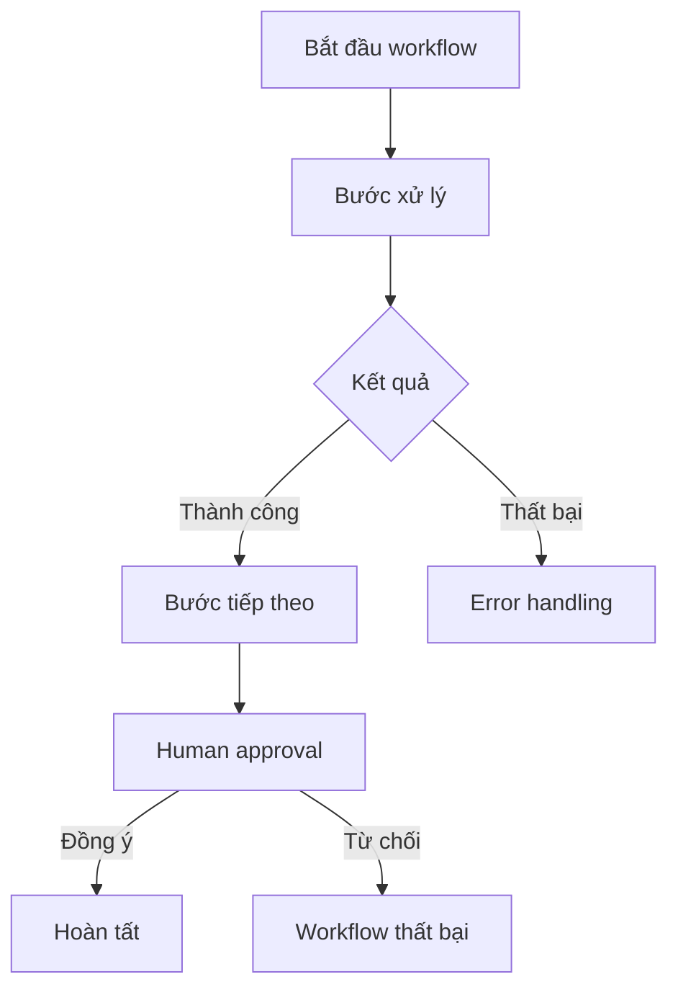

# 🔗 AWS Step Functions — dựng workflow trực quan cho hệ thống serverless

> Nguồn: `250-Step-Functions.txt` · [Udemy](https://ua.udemy.com/course/aws-certified-cloud-practitioner-new/learn/lecture/33532758)

Khi hệ thống của bạn có nhiều bước xử lý nối tiếp nhau, làm sao để "chỉ huy" chúng một cách rõ ràng? Câu trả lời là **AWS Step Functions** — dịch vụ giúp bạn vẽ ra **workflow (luồng công việc) trực quan** và để AWS lo phần điều phối.

---

### 💡 Step Functions là gì?

Step Functions là cách để bạn xây dựng một **serverless visual workflow (workflow trực quan, không cần quản lý server)** nhằm thực hiện **orchestration (điều phối)** — thường là điều phối các **Lambda function** của bạn.

Cách làm rất trực quan: bạn **thiết kế một graph (đồ thị)** và tại mỗi bước, bạn định nghĩa **nếu thành công hoặc thất bại thì bước tiếp theo là gì**. Nhờ đó, bạn có thể xây dựng những **workflow phức tạp** ngay trong AWS.

---

### ⚙️ Các tính năng bên trong

Step Functions cung cấp nhiều tính năng nội bộ mạnh mẽ:

* **Sequencing** — xử lý tuần tự các bước
* **Parallel functions** — chạy song song
* **Conditions** — điều kiện rẽ nhánh
* **Timeouts** — giới hạn thời gian
* **Error handling** — xử lý lỗi
* ...và còn rất nhiều thứ khác.

---

### 🔌 Không chỉ có Lambda

Step Functions **không chỉ làm việc với Lambda function**. Nó có thể tích hợp với:

* **EC2 instance**
* **ECS task**
* **On-premises server (server tại chỗ)**
* **API Gateway**
* **SQS queue**
* ...và **rất nhiều dịch vụ AWS khác**.

*Đây là lý do Step Functions trở thành "nhạc trưởng" cho các hệ thống phức tạp — mọi thành phần đều có thể được đưa vào cùng một workflow.*

---

### 🙋 Human approval và các use case

Một tính năng rất thú vị: bạn có thể triển khai **human approval (phê duyệt bởi con người)** ngay trong workflow. Ví dụ:

1. Workflow chạy đến một điểm nhất định.
2. Một người sẽ xem xét kết quả.
3. Nếu người đó nói **"Yes"** → workflow tiếp tục.
4. Nếu **"No"** → workflow thất bại.

Các use case của Step Functions rất đa dạng:

* **Order fulfillment (xử lý đơn hàng)**
* **Data processing (xử lý dữ liệu)**
* **Web application**
* Bất kỳ workflow phức tạp nào cần một **graph để hình dung**.

---

### 🎯 Tự kiểm tra nhanh

**Câu 1:** Step Functions dùng để làm gì?

<b>Xem đáp án</b>

**Đáp án:** Xây dựng serverless visual workflow để orchestration, thường là điều phối Lambda function.

Giải thích: Bạn thiết kế graph và định nghĩa bước tiếp theo khi thành công hoặc thất bại.

Tham chiếu: Mục Step Functions là gì.

**Câu 2:** Kể tên một vài tính năng nội bộ của Step Functions.

<b>Xem đáp án</b>

**Đáp án:** Sequencing, parallel functions, conditions, timeouts, error handling...

Giải thích: Nhờ đó có thể xây dựng workflow phức tạp.

Tham chiếu: Mục Các tính năng bên trong.

**Câu 3:** Step Functions chỉ tích hợp với Lambda đúng hay sai?

<b>Xem đáp án</b>

**Đáp án:** Sai.

Giải thích: Nó còn tích hợp với EC2 instance, ECS task, on-premises server, API Gateway, SQS queue và nhiều dịch vụ AWS khác.

Tham chiếu: Mục Không chỉ có Lambda.

**Câu 4:** Human approval trong Step Functions hoạt động thế nào?

<b>Xem đáp án</b>

**Đáp án:** Workflow dừng để con người xem xét; nếu "Yes" thì tiếp tục, nếu "No" thì thất bại.

Giải thích: Đây là tính năng cho phép phê duyệt thủ công trong workflow.

Tham chiếu: Mục Human approval và các use case.

**Câu 5:** Nêu một vài use case của Step Functions.

<b>Xem đáp án</b>

**Đáp án:** Order fulfillment, data processing, web application, hoặc bất kỳ workflow phức tạp nào cần graph để hình dung.

Giải thích: Dịch vụ phù hợp với mọi luồng công việc phức tạp.

Tham chiếu: Mục Human approval và các use case.

---

Vậy là các bạn đã nắm **AWS Step Functions**: workflow trực quan, tích hợp rộng khắp, hỗ trợ cả human approval — công cụ orchestration rất đáng nhớ. Ở bài tiếp theo, chúng ta sẽ "lên vũ trụ" với **AWS Ground Station** — dịch vụ kết nối vệ tinh với cloud. Hẹn gặp lại! 🚀
