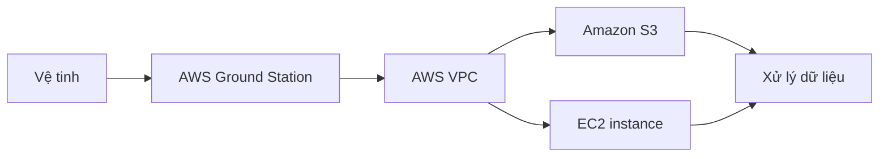

# 📡 AWS Ground Station — đưa dữ liệu vệ tinh lên cloud trong vài giây

> Nguồn: `251-Ground-Station.txt` · [Udemy](https://ua.udemy.com/course/aws-certified-cloud-practitioner-new/learn/lecture/33532766)

Có một dịch vụ AWS mà mình chắc chắn các bạn sẽ không quên sau khi nghe qua: **AWS Ground Station** — dịch vụ kết nối **vệ tinh** với đám mây AWS. Nghe có vẻ xa vời, nhưng biết đâu đề thi lại hỏi đấy!

---

### 🛰️ Ground Station là gì?

**AWS Ground Station** là một **fully managed service (dịch vụ được quản lý hoàn toàn)** cho phép bạn:

* **Điều khiển liên lạc vệ tinh (satellite communication)**
* **Xử lý dữ liệu (process data)**
* **Mở rộng quy mô hoạt động vệ tinh (scale satellite operations)**

Đây không phải dịch vụ dành cho tất cả mọi người — nhưng trên quỹ đạo quanh Trái Đất có **rất nhiều vệ tinh**, và bạn có thể muốn truy cập dữ liệu của chúng vì bất kỳ mục đích gì.

---

### 🌍 Mạng lưới trạm mặt đất toàn cầu

Ground Station cung cấp cho bạn một **global network of satellite ground stations (mạng lưới trạm mặt đất vệ tinh toàn cầu)** đặt **gần các AWS region**.

Nhờ vậy, việc lấy dữ liệu từ vệ tinh lên cloud AWS trở nên dễ dàng hơn rất nhiều.

---

### ⚙️ Dữ liệu đi như thế nào?

Luồng hoạt động khá đơn giản:

* **Ground Station chạy bên trong cloud** và được kết nối với các vệ tinh.
* Bạn có thể **tải dữ liệu vệ tinh về AWS VPC chỉ trong vài giây**.
* Dữ liệu được tải về **Amazon S3 bucket** hoặc **EC2 instance**.
* Từ đó, bạn **xử lý dữ liệu theo cách mình muốn**.

*Tin mình đi: làm việc này trước khi có Ground Station là cực kỳ khó — còn bây giờ thì rất dễ.*

---

### 💼 Use case của Ground Station

Nếu bạn có quyền truy cập vệ tinh, các use case bao gồm:

* **Weather forecasting (dự báo thời tiết)**
* **Surface imaging (chụp ảnh bề mặt)**
* **Communications (liên lạc)**
* **Video broadcast (truyền phát video)**

---

### 🎯 Tự kiểm tra nhanh

**Câu 1:** AWS Ground Station là dịch vụ gì?

<b>Xem đáp án</b>

**Đáp án:** Fully managed service cho phép điều khiển liên lạc vệ tinh, xử lý dữ liệu và mở rộng hoạt động vệ tinh.

Giải thích: Dịch vụ kết nối vệ tinh với cloud AWS.

Tham chiếu: Mục Ground Station là gì.

**Câu 2:** Ground Station cung cấp mạng lưới gì?

<b>Xem đáp án</b>

**Đáp án:** Mạng lưới trạm mặt đất vệ tinh toàn cầu, đặt gần các AWS region.

Giải thích: Giúp lấy dữ liệu từ vệ tinh lên AWS dễ dàng hơn.

Tham chiếu: Mục Mạng lưới trạm mặt đất toàn cầu.

**Câu 3:** Dữ liệu vệ tinh có thể được tải về trong bao lâu?

<b>Xem đáp án</b>

**Đáp án:** Chỉ trong vài giây, vào AWS VPC.

Giải thích: Ground Station chạy trong cloud và kết nối trực tiếp với vệ tinh.

Tham chiếu: Mục Dữ liệu đi như thế nào.

**Câu 4:** Dữ liệu vệ tinh được tải về những đích nào?

<b>Xem đáp án</b>

**Đáp án:** Amazon S3 bucket hoặc EC2 instance.

Giải thích: Từ đó bạn xử lý dữ liệu theo nhu cầu.

Tham chiếu: Mục Dữ liệu đi như thế nào.

**Câu 5:** Nêu các use case của Ground Station.

<b>Xem đáp án</b>

**Đáp án:** Weather forecasting, surface imaging, communications, video broadcast.

Giải thích: Áp dụng khi bạn có quyền truy cập vệ tinh.

Tham chiếu: Mục Use case của Ground Station.

---

Vậy là các bạn đã biết **AWS Ground Station**: mạng lưới trạm mặt đất toàn cầu, tải dữ liệu vệ tinh về S3/EC2 trong vài giây, phục vụ dự báo thời tiết, chụp ảnh bề mặt, liên lạc và truyền phát video. Ở bài tiếp theo, chúng ta tìm hiểu **Amazon Pinpoint** — nền tảng marketing đa kênh của AWS. Hẹn gặp lại! 🚀
