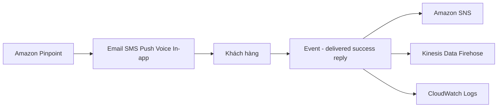

# 📣 Amazon Pinpoint — nền tảng marketing đa kênh của AWS

> Nguồn: `252-AWS-Pinpoint.txt` · [Udemy](https://ua.udemy.com/course/aws-certified-cloud-practitioner-new/learn/lecture/33934174)

Chúng ta cùng tìm hiểu **Amazon Pinpoint** — dịch vụ marketing đa kênh có thể mở rộng theo cả hai chiều: **inbound (nhận)** và **outbound (gửi)**. Nếu doanh nghiệp của bạn muốn gửi email, SMS hay push notification đến hàng triệu khách hàng, đây chính là công cụ dành cho bạn.

---

### 💡 Pinpoint là gì?

Amazon Pinpoint là dịch vụ **scalable inbound và outbound marketing communication** — tức là bạn có thể **gửi** và **nhận** liên lạc marketing ở quy mô lớn. Các kênh gửi bao gồm:

* **Email**
* **SMS**
* **Push notification (thông báo đẩy)**
* **Voice (thoại)**
* **In-app messaging (tin nhắn trong ứng dụng)**

Một trong những **use case chính là SMS**: khách hàng sẽ nhận được tin nhắn SMS do bạn gửi từ Amazon Pinpoint.

---

### 🎯 Phân khúc và cá nhân hóa

Pinpoint cho phép bạn:

* **Segment (phân khúc)** và **personalize (cá nhân hóa)** tin nhắn với **đúng nội dung** cho từng khách hàng.
* Tạo **group (nhóm)** và **segment (phân khúc)** theo nhu cầu.
* **Nhận phản hồi (replies)** từ khách hàng.

Và dịch vụ này **mở rộng tới hàng tỷ tin nhắn mỗi ngày** — con số đủ để thấy nó mạnh cỡ nào.

---

### 📊 Use case và luồng sự kiện

Các use case điển hình của Pinpoint:

* **Chạy campaign (chiến dịch)** bằng cách gửi **marketing email hàng loạt (in bulk)**.
* Gửi **transactional SMS (SMS giao dịch)**.

Khi có người phản hồi hoặc khi tin nhắn thành công, **tất cả event (sự kiện)** — ví dụ **text success, text delivered, replies**... — sẽ được đưa đến:

* **Amazon SNS**
* **Kinesis Data Firehose**
* **CloudWatch Logs**

Nhờ đó, bạn có thể **xây dựng bất kỳ loại automation (tự động hóa)** nào trên nền Amazon Pinpoint.

---

### 🆚 Pinpoint khác gì SNS và SES?

Bạn có thể thắc mắc: Pinpoint khác gì **Amazon SNS** hay **Amazon SES**? Quả thật chúng có phần chồng lấn, nhưng khác biệt nằm ở việc **ai quản lý cái gì**:

| Tiêu chí | SNS / SES | Amazon Pinpoint |
|---|---|---|
| Quản lý audience, content, lịch gửi | **Ứng dụng của bạn** phải tự quản lý từng message | **Pinpoint quản lý** toàn bộ |
| Công cụ hỗ trợ | Không có sẵn | Message templates, delivery schedules, segment nhắm mục tiêu, full campaign |
| Khối lượng công việc | Nhiều, có thể **không mở rộng tốt** | Quản lý tập trung, dễ mở rộng |
| Định vị | Nhắn tin cơ bản | **Bước tiến hóa tiếp theo** cho marketing chuyên nghiệp |

*Hãy xem Pinpoint là **bước tiến hóa tiếp theo của SNS và SES**, dành cho những ai muốn làm **marketing communication bài bản, đầy đủ tính năng**.*

---

### 🎯 Tự kiểm tra nhanh

**Câu 1:** Pinpoint là loại dịch vụ gì?

<b>Xem đáp án</b>

**Đáp án:** Dịch vụ marketing communication có thể mở rộng, hỗ trợ cả inbound và outbound.

Giải thích: Dùng để gửi và nhận liên lạc marketing ở quy mô lớn.

Tham chiếu: Mục Pinpoint là gì.

**Câu 2:** Pinpoint hỗ trợ những kênh gửi nào?

<b>Xem đáp án</b>

**Đáp án:** Email, SMS, push notification, voice và in-app messaging.

Giải thích: SMS là một trong những use case chính.

Tham chiếu: Mục Pinpoint là gì.

**Câu 3:** Sự kiện từ Pinpoint được gửi đến những đâu?

<b>Xem đáp án</b>

**Đáp án:** Amazon SNS, Kinesis Data Firehose và CloudWatch Logs.

Giải thích: Nhờ đó bạn xây dựng automation trên nền Pinpoint.

Tham chiếu: Mục Use case và luồng sự kiện.

**Câu 4:** Điểm khác biệt cốt lõi giữa Pinpoint và SNS/SES là gì?

<b>Xem đáp án</b>

**Đáp án:** Với SNS/SES, ứng dụng của bạn phải tự quản lý audience, content và delivery schedule; còn Pinpoint cung cấp template, lịch gửi, segment và full campaign do dịch vụ quản lý.

Giải thích: Vì vậy Pinpoint được xem là bước tiến hóa tiếp theo của SNS và SES.

Tham chiếu: Mục Pinpoint khác gì SNS và SES.

**Câu 5:** Pinpoint mở rộng tới quy mô nào?

<b>Xem đáp án</b>

**Đáp án:** Hàng tỷ tin nhắn mỗi ngày.

Giải thích: Đây là con số thể hiện khả năng mở rộng của dịch vụ.

Tham chiếu: Mục Phân khúc và cá nhân hóa.

---

Vậy là các bạn đã nắm **Amazon Pinpoint**: marketing đa kênh, phân khúc và cá nhân hóa, mở rộng đến hàng tỷ tin nhắn mỗi ngày, và là "bước tiến hóa" của SNS/SES. Chúng ta cũng đã đi hết chương **Other Services** rồi đấy! Ở chương tiếp theo, chúng ta sẽ bước sang **AWS Architecting & Ecosystem** — nơi các mảnh ghép kiến thức được kết nối lại với nhau. Hẹn gặp lại! 🚀
