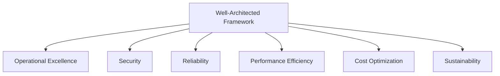

# 🏛️ AWS Well-Architected Framework: 6 trụ cột của một kiến trúc "chuẩn"

> Nguồn: `253-AWS-WhitePapers-Well-Architected-Framework.txt` · [Udemy](https://ua.udemy.com/course/aws-certified-cloud-practitioner-new/learn/lecture/20056474)

Chào mừng các bạn đến với section **Architecting on AWS & AWS Ecosystem**! Đây là phần rất thú vị: chúng ta sẽ học cách tư duy như một kiến trúc sư giải pháp trên cloud, bắt đầu từ **Well-Architected Framework (khung kiến trúc tốt)** và 6 trụ cột nổi tiếng của nó.

*Đừng lo nếu bạn chưa có nền IT — mình sẽ giải thích mọi thứ bằng ví dụ đời thường, và đây là kiến thức nền tảng rất đáng để hiểu.*

---

### 🧭 Nguyên tắc chung khi thiết kế trên cloud

Khi làm việc trên cloud, các bạn cần thay đổi cách suy nghĩ so với môi trường on-premises (tại chỗ):

* **Đừng đoán nhu cầu capacity (dung lượng):** hãy dùng **auto scaling (tự động mở rộng)** và scale theo nhu cầu thực tế của hệ thống.
* **Kiểm thử ở quy mô production:** trên cloud, bạn có thể tạo tài nguyên cực nhanh, nên chẳng có lý do gì không test hệ thống ở quy mô thật — kể cả chỉ trong một giờ — để chắc chắn sẵn sàng khi ra mắt khách hàng.
* **Tự động hóa để thử nghiệm kiến trúc dễ dàng hơn:** **CloudFormation** rất quan trọng vì **infrastructure as code (hạ tầng dưới dạng mã)** cho phép tạo lại kiến trúc trên nhiều account và region khác nhau. Các nền tảng **platform as a service (nền tảng dịch vụ)** như **Beanstalk** cũng giúp thử nghiệm nhanh.
* **Để kiến trúc tiến hóa:** thiết kế dựa trên yêu cầu thay đổi. Khi migrate workload từ on-premises lên cloud, ban đầu có thể giống y hệt, nhưng sau đó hãy nghĩ lại xem tận dụng cloud tốt hơn thế nào — ví dụ chuyển sang serverless.
* **Dùng dữ liệu dẫn dắt kiến trúc:** đừng đoán, hãy nhìn vào cách hệ thống thực sự được dùng — pattern, truy vấn — rồi chọn dịch vụ phù hợp.
* **Cải thiện qua game days:** mô phỏng các ngày flash sale để "stress test" hệ thống. Netflix có chương trình **chaos monkey** chạy trong môi trường EC2, tự động tắt ngẫu nhiên các EC2 instance trong production để xem hệ thống có chịu được lỗi và những đợt tăng tải lớn hay không.

---

### 🧱 Những nguyên tắc thiết kế khi lên cloud

* **Scalable (khả năng mở rộng):** cả **vertical scalability (mở rộng dọc)** lẫn **horizontal scalability (mở rộng ngang)**, vì chúng ta có thể tạo và xóa server rất dễ dàng.
* **Disposable resources (tài nguyên dùng xong có thể bỏ):** server phải dễ thay thế và dễ cấu hình. Nếu nhồi quá nhiều cấu hình vào một server rồi lỡ mất nó, bạn có thể tốn ba ngày để dựng lại. Trên cloud, mọi thứ — kể cả hạ tầng — đều có thể bị hủy, nên hãy **backup dữ liệu, backup cấu hình** và có cách dựng lại toàn bộ kiến trúc thật nhanh.
* **Automation (tự động hóa):** được dẫn dắt bởi các nguyên tắc như serverless, infrastructure as a service, auto scaling...
* **Loose coupling (liên kết lỏng):** thay vì xây một **monolith (khối liền)** ngày càng to và khó bảo trì, khó mở rộng, hãy chia nhỏ thành các component liên kết lỏng — có thể nối với nhau qua **SNS** hoặc **SQS**. Thay đổi hay lỗi ở một component **không được lan sang** các component khác, vì trên cloud mọi thứ đều có thể hỏng và bạn phải chuẩn bị cho điều đó.
* **Think in services, not servers (nghĩ theo dịch vụ, không phải server):** đừng chỉ dịch nguyên hệ thống on-premises lên bằng EC2 — hãy nghĩ đến các **managed services (dịch vụ được quản lý)**, database, serverless... để cuộc sống dễ thở hơn rất nhiều.

*Cứ thong thả nhé — điều quan trọng là nắm được tinh thần: cloud cho chúng ta công cụ mới, hãy dùng đúng cách.*

---

### 🏛️ Well-Architected Framework và 6 trụ cột

Đây chính là lúc **Well-Architected Framework** xuất hiện. Khung này gồm **6 trụ cột**:

1. **Operational Excellence** — vận hành xuất sắc
2. **Security** — bảo mật
3. **Reliability** — độ tin cậy
4. **Performance Efficiency** — hiệu quả hiệu năng
5. **Cost Optimization** — tối ưu chi phí
6. **Sustainability** — tính bền vững

Điểm mình muốn các bạn nhớ kỹ: 6 trụ cột này **không phải để cân đối, thỏa hiệp hay đánh đổi** lẫn nhau — chúng tạo thành một **synergy (sự cộng hưởng)**. Ví dụ, khi bạn cải thiện operational excellence, bạn thường cũng đang tối ưu luôn cả chi phí.

Và như mình đã hứa, **6 bài giảng tiếp theo** sẽ là deep dive vào từng trụ cột để các bạn hiểu chúng thực sự nghĩa là gì trên AWS.

---

### 🎯 Tự kiểm tra nhanh

**Câu 1:** Trên cloud, thay vì đoán nhu cầu capacity, các bạn nên làm gì?

<b>Xem đáp án</b>

**Đáp án:** Dùng auto scaling và scale theo nhu cầu thực tế của hệ thống.

Giải thích: Cloud cho phép mở rộng linh hoạt, nên không cần đoán trước dung lượng.

Tham chiếu: Mục Nguyên tắc chung khi thiết kế trên cloud.

**Câu 2:** Netflix dùng "chaos monkey" để làm gì?

<b>Xem đáp án</b>

**Đáp án:** Tự động tắt ngẫu nhiên các EC2 instance trong production để kiểm tra khả năng chịu lỗi và chịu tải đột biến của hệ thống.

Giải thích: Đây là ví dụ điển hình của việc cải thiện hệ thống qua game days.

Tham chiếu: Mục Nguyên tắc chung khi thiết kế trên cloud.

**Câu 3:** Kể tên 6 trụ cột của Well-Architected Framework.

<b>Xem đáp án</b>

**Đáp án:** Operational Excellence, Security, Reliability, Performance Efficiency, Cost Optimization và Sustainability.

Giải thích: Đây là bộ khung đánh giá kiến trúc tốt trên AWS.

Tham chiếu: Mục Well-Architected Framework và 6 trụ cột.

**Câu 4:** Loose coupling giúp ích gì cho kiến trúc của bạn?

<b>Xem đáp án</b>

**Đáp án:** Chia ứng dụng monolith thành các component nhỏ liên kết lỏng, để thay đổi hay lỗi ở một component không lan sang các phần còn lại.

Giải thích: Trên cloud, mọi thứ đều có thể hỏng, nên cần cô lập ảnh hưởng của lỗi.

Tham chiếu: Mục Những nguyên tắc thiết kế khi lên cloud.

**Câu 5:** Quan hệ giữa 6 trụ cột là gì?

<b>Xem đáp án</b>

**Đáp án:** Là sự cộng hưởng (synergy), không phải sự đánh đổi — cải thiện trụ cột này thường kéo theo cải thiện trụ cột khác.

Giải thích: Ví dụ, operational excellence tốt hơn cũng giúp tối ưu chi phí tốt hơn.

Tham chiếu: Mục Well-Architected Framework và 6 trụ cột.

---

Vậy là các bạn đã có bản đồ tổng quan về kiến trúc trên AWS. *Hãy nhớ: đây không phải cuộc đua, cứ học từng trụ cột một thật chắc.*

Ở bài tiếp theo, chúng ta sẽ đi sâu vào trụ cột đầu tiên: **Operational Excellence**. Hẹn gặp các bạn ở đó! 🚀
