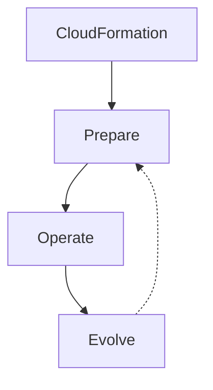

# ⚙️ Pillar 1 — Operational Excellence: vận hành hệ thống như một cỗ máy trơn tru

> Nguồn: `254-Pillar-1-Operational-Excellence.txt` · [Udemy](https://ua.udemy.com/course/aws-certified-cloud-practitioner-new/learn/lecture/20241384)

Chúng ta đã biết Well-Architected Framework có 6 trụ cột. Hôm nay, mình cùng các bạn đi sâu vào trụ cột đầu tiên: **Operational Excellence (vận hành xuất sắc)** — trụ cột nói về cách chạy và giám sát hệ thống để mang lại giá trị kinh doanh.

*Đây là bài mang tính giáo dục cao, mình sẽ không bắt các bạn học thuộc hết dịch vụ — cứ đọc để hiểu tinh thần trước đã nhé.*

---

### 📌 Operational Excellence là gì?

Trụ cột này được định nghĩa là **khả năng vận hành và giám sát hệ thống, mang lại giá trị kinh doanh, và liên tục cải thiện các quy trình, thủ tục hỗ trợ**.

Nói cách khác: hệ thống chạy tốt thôi chưa đủ — bạn còn phải làm cho cách vận hành của mình **ngày một tốt hơn theo thời gian**.

---

### 🧭 5 nguyên tắc thiết kế của Operational Excellence

1. **Thực hiện vận hành như code (operations as code):** dùng **infrastructure as code (hạ tầng dưới dạng mã)** — trên AWS, đó chính là **AWS CloudFormation**.
2. **Thay đổi thường xuyên, nhỏ và có thể đảo ngược:** nếu có lỗi, bạn có thể revert (hoàn tác) ngay. Nếu cứ ba tháng mới làm một thay đổi khổng lồ thì mọi thứ sẽ không ổn.
3. **Tinh chỉnh quy trình vận hành thường xuyên** và đảm bảo **mọi thành viên trong team đều quen** với quy trình mới.
4. **Dự đoán lỗi — và khi lỗi xảy ra, phải học từ chính nó:** thất bại là học hỏi; nếu không tiếp thu feedback từ thất bại, bạn sẽ không tiến bộ.
5. **Dùng managed services (dịch vụ được quản lý) để giảm gánh nặng vận hành**, đồng thời triển khai **observability (khả năng quan sát)** để có những insight hành động được — bao gồm hiệu năng, độ tin cậy và chi phí.

---

### 🛠️ Ba giai đoạn: Prepare — Operate — Evolve

**1. Prepare (chuẩn bị):** dùng **runbooks (sổ tay vận hành)**, xây dựng **tiêu chuẩn hạ tầng** tốt, chạy các bản deploy thử/mock deployment. Công cụ chính là **CloudFormation** để chuẩn bị mọi thứ dưới dạng infrastructure as code, kèm **AWS Config** — tuy chưa học sâu trong khóa này, nhưng Config có thể dùng để **đánh giá tính tuân thủ (compliance) của các template CloudFormation**.

**2. Operate (vận hành):** tự động hóa tối đa, release nhanh, tránh quy trình thủ công. Bộ công cụ gồm:

* **CloudFormation** và **AWS Config** — xương sống của vận hành.
* **CloudTrail** — theo dõi mọi **API call** để đảm bảo không có thay đổi nào ngoài ý muốn hoặc làm thủ công.
* **CloudWatch** — giám sát hiệu năng của stack theo thời gian.
* **X-Ray** — trace các **HTTP request**, phát hiện request lỗi và chỉ ra chính xác nơi vấn đề xảy ra.

**3. Evolve (tiến hóa hạ tầng theo thời gian):** **CloudFormation** tiếp tục là trung tâm, còn bộ công cụ **CI/CD (tích hợp và triển khai liên tục)** gồm **CodeBuild, CodeCommit, CodeDeploy, CodePipeline** giúp bạn lặp lại nhanh, deploy nhanh, deploy thường xuyên và deploy từng thay đổi nhỏ.

*Đừng lo nếu tên dịch vụ nghe lạ — các bạn chưa cần nhớ hết đâu.* Với kỳ thi, mình chỉ muốn các bạn thấy **các dịch vụ AWS cộng hưởng với nhau** như thế nào để tạo nên operational excellence. Nếu tò mò, các bạn có thể đọc thêm whitepaper của trụ cột này.

---

### 🎯 Tự kiểm tra nhanh

**Câu 1:** Operational Excellence tập trung vào điều gì?

<b>Xem đáp án</b>

**Đáp án:** Khả năng vận hành, giám sát hệ thống, mang lại giá trị kinh doanh và liên tục cải thiện quy trình.

Giải thích: Đây là định nghĩa chính thức của trụ cột đầu tiên.

Tham chiếu: Mục Operational Excellence là gì.

**Câu 2:** Vì sao nên thay đổi nhỏ và thường xuyên?

<b>Xem đáp án</b>

**Đáp án:** Để khi có lỗi, bạn có thể đảo ngược (revert) thay đổi dễ dàng.

Giải thích: Thay đổi lớn mỗi vài tháng sẽ rất khó kiểm soát khi xảy ra sự cố.

Tham chiếu: Mục 5 nguyên tắc thiết kế của Operational Excellence.

**Câu 3:** Dịch vụ nào giúp theo dõi các API call trong trụ cột này?

<b>Xem đáp án</b>

**Đáp án:** AWS CloudTrail.

Giải thích: CloudTrail giúp đảm bảo không có thay đổi thủ công hay ngoài ý muốn.

Tham chiếu: Mục Ba giai đoạn Prepare — Operate — Evolve.

**Câu 4:** X-Ray có tác dụng gì?

<b>Xem đáp án</b>

**Đáp án:** Trace các HTTP request, kiểm tra chúng hoạt động đúng không và chỉ ra nơi xảy ra lỗi.

Giải thích: X-Ray được nhắc trong giai đoạn Operate.

Tham chiếu: Mục Ba giai đoạn Prepare — Operate — Evolve.

**Câu 5:** Bộ công cụ nào giúp "tiến hóa" hạ tầng qua CI/CD?

<b>Xem đáp án</b>

**Đáp án:** CodeBuild, CodeCommit, CodeDeploy và CodePipeline.

Giải thích: Chúng cho phép lặp lại nhanh và deploy những thay đổi nhỏ thường xuyên.

Tham chiếu: Mục Ba giai đoạn Prepare — Operate — Evolve.

---

Vậy là các bạn đã nắm được trụ cột đầu tiên — nơi **CloudFormation** tỏa sáng như xương sống của vận hành. *Cứ từng bước một, mình tin các bạn sẽ thấy bức tranh ngày càng rõ.*

Ở bài tiếp theo, chúng ta sẽ đến với trụ cột **Security** — trụ cột mà mình rất yêu thích. Hẹn gặp các bạn ở đó! 🚀
