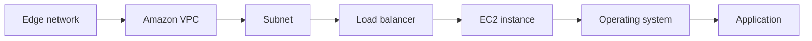

# 🔐 Pillar 2 — Security: bảo vệ mọi lớp, từ edge đến ứng dụng

> Nguồn: `255-Pillar-2-Security.txt` · [Udemy](https://ua.udemy.com/course/aws-certified-cloud-practitioner-new/learn/lecture/20241386)

Tiếp tục hành trình 6 trụ cột, hôm nay chúng ta đến với trụ cột mình rất yêu thích: **Security (bảo mật)**. Ai cũng biết bảo mật là quan trọng, nhưng điều thú vị là nó vừa **giảm thiểu rủi ro theo thời gian**, vừa **tiết kiệm chi phí** khỏi những thảm họa.

*Đừng lo nếu bạn chưa rành các dịch vụ bảo mật — mình sẽ đi từ nguyên tắc đến ví dụ cụ thể.*

---

### 📌 Security là gì?

Trụ cột Security bao gồm **khả năng bảo vệ thông tin, hệ thống và tài sản, đồng thời vẫn mang lại giá trị kinh doanh** thông qua các chiến lược **đánh giá và giảm thiểu rủi ro (risk assessment and mitigation)**.

Nhiều người nghĩ bảo mật chỉ là nghĩa vụ phải làm. Nhưng khi ứng dụng của bạn được bảo vệ tốt, bạn đang **giảm rủi ro theo thời gian** và **tránh được chi phí khổng lồ từ các thảm họa** — không công ty nào muốn dính sự cố bảo mật cả.

---

### 🧭 7 nguyên tắc thiết kế bảo mật mạnh

1. **Nền tảng danh tính vững chắc:** tập trung hóa việc quản lý tài khoản người dùng, dựa trên **least privilege (quyền tối thiểu)** — **IAM (Identity and Access Management)** là dịch vụ giúp bạn làm điều này.
2. **Bật khả năng truy vết (traceability):** theo dõi mọi log, mọi metric, lưu trữ chúng và **tự động phản ứng** mỗi khi có gì đó bất thường.
3. **Áp dụng bảo mật ở mọi lớp:** bảo vệ từng lớp một, để nếu lớp này thất bại thì lớp khác tiếp quản.
4. **Tự động hóa các best practice bảo mật:** bảo mật không phải việc làm thủ công — chỉ khi tự động hóa, nó mới được làm tốt.
5. **Bảo vệ dữ liệu khi truyền và khi lưu (in transit & at rest):** luôn bật **encryption (mã hóa)**, dùng SSL, tokenization và kiểm soát truy cập.
6. **Giữ con người tránh xa dữ liệu:** tự hỏi vì sao ai đó cần truy cập dữ liệu — liệu có cách tự động hóa nhu cầu truy cập trực tiếp đó không.
7. **Chuẩn bị cho sự cố bảo mật:** sự cố rồi sẽ đến với mọi công ty — hãy chạy **response simulation (mô phỏng ứng phó)** và dùng công cụ để tự động hóa tốc độ phát hiện, điều tra và khôi phục.

---

### 🛡️ Các nhóm dịch vụ AWS cho bảo mật

| Nhóm | Dịch vụ tiêu biểu |
|---|---|
| Danh tính & truy cập | IAM, STS (tạo thông tin đăng nhập tạm thời), MFA token, AWS Organizations (quản lý nhiều account tập trung) |
| Phát hiện bất thường | AWS Config (compliance), CloudTrail (API call khả nghi), CloudWatch (metric vượt ngưỡng) |
| Bảo vệ hạ tầng | CloudFront (chống DDoS lớp đầu), Amazon VPC với ACL đúng, Shield (chống DDoS), WAF (Web Application Firewall), Inspector (đánh giá bảo mật EC2) |
| Bảo vệ dữ liệu | KMS (mã hóa at rest), S3 với SSE-S3, SSE-KMS, SSE-C hoặc client-side encryption, bucket policy, HTTPS trên Load Balancer, mã hóa EBS và RDS kèm SSL |
| Ứng phó sự cố | IAM (xóa hoặc tước quyền account bị xâm phạm), CloudFormation (dựng lại hạ tầng), CloudWatch Events (tự động cảnh báo) |

*Các bạn không cần nhớ hết những dịch vụ này cho kỳ thi đâu* — nhiều dịch vụ trong số đó thuộc phạm vi kỳ thi SysOps. Điều mình muốn các bạn thấy là **cách các dịch vụ AWS cộng hưởng** để đạt được bảo mật toàn diện.

---

### 🎯 Tự kiểm tra nhanh

**Câu 1:** Mục tiêu kép của bảo mật tốt là gì?

<b>Xem đáp án</b>

**Đáp án:** Bảo vệ thông tin, hệ thống, tài sản; giảm rủi ro và tiết kiệm chi phí từ thảm họa.

Giải thích: Bảo mật không chỉ là nghĩa vụ — nó mang lại giá trị kinh doanh.

Tham chiếu: Mục Security là gì.

**Câu 2:** Nguyên tắc "least privilege" được thực hiện nhờ dịch vụ nào?

<b>Xem đáp án</b>

**Đáp án:** IAM (Identity and Access Management).

Giải thích: IAM giúp tập trung hóa quản lý tài khoản và cấp quyền tối thiểu.

Tham chiếu: Mục 7 nguyên tắc thiết kế bảo mật mạnh.

**Câu 3:** Dịch vụ nào là "tuyến phòng thủ đầu tiên" trước tấn công DDoS?

<b>Xem đáp án</b>

**Đáp án:** CloudFront.

Giải thích: Ngoài ra còn có Shield chuyên bảo vệ tài khoản AWS khỏi DDoS.

Tham chiếu: Mục Các nhóm dịch vụ AWS cho bảo mật.

**Câu 4:** Kể tên các cơ chế mã hóa của S3 được nhắc trong bài.

<b>Xem đáp án</b>

**Đáp án:** SSE-S3, SSE-KMS, SSE-C và client-side encryption.

Giải thích: S3 có rất nhiều cơ chế mã hóa, kèm bucket policy.

Tham chiếu: Mục Các nhóm dịch vụ AWS cho bảo mật.

**Câu 5:** Khi một account bị xâm phạm, bước ứng phó đầu tiên là gì?

<b>Xem đáp án</b>

**Đáp án:** Dùng IAM để xóa account đó hoặc tước hết quyền (zero privilege).

Giải thích: IAM là tuyến phòng thủ tốt đầu tiên trong incident response.

Tham chiếu: Mục Các nhóm dịch vụ AWS cho bảo mật.

---

Vậy là trụ cột Security đã rõ: bảo mật mọi lớp, tự động hóa, mã hóa mọi nơi và chuẩn bị cho sự cố. *Hãy nhớ: cứ từng bước một, không cần thuộc hết mọi dịch vụ ngay.*

Ở bài tiếp theo, chúng ta sẽ tìm hiểu trụ cột **Reliability** — làm sao để ứng dụng chạy "bất chấp mọi thứ". Hẹn gặp các bạn ở đó! 🚀
