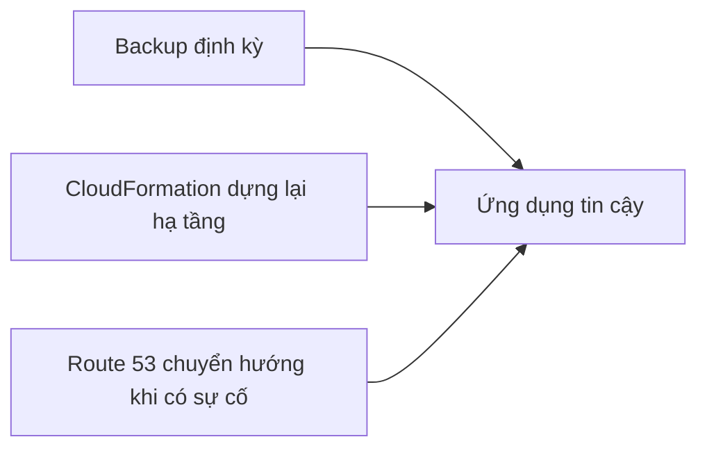

# 🧱 Pillar 3 — Reliability: để ứng dụng chạy "bất chấp mọi thứ"

> Nguồn: `256-Pillar-3-Reliability.txt` · [Udemy](https://ua.udemy.com/course/aws-certified-cloud-practitioner-new/learn/lecture/20241390)

"Ứng dụng của tôi có chạy ổn không nếu mọi thứ xung quanh đổ vỡ?" — đó chính là câu hỏi mà trụ cột thứ ba, **Reliability (độ tin cậy)**, trả lời. Đây là trụ cột giúp hệ thống của bạn đứng vững và tự hồi phục.

*Đừng lo nếu bạn chưa từng nghe về disaster recovery — mình sẽ nhắc lại trong section này, và giải thích thật đơn giản.*

---

### 📌 Reliability là gì?

Reliability là **khả năng của hệ thống phục hồi sau các sự cố hạ tầng hoặc dịch vụ, tự động lấy thêm tài nguyên tính toán để đáp ứng nhu cầu, và giảm thiểu các gián đoạn** như cấu hình sai (misconfiguration) hay lỗi mạng tạm thời (transient network issues).

Nói ngắn gọn: mục tiêu là **ứng dụng chạy bất chấp mọi thứ**.

---

### 🧭 5 nguyên tắc thiết kế của Reliability

1. **Kiểm thử quy trình phục hồi:** dùng tự động hóa để mô phỏng các lỗi khác nhau, hoặc tái tạo lại những tình huống từng gây lỗi trước đây.
2. **Tự động phục hồi khi có lỗi:** dự đoán và xử lý lỗi **trước khi chúng xảy ra**.
3. **Scale theo chiều ngang (horizontally):** để tăng độ sẵn sàng của hệ thống hoặc chịu tải lớn hơn.
4. **Đừng đoán capacity:** nếu bạn nghĩ "ứng dụng này cần 4 server" thì kiểu gì cũng sai về lâu dài — hãy dùng **auto scaling** ở mọi nơi có thể để luôn có đúng dung lượng cần thiết.
5. **Thay đổi mọi thứ qua tự động hóa (automation):** đảm bảo ứng dụng luôn đáng tin cậy, hoặc có thể rollback (hoàn tác) khi cần.

---

### 🛠️ Ba nhóm dịch vụ AWS cho Reliability

| Nhóm | Vai trò & dịch vụ |
|---|---|
| Nền tảng (Foundations) | IAM (không để ai có quá nhiều quyền gây họa cho account), Amazon VPC (nền tảng mạng vững chắc), Service Limits (đặt giới hạn phù hợp, không quá cao cũng không quá thấp, giám sát theo thời gian và liên hệ AWS để tăng khi sắp chạm ngưỡng), Trusted Advisor (theo dõi service limit và nhiều thứ khác) |
| Quản lý thay đổi (Change Management) | Auto Scaling (ứng dụng nổi tiếng hơn thì không cần thay đổi gì), CloudWatch (theo dõi metric, ví dụ CPU utilization tăng cao), CloudTrail (truy vết API call), AWS Config |
| Quản lý lỗi (Failure Management) | Backup định kỳ, CloudFormation (dựng lại toàn bộ hạ tầng một lần), S3 (backup dữ liệu), S3 Glacier (lưu trữ archive ít chạm tới), Route 53 (DNS toàn cầu độ tin cậy cao — khi có sự cố, chỉ cần trỏ Route 53 sang một stack ứng dụng mới ở nơi khác) |

Điểm đáng nhớ: **Route 53** cho phép bạn "chuyển nhà" cả hệ thống sang một stack mới ở nơi khác khi có thảm họa — đây chính là một dạng **disaster recovery (khôi phục sau thảm họa)** mà chúng ta sẽ học ở phần sau của section này.

---

### 🎯 Tự kiểm tra nhanh

**Câu 1:** Reliability được định nghĩa là gì?

<b>Xem đáp án</b>

**Đáp án:** Khả năng phục hồi sau sự cố hạ tầng/dịch vụ, tự động lấy thêm tài nguyên theo nhu cầu và giảm thiểu gián đoạn do cấu hình sai hay lỗi mạng tạm thời.

Giải thích: Mục tiêu là ứng dụng chạy bất chấp mọi thứ.

Tham chiếu: Mục Reliability là gì.

**Câu 2:** Vì sao không nên "đoán capacity"?

<b>Xem đáp án</b>

**Đáp án:** Vì dự đoán số server cố định sẽ không đúng về lâu dài — hãy dùng auto scaling để luôn có đúng dung lượng.

Giải thích: Đây là nguyên tắc thiết kế thứ tư của Reliability.

Tham chiếu: Mục 5 nguyên tắc thiết kế của Reliability.

**Câu 3:** Service Limits cần được đặt như thế nào?

<b>Xem đáp án</b>

**Đáp án:** Không quá cao, không quá thấp — đúng mức, và được giám sát theo thời gian; khi sắp chạm giới hạn thì liên hệ AWS để tăng.

Giải thích: Nhờ vậy tránh được gián đoạn dịch vụ khi ứng dụng tăng trưởng.

Tham chiếu: Mục Ba nhóm dịch vụ AWS cho Reliability.

**Câu 4:** Dịch vụ nào giúp dựng lại toàn bộ hạ tầng một lần sau sự cố?

<b>Xem đáp án</b>

**Đáp án:** CloudFormation.

Giải thích: Đây là công cụ chủ chốt trong nhóm Failure Management.

Tham chiếu: Mục Ba nhóm dịch vụ AWS cho Reliability.

**Câu 5:** Route 53 giúp gì khi xảy ra thảm họa?

<b>Xem đáp án</b>

**Đáp án:** Là hệ thống DNS toàn cầu tin cậy, có thể trỏ sang một stack ứng dụng mới ở nơi khác.

Giải thích: Đây là cơ chế disaster recovery ở tầng DNS.

Tham chiếu: Mục Ba nhóm dịch vụ AWS cho Reliability.

---

Vậy là trụ cột Reliability đã rõ: kiểm thử phục hồi, tự động phục hồi, scale ngang, đừng đoán capacity và tự động hóa mọi thay đổi. *Cứ học chậm mà chắc, các bạn nhé.*

Ở bài tiếp theo, chúng ta sẽ đến với trụ cột **Performance Efficiency** — làm sao dùng tài nguyên hiệu quả nhất. Hẹn gặp các bạn ở đó! 🚀
