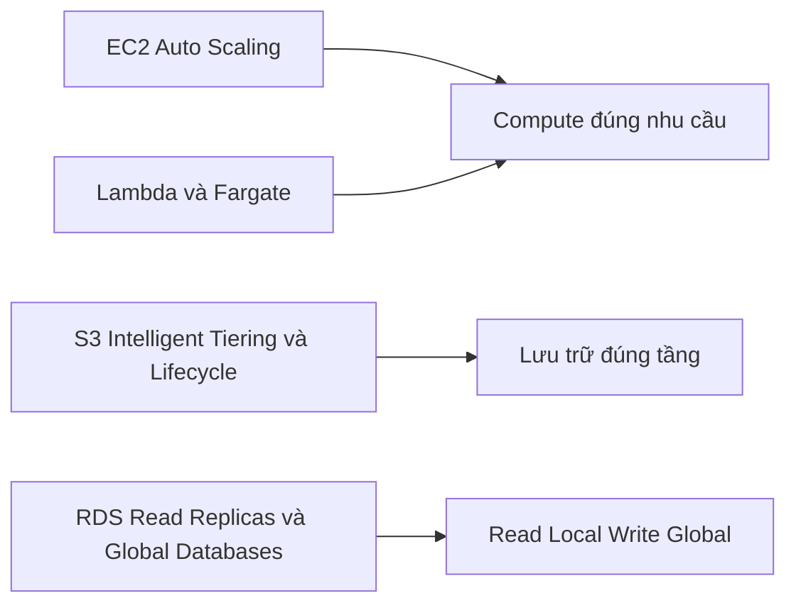

# 🌱 Pillar 6 — Sustainability: chạy cloud xanh, giảm dấu chân môi trường

> Nguồn: `259-Pillar-6-Sustainability.txt` · [Udemy](https://ua.udemy.com/course/aws-certified-cloud-practitioner-new/learn/lecture/31712754)

Chúng ta đã đi qua 5 trụ cột, và đây là trụ cột cuối cùng — cũng là trụ cột **mới nhất** của Well-Architected Framework: **Sustainability (tính bền vững)**. Mục tiêu rất ý nghĩa: giảm thiểu tác động môi trường khi chạy workload trên cloud.

*Đừng lo nếu đây là chủ đề bạn chưa từng nghĩ tới — hóa ra tối ưu kỹ thuật và bảo vệ môi trường lại đi cùng nhau.*

---

### 📌 Sustainability là gì?

Trụ cột này tập trung vào việc **giảm thiểu tác động môi trường của các workload chạy trên cloud**.

Cách tiếp cận gồm các bước:

1. **Hiểu tác động của bạn** và thiết lập **performance indicators (chỉ số đo lường)**.
2. **Đánh giá các cải tiến** để chắc chắn đạt được **mục tiêu bền vững**.
3. Nghĩ dài hạn và tính **ROI (tỷ suất hoàn vốn)**.

---

### 🧭 Các nguyên tắc cốt lõi của Sustainability

* **Tối đa hóa mức sử dụng dịch vụ (maximize utilization):** dùng càng hiệu quả càng tiết kiệm năng lượng, và thể hiện ý thức với môi trường.
* **Chủ động đón nhận phần cứng mới hiệu quả hơn:** AWS liên tục tối ưu hạ tầng, nên dùng phần cứng/dịch vụ mới hơn nghĩa là bạn đang hiệu quả hơn.
* **Ưu tiên managed services:** vì bạn chia sẻ hạ tầng với nhiều người khác, đây là lựa chọn tốt hơn cho tính bền vững.
* **Giảm tác động phía sau (downstream impact):** giảm năng lượng, tài nguyên cần cho dịch vụ của bạn, đồng thời giảm nhu cầu buộc khách hàng phải liên tục nâng cấp thiết bị.

---

### 🛠️ Dịch vụ AWS giúp tăng tính bền vững

| Nhóm | Dịch vụ & cách dùng |
|---|---|
| Compute hiệu quả | EC2 Auto Scaling, serverless như Lambda hoặc Fargate — dùng đúng lượng compute cho công việc; Cost Explorer để nhìn chi phí; Graviton 2, các instance họ EC2 T và Spot Instances (dùng phần capacity nhàn rỗi, nếu không sẽ bị lãng phí) |
| Lưu trữ phân tầng | EFS-IA, Amazon S3 Glacier, Cold HDD cho EBS — đặt câu hỏi: có phải mọi dữ liệu đều cần "nóng"? |
| Vòng đời dữ liệu | S3 Lifecycle Configurations, S3 Intelligent-Tiering và Amazon Data Lifecycle Manager — đảm bảo dữ liệu nằm đúng tầng |
| Database | **Read Local, Write Global** — RDS Read Replicas, Aurora Global Databases, DynamoDB Global Tables hoặc dùng CloudFront |

*Đừng lo nếu bạn chưa học sâu về Graviton hay Aurora — điều quan trọng là nắm được tinh thần: dùng đúng tài nguyên, đúng tầng, đúng thời điểm chính là vừa tiết kiệm vừa bền vững.*

---

### 🎯 Tự kiểm tra nhanh

**Câu 1:** Sustainability tập trung vào điều gì?

<b>Xem đáp án</b>

**Đáp án:** Giảm thiểu tác động môi trường của các workload chạy trên cloud.

Giải thích: Đây là trụ cột mới nhất của Well-Architected Framework.

Tham chiếu: Mục Sustainability là gì.

**Câu 2:** Vì sao dùng managed services lại tốt cho tính bền vững?

<b>Xem đáp án</b>

**Đáp án:** Vì bạn chia sẻ hạ tầng với nhiều người — tận dụng tốt hơn tài nguyên chung.

Giải thích: Đây là một trong các nguyên tắc cốt lõi.

Tham chiếu: Mục Các nguyên tắc cốt lõi của Sustainability.

**Câu 3:** Spot Instances giúp gì cho môi trường?

<b>Xem đáp án</b>

**Đáp án:** Tận dụng phần capacity nhàn rỗi — nếu không dùng thì phần đó cũng bị lãng phí.

Giải thích: Spot nằm trong nhóm compute hiệu quả.

Tham chiếu: Mục Dịch vụ AWS giúp tăng tính bền vững.

**Câu 4:** Nhóm dịch vụ nào giúp đưa dữ liệu vào đúng tầng lưu trữ?

<b>Xem đáp án</b>

**Đáp án:** S3 Lifecycle Configurations, S3 Intelligent-Tiering và Amazon Data Lifecycle Manager.

Giải thích: Kèm theo các tầng như EFS-IA, S3 Glacier, Cold HDD.

Tham chiếu: Mục Dịch vụ AWS giúp tăng tính bền vững.

**Câu 5:** "Read Local, Write Global" gợi ý những dịch vụ nào?

<b>Xem đáp án</b>

**Đáp án:** RDS Read Replicas, Aurora Global Databases, DynamoDB Global Tables và CloudFront.

Giải thích: Đây là nhóm database giúp tăng tính bền vững.

Tham chiếu: Mục Dịch vụ AWS giúp tăng tính bền vững.

---

Vậy là các bạn đã hoàn thành cả **6 trụ cột** của Well-Architected Framework! *Thật đáng tự hào — cứ từng bước một, bạn đang xây cho mình nền tảng kiến trúc rất vững chắc.*

Ở bài tiếp theo, chúng ta sẽ tìm hiểu công cụ giúp đánh giá kiến trúc của bạn theo đúng 6 trụ cột này: **AWS Well-Architected Tool**. Hẹn gặp các bạn ở đó! 🚀
