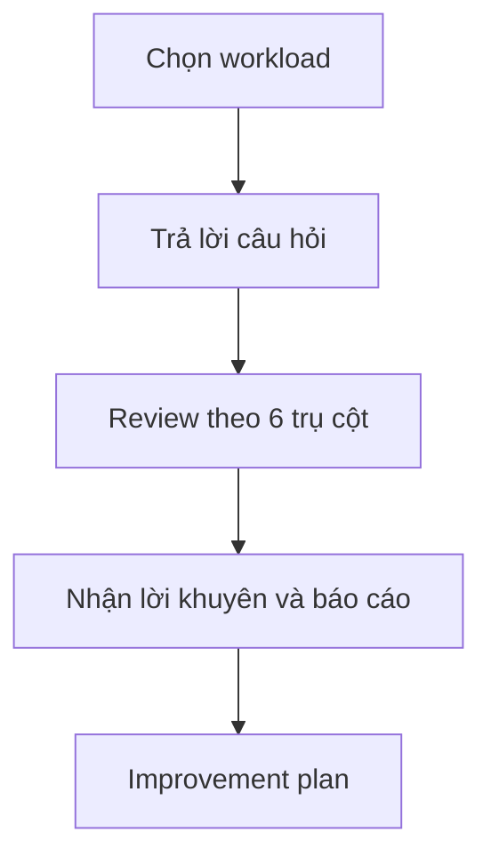

# 🧰 AWS Well-Architected Tool: "chấm điểm" kiến trúc của bạn theo 6 trụ cột

> Nguồn: `260-AWS-Well-Architected-Tool.txt` · [Udemy](https://ua.udemy.com/course/aws-certified-cloud-practitioner-new/learn/lecture/24682662)

Chúng ta đã học xong 6 trụ cột của **Well-Architected Framework**. Nhưng làm sao biết kiến trúc thật của bạn đang "khỏe" đến đâu? Câu trả lời là **AWS Well-Architected Tool** — công cụ giúp bạn review kiến trúc theo đúng bộ khung này và nhận về các gợi ý cải thiện.

*Đừng lo nếu bạn chưa từng dùng công cụ này — mình sẽ vừa thao tác trên console vừa giải thích từng bước.*

---

### 🎯 Công cụ này dùng để làm gì?

Ý tưởng rất đơn giản:

1. Bạn **review kiến trúc của mình** dựa trên **6 trụ cột** vừa học.
2. Từ đó, bạn **áp dụng các best practice về kiến trúc** phù hợp.

Cách hoạt động: chọn workload → trả lời một số câu hỏi → xem lại câu trả lời theo 6 trụ cột trong Well-Architected Framework → nhận **lời khuyên**, video, tài liệu, báo cáo...

---

### 🖥️ Thực hành: Định nghĩa workload trên console

Trong console của **AWS Well-Architected Tool**, mình bắt đầu bằng việc **định nghĩa một workload** (khối lượng công việc):

* Đặt tên workload — ví dụ **Demo Workload**.
* Thêm **description (mô tả)**, **review owner** (ví dụ `john@example.com`), **environment** (production, pre-production...).
* Khai báo **region** đang vận hành (ví dụ: một region), có đang dùng **non-AWS region** không, **account ID**...

Sau khi trả lời các thông tin đó, bạn **áp lens (ống kính)** cho workload. Có nhiều lens để chọn:

* **AWS Well-Architected Framework** lens
* **FTR Lens**
* **Serverless Lens**
* **SaaS Lens**
* ...và bạn thậm chí có thể tự định nghĩa **custom lens** của riêng mình.

Trong phần thực hành, mình chọn lens **AWS Well-Architected Framework** rồi bấm **Define Workload**.

---

### 📝 Trả lời câu hỏi và nhận kết quả

Bạn sẽ nhận được các câu hỏi cho **cả 6 trụ cột**: operational excellence, security, reliability, performance efficiency, cost optimization và sustainability.

1. Với mỗi câu hỏi, chọn câu trả lời của mình và bấm **Next**.
2. Nếu câu hỏi không áp dụng cho workload, bạn chọn "không áp dụng" và ghi lý do, rồi bấm **Next**.
3. Bạn có thể dành rất nhiều thời gian cho phần này — công cụ dành cho các ứng dụng production nghiêm túc.
4. Xong thì bấm **Save and Exit**.

Kết quả bạn nhận được là các **risk (rủi ro)**: **high risk**, **medium risk**... Bạn có thể lưu lại thành **milestone** — ví dụ "bản nháp đầu tiên" — rồi bấm **Save**.

Trong ví dụ trên console, sau khi trả lời, có **2 risk được đánh giá**: một **high risk** và một **medium risk**. Mở **improvement plan**, bạn sẽ thấy các **improvement item (hạng mục cần cải thiện)** kèm **link tài liệu** dựa trên câu trả lời của bạn.

Đây là công cụ rất hữu ích để team đảm bảo ứng dụng của mình **Well-Architected**; nếu chưa đạt, bạn nhận được cả khu vực cần cải thiện lẫn tài liệu để chạy hệ thống ở trạng thái tốt nhất.

---

### 🎯 Tự kiểm tra nhanh

**Câu 1:** Mục đích chính của AWS Well-Architected Tool là gì?

<b>Xem đáp án</b>

**Đáp án:** Review kiến trúc theo 6 trụ cột và áp dụng best practice kiến trúc.

Giải thích: Công cụ dựa trên Well-Architected Framework.

Tham chiếu: Mục Công cụ này dùng để làm gì.

**Câu 2:** Quy trình làm việc của công cụ gồm những bước nào?

<b>Xem đáp án</b>

**Đáp án:** Chọn workload → trả lời câu hỏi → review theo 6 trụ cột → nhận lời khuyên, video, tài liệu, báo cáo.

Giải thích: Đây là luồng hoạt động cơ bản.

Tham chiếu: Mục Công cụ này dùng để làm gì.

**Câu 3:** Khi định nghĩa workload, bạn cần khai báo những gì?

<b>Xem đáp án</b>

**Đáp án:** Tên workload, description, review owner, environment, region, non-AWS region, account ID...

Giải thích: Các thông tin này mô tả workload trước khi áp lens.

Tham chiếu: Mục Thực hành: Định nghĩa workload trên console.

**Câu 4:** Kể tên một số lens được nhắc trong bài.

<b>Xem đáp án</b>

**Đáp án:** Well-Architected Framework lens, FTR Lens, Serverless Lens, SaaS Lens — và cả custom lens do bạn tự định nghĩa.

Giải thích: Lens là bộ tiêu chí đánh giá workload.

Tham chiếu: Mục Thực hành: Định nghĩa workload trên console.

**Câu 5:** Sau khi trả lời câu hỏi, bạn nhận được gì?

<b>Xem đáp án</b>

**Đáp án:** Các risk (high/medium...) và improvement plan với hạng mục cải thiện kèm link tài liệu.

Giải thích: Bạn có thể lưu milestone cho từng giai đoạn đánh giá.

Tham chiếu: Mục Trả lời câu hỏi và nhận kết quả.

---

Vậy là các bạn đã biết cách tự "chấm điểm" kiến trúc của mình bằng **AWS Well-Architected Tool**. *Cứ đánh giá từng milestone một — kiến trúc tốt là cả một hành trình, không phải cuộc đua.*

Ở bài tiếp theo, chúng ta sẽ tìm hiểu **AWS Customer Carbon Footprint Tool** — công cụ giúp bạn nhìn thấy dấu chân carbon của mình trên cloud. Hẹn gặp các bạn ở đó! 🚀
