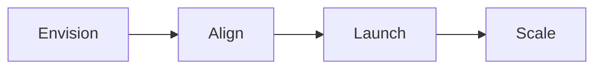

# 🗺️ AWS Cloud Adoption Framework (CAF): 6 perspectives bạn phải nhớ

> Nguồn: `262-AWS-Cloud-Adoption-Framework-CAF.txt` · [Udemy](https://ua.udemy.com/course/aws-certified-cloud-practitioner-new/learn/lecture/37760092)

Chào các bạn! Bài này chúng ta nói về **AWS Cloud Adoption Framework**, gọi tắt là **CAF**. Đây là nội dung **có xuất hiện trong đề thi** và có vài thứ các bạn phải nhớ nằm lòng. *Đừng lo, đến cuối bài mọi thứ sẽ bắt đầu có lý.*

---

### 📘 CAF là gì?

CAF thực chất là một **ebook** — một **white paper (sách trắng)**, nên nó **không phải là một dịch vụ AWS**.

* CAF giúp bạn xây dựng và thực thi một **kế hoạch toàn diện cho chuyển đổi số (digital transformation)** thông qua việc sử dụng AWS một cách sáng tạo.
* Nó được tạo bởi các chuyên gia của AWS, tổng hợp **best practices** từ **hàng nghìn khách hàng** vào một framework duy nhất.
* CAF gồm 2 thành phần: **organizational capabilities (năng lực tổ chức)** — nền tảng cho chuyển đổi thành công — và các năng lực này được nhóm vào **6 perspectives**.

---

### 🧭 Sáu perspectives — chia thành 2 nhóm

Đây là phần **quan trọng nhất cho kỳ thi**:

| Perspective | Nhóm | Vai trò chính |
|---|---|---|
| Business | Business | Đảm bảo đầu tư cloud tăng tốc chuyển đổi số và kết quả kinh doanh |
| People | Business | Cầu nối giữa công nghệ và kinh doanh |
| Governance | Business | Điều phối sáng kiến cloud, tối đa lợi ích, giảm rủi ro |
| Platform | Technical | Xây nền tảng hybrid cloud quy mô doanh nghiệp |
| Security | Technical | Đảm bảo confidentiality, integrity, availability của dữ liệu |
| Operations | Technical | Đảm bảo dịch vụ cloud đáp ứng nhu cầu kinh doanh |

*Nhớ kỹ: **People** là cầu nối giữa technology và business — đây là câu hỏi rất dễ gặp trong đề.*

---

### 🧩 Capabilities bên trong từng perspective

Các bạn **không bắt buộc nhớ hết** danh sách này, nhưng nên xem qua để biết chúng thuộc perspective nào:

* **Business:** strategy management, portfolio management, innovation management, product management, strategic partnership, data monetization, business insight, data science.
* **People:** culture evolution, transformational leadership, cloud fluency, workforce transformation, change acceleration, organization design, organizational alignment.
* **Governance:** program and project management, benefits management, risk management, cloud financial management, application portfolio management, data governance, data curation.
* **Platform:** platform architecture, data architecture, platform engineering, data engineering, provisioning and orchestration, modern application development, CI/CD (Continuous Integration and Continuous Delivery).
* **Security:** security governance, security assurance, IAM (Identity and Access Management), threat detection, vulnerability management, infrastructure protection, data protection, application security, incident response.
* **Operations:** observability, event management, incidents and problem management, change and release management, performance and capacity management, configuration management, patch management, availability and continuity management, application management.

---

### 🔄 Transformation domains và 4 giai đoạn

CAF còn có **4 transformation domains**: **technology, process, organization, products**.

* **Technology:** dùng cloud để migrate và hiện đại hóa hạ tầng, ứng dụng, dữ liệu và nền tảng analytics cũ.
* **Process:** số hóa, tự động hóa, tối ưu vận hành; dùng data/analytics để tạo insight hành động và machine learning để nâng trải nghiệm khách hàng.
* **Organization:** tái hình dung mô hình vận hành — tổ chức lại team theo sản phẩm và value stream, dùng phương pháp agile để lặp nhanh và tiến hóa.
* **Products:** tái hình dung mô hình kinh doanh, tạo giá trị mới như sản phẩm, dịch vụ và mô hình doanh thu.

Và **4 transformation phases** theo đúng thứ tự:

1. **Envision:** xác định cơ hội chuyển đổi, chứng minh cloud tăng tốc kết quả kinh doanh và tạo nền móng cho chuyển đổi số.
2. **Align:** soi vào 6 perspectives để tìm **capability gaps**, từ đó tạo ra **action plan**.
3. **Launch:** xây dựng và đưa các **pilot initiatives** vào production, chứng minh giá trị kinh doanh tăng dần.
4. **Scale:** mở rộng pilot tới quy mô mong muốn và hiện thực hóa lợi ích kinh doanh.

*Mẹo thi: nếu không nhớ hết, hãy dùng phương pháp loại trừ — tên gọi thường đã gợi ý khá rõ.*

---

### 🧪 Tự kiểm tra nhanh

**Câu 1:** CAF là gì?

<b>Xem đáp án</b>

**Đáp án:** Là một ebook/white paper — **không phải dịch vụ AWS**.
Giải thích: CAF giúp xây dựng và thực thi kế hoạch chuyển đổi số toàn diện qua AWS.

**Câu 2:** Kể tên 6 perspectives của CAF?

<b>Xem đáp án</b>

**Đáp án:** Business, People, Governance, Platform, Security, Operations.
Giải thích: 3 nhóm business capabilities và 3 nhóm technical capabilities.

**Câu 3:** Perspective nào là cầu nối giữa technology và business?

<b>Xem đáp án</b>

**Đáp án:** People.
Giải thích: Đây là chi tiết rất hay được hỏi trong đề thi.

**Câu 4:** Giai đoạn Align trong CAF làm gì?

<b>Xem đáp án</b>

**Đáp án:** Xem xét 6 perspectives, xác định capability gaps và tạo action plan.
Giải thích: Envision thì xác định cơ hội; Launch và Scale là đưa pilot vào production rồi mở rộng.

**Câu 5:** Bốn transformation domains của CAF là gì?

<b>Xem đáp án</b>

**Đáp án:** Technology, process, organization, products.
Giải thích: Các domain này giúp dẫn dắt kết quả kinh doanh.

---

CAF nhìn có vẻ trừu tượng, nhưng từ góc độ thi cử thì rất rõ ràng: nhớ **6 perspectives**, biết capability nào thuộc perspective nào, và nắm **4 domains + 4 phases**. *Loại trừ khéo léo là đủ để bạn chọn đúng đáp án.*

Ở bài tiếp theo, chúng ta sẽ nói về **Right Sizing** — một chủ đề nhỏ nhưng có thể xuất hiện trong đề. Hẹn gặp các bạn ở đó! 🚀
