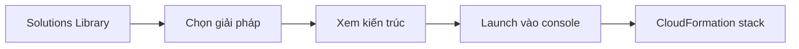

# 🌐 AWS Ecosystem: Tài nguyên, hỗ trợ và đối tác quanh AWS

> Nguồn: `264-AWS-Ecosystem.txt` · [Udemy](https://ua.udemy.com/course/aws-certified-cloud-practitioner-new/learn/lecture/20056488)

Chúng ta cùng nói về **hệ sinh thái (ecosystem)** bao quanh AWS. Ở đề thi, các bạn sẽ gặp **1-2 câu** về việc tìm đúng dịch vụ hoặc đúng công cụ trong hệ sinh thái này — nên bài này hơi dài, nhưng rất đáng học kỹ.

---

### 📚 Tài nguyên miễn phí để học AWS

AWS cung cấp rất nhiều tài nguyên online **hoàn toàn miễn phí**:

* **AWS Blog:** cập nhật tính năng mới và các bài viết chuyên sâu theo từng use case cụ thể.
* **Community forums (diễn đàn cộng đồng):** nơi giao lưu với những người xây dựng khác.
* **White paper & guide (sách trắng và hướng dẫn):** học sâu về một mảng cụ thể của AWS.
* **Solutions Library** (trước đây gọi là **Quick Starts**): thư viện giải pháp công nghệ đã được **kiểm chứng (vetted)** cho cloud — ví dụ bạn muốn làm live streaming trên AWS thì chỉ cần tìm trên website solutions.

Trong video demo, mình mở Solutions Library, chọn giải pháp **live streaming on AWS**, xem mô tả, ưu/nhược điểm và **architecture diagram**, rồi bấm **launch in console** — nó đưa thẳng vào **CloudFormation** để tạo stack theo URL cụ thể. Đây là cách rất tốt để khởi đầu nhanh với kiến trúc có sẵn, mở rộng tốt và được AWS kiểm chứng.

---

### 🛟 Các gói hỗ trợ của AWS

| Gói | Kênh hỗ trợ | Thời gian phản hồi |
|---|---|---|
| Developer | Email giờ hành chính, cloud support associates | General guidance dưới 24 giờ; system impaired dưới 12 giờ |
| Business | Phone, email, chat 24/7; cloud support engineers | Production system impaired dưới 4 giờ; production system down dưới 1 giờ |
| Enterprise | 24/7; TAM riêng; concierge support team | Business system down dưới 15 phút |

*Enterprise là gói đắt nhất, nhưng có **dedicated TAM (Technical Account Manager — quản lý tài khoản kỹ thuật riêng)** và đội **concierge** hỗ trợ billing cùng best practices cho tài khoản.*

---

### 🛒 AWS Marketplace

Marketplace là **danh mục số (digital catalog)** với **hàng nghìn phần mềm** từ các **ISV (Independent Software Vendors — nhà cung cấp phần mềm độc lập, bên thứ ba)**. Bạn có thể mua:

* **Custom AMI** — máy ảo đã tùy biến sẵn OS, firewall hoặc giải pháp kỹ thuật.
* **CloudFormation templates** sẵn sàng cho production.
* **SaaS** (Software as a Service) trực tiếp từ Marketplace.
* **Containers**.

Ưu điểm lớn: chi phí **đi thẳng vào hóa đơn AWS** của bạn. Và nếu muốn, bạn cũng có thể **bán giải pháp của chính mình** với tư cách marketplace seller — chúng ta đã gặp ý này ở phần AMI đầu khóa.

---

### 🎓 Đào tạo từ AWS

AWS cung cấp 2 kiểu đào tạo: **digital (online)** và **classroom (trực tiếp hoặc ảo)**. Ngoài ra:

* **Private training** — khóa riêng cho tổ chức của bạn.
* Chương trình đào tạo & chứng chỉ **riêng cho chính phủ Mỹ**.
* Chương trình đào tạo & chứng chỉ **cho doanh nghiệp**.
* **AWS Academy** — giúp các trường đại học dạy AWS, để sinh viên ra trường cũng biết dùng cloud.

Còn tất nhiên, ngoài AWS còn có các khóa không do AWS tài trợ — ví dụ giảng viên online yêu thích của các bạn, chính là mình, dạy về chứng chỉ và AWS.

---

### 🤝 Professional Services và AWS Partner Network

* **AWS Professional Services Organization:** đội chuyên gia toàn cầu của AWS, làm việc song song với team của bạn và một thành viên được chọn của **APN**.
* **APN (AWS Partner Network):** mạng lưới đối tác mà AWS biết là giỏi cloud, gồm:
  * **Technology partners:** cung cấp phần cứng, kết nối và phần mềm — thiên về hạ tầng.
  * **Consulting partners:** các công ty professional services giúp bạn xây dựng trên AWS.
  * **Training partners:** đơn vị có thể giảng dạy các khóa đào tạo AWS.
* **Competency Program:** trao cho các APN partner đã chứng minh **năng lực kỹ thuật** và **thành công với khách hàng** trong những lĩnh vực giải pháp chuyên biệt.
* **Navigate Program:** giúp các partner trở thành partner tốt hơn — đào tạo chính các partner.

---

### 🧪 Tự kiểm tra nhanh

**Câu 1:** Solutions Library (Quick Starts) cung cấp gì và triển khai thế nào?

<b>Xem đáp án</b>

**Đáp án:** Các giải pháp công nghệ đã được AWS kiểm chứng, có thể launch để tạo CloudFormation stack.
Giải thích: Bạn xem kiến trúc, ưu/nhược điểm rồi bấm launch in console.

**Câu 2:** Gói hỗ trợ nào có dedicated TAM?

<b>Xem đáp án</b>

**Đáp án:** Enterprise — gói đắt nhất.
Giải thích: Ngoài TAM còn có concierge support team cho billing và best practices.

**Câu 3:** Ở gói Enterprise, khi business system down thì thời gian phản hồi là bao lâu?

<b>Xem đáp án</b>

**Đáp án:** Dưới 15 phút.
Giải thích: Developer và Business có cam kết thời gian dài hơn.

**Câu 4:** Mua hàng trên Marketplace có ưu điểm gì về thanh toán?

<b>Xem đáp án</b>

**Đáp án:** Chi phí đi thẳng vào hóa đơn AWS của bạn.
Giải thích: Marketplace bán AMI, CloudFormation templates, SaaS, containers... từ các ISV.

**Câu 5:** APN technology partners khác consulting partners thế nào?

<b>Xem đáp án</b>

**Đáp án:** Technology partners cung cấp phần cứng, kết nối, phần mềm; consulting partners là công ty professional services giúp xây dựng trên AWS.
Giải thích: Ngoài ra còn có training partners đào tạo AWS.

---

Hệ sinh thái AWS khá rộng, nhưng *tên gọi thường rất gợi ý* — chỉ cần các bạn đã nhìn qua một lần là sẽ nhận ra. Nhớ dành chút thời gian ôn lại bài này trước kỳ thi để "refresh" trí nhớ nhé.

Ở bài tiếp theo, chúng ta sẽ tìm hiểu **AWS re:Post** — diễn đàn hỏi đáp cộng đồng của AWS. Hẹn gặp các bạn ở đó! 🚀
