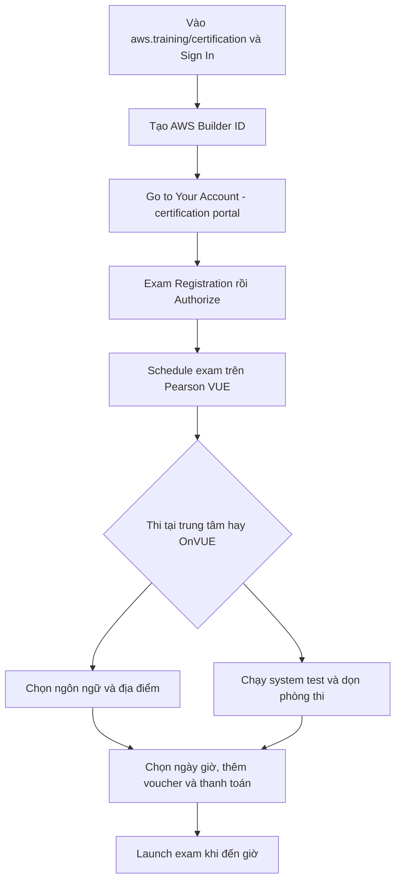

# 📅 Đăng ký và đặt lịch thi AWS: Hướng dẫn từng bước

> Nguồn: `272-Exam-Walkthrough-and-Signup.txt` · [Udemy](https://ua.udemy.com/course/aws-certified-cloud-practitioner-new/learn/lecture/20053374)

Đã đến lúc đăng nhập vào **tài khoản AWS Certification** và đặt lịch thi. Trong bài này, mình sẽ đi cùng các bạn từ lúc tạo tài khoản cho đến khi nhấn nút **Launch exam**.

*Đừng quên xem hai bài tiếp theo về **accommodation (hỗ trợ đặc biệt, cộng thêm giờ)** và **certification benefits (quyền lợi chứng chỉ, giảm 50%)** nhé — chúng có thể giúp bạn rất nhiều.*

---

### 🪪 Bước 1: Tạo AWS Builder ID và vào cổng chứng chỉ

1. Truy cập **aws.training/certification** và bấm **Sign In**.
2. Tạo **AWS Builder ID** — tài khoản riêng cho việc thi chứng chỉ AWS. Cứ làm theo các bước là xong.
3. Sau khi đăng nhập, bấm **Go to Your Account** để vào **certification portal**.

Từ đây bạn có nhiều lựa chọn, và trong bài này mình sẽ hướng dẫn **schedule an exam (đặt lịch thi)**.

---

### 📅 Bước 2: Chọn kỳ thi và đặt lịch

1. Bấm **Exam Registration** → **schedule an exam**.
2. Danh sách các kỳ thi hiện ra ở phía dưới. Một số kỳ thi ở trạng thái đã **authorized**, số khác cần bấm **Authorize** trước thì nút **Schedule** mới mở. *(Mình cũng không rõ vì sao phải authorize, nhưng quy trình là vậy.)*
3. Ví dụ mình chọn đặt lịch **AWS Certified Developer Associate**. Bấm **Schedule** → bạn được đưa sang **Pearson VUE** — đối tác tổ chức thi của AWS.

---

### 🏢 Bước 3: Thi tại trung tâm hay thi online?

Bạn có **2 lựa chọn**:

* **Thi trực tiếp tại test center (trung tâm khảo thí):** phù hợp nếu bạn không muốn thi ở nhà. Cần mang **photo ID (giấy tờ tùy thân có ảnh)** và hiểu rõ **những gì được và không được mang** vào phòng thi.
* **Thi online với OnVUE:** mình thích cách này vì ngồi ngay tại nhà, rất tiện. Yêu cầu: **máy tính có webcam** và **kết nối internet tốt**.

Với cả hai hình thức, bạn sẽ chọn **ngôn ngữ thi** (tùy nơi bạn ở). Với thi tại trung tâm, bạn còn chọn **địa điểm**: đồng ý các điều kiện, nhập địa chỉ và xem danh sách địa điểm thi xung quanh.

---

### ✅ Bước 4: Chuẩn bị phòng thi online đúng chuẩn

* Bấm **Run system test** — mình **cực kỳ khuyến khích** chạy thử **trước ngày thi thật** để chắc chắn mọi thứ hoạt động tốt.
* **Phòng thi phải trống trơn**: không để gì trên bàn, dọn sạch mọi thứ. Giám thị sẽ yêu cầu bạn **giơ bàn** cho họ xem.
* **Mang theo ID**.
* **Check-in khoảng 30 phút trước giờ hẹn** để chắc chắn bạn vào thi đúng giờ.

Sau đó, bạn chọn ngôn ngữ thi lần nữa, đồng ý các điều khoản, chọn **ngôn ngữ cho người check-in** (khác với ngôn ngữ bài thi — chỉ dùng để trao đổi khi check-in), chọn **múi giờ**, rồi **chọn ngày và giờ**.

---

### 💳 Bước 5: Thanh toán và nhận phòng thi

* Hoàn tất **đặt lịch và thanh toán**.
* Nếu có **voucher giảm giá**, bạn thêm vào ngay ở bước này — mình sẽ chỉ cách lấy voucher **giảm 50%** ở bài sau.
* Khi đến ngày thi: vào **Home → Dashboard**, bấm **Manage my Pearson VUE account**, tìm nút **Launch exam** và bấm **Launch** là xong.

---

Vậy là các bạn đã biết toàn bộ quy trình từ đăng nhập đến lúc bấm **Launch exam**. *Chỉ cần chạy system test sớm và dọn bàn thật sạch là bạn đã đi trước rất nhiều người rồi.*

Ở bài tiếp theo, mình sẽ chỉ cách **tiết kiệm 50% lệ phí** cho kỳ thi tiếp theo của bạn. Hẹn gặp các bạn ở đó! 🚀
