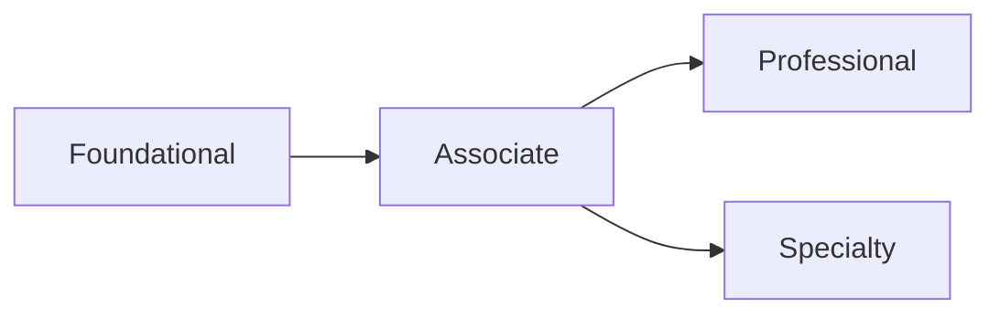

# 🗺️ Bản đồ chứng chỉ AWS: Sau Cloud Practitioner, bạn đi đâu tiếp?

> Nguồn: `275-AWS-Certification-Paths.txt` · [Udemy](https://ua.udemy.com/course/aws-certified-cloud-practitioner-new/learn/lecture/39035278)

Chúc mừng các bạn — các bạn đang chuẩn bị chinh phục chứng chỉ AWS đầu tiên! Nhưng hành trình chưa dừng lại ở đây: AWS có rất nhiều chứng chỉ ở nhiều cấp độ, và tùy vào **vai trò (role)** mong muốn mà AWS khuyến nghị những **lộ trình (path)** khác nhau.

Trong bài này, mình sẽ điểm qua từng lộ trình để các bạn nhìn rõ con đường dài hạn của mình.

---

### 🧭 Bốn cấp độ chứng chỉ AWS

Hệ thống chứng chỉ AWS gồm **4 cấp độ**: Foundational (nền tảng), Associate, Professional và Specialty (chuyên ngành). Tất cả các lộ trình theo vai trò được tổng hợp trong một tài liệu — link nằm ở **góc dưới bên phải** của bài giảng này.

| Cấp độ | Chứng chỉ tiêu biểu |
|---|---|
| Foundational | Cloud Practitioner, AI Practitioner |
| Associate | Solutions Architect Associate, Developer Associate, SysOps Administrator Associate, Machine Learning Engineer Associate, Data Engineer Associate |
| Professional | Solutions Architect Professional, DevOps Engineer Professional |
| Specialty | Security Specialty, Advanced Networking Specialty, Machine Learning Specialty |

---

### 🏗️ Kiến trúc & phát triển ứng dụng

**Solutions architect (kiến trúc sư giải pháp)** — thiết kế, phát triển và quản lý hạ tầng, tài nguyên cloud:

1. **Cloud Practitioner** — nếu bạn đã hiểu về cloud và IT thì có thể bỏ qua, *nhưng mình vẫn đánh giá đây là chứng chỉ tốt nên có*.
2. **AI Practitioner Foundational** — nếu bạn muốn tận dụng AI.
3. **Solutions Architect Associate** → **Solutions Architect Professional**.
4. Đào sâu chuyên môn: **Security Specialty**.

**Application architecture (kiến trúc ứng dụng)** — xoay quanh giao diện người dùng, middleware, hạ tầng... giữ nguyên lộ trình trên nhưng **thêm Developer Associate**, rồi tiến lên **DevOps Engineer Professional**; đào sâu là **Solutions Architect Professional**.

---

### ⚙️ Vận hành & DevOps

* **Systems administrator (quản trị hệ thống)** — cài đặt, nâng cấp, bảo trì các thành phần máy tính và phần mềm, tích hợp quy trình tự động hóa: **Cloud Practitioner → SysOps Administrator Associate → đào sâu DevOps Engineer Professional**.
* **Cloud engineer** — triển khai và vận hành hạ tầng mạng của tổ chức, xây dựng hệ thống bảo mật để giữ dữ liệu an toàn: **Cloud Practitioner → SysOps Administrator Associate → Security Specialty**, đào sâu thêm **DevOps Engineer Professional** và **Advanced Networking Specialty**.
* **Test engineer (DevOps)** — đưa thực hành tốt về kiểm thử và chất lượng vào phát triển phần mềm, từ thiết kế đến phát hành trong suốt vòng đời sản phẩm: **Cloud Practitioner → Developer → DevOps Engineer**.
* **Cloud DevOps engineer** — thiết kế, triển khai và vận hành môi trường hybrid cloud quy mô lớn toàn cầu, thúc đẩy pipeline CI/CD tự động hóa đầu-cuối: **Cloud Practitioner → Developer Associate → (tùy chọn) SysOps Administrator → Machine Learning Engineer Associate nếu làm về ML → đào sâu DevOps Engineer Professional**.
* **DevSecOps engineer** — tăng tốc cloud adoption cho doanh nghiệp với khả năng cung cấp nhanh và ổn định dựa trên CI/CD: **Cloud Practitioner → SysOps Administrator Associate → Machine Learning Associate nếu làm AI/ML → DevOps Engineer → Security Specialty**.

---

### 🔐 Bảo mật

* **Cloud security engineer** — thiết kế kiến trúc bảo mật máy tính, phát triển các thiết kế an ninh mạng chi tiết, triển khai và theo dõi hiệu năng hệ thống bảo mật để bảo vệ thông tin: **Cloud Practitioner → AI Practitioner Foundational nếu làm AI/ML → SysOps Administrator → Security Specialty**, đào sâu với **DevOps Engineer Professional** và **Advanced Networking Specialty**.
* **Cloud security architect** — thiết kế và triển khai giải pháp cloud doanh nghiệp, áp dụng governance để nhận diện, truyền đạt và giảm thiểu rủi ro kinh doanh lẫn kỹ thuật: **Cloud Practitioner → AI Practitioner Foundational → Solutions Architect Associate → Security Specialty**, đào sâu bằng **Solutions Architect Professional**.

---

### 📊 Dữ liệu, AI & Machine Learning

* **Cloud data engineer** — tự động hóa thu thập và xử lý dữ liệu có cấu trúc/bán cấu trúc, giám sát hiệu năng data pipeline: **Cloud Practitioner → Solutions Architect Associate → Data Engineer**; đào sâu **Security Specialty**, và thêm **Machine Learning Engineer Associate** nếu làm AI/ML.
* **Machine learning engineer** — nghiên cứu, xây dựng và thiết kế hệ thống AI tự động hóa mô hình dự đoán: **Cloud Practitioner → AI Practitioner Foundational → Solutions Architect Associate → Machine Learning Engineer Associate**; đào sâu với **Data Engineer Associate** và **Machine Learning Specialty**.
* **Prompt engineer** — thiết kế, kiểm thử và tinh chỉnh prompt để tối ưu hiệu năng của AI language model: **Cloud Practitioner → AI Practitioner Foundational → Machine Learning Engineer Associate → Machine Learning Specialty**.
* **Machine learning ops engineer** — vận hành, bảo trì nền tảng và hạ tầng: **Cloud Practitioner → AI Practitioner → Solutions Architect Associate → Machine Learning Associate**; đào sâu với **Data Engineer** và **DevOps Engineer**.
* **Data scientist** — phát triển và bảo trì mô hình AI/ML để giải quyết bài toán kinh doanh, huấn luyện và tinh chỉnh mô hình, đánh giá hiệu năng: **Cloud Practitioner → AI Practitioner Foundational → Solutions Architect Associate → Machine Learning Engineer Associate → Machine Learning Specialty**.

---

Vậy là các bạn đã có tấm bản đồ chứng chỉ AWS trong tay. *Đừng vội lo lắng về việc chọn đúng ngay từ đầu* — hãy cứ thi Cloud Practitioner trước, rồi để vai trò công việc dẫn đường cho bạn. Mình tin các bạn sẽ đi rất xa trên hành trình này.

Ở bài cuối cùng, mình có một lời chúc mừng đặc biệt dành cho các bạn. Hẹn gặp lại! 🚀
