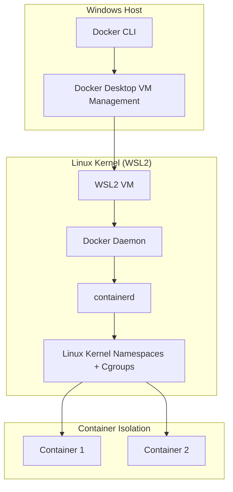

# Hướng Dẫn Setup Môi Trường Docker Trên Mac, Windows & Linux

Sau khi hiểu sức mạnh của Docker ở các bài viết trước, bước tiếp theo là đưa vũ khí này vào cỗ máy làm việc. Nghe đơn giản: *"Chỉ cần tải file setup về và next, next, finish?"*. Nếu bạn chỉ là người dùng phổ thông, điều đó đúng. Nhưng với tư cách là Backend/DevOps Engineer, bạn cần hiểu tại sao cài Docker trên Linux chỉ mất 2 dòng lệnh, trong khi trên Windows và Mac lại cần **Docker Desktop** hay **WSL 2**.

---

## Tại Sao Mac và Windows Cần "Docker Desktop"?

Hãy nhớ kiến thức cốt lõi: **Container sử dụng các tính năng của Linux Kernel (Namespaces và Cgroups).**

- **Trên Linux:** Mọi thứ là "Native". Lõi hệ điều hành đã có sẵn những thứ Docker cần. Bạn chỉ cần cài **Docker Engine** — một service chạy ngầm cực nhẹ.
- **Trên macOS và Windows:** Cả hai hệ điều hành này **KHÔNG có Linux Kernel**. Vậy làm sao chạy được Linux Container?

Đó là lúc **Docker Desktop** xuất hiện. Nó không chỉ là giao diện đồ họa (GUI). Bên dưới, Docker Desktop âm thầm tạo ra một **Máy ảo Linux cực kỳ siêu nhẹ** (Micro-VM) được tích hợp sâu vào hệ điều hành. Khi bạn gõ `docker run` trên Terminal, lệnh đó thực chất được gửi xuyên qua hệ điều hành vào nhân Linux ẩn kia để thực thi.



---

## Hướng Dẫn Cài Đặt Theo Từng Nền Tảng

### A. Linux (Môi trường chuẩn mực nhất)

Nếu bạn dùng Ubuntu/Kubuntu, bạn đang ở "sân nhà" của Docker. Cài trực tiếp Docker Engine qua CLI:

```bash
# 1. Cập nhật hệ thống và cài công cụ phụ trợ
sudo apt-get update
sudo apt-get install ca-certificates curl gnupg

# 2. Thêm GPG key chính thức của Docker
sudo install -m 0755 -d /etc/apt/keyrings
curl -fsSL https://download.docker.com/linux/ubuntu/gpg | sudo gpg --dearmor -o /etc/apt/keyrings/docker.gpg
sudo chmod a+r /etc/apt/keyrings/docker.gpg

# 3. Thêm Docker repository
echo \
  "deb [arch="$(dpkg --print-architecture)" signed-by=/etc/apt/keyrings/docker.gpg] https://download.docker.com/linux/ubuntu \
  "$(. /etc/os-release && echo "$VERSION_CODENAME")" stable" | \
  sudo tee /etc/apt/sources.list.d/docker.list > /dev/null

# 4. Cài đặt Docker Engine
sudo apt-get update
sudo apt-get install docker-ce docker-ce-cli containerd.io docker-buildx-plugin docker-compose-plugin
```

### B. macOS

1. Truy cập [docker.com](https://www.docker.com/products/docker-desktop/), tải **Docker Desktop for Mac** (trang web tự nhận diện chip Intel hay Apple Silicon)
2. Mở file `.dmg` và kéo thả icon cá voi vào thư mục `Applications`
3. Mở Docker app. Khi icon cá voi trên thanh Menu Bar ngừng nhấp nháy và báo **"Docker Desktop is running"**, bạn đã sẵn sàng

### C. Windows (WSL 2)

Trước đây, Docker trên Windows dựa vào Hyper-V và chạy nặng nề. Hiện nay, chuẩn mực bắt buộc là **WSL 2 (Windows Subsystem for Linux version 2)** — công nghệ của Microsoft đưa nguyên nhân Linux thật vào bên trong Windows.

```powershell
# Bật WSL 2 (PowerShell Admin)
wsl --install
```

*Lệnh này tự động bật tính năng cần thiết, tải nhân Linux và cài Ubuntu mặc định. Sau đó khởi động lại máy.*

Tiếp theo:

1. Tải **Docker Desktop for Windows** từ [docker.com](https://www.docker.com/products/docker-desktop/)
2. Chạy file cài đặt, đảm bảo tick **"Use WSL 2 instead of Hyper-V"**
3. Khởi động Docker Desktop

---

## Best Practices & Cạm Bẫy Khi Cài Đặt

### Cạm bẫy 1: Quên "Chạy" Docker Daemon

**Triệu chứng:** Gõ `docker ps` bị lỗi `Cannot connect to the Docker daemon`.

**Giải quyết:** Trên Mac và Windows, Docker không tự chạy nền nếu chưa bật app. Hãy chắc chắn đã mở Docker Desktop. Bật tính năng **"Start Docker Desktop when you log in"** trong Settings.

### Cạm bẫy 2: Lỗi Quyền Root (Trên Linux)

**Triệu chứng:** Gõ `docker run` bị báo `permission denied`. Phải thêm `sudo` trước mỗi lệnh.

**Best Practice:** Thêm user hiện tại vào group `docker`:

```bash
sudo usermod -aG docker $USER
newgrp docker
```

### Cạm bẫy 3: WSL 2 "Ăn Trọn" RAM

**Triệu chứng:** WSL 2 mặc định được phép dùng tới **50% tổng RAM**. Nếu máy 16GB RAM, Docker sẽ ngốn 8GB dù chẳng chạy ứng dụng gì nặng.

**Best Practice:** Giới hạn tài nguyên bằng file `.wslconfig` tại `C:\Users\<Tên_User>\`:

```ini
[wsl2]
memory=4GB
processors=2
```

*Lưu lại và mở PowerShell gõ `wsl --shutdown`, sau đó khởi động lại Docker Desktop.*

### Cạm bẫy 4: Bóng Ma "Docker Toolbox"

Nếu bạn thấy tutorial cũ hướng dẫn cài **Docker Toolbox** (dùng VirtualBox), hãy quên nó đi! Docker Toolbox là công nghệ lỗi thời, đã bị Docker chính thức khai tử. Nếu máy không đủ cấu hình, hãy cài Ubuntu hoặc thuê VPS giá rẻ để học.

---

## Tóm Tắt

Dù bạn sử dụng hệ điều hành nào, mục tiêu cuối cùng là có **Docker Engine** chạy mượt mà:

- **Linux** là môi trường hoàn hảo và nguyên thủy nhất
- **Windows và Mac** nhờ WSL 2 và Hypervisor framework đã mang lại trải nghiệm phát triển gần tương đương Linux

Để kiểm tra mọi thứ đã hoàn hảo, mở Terminal và gõ:

```bash
docker version
```

Nếu thấy thông tin hiển thị cả **Client** và **Server (Engine)**, cỗ máy của bạn đã sẵn sàng.
