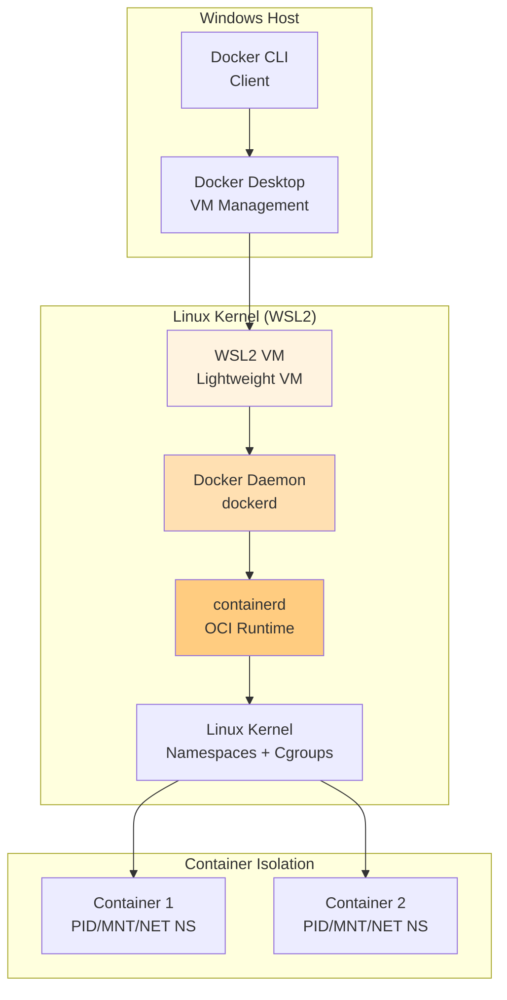

Dưới đây là phần thứ tư của series, được thiết kế để không chỉ hướng dẫn cài đặt "click next", mà còn giải thích tường tận cơ chế bên dưới (under the hood) để bạn hiểu chính xác máy tính của mình đang chạy cái gì.

---

# Setup Môi Trường Docker Chuẩn DevOps: Từ Mac, Windows Đến Linux (WSL2 & Under The Hood)

Sau khi hiểu được sức mạnh của Docker ở các bài viết trước, bước tiếp theo là đưa vũ khí này vào cỗ máy làm việc của bạn.

Nghe có vẻ đơn giản: *"Chỉ cần tải file setup về và next, next, finish là xong thôi mà?"*. Nếu bạn chỉ là người dùng phổ thông, điều đó đúng. Nhưng với tư cách là một Backend/DevOps Engineer, bạn cần hiểu tại sao cài Docker trên Linux chỉ mất 2 dòng lệnh, trong khi trên Windows và Mac lại sinh ra những phần mềm phức tạp như **Docker Desktop** hay **WSL 2**.

Hãy cùng "giải phẫu" quá trình cài đặt Docker trên các nền tảng và thiết lập một môi trường làm việc chuyên nghiệp nhất.

---

## 1. Giải Phẫu Khái Niệm: Tại Sao Mac và Windows Cần "Docker Desktop"?

Hãy nhớ lại kiến thức cốt lõi: **Container sử dụng các tính năng của Linux Kernel (như Namespaces và Cgroups)** - chuẩn OCI Runtime Specification.

### Kiến trúc WSL2 cho Docker trên Windows



* **Trên Linux:** Mọi thứ là "Native" (bản địa). Lõi hệ điều hành của bạn đã có sẵn những thứ Docker cần. Bạn chỉ cần cài **Docker Engine** — một service chạy ngầm (daemon) cực nhẹ.
* **Trên macOS và Windows:** Cả hai hệ điều hành này **KHÔNG có Linux Kernel**. Vậy làm sao chúng chạy được Linux Container?

Đó là lúc **Docker Desktop** xuất hiện. Nó không chỉ đơn thuần là một giao diện đồ họa (GUI). Bên dưới giao diện bóng bẩy đó, Docker Desktop âm thầm tạo ra một **Máy ảo Linux cực kỳ siêu nhẹ** (Micro-VM) được tích hợp sâu vào hệ điều hành của bạn. Khi bạn gõ lệnh `docker run` trên Terminal của Mac/Windows, lệnh đó thực chất được gửi xuyên qua hệ điều hành của bạn, đi thẳng vào cái nhân Linux ẩn kia để thực thi.

---

## 2. Hướng Dẫn Cài Đặt Theo Từng Nền Tảng

### A. Dành cho Linux (Môi trường chuẩn mực nhất)

Nếu bạn xài Ubuntu/Kubuntu, xin chúc mừng, bạn đang ở trên "sân nhà" của Docker. Không có giao diện rườm rà, chúng ta sẽ cài trực tiếp Docker Engine qua CLI.

**Thực hành (Code Snippet cho Ubuntu/Debian):**

```bash
# 1. Cập nhật hệ thống và cài các công cụ phụ trợ
sudo apt-get update
sudo apt-get install ca-certificates curl gnupg

# 2. Thêm GPG key chính thức của Docker
sudo install -m 0755 -d /etc/apt/keyrings
curl -fsSL https://download.docker.com/linux/ubuntu/gpg | sudo gpg --dearmor -o /etc/apt/keyrings/docker.gpg
sudo chmod a+r /etc/apt/keyrings/docker.gpg

# 3. Thêm Docker repository
echo \
  "deb [arch="$(dpkg --print-architecture)" signed-by=/etc/apt/keyrings/docker.gpg] https://download.docker.com/linux/ubuntu \
  "$(. /etc/os-release && echo "$VERSION_CODENAME")" stable" | \
  sudo tee /etc/apt/sources.list.d/docker.list > /dev/null

# 4. Cài đặt Docker Engine
sudo apt-get update
sudo apt-get install docker-ce docker-ce-cli containerd.io docker-buildx-plugin docker-compose-plugin

```

### B. Dành cho macOS

Việc cài đặt trên Mac rất đơn giản nhưng hãy lưu ý về kiến trúc chip (Intel vs Apple Silicon M1/M2/M3).

1. Truy cập [docker.com](https://www.docker.com/products/docker-desktop/), tải bản **Docker Desktop for Mac**. (Trang web thường tự nhận diện đúng loại chip của bạn).
2. Mở file `.dmg` và kéo thả icon con cá voi vào thư mục `Applications`.
3. Mở Docker app. Khi bạn thấy icon cá voi trên thanh Menu Bar (góc trên bên phải) ngừng nhấp nháy và báo **"Docker Desktop is running"**, bạn đã sẵn sàng.

### C. Dành cho Windows (Sức mạnh của WSL 2)

Trước đây, Docker trên Windows dựa vào Hyper-V và chạy khá nặng nề. Hiện nay, chuẩn mực bắt buộc là sử dụng **WSL 2 (Windows Subsystem for Linux version 2)**. Đây là công nghệ của Microsoft đưa nguyên một nhân Linux thật vào bên trong Windows.

1. **Bật WSL 2:** Mở PowerShell bằng quyền Admin (`Run as Administrator`) và gõ một lệnh duy nhất:
```powershell
wsl --install

```


```
   *(Lệnh này sẽ tự động bật các tính năng cần thiết, tải nhân Linux và cài đặt Ubuntu mặc định. Sau đó hãy khởi động lại máy).*
2. Truy cập [docker.com](https://www.docker.com/products/docker-desktop/), tải **Docker Desktop for Windows**.
3. Chạy file cài đặt. Đảm bảo tick chọn mục **"Use WSL 2 instead of Hyper-V"** (Dùng WSL 2 thay vì Hyper-V).
4. Khởi động Docker Desktop. Giao diện và cách hoạt động sẽ hoàn toàn tương đồng với Mac.

---

## 3. Best Practices & Cạm Bẫy (Pitfalls) Khi Cài Đặt

Là một kỹ sư đàn anh, tôi khuyên bạn đừng bỏ qua phần này. Rất nhiều bạn setup xong thì máy tính chạy giật lag hoặc gõ lệnh bị báo lỗi. Dưới đây là cách phòng tránh:

### Cạm bẫy 1: Quên "Chạy" Docker Daemon (Lỗi kinh điển trên Mac/Win)
* **Triệu chứng:** Bạn gõ `docker ps` vào terminal và nhận lỗi: `Cannot connect to the Docker daemon at unix:///var/run/docker.sock. Is the docker daemon running?`
* **Giải quyết:** Trên Mac và Windows, Docker không tự chạy nền nếu bạn chưa bật app. Hãy chắc chắn bạn đã click mở ứng dụng Docker Desktop (thấy icon cá voi hoạt động) trước khi gõ lệnh. Bạn có thể vào *Settings* của Docker Desktop và bật tính năng **"Start Docker Desktop when you log in"**.

### Cạm bẫy 2: Lỗi Quyền Root (Trên Linux)
* **Triệu chứng:** Cài xong trên Linux, bạn gõ `docker run` thì bị báo lỗi `permission denied`. Bạn phải thêm `sudo` trước mỗi lệnh (ví dụ: `sudo docker ps`), rất phiền phức và rủi ro.
* **Best Practice:** Hãy thêm user hiện tại của bạn vào group `docker` (điều này cho phép bạn dùng Docker không cần root).
  ```bash
sudo usermod -aG docker $USER
newgrp docker

```

*(Đăng xuất và đăng nhập lại để áp dụng).*

### Cạm bẫy 3: WSL 2 "Ăn Trọn" RAM Của Bạn (Lỗi tử huyệt trên Windows)

* **Triệu chứng:** Mặc định, WSL 2 trên Windows được phép dùng tới **50% tổng dung lượng RAM** của máy tính. Nếu bạn có 16GB RAM, một ngày đẹp trời Docker sẽ ngốn 8GB của bạn dù chẳng chạy ứng dụng gì nặng, khiến máy tính treo đơ.
* **Best Practice:** Giới hạn tài nguyên cho WSL 2. Tạo một file tên là `.wslconfig` ở thư mục `C:\Users\<Tên_User_Của_Bạn>` với nội dung sau:
```ini

```


[wsl2]
memory=4GB # Chỉ cho phép WSL 2 dùng tối đa 4GB RAM
processors=2 # Chỉ cho phép dùng 2 core CPU

```
  *(Lưu lại và mở PowerShell gõ `wsl --shutdown`, sau đó khởi động lại Docker Desktop).*

### Cạm bẫy 4: Bóng Ma "Docker Toolbox"
* Nếu bạn lên mạng tìm tutorial cũ, bạn có thể thấy hướng dẫn cài phần mềm tên là **Docker Toolbox** (dành cho Windows 7/8 hoặc Mac cũ không đủ cấu hình phần cứng).
* **Lời khuyên DevOps:** Hãy quên nó đi! Docker Toolbox là công nghệ lỗi thời (Legacy), sử dụng VirtualBox rất chậm chạp và nhiều lỗi mạng (networking). Nó đã bị Docker chính thức khai tử. Nếu máy bạn không đủ cấu hình cài Docker Desktop, bạn nên cài thẳng một hệ điều hành Linux (như Ubuntu) hoặc thuê một con VPS giá rẻ để học, tuyệt đối không dùng Toolbox.

---

## Tổng Kết

Dù bạn đang sử dụng hệ điều hành nào, mục tiêu cuối cùng là có được **Docker Engine** chạy mượt mà bên dưới. 
* Linux là môi trường hoàn hảo và nguyên thủy nhất.
* Windows và Mac nhờ có WSL 2 và Hypervisor framework mà đã mang lại trải nghiệm phát triển (Dev Experience) gần như tương đương với Linux.

Để kiểm tra xem mọi thứ đã hoàn hảo chưa, hãy mở Terminal/PowerShell của bạn lên và gõ:
```bash
docker version

```

Nếu bạn thấy thông tin hiển thị bao gồm cả **Client** và **Server (Engine)**, xin chúc mừng, cỗ máy của bạn đã sẵn sàng.

*Ở bài viết tới, chúng ta sẽ bắt tay vào viết những dòng lệnh Docker CLI đầu tiên, kéo Image từ Docker Hub và khởi chạy Container backend thực tế!*