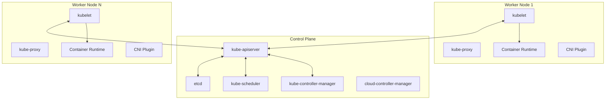
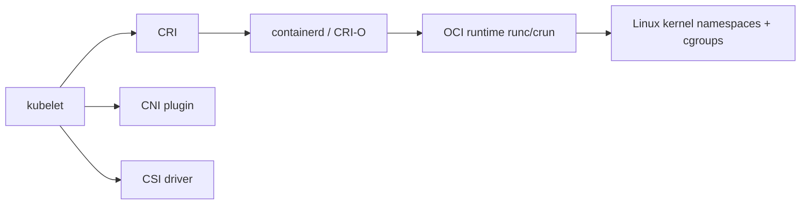
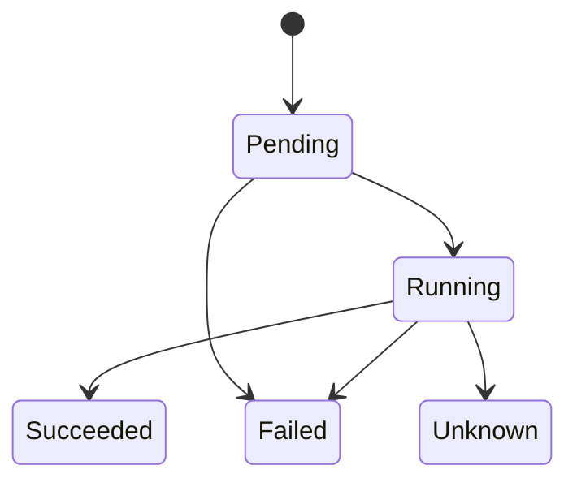
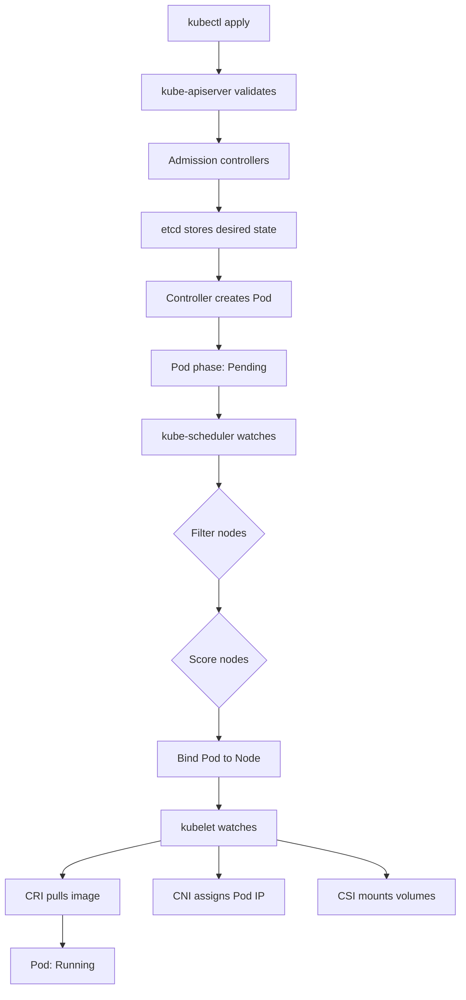
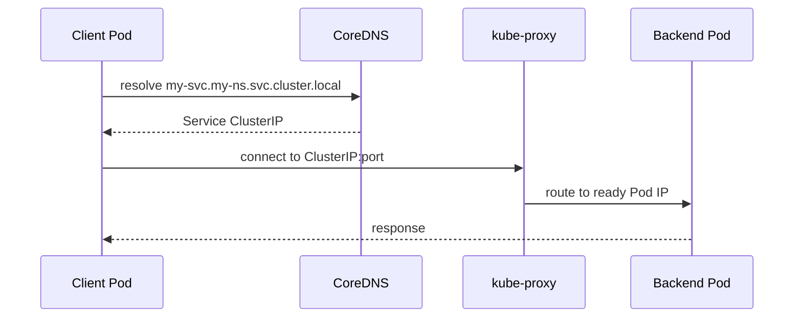

# Kiến Trúc Kubernetes: Deep Dive Từ Control Plane Đến Worker Nodes

Sau khi nắm vững Docker, ta cần hiểu **Kubernetes** — hệ thống điều phối container thuộc hệ sinh thái CNCF (Cloud Native Computing Foundation). Kubernetes giải quyết bài toán vận hành container ở quy mô nhiều node: scheduling, service discovery, self-healing, rollout, storage, policy và bảo mật.

---

## Kiến Trúc Tổng Quan Cluster

Một Kubernetes cluster gồm **Control Plane** và một hoặc nhiều **Worker Nodes**:

### Vai trò chính

| Thành phần | Vai trò | Ghi chú |
|---|---|---|
| `kube-apiserver` | Cổng vào duy nhất của Kubernetes API | Validate request, admission, authn/authz |
| `etcd` | Key-value store lưu state cluster | Cần backup và bảo vệ nghiêm ngặt |
| `kube-scheduler` | Gán Pod chưa schedule vào Node phù hợp | Dựa trên filter, score, affinity, taints/tolerations |
| `kube-controller-manager` | Kéo actual state về desired state | Deployment, ReplicaSet, Node, Job... |
| `kubelet` | Agent trên node, đảm bảo Pod chạy đúng spec | Gọi container runtime qua CRI |
| `container runtime` | Pull image, tạo sandbox/container | containerd hoặc CRI-O |
| `kube-proxy` | Hiện thực Service virtual IP | iptables, ipvs, nftables |
| CNI plugin | Cấp Pod IP, route, network policy | Calico, Cilium, Flannel |

---

## Các Interface Chuẩn: CRI, CNI, CSI, OCI

Kubernetes cố tình tách abstraction khỏi implementation:

| Interface | Kubernetes dùng để làm gì | Ví dụ |
|---|---|---|
| **CRI** - Container Runtime Interface | kubelet nói chuyện với container runtime | containerd, CRI-O |
| **CNI** - Container Network Interface | Thiết lập network namespace, Pod IP, route | Cilium, Calico, Flannel |
| **CSI** - Container Storage Interface | Provision, attach, mount volume | AWS EBS CSI, Ceph CSI |
| **OCI Image Spec** | Định dạng image: manifest, config, layers | Docker/OCI images |
| **OCI Runtime Spec** | Cách runtime tạo và chạy container bundle | runc, crun, Kata Containers |

Điểm quan trọng: Kubernetes hiện đại **không phụ thuộc Docker Engine trực tiếp**. Docker vẫn quan trọng ở bước build image, nhưng trong cluster production kubelet giao tiếp với containerd/CRI-O qua CRI.

---

## Pod Lifecycle

Pod là đơn vị deploy nhỏ nhất trong Kubernetes. Một Pod có thể chứa một hoặc nhiều container dùng chung network namespace, IP, port space và volumes.

### Pod phases

| Phase | Ý nghĩa |
|---|---|
| `Pending` | Đã được API server chấp nhận nhưng chưa chạy đủ container |
| `Running` | Đã gán vào node và ít nhất một container đang chạy |
| `Succeeded` | Tất cả container kết thúc thành công |
| `Failed` | Ít nhất một container kết thúc lỗi |
| `Unknown` | Control plane không xác định được trạng thái Pod |

Pod không tự "sống lại". Nếu Pod thuộc Deployment/StatefulSet/DaemonSet/Job, controller sẽ tạo Pod thay thế.

---

## Pod Scheduling Flow

Scheduler chỉ chọn node. Việc pull image, tạo container, gắn volume là trách nhiệm của kubelet và CRI/CNI/CSI trên node.

---

## Workloads: Deployment, StatefulSet, DaemonSet

| Loại workload | Dùng khi nào | Đặc điểm |
|---|---|---|
| **Deployment** | Stateless app, API, worker thay thế ngang hàng | Quản lý ReplicaSet, rolling update, rollback |
| **StatefulSet** | Database, queue cần identity/storage ổn định | Pod ordinal name, stable network, PVC riêng |
| **DaemonSet** | Agent cần chạy trên mỗi node | Log agent, monitoring agent, CNI plugin |
| **Job** | Tác vụ chạy xong thì kết thúc | Batch, migration, one-off task |
| **CronJob** | Job theo lịch | Backup, cleanup, scheduled sync |

---

## Service Types và Service Discovery

Pod IP là ephemeral. Service cung cấp địa chỉ ổn định để client gọi đến nhóm backend Pod.

### Service types

| Type | Mục đích | Cách hoạt động |
|---|---|---|
| `ClusterIP` | Truy cập nội bộ cluster | Default; cấp virtual IP nội bộ |
| `NodePort` | Mở service qua `<NodeIP>:<NodePort>` | Tự tạo ClusterIP; default range `30000-32767` |
| `LoadBalancer` | Expose qua cloud/load balancer | Dựa trên NodePort hoặc cloud-controller |
| `ExternalName` | Alias DNS đến hostname ngoài cluster | Trả CNAME, không proxy traffic |

---

## Ingress và Gateway API

Ingress dùng cho HTTP/HTTPS routing từ ngoài cluster vào Service bên trong. Ingress có thể xử lý host-based routing, path-based routing, TLS termination.

Điểm cần nhớ:
- Ingress resource **không làm gì** nếu không có **Ingress Controller**
- Ingress là API stable nhưng đã feature-frozen; tính năng mới được đẩy sang **Gateway API**

---

## ConfigMap và Secret

| Resource | Dùng cho | Lưu ý |
|---|---|---|
| `ConfigMap` | Cấu hình không nhạy cảm | Mount thành file hoặc env var |
| `Secret` | Dữ liệu nhạy cảm: token, password, TLS key | Không phải vault; cần RBAC chặt, encryption at rest |

Best practice: Tách config khỏi image, không đưa secret vào image/Git/build logs.

---

## Storage: PV, PVC, StorageClass, CSI

| Khái niệm | Ý nghĩa |
|---|---|
| `PersistentVolume` | Tài nguyên storage trong cluster |
| `PersistentVolumeClaim` | Yêu cầu storage của workload |
| `StorageClass` | Policy cho dynamic provisioning |
| `CSI Driver` | Plugin kết nối Kubernetes với storage provider |

---

## RBAC và Security

RBAC kiểm soát ai được làm gì với tài nguyên nào:

- Dùng ServiceAccount riêng cho từng workload
- Dùng Role/RoleBinding trong namespace khi có thể
- Tránh wildcard `*` cho verbs/resources
- Pod Security Admission (PSA) thay thế PSP đã deprecated
- Chạy non-root, drop capabilities, read-only root filesystem

---

## Best Practices Theo Chuẩn CNCF

1. **Immutable infrastructure:** Không sửa container đang chạy; sửa source, build image mới, rollout lại
2. **Declarative operations:** Quản lý bằng manifest, Helm/Kustomize hoặc GitOps
3. **Resource management:** Đặt `requests`; đặt `limits` có chủ đích
4. **Health probes:** Startup probe cho app khởi động chậm, readiness probe cho traffic, liveness probe cho lỗi không tự hồi phục
5. **Least privilege:** RBAC tối thiểu, non-root container, không privileged
6. **NetworkPolicy:** Giới hạn east-west traffic
7. **Secret handling:** Không secret trong image/Git/log; bật encryption at rest
8. **Image supply chain:** Pin image tag/digest, scan CVE, dùng trusted registry
9. **etcd backup:** Backup định kỳ và test restore
10. **Observability:** Metrics, logs, tracing phải thiết kế ngay từ đầu

---

## Tóm Tắt

Kubernetes không chỉ là công cụ "chạy nhiều container". Nó là control plane khai báo desired state, sau đó dùng các controller, scheduler, kubelet và plugin interfaces để liên tục kéo hệ thống về trạng thái mong muốn.

Nắm chắc kiến trúc giúp bạn debug đúng tầng: lỗi scheduling xem scheduler/events, lỗi container xem kubelet/runtime, lỗi network xem Service/EndpointSlice/CNI, lỗi storage xem PVC/PV/CSI, lỗi quyền xem RBAC.
