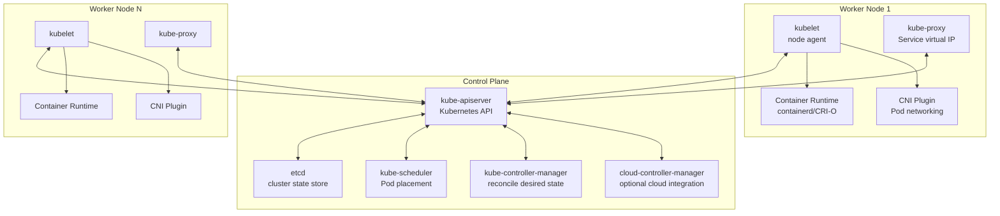
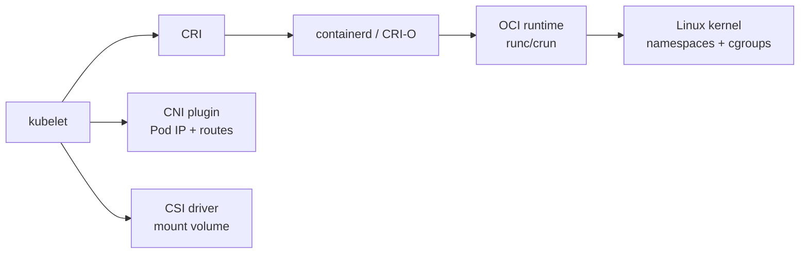
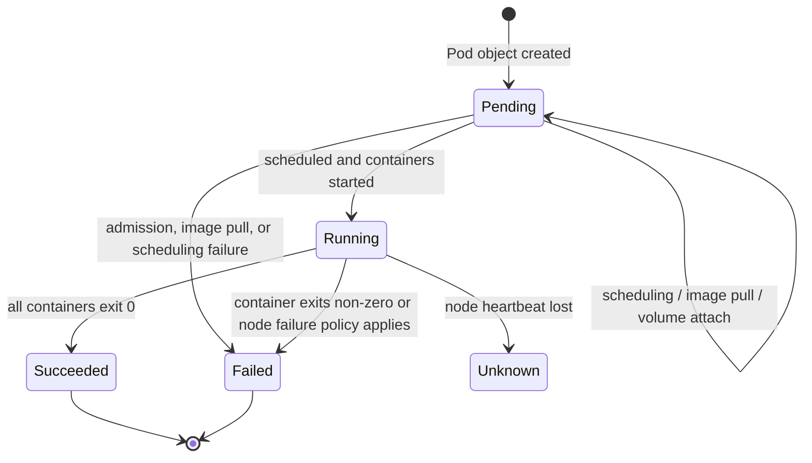
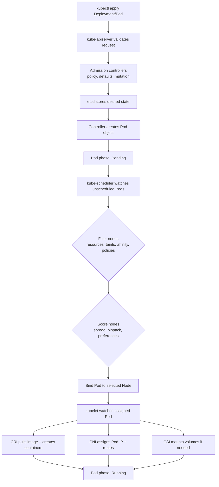
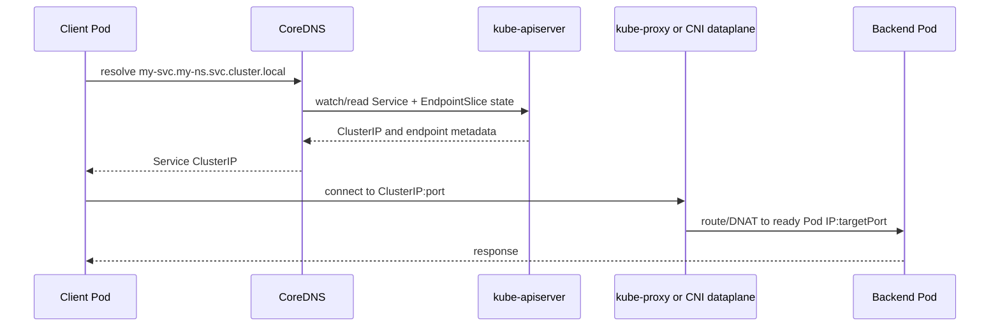
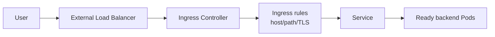
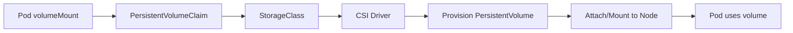
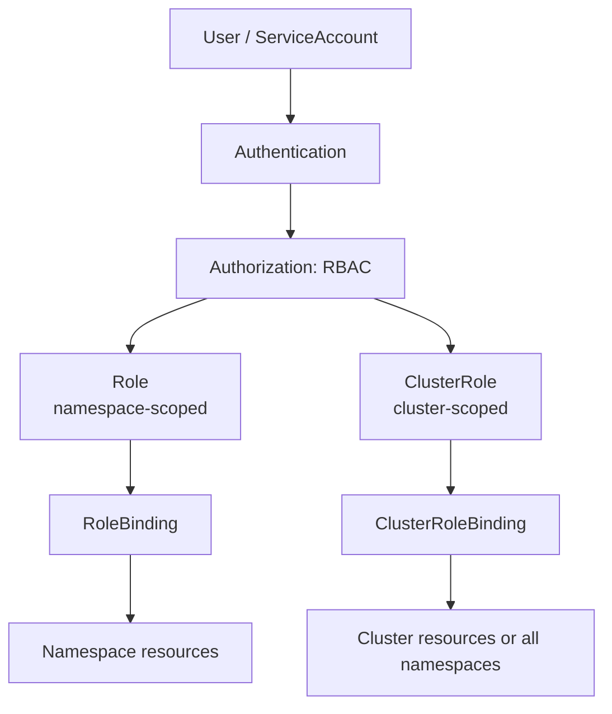

---

# Kubernetes Architecture Deep Dive: Từ Control Plane Đến Worker Nodes

Sau khi nắm vững Docker, ta cần hiểu **Kubernetes** - hệ thống điều phối container thuộc hệ sinh thái CNCF (Cloud Native Computing Foundation). Kubernetes giúp giải quyết bài toán vận hành container ở quy mô nhiều node: scheduling, service discovery, self-healing, rollout, storage, policy và bảo mật.

---

## 1. Kiến Trúc Tổng Quan Cluster

Một Kubernetes cluster gồm **Control Plane** và một hoặc nhiều **Worker Nodes**:



### Vai trò chính

| Thành phần | Vai trò | Ghi chú |
|---|---|---|
| `kube-apiserver` | Cổng vào duy nhất của Kubernetes API | Validate request, admission, authn/authz |
| `etcd` | Key-value store lưu state cluster | Cần backup và bảo vệ nghiêm ngặt |
| `kube-scheduler` | Gán Pod chưa được schedule vào Node phù hợp | Dựa trên filter, score, affinity, taints/tolerations, resources |
| `kube-controller-manager` | Chạy các controller để kéo actual state về desired state | Deployment, ReplicaSet, Node, Job, EndpointSlice... |
| `kubelet` | Agent trên node, đảm bảo Pod được chạy đúng spec | Gọi container runtime qua CRI |
| `container runtime` | Pull image, tạo sandbox/container | Thường là `containerd` hoặc CRI-O; runtime thấp hơn có thể dùng OCI runtime như `runc` |
| `kube-proxy` | Hiện thực Service virtual IP | Linux modes gồm `iptables`, `ipvs`, `nftables`; một số CNI thay bằng dataplane riêng |
| CNI plugin | Cấp Pod IP, route, network policy | Ví dụ Calico, Cilium, Flannel |
| CSI driver | Tích hợp storage provider | Dùng cho PV/PVC và dynamic provisioning |

---

## 2. Các Interface Chuẩn: CRI, CNI, CSI, OCI

Kubernetes cố tình tách abstraction khỏi implementation:

| Interface / Spec | Kubernetes dùng để làm gì | Ví dụ |
|---|---|---|
| **CRI** - Container Runtime Interface | kubelet nói chuyện với container runtime | containerd, CRI-O |
| **CNI** - Container Network Interface | thiết lập network namespace, Pod IP, route, policy | Cilium, Calico, Flannel |
| **CSI** - Container Storage Interface | provision, attach, mount volume | AWS EBS CSI, GCE PD CSI, Ceph CSI |
| **OCI Image Spec** | định dạng image: manifest, config, layers | Docker/OCI images |
| **OCI Runtime Spec** | cách runtime tạo và chạy container bundle | runc, crun, Kata Containers |



Điểm quan trọng: Kubernetes hiện đại không phụ thuộc Docker Engine trực tiếp. Docker vẫn rất quan trọng ở bước build image và developer workflow, nhưng trong cluster production kubelet thường giao tiếp với containerd/CRI-O qua CRI.

---

## 3. Pod Lifecycle

Pod là đơn vị deploy nhỏ nhất trong Kubernetes. Một Pod có thể chứa một hoặc nhiều container dùng chung network namespace, IP, port space và volumes.

### Pod phases

| Phase | Ý nghĩa |
|---|---|
| `Pending` | Pod đã được API server chấp nhận nhưng chưa chạy đủ container; có thể đang chờ schedule, pull image, attach volume |
| `Running` | Pod đã được gán vào node và ít nhất một container chính đang chạy hoặc đang restart |
| `Succeeded` | Tất cả container kết thúc thành công và sẽ không restart |
| `Failed` | Ít nhất một container kết thúc lỗi hoặc Pod bị coi là failed |
| `Unknown` | Control plane không xác định được trạng thái Pod, thường do mất liên lạc với node |



Pod không tự "sống lại" như một thực thể bền vững. Nếu Pod thuộc Deployment, StatefulSet, DaemonSet hoặc Job, controller tương ứng sẽ tạo Pod thay thế để đạt desired state.

---

## 4. Pod Scheduling Flow

Từ YAML đến Pod chạy thật, luồng chính như sau:



Scheduler chỉ chọn node. Việc pull image, tạo container, gắn volume và cấu hình network là trách nhiệm của kubelet cùng CRI/CNI/CSI trên node đã được chọn.

---

## 5. Workloads: Deployment, StatefulSet, DaemonSet

| Loại workload | Dùng khi nào | Đặc điểm |
|---|---|---|
| **Deployment** | Stateless app, API, worker có thể thay thế ngang hàng | Quản lý ReplicaSet, rolling update, rollback |
| **StatefulSet** | Database, queue, workload cần identity/storage ổn định | Pod có ordinal name, stable network identity, PVC riêng |
| **DaemonSet** | Agent cần chạy trên mỗi node hoặc nhóm node | Log agent, monitoring agent, CNI/node plugin |
| **Job** | Tác vụ chạy xong thì kết thúc | Batch, migration, one-off task |
| **CronJob** | Job theo lịch | Backup, cleanup, scheduled sync |

Không nên chọn StatefulSet chỉ vì app "có state" ở mức business. Hãy chọn khi workload thật sự cần stable identity, thứ tự rollout hoặc storage gắn với từng replica.

---

## 6. Service Types Và Service Discovery

Pod IP là ephemeral. Service cung cấp địa chỉ ổn định để client gọi đến một nhóm backend Pod thông qua selector và EndpointSlice.

### Service types

| Type | Mục đích | Cách hoạt động |
|---|---|---|
| `ClusterIP` | Truy cập nội bộ cluster | Default; cấp virtual IP nội bộ |
| `NodePort` | Mở service qua `<NodeIP>:<NodePort>` | Tự tạo ClusterIP phía sau; default range thường là `30000-32767` |
| `LoadBalancer` | Expose qua cloud/load balancer implementation | Thường dựa trên NodePort hoặc cloud-controller-manager |
| `ExternalName` | Alias DNS đến hostname ngoài cluster | Trả CNAME, không proxy traffic |

### Service discovery flow



Kubernetes network model giả định mỗi Pod có IP riêng trong cluster và Pod có thể giao tiếp trực tiếp với Pod khác nếu không bị NetworkPolicy hoặc dataplane policy chặn.

---

## 7. Ingress Và Gateway API

Ingress dùng cho HTTP/HTTPS routing từ ngoài cluster vào Service bên trong cluster. Ingress có thể xử lý host-based routing, path-based routing, TLS termination và fan-out nhiều Service sau một entrypoint.

Điểm cần nhớ:

- Ingress resource tự nó không làm gì nếu không có **Ingress Controller**.
- Ingress là API stable, nhưng đã feature-frozen; tính năng mới được đẩy sang **Gateway API**.
- Expose protocol không phải HTTP/HTTPS thường dùng `LoadBalancer`, `NodePort`, Gateway API hoặc giải pháp riêng của cloud/service mesh.



---

## 8. ConfigMap Và Secret

| Resource | Dùng cho | Lưu ý |
|---|---|---|
| `ConfigMap` | Cấu hình không nhạy cảm: flags, URLs, config file | Có thể mount thành file hoặc env var |
| `Secret` | Dữ liệu nhạy cảm: token, password, TLS key | Không phải vault mặc định; cần RBAC chặt, encryption at rest, hạn chế quyền đọc |

Best practice:

- Tách config khỏi image để giữ image immutable.
- Không đưa secret vào image, Git repo hoặc build logs.
- Với Kubernetes production, cân nhắc External Secrets Operator, cloud secret manager hoặc sealed/sops workflow.
- Tránh mount service account token tự động nếu workload không cần gọi Kubernetes API.

---

## 9. Storage: PV, PVC, StorageClass, CSI

PersistentVolume subsystem tách nhu cầu storage của app khỏi implementation storage bên dưới.



| Khái niệm | Ý nghĩa |
|---|---|
| `PersistentVolume` | Tài nguyên storage trong cluster, được provision thủ công hoặc động |
| `PersistentVolumeClaim` | Yêu cầu storage của workload |
| `StorageClass` | Policy/provisioner cho dynamic provisioning |
| `CSI Driver` | Plugin kết nối Kubernetes với storage provider |

Không giả định Pod, Pod IP, node local disk hoặc writable container layer là bền vững. Dữ liệu cần tồn tại lâu dài nên đi qua PVC hoặc storage service bên ngoài.

---

## 10. RBAC - Role-Based Access Control

RBAC kiểm soát ai được làm gì với tài nguyên nào.



Best practice:

- Dùng ServiceAccount riêng cho từng workload.
- Dùng Role/RoleBinding trong namespace khi có thể.
- Tránh wildcard `*` cho verbs/resources.
- Không cấp quyền đọc Secret rộng nếu không cần.
- Audit các binding mặc định và binding cấp cluster.

---

## 11. Security: PSA, OPA/Gatekeeper, Image Scanning

**PodSecurityPolicy (PSP)** đã deprecated từ Kubernetes v1.21 và bị remove ở v1.25. Cách tiếp cận hiện tại là:

- **Pod Security Admission (PSA):** enforce Pod Security Standards ở cấp namespace với ba profile `privileged`, `baseline`, `restricted`.
- **OPA/Gatekeeper hoặc Kyverno:** policy-as-code mở rộng cho quy tắc riêng của tổ chức.
- **Image scanning:** scan CVE trong CI/CD và trước khi deploy.
- **Runtime hardening:** chạy non-root, drop capabilities, chặn privilege escalation, dùng read-only root filesystem nếu app hỗ trợ.

Ví dụ security context cơ bản:

```yaml
securityContext:
  runAsNonRoot: true
  runAsUser: 10001
  seccompProfile:
    type: RuntimeDefault
containers:
  - name: app
    image: registry.example.com/app:1.0.0
    securityContext:
      allowPrivilegeEscalation: false
      readOnlyRootFilesystem: true
      capabilities:
        drop: ["ALL"]
```

---

## 12. CNCF-Aligned Best Practices

1. **Immutable infrastructure:** không sửa container đang chạy; sửa source, build image mới, scan, rollout lại.
2. **Declarative operations:** quản lý bằng manifest, Helm/Kustomize hoặc GitOps thay vì thay đổi thủ công trên production.
3. **Resource management:** đặt `requests`; đặt `limits` có chủ đích, đặc biệt memory limit.
4. **Health probes:** dùng startup probe cho app khởi động chậm, readiness probe để điều tiết traffic, liveness probe cho lỗi không tự hồi phục.
5. **Least privilege:** RBAC tối thiểu, non-root container, không privileged nếu không có lý do rõ.
6. **NetworkPolicy:** giới hạn east-west traffic, không mặc định tin mọi Pod trong cluster.
7. **Secret handling:** tránh secret trong image/Git/log; bật encryption at rest và kiểm soát quyền đọc Secret.
8. **Image supply chain:** pin image tag/digest, scan CVE, dùng trusted registry, cân nhắc ký image.
9. **etcd backup:** backup định kỳ và test restore, vì etcd là source of truth của cluster.
10. **Observability:** metrics, logs, tracing và events phải được thiết kế ngay từ đầu, không đợi đến khi có sự cố.

---

## 13. Accuracy Checklist

| Chủ đề | Kết luận chính xác |
|---|---|
| Pod lifecycle | Phase chính là `Pending`, `Running`, `Succeeded`, `Failed`, `Unknown`; container state chi tiết gồm `Waiting`, `Running`, `Terminated`. |
| Service | Các type chuẩn là `ClusterIP`, `NodePort`, `LoadBalancer`, `ExternalName`; Ingress không phải Service type. |
| kube-proxy | Linux modes gồm `iptables`, `ipvs`, `nftables`; một số CNI có thể thay thế bằng dataplane riêng. |
| Ingress | Stable nhưng frozen; Gateway API là hướng mở rộng tính năng mới. |
| ConfigMap/Secret | Secret không tự động tương đương vault; vẫn cần RBAC, encryption at rest và quy trình quản lý secret. |
| Workloads | Deployment cho stateless, StatefulSet cho identity/storage ổn định, DaemonSet cho node-level agents. |
| Storage | PV có lifecycle độc lập với Pod; PVC là yêu cầu storage; CSI là chuẩn plugin storage. |
| Security | PSP đã bị remove; dùng PSA và policy engines như Gatekeeper/Kyverno. |

---

## Tổng Kết

Kubernetes không chỉ là công cụ "chạy nhiều container". Nó là một control plane khai báo desired state, sau đó dùng các controller, scheduler, kubelet và plugin interfaces để liên tục kéo hệ thống về trạng thái mong muốn.

Nắm chắc kiến trúc này giúp bạn debug đúng tầng: lỗi scheduling xem scheduler/events, lỗi container xem kubelet/runtime, lỗi network xem Service/EndpointSlice/kube-proxy/CNI, lỗi storage xem PVC/PV/CSI, lỗi quyền xem RBAC/admission policy.
