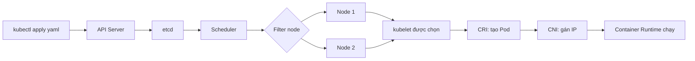

# Lộ Trình Học Từ Docker Cơ Bản Đến Kubernetes Nâng Cao

Ở phần trước, chúng ta đã "mổ xẻ" cơ chế hoạt động Docker và lý do tại sao nó là cuộc cách mạng cho kiến trúc hệ thống. Giờ đây, khi đã nắm được những khái niệm cốt lõi "under the hood", đã đến lúc vạch ra một lộ trình học tập và áp dụng thực tế.

Bài viết này không chỉ lướt qua lý thuyết suông. Chúng ta sẽ đi sâu vào những thứ bạn thực sự cần để build, deploy và vận hành hệ thống Backend chịu tải cao.

---

## Giai Đoạn 1: Nền Tảng Cốt Lõi (The Foundation)

Để chạy được ứng dụng trơn tru, bạn cần làm chủ các mảnh ghép cơ bản nhất:

### Images & Containers

Bản chất của việc build Image là gì? Làm sao tự viết Dockerfile, tận dụng Base Images có sẵn, và khởi chạy Container từ những Image đó. Quan trọng nhất là hiểu rõ cách Image và Container tương tác qua lại.

### Data & Volumes (Bảo toàn dữ liệu)

Trong thế giới Container, mọi thứ đều là tạm thời (ephemeral). Nếu container bị sập, khởi động lại hoặc xóa, dữ liệu bên trong sẽ bốc蒸发. Bạn sẽ học cách quản lý **Volumes** để đảm bảo dữ liệu luôn được lưu trữ an toàn — điều kiện tiên quyết khi chạy các database như MongoDB.

### Container Networking (Mạng lưới giao tiếp)

Hệ thống hiện đại không bao giờ đứng độc lập. Làm thế nào để Backend Go service kết nối an toàn tới database, hay phục vụ dữ liệu cho frontend? Thiết lập mạng lưới nội bộ để các container "nói chuyện" với nhau là kỹ năng sống còn.

---

## Giai Đoạn 2: Thực Chiến Production (Real-Life Concepts)

Khi nền tảng đã vững, chúng ta nâng cấp và đối mặt với bài toán kiến trúc phức tạp hơn.

### Multi-Container Projects & Docker-Compose

Quản lý cụm ứng dụng nhiều thành phần (API, Database, Message Queue, AI Models) bằng CLI rời rạc là cơn ác mộng. **Docker-Compose** định nghĩa và khởi chạy toàn bộ stack cục bộ chỉ bằng một file cấu hình duy nhất.

### Utility Containers

Mô hình kiến trúc thú vị: sử dụng container không phải để chạy process liên tục 24/7, mà đóng vai trò bộ công cụ dùng một lần (chạy script migrate database, khởi tạo môi trường test, chạy lệnh build CI/CD).

### Triển khai (Deployment) lên Cloud

Đưa toàn bộ thành quả lên Cloud. Lấy **AWS** làm môi trường tham chiếu để deploy containerized applications lên production chuẩn chỉ.

---

## Giai Đoạn 3: "Trùm Cuối" Kubernetes (K8s)

Docker rất tuyệt, nhưng khi hệ thống phình to với hàng chục microservices chạy trên nhiều máy chủ vật lý, quản lý container thủ công là bất khả thi. Đó là lúc **Kubernetes (K8s)** xuất hiện.

Chúng ta cố tình để K8s ở cuối vì bạn bắt buộc phải hiểu tường tận về Container trước khi nhận ra "nỗi đau" mà Kubernetes giải quyết.

### Kiến trúc & Nguyên lý cốt lõi

Khám phá lý do Kubernetes ra đời và cách nó tự động hóa việc vận hành hệ thống.

### Dịch chuyển sang tư duy Cluster

Các khái niệm về Data, Volumes & Networking ở Docker đã hóc búa, nay được nâng cấp lên để phù hợp với môi trường cụm máy chủ. Bạn sẽ thấy cách kiến thức cũ được "ánh xạ" hoàn hảo sang hệ sinh thái mới.

### Deploy K8s Cluster

Thực hành setup và deploy ứng dụng trực tiếp lên cluster thực thụ. Sau phần này, việc gõ `kubectl` điều khiển hệ thống sẽ trở thành bản năng.

---

## Best Practices Đi Xuyên Suốt Lộ Trình

### OCI First

Image nên tương thích OCI Image Spec; runtime cuối cùng là OCI runtime như `runc`. Kubernetes không gọi Docker Engine trực tiếp trong cluster hiện đại, kubelet nói chuyện với runtime qua CRI như containerd hoặc CRI-O.

### Immutable Infrastructure

Không SSH vào container để sửa lỗi thủ công. Sửa source, build image mới, scan, ký (nếu có pipeline signing), rồi rollout lại.

### Declarative Operations

Ưu tiên manifest, Helm/Kustomize hoặc GitOps thay vì thay đổi thủ công bằng CLI trên production.

### Resource Governance

Mỗi workload cần `requests` tối thiểu; memory limit nên được đặt có chủ đích; CPU limit cần cân nhắc vì có thể gây throttling.

### Health Model

- **Startup probe:** Cho app khởi động chậm
- **Readiness probe:** Cho khả năng nhận traffic
- **Liveness probe:** Cho lỗi không tự hồi phục

### Least Privilege

Chạy non-root, không privileged container nếu không có lý do rõ, giảm Linux capabilities, tách namespace/service account/RBAC theo workload.

### NetworkPolicy

Mặc định cluster cho phép pod-to-pod rộng. Dùng NetworkPolicy hoặc service mesh policy để giới hạn east-west traffic.

### Storage Rõ Lifecycle

Dữ liệu bền vững đi qua PVC/StorageClass/CSI. Không giả định Pod IP, node local disk hoặc writable container layer là ổn định.

---

## Tài Liệu Chính Thức Để Đối Chiếu

- **Docker Docs:** Docker Engine, Dockerfile reference, storage drivers/layers, Compose Specification
- **Kubernetes Docs:** Components, Pod lifecycle, Service, Ingress, Persistent Volumes, RBAC, Pod Security Admission
- **CNCF Glossary/Whitepapers:** Containers, immutable infrastructure, cloud native security
- **OCI:** opencontainers/image-spec, opencontainers/runtime-spec, opencontainers/distribution-spec

---

## Tóm Tắt

Đây là hành trình đồ sộ với vô số khái niệm kỹ thuật và Use-case thực tế. Khối lượng kiến thức lớn, nhưng chúng ta sẽ đi từng bước một cách có hệ thống để không bỏ sót nền tảng nào. Hãy mở Terminal lên, vì chúng ta sắp bắt tay vào code ngay bây giờ!
