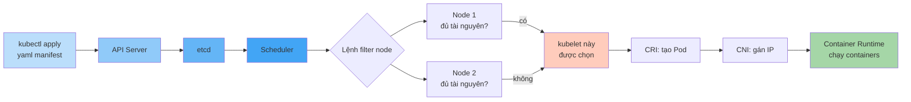
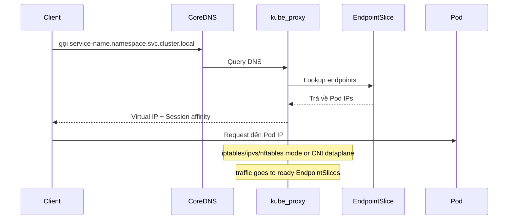
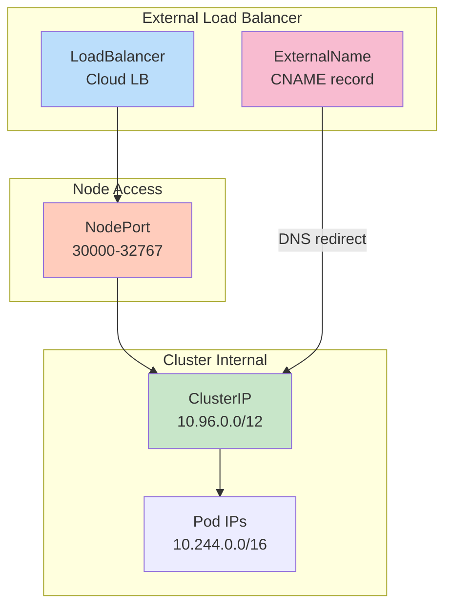

Dưới đây là phần tiếp theo của bài blog, được cấu trúc lại từ kịch bản để biến thành một lộ trình (Roadmap) rõ ràng, sắc bén và mang tính định hướng cao cho một kỹ sư hệ thống.

---

## Lộ Trình Thực Chiến: Từ Docker Cơ Bản Đến Hệ Sinh Thái Kubernetes

Chào mừng bạn trở lại! Ở phần trước, chúng ta đã "mổ xẻ" cơ chế hoạt động của Docker và lý do tại sao nó là cuộc cách mạng cho kiến trúc hệ thống. Giờ đây, khi bạn đã nắm được những khái niệm cốt lõi "under the hood", đã đến lúc vạch ra một lộ trình học tập và áp dụng thực tế.

Khóa học/bài hướng dẫn này không chỉ lướt qua lý thuyết suông. Chúng ta sẽ đi sâu vào những thứ bạn thực sự cần để build, deploy và vận hành một hệ thống Backend chịu tải cao. Dưới đây là bức tranh toàn cảnh về những gì chúng ta sẽ chinh phục trong thời gian tới.

---

### 🛠️ Giai Đoạn 1: Nền Tảng Cốt Lõi (The Foundation)

Để chạy được ứng dụng trơn tru, bạn cần làm chủ hoàn toàn các mảnh ghép cơ bản nhất. Ở block nền tảng này, chúng ta sẽ giải quyết 3 bài toán lớn:

* **Images & Containers:** Bản chất của việc build Image là gì? Làm sao để tự viết Dockerfile, tận dụng các Base Images có sẵn, và khởi chạy/cấu hình Container từ những Images đó. Quan trọng nhất là hiểu rõ cách Image và Container tương tác qua lại.
* **Data & Volumes (Bảo toàn dữ liệu):** Trong thế giới Container, mọi thứ đều là tạm thời (ephemeral). Nếu một container bị sập, khởi động lại hoặc xóa đi, dữ liệu bên trong sẽ bốc hơi. Bạn sẽ học cách quản lý **Volumes** để đảm bảo dữ liệu luôn được lưu trữ an toàn (điều kiện tiên quyết khi bạn chạy các database như MongoDB cho dự án).
* **Container Networking (Mạng lưới giao tiếp):** Một hệ thống hiện đại không bao giờ đứng độc lập. Làm thế nào để một service Backend viết bằng Go xử lý logic có thể kết nối an toàn tới database, hay phục vụ dữ liệu cho một ứng dụng frontend (ví dụ: Mobile app bằng Flutter) nằm ở một container khác? Thiết lập mạng lưới nội bộ để các container "nói chuyện" với nhau là kỹ năng sống còn.

---

### 🚀 Giai Đoạn 2: Thực Chiến Production (Real-Life Concepts)

Khi nền tảng đã vững, chúng ta sẽ nâng cấp "đồ chơi" và đối mặt với các bài toán kiến trúc phức tạp hơn ở môi trường thực tế.

* **Multi-Container Projects & Docker-Compose:** Quản lý một cụm ứng dụng nhiều thành phần (API, Database, Message Queue, AI Models) bằng các lệnh CLI rời rạc là một cơn ác mộng. **Docker-Compose** chính là công cụ giúp bạn định nghĩa và khởi chạy toàn bộ stack cục bộ chỉ bằng một file cấu hình duy nhất.
* **Utility Containers:** Đây là một mô hình kiến trúc cực kỳ thú vị. Bạn sẽ học cách sử dụng container không phải để chạy một process liên tục 24/7, mà đóng vai trò như một bộ công cụ dùng một lần (ví dụ: chạy script tự động migrate database, khởi tạo môi trường test, hoặc chạy các lệnh build CI/CD).
* **Triển khai (Deployment):** Đưa toàn bộ thành quả lên Cloud. Chúng ta sẽ lấy **AWS** làm môi trường tham chiếu để deploy các containerized applications lên production một cách chuẩn chỉ.

---

### ☸️ Giai Đoạn 3: "Trùm Cuối" Kubernetes (K8s)

Docker rất tuyệt, nhưng khi hệ thống của bạn phình to với hàng chục microservices chạy trên nhiều máy chủ vật lý khác nhau (đáp ứng cho các hệ thống routing thông minh hay tính toán lượng lớn request), quản lý container thủ công là bất khả thi. Đó là lúc hệ thống điều phối **Kubernetes (K8s)** xuất hiện.

Chúng ta cố tình để K8s ở cuối vì bạn bắt buộc phải hiểu tường tận về Container trước khi nhận ra "nỗi đau" mà Kubernetes giải quyết.

* **Kiến trúc & Nguyên lý cốt lõi:** Khám phá lý do Kubernetes ra đời và cách nó tự động hóa việc vận hành hệ thống.
* **Dịch chuyển sang tư duy Cluster:** Các khái niệm về **Data, Volumes & Networking** ở Docker đã hóc búa, nay sẽ được nâng cấp lên để phù hợp với môi trường cụm máy chủ (Cluster) của K8s. Bạn sẽ thấy cách những kiến thức cũ được "ánh xạ" hoàn hảo sang hệ sinh thái mới này.
* **Deploy K8s Cluster:** Thực hành setup và deploy các ứng dụng trực tiếp lên một cluster thực thụ. Chắc chắn sau phần này, việc gõ các lệnh `kubectl` điều khiển hệ thống sẽ trở thành bản năng của bạn.

---

## Pod Scheduling Flowchart

Kubernetes đưa Pod từ YAML đến Node chạy thực sự qua flow:

---

## Service Discovery Flow

Cơ chế các Service kết nối Pod trong cluster:

---

## Kubernetes Service Types Architecture

---

## OCI và Cloud Native best practices cần đi xuyên suốt lộ trình

1. **OCI first:** Image nên tương thích OCI Image Spec; runtime cuối cùng thường là OCI runtime như `runc` hoặc runtime tương thích. Kubernetes không gọi Docker Engine trực tiếp trong các cluster hiện đại, mà kubelet nói chuyện với runtime qua CRI như containerd hoặc CRI-O.
2. **Immutable infrastructure:** Không SSH vào container để sửa lỗi thủ công. Sửa source, build image mới, scan, ký nếu có pipeline signing, rồi rollout lại.
3. **Declarative operations:** Ưu tiên manifest, Helm/Kustomize hoặc GitOps thay vì thay đổi thủ công bằng CLI trên production.
4. **Resource governance:** Mỗi workload cần `requests` tối thiểu; memory limit nên được đặt có chủ đích; CPU limit cần cân nhắc vì có thể gây throttling.
5. **Health model:** Dùng startup probe cho app khởi động chậm, readiness probe cho khả năng nhận traffic, liveness probe cho lỗi không tự hồi phục.
6. **Least privilege:** Chạy non-root, không privileged container nếu không có lý do rõ, giảm Linux capabilities, tách namespace/service account/RBAC theo workload.
7. **NetworkPolicy:** Mặc định cluster cho phép pod-to-pod rộng; hãy dùng NetworkPolicy hoặc service mesh policy để giới hạn east-west traffic.
8. **Storage rõ lifecycle:** Dữ liệu bền vững đi qua PVC/StorageClass/CSI; không giả định Pod IP, node local disk hoặc writable container layer là ổn định.

## Tài liệu chính thức để đối chiếu

- Docker Docs: Docker Engine, Dockerfile reference, storage drivers/layers, Compose Specification.
- Kubernetes Docs: Components, Pod lifecycle, Service, Ingress, Persistent Volumes, RBAC, Pod Security Admission.
- CNCF Glossary/Whitepapers: containers, immutable infrastructure, cloud native security.
- OCI: opencontainers/image-spec, opencontainers/runtime-spec, opencontainers/distribution-spec.

---

### Tổng kết

Đây là một hành trình đồ sộ với vô số khái niệm kỹ thuật và các Use-case thực tế. Khối lượng kiến thức lớn, nhưng chúng ta sẽ đi từng bước một cách có hệ thống để không bỏ sót bất kỳ nền tảng nào. Hãy mở Terminal của bạn lên, vì chúng ta sắp bắt tay vào code ngay bây giờ!
