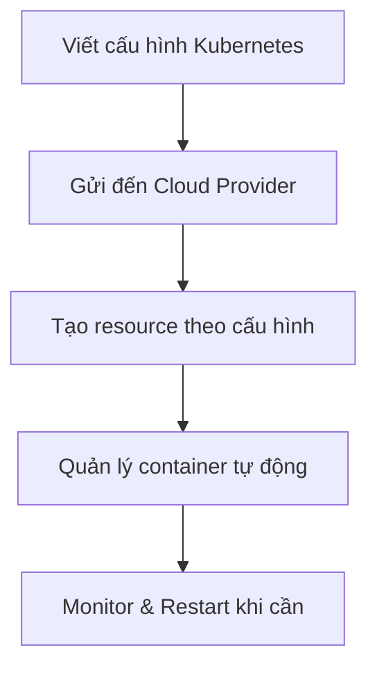

# Kubernetes Chính Xác Là Gì? Hiểu Đúng Để Không Nhầm Lẫn

## Giới Thiệu

"Kubernetes là hệ thống orchestration container" — câu này bạn đã nghe nhiều lần. Nhưng chính xác nó làm gì? Và quan trọng hơn, nó **không** phải là gì? Hiểu sai về Kubernetes sẽ khiến bạn lãng phí thời gian và công sức.

---

## Kubernetes: Định Nghĩa Chính Xác

Theo tài liệu chính thức tại [kubernetes.io](https://kubernetes.io):

> "Kubernetes là nền mã nguồn mở, có thể mở rộng, giúp quản lý workload container và dịch vụ, hỗ trợ cấu hình khai báo và tự động hóa."

Nói đơn giản hơn, Kubernetes giúp bạn:
- **Triển khai tự động** container lên bất kỳ cloud nào
- **Scaling tự động** số lượng container theo nhu cầu
- **Load balancing** traffic đều đặn
- **Tự động phục hồi** khi container gặp sự cố
- **Quản lý cấu hình** và secret an toàn

## Cách Kubernetes Hoạt Động



Bạn viết một **file cấu hình YAML** mô tả:
- Container nào cần chạy
- Bao nhiêu replica
- Khi nào cần scaling
- Container nào cần thay thế khi lỗi

Sau đó, gửi cấu hình này đến bất kỳ cloud nào hỗ trợ Kubernetes, và hệ thống sẽ **tự động thực hiện** những gì bạn mô tả.

## Kubernetes Không Phải Là Cloud Provider

Đây là nhầm lẫn phổ biến nhất. Kubernetes:
- **Không phải AWS, Azure, hay Google Cloud** — Nó chạy **trên** các cloud này
- **Không tạo infrastructure** — Bạn phải cung cấp cluster trước
- **Không phải PaaS** — Nó hoạt động ở tầng container, không phải phần cứng

## Kubernetes Không Phải Là Đối Thủ Của Docker

Kubernetes **làm việc cùng** Docker:
- Docker đóng gói ứng dụng thành container
- Kubernetes quản lý và triển khai các container đó

```
Docker: "Tôi tạo container từ image"
Kubernetes: "Tôi chạy và quản lý các container đó trên cluster"
```

## Ví Dụ Thực Tế

Giả sử bạn có ứng dụng web với:
- 1 frontend container
- 1 backend container
- 1 database container

Với Kubernetes, bạn viết cấu hình YAML mô tả:
- Ba container này cần chạy như thế nào
- Bao nhiêu replica của mỗi container
- Cách chúng giao tiếp với nhau
- Quy tắc scaling khi traffic tăng

Sau đó, áp dụng cấu hình lên cluster và Kubernetes sẽ **tự động** thực hiện tất cả.

## Tóm Tắt

- Kubernetes là hệ thống orchestration container mã nguồn mở
- Bạn viết cấu hình YAML, Kubernetes thực thi trên cloud
- Nó không phải cloud provider, không thay thế Docker
- Nó hoạt động ở tầng container, quản lý lifecycle của container
- Cấu hình một lần, chạy được trên mọi cloud

> **Bài tiếp theo:** Tìm hiểu kiến trúc tổng quan và các thành phần cốt lõi của Kubernetes.
