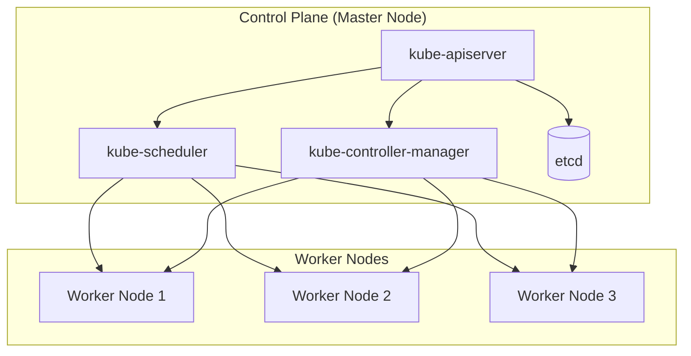
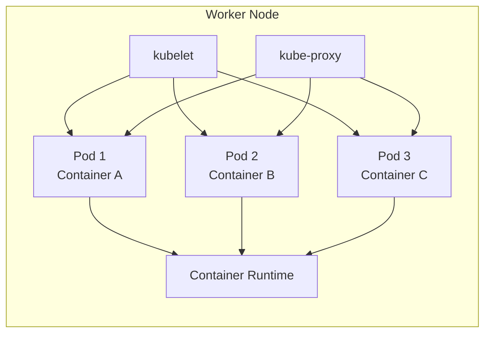
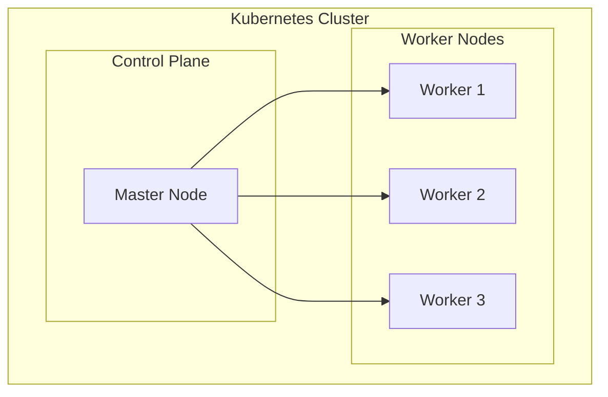

# Kiến Trúc Kubernetes: Hiểu Rõ Control Plane, Worker Nodes & Pods

## Giới Thiệu

Khi bắt đầu học Kubernetes, bạn sẽ gặp hàng loạt thuật ngữ mới: Pod, Node, Cluster, Control Plane... Đừng lo lắng. Bài viết này sẽ giúp bạn hiểu rõ kiến trúc tổng quan của Kubernetes một cách có hệ thống.

---

## Kiến Trúc Tổng Quan

Một Kubernetes cluster bao gồm hai phần chính:

## Pod — Đơn Vị Nhỏ Nhất

**Pod** là đơn vị nhỏ nhất trong Kubernetes mà bạn có thể định nghĩa trong cấu hình. Một Pod:
- Chứa **một hoặc nhiều container** cần làm việc cùng nhau
- Chứa các resource đi kèm như volume, config
- Được Kubernetes quản lý (tạo, xóa, thay thế)

Bạn có thể coi Pod như một "vỏ bọc" xung quanh container, giúp Kubernetes quản lý container đó.

## Worker Node — Máy Chạy Container

**Worker Node** là máy tính thực tế (virtual hoặc physical) chạy các Pod của bạn. Một Worker Node có thể chạy nhiều Pod.

Trên mỗi Worker Node có:
- **kubelet**: Agent liên lạc với Master Node
- **kube-proxy**: Quản lý network traffic
- **Container Runtime**: Docker hoặc containerd để chạy container

## Master Node — Trung Tâm Điều Phối

**Master Node** (Control Plane) là nơi điều khiển toàn bộ cluster:

| Thành phần | Chức năng |
|------------|-----------|
| **kube-apiserver** | Cổng giao tiếp duy nhất, xử lý mọi API request |
| **kube-scheduler** | Quyết định Pod nào chạy trên Node nào |
| **kube-controller-manager** | Đảm bảo trạng thái thực tế khớp với trạng thái mong muốn |
| **etcd** | Lưu trữ toàn bộ dữ liệu cluster |
| **cloud-controller-manager** | Tích hợp với cloud provider (AWS, Azure, GCP) |

## Cluster — Tập Hợp Các Nodes

**Cluster** là tập hợp tất cả Master Node và Worker Node, tạo thành một mạng lưới liên lạc với nhau.

## Tóm Tắt

- **Pod**: Đơn vị nhỏ nhất, chứa container
- **Worker Node**: Máy chạy Pod, có kubelet, kube-proxy, container runtime
- **Master Node**: Control Plane với API server, scheduler, controllers
- **Cluster**: Tập hợp tất cả nodes tạo thành mạng lưới

> **Bài tiếp theo:** Tìm hiểu chi tiết hơn về Worker Nodes và Master Node.
