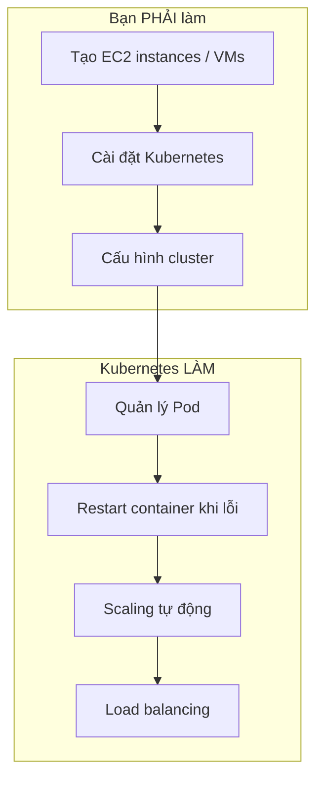

# Kubernetes Sẽ KHÔNG Quản Lý Infrastructure Của Bạn!

## Giới Thiệu

Có một hiểu lầm rất phổ biến: "Kubernetes sẽ tự động tạo và quản lý server cho tôi." Sự thật là **KHÔNG**. Kubernetes chỉ quản lý container **sau khi** bạn đã cung cấp cluster. Hiểu sai điểm này sẽ khiến bạn thất vọng khi bắt tay vào thực tế.

---

## Kubernetes Quản Lý Gì?

Kubernetes giúp bạn:
- **Tạo và quản lý Pod** — đơn vị chứa container
- **Tự động restart** container khi gặp sự cố
- **Scaling** số lượng Pod theo nhu cầu
- **Load balancing** traffic giữa các Pod
- **Quản lý lifecycle** của container

## Kubernetes KHÔNG Quản Lý Gì?

**Bạn phải tự làm** những việc sau:
- **Tạo cluster** — bao gồm các Worker Node và Master Node
- **Cài đặt Kubernetes software** trên các nodes
- **Cấu hình network** và security cho cluster
- **Thiết lập load balancer** nếu cần

## Hình Ảnh Minh Họa

## So Sánh Với Docker Compose

Giống như Docker Compose không cài đặt Docker trên máy của bạn, Kubernetes cũng không tạo server cho bạn. Nó chỉ **sử dụng** những gì bạn đã chuẩn bị.

| Hành động | Bạn làm | Kubernetes làm |
|-----------|---------|----------------|
| Tạo server | ✅ | ❌ |
| Cài đặt runtime | ✅ | ❌ |
| Tạo Pod | ❌ | ✅ |
| Restart container | ❌ | ✅ |
| Scaling | ❌ | ✅ |
| Load balancing | ❌ | ✅ |

## Tin Tốt

Mặc dù bạn phải tự tạo cluster, nhưng có nhiều công cụ giúp bạn:
- **Minikube**: Tạo cluster local để test
- **EKS/AKS/GKE**: Dịch vụ managed từ cloud provider
- **kubeadm**: Công cụ tạo cluster trên server riêng

Bạn chỉ cần cung cấp infrastructure, Kubernetes sẽ lo phần còn lại.

## Tóm Tắt

- Kubernetes **không** tự tạo server hay infrastructure
- Bạn phải tạo cluster trước khi sử dụng Kubernetes
- Kubernetes quản lý Pod, container, scaling, load balancing
- Có nhiều công cụ giúp việc tạo cluster dễ dàng hơn

> **Bài tiếp theo:** Tìm hiểu chi tiết về Worker Node và các thành phần bên trong.
