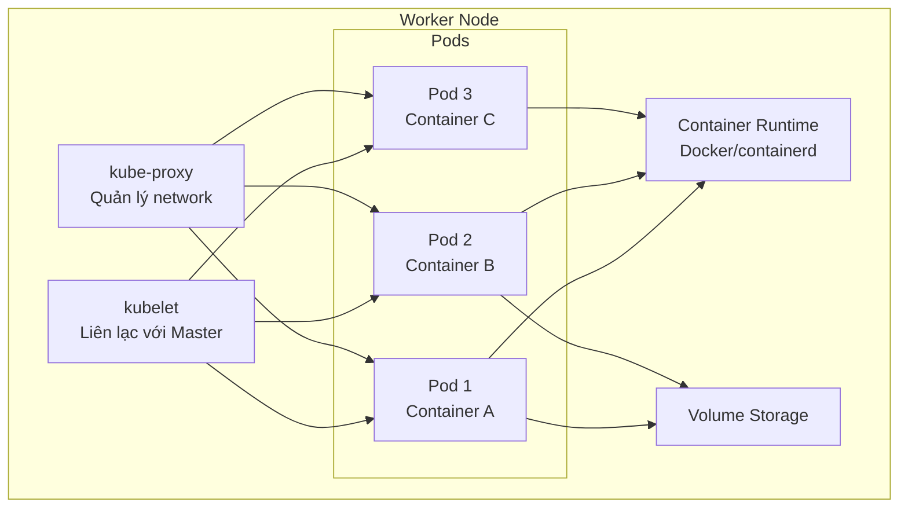

# Tìm Hiểu Chi Tiết Về Worker Node Trong Kubernetes

## Giới Thiệu

Worker Node là nơi thực sự chạy các container của bạn. Hiểu rõ cấu trúc bên trong Worker Node sẽ giúp bạn debug hiệu quả và tối ưu hóa deployment. Hãy cùng tìm hiểu từng thành phần.

---

## Worker Node Là Gì?

**Worker Node** đơn giản là một máy tính (virtual hoặc physical) có:
- CPU và Memory nhất định
- Phần mềm cần thiết để chạy container
- Kết nối với Master Node để nhận lệnh

Bạn có thể coi Worker Node như một "máy chạy việc" — Master Node sẽ giao việc, Worker Node sẽ thực hiện.

## Cấu Trúc Bên Trong Worker Node

## Pod — Đơn Vị Chạy Container

Một Pod có thể chứa:
- **Một container** (phổ biến nhất)
- **Nhiều container** cần làm việc紧密 cùng nhau
- **Volume** — dung lượng lưu trữ chia sẻ
- **Config** — cấu hình để container chạy đúng

Pod là đơn vị **tạm thời** trong Kubernetes. Khi Pod bị xóa, container bên trong cũng bị dừng. Kubernetes sẽ tạo Pod mới nếu cần.

## kubelet — Đại Diện Trên Worker Node

**kubelet** là agent chạy trên mỗi Worker Node, có nhiệm vụ:
- **Liên lạc với Master Node** — nhận lệnh và báo cáo trạng thái
- **Đảm bảo container chạy đúng** — start, stop, restart theo yêu cầu
- **Báo cáo health** — thông báo cho Master Node về trạng thái Node

Khi Master Node muốn tạo Pod mới trên Worker Node, kubelet sẽ nhận lệnh và thực thi.

## kube-proxy — Quản Lý Network

**kube-proxy** xử lý network traffic trên Worker Node:
- **Routing traffic** đến đúng Pod
- **Load balancing** giữa các Pod
- **Quy tắc firewall** — cho phép hoặc chặn traffic

Nếu có Service (giải pháp tiếp cận Pod), kube-proxy sẽ đảm bảo traffic được chuyển đúng đến Pod backend.

## Container Runtime — Chạy Container Thực Sự

**Container Runtime** là phần mềm thực sự tạo và chạy container. Kubernetes hỗ trợ:
- **Docker** (phổ biến nhất)
- **containerd** (nhẹ hơn, được Docker sử dụng bên trong)
- **CRI-O** (dành riêng cho Kubernetes)

kubelet không chạy container trực tiếp — nó gọi container runtime thông qua **CRI (Container Runtime Interface)**.

## Worker Node Không Phải Là dedicated

Quan trọng: Worker Node **không chuyên dụng** cho một tác vụ duy nhất. Bạn có thể chạy nhiều loại Pod khác nhau trên cùng một Node:
- Pod chạy backend API
- Pod chạy frontend web
- Pod chạy worker background job

Giống như máy tính cá nhân của bạn — bạn có thể chạy nhiều ứng dụng cùng lúc.

## Tóm Tắt

- Worker Node là máy chạy Pod và container
- **kubelet**: Agent liên lạc với Master Node
- **kube-proxy**: Quản lý network traffic
- **Container Runtime**: Docker, containerd, hoặc CRI-O
- Pod là đơn vị tạm thời, có thể chứa nhiều container
- Worker Node không chuyên dụng, chạy nhiều loại Pod

> **Bài tiếp theo:** Tìm hiểu về Master Node và các thành phần Control Plane.
