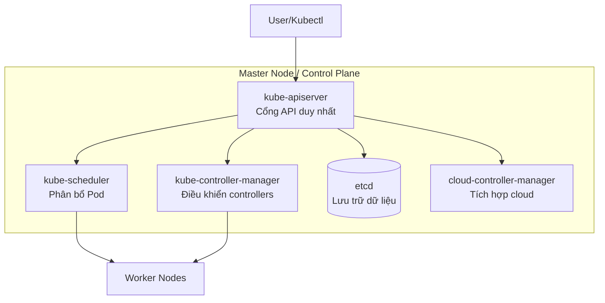

# Master Node Trong Kubernetes: Trung Tâm Điều Phối Toàn Cluster

## Giới Thiệu

Nếu Worker Node là "người lao động" thì Master Node là "quản đốc" — nơi đưa ra quyết định và điều phối toàn bộ hoạt động. Hiểu rõ Master Node sẽ giúp bạn nắm bắt cách Kubernetes đưa ra quyết định.

---

## Master Node Là Gì?

**Master Node** (hoặc Control Plane) là nơi chạy các service điều khiển toàn bộ cluster. Nó:
- Nhận cấu hình từ bạn (qua API)
- Quyết định Pod nào chạy trên Node nào
- Đảm bảo trạng thái thực tế khớp với trạng thái mong muốn
- Lưu trữ toàn bộ dữ liệu cluster

## Các Thành Phần Chính

## kube-apiserver — Cổng API Duy Nhất

**kube-apiserver** là component quan trọng nhất:
- Là **cổng giao tiếp duy nhất** cho mọi request
- Xác thực và phân quyền request
- Lưu trữ dữ liệu vào etcd
- Truyền lệnh đến các component khác

Mọi tương tác với Kubernetes đều qua API server. Không có component nào khác kết nối trực tiếp với etcd.

## kube-scheduler — Phân Bổ Pod

**kube-scheduler** quyết định Pod mới sẽ chạy trên Node nào:
- Theo dõi Pod chưa được gán Node
- Phân tích tài nguyên khả dụng trên mỗi Node
- Xem xét các quy tắc affinity, taints, tolerations
- Gán Pod cho Node phù hợp nhất

Scheduler chỉ **quyết định**, không chạy Pod trực tiếp. Sau khi quyết định, nó thông báo cho API server.

## kube-controller-manager — Điều Phối Controllers

**kube-controller-manager** chạy nhiều controller, mỗi controller chịu trách nhiệm một phần:

| Controller | Chức năng |
|------------|-----------|
| **Node controller** | Phát hiện khi Node bị lỗi |
| **Job controller** | Quản lý các task một lần |
| **EndpointSlice controller** | Liên kết Service với Pod |
| **ServiceAccount controller** | Tạo ServiceAccount mặc định |
| **Deployment controller** | Đảm bảo số lượng Pod đúng |

Mục tiêu của tất cả controllers: **đưa trạng thái thực tế về trạng thái mong muốn**.

## etcd — Ngân Hàng Dữ Liệu

**etcd** là key-value store lưu trữ:
- Toàn bộ cấu hình cluster
- Trạng thái của mọi Node, Pod, Service
- Dữ liệu về resource và metadata

etcd phải **đáng tin cậy** — nếu mất dữ liệu etcd, toàn bộ cluster sẽ mất trạng thái.

## cloud-controller-manager — Giao Tiếp Với Cloud

**cloud-controller-manager** (tùy chọn) giúp Kubernetes tương tác với cloud provider:
- Tạo load balancer trên AWS/Azure/GCP
- Quản lý storage volumes
- Xử lý các resource đặc thù của cloud

## Tóm Tắt

- **API Server**: Cổng giao tiếp duy nhất, xử lý mọi request
- **Scheduler**: Quyết định Pod chạy trên Node nào
- **Controller Manager**: Điều phối các controller đảm bảo trạng thái
- **etcd**: Lưu trữ dữ liệu cluster
- **Cloud Controller Manager**: Tích hợp với cloud provider

> **Bài tiếp theo:** Tổng hợp các thuật ngữ và khái niệm quan trọng trong Kubernetes.
