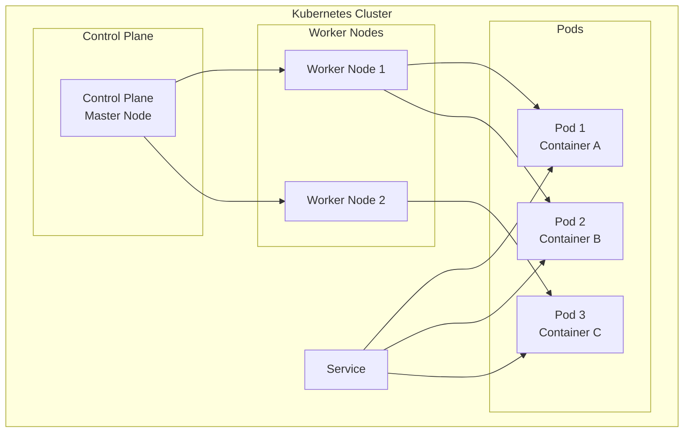

# Thuật Ngữ & Khái Niệm Quan Trọng Trong Kubernetes

## Giới Thiệu

Trước khi bắt tay vào thực hành, hãy tổng hợp lại các thuật ngữ quan trọng nhất trong Kubernetes. Đây là những khái niệm bạn sẽ gặp liên tục trong suốt khóa học và công việc thực tế.

---

## Tổng Quan Thuật Ngữ

## Cluster — Tập Hợp Toàn Bộ

**Cluster** là tập hợp tất cả Master Node và Worker Node, tạo thành một mạng lưới liên lạc. Kubernetes làm việc trên cluster, không phải trên từng máy riêng lẻ.

## Node — Máy Tính Trong Cluster

**Node** là máy tính (virtual hoặc physical) thuộc cluster:
- **Master Node**: Chạy Control Plane, điều phối cluster
- **Worker Node**: Chạy Pod và container thực tế

## Pod — Đơn Vị Nhỏ Nhất

**Pod** là đơn vị nhỏ nhất bạn có thể định nghĩa trong Kubernetes:
- Chứa **một hoặc nhiều container**
- Chứa resource đi kèm (volume, config)
- Được tạo và quản lý bởi Kubernetes
- Là đơn vị **tạm thời** — khi Pod bị xóa, container cũng dừng

Khi bạn tạo Pod, Kubernetes sẽ thực hiện tương đương lệnh `docker run` bên trong.

## Container — Ứng Dụng Đóng Gói

**Container** vẫn là Docker container quen thuộc:
- Được đóng gói từ Docker image
- Chạy bên trong Pod
- Được Kubernetes quản lý thông qua Pod

Pod chạy container = Pod thực thi `docker run` nội bộ.

## Service — Tiếp Cận Pod

**Service** là cách để tiếp cận một nhóm Pod:
- Gán **IP address duy nhất** cho nhóm Pod
- **Load balancing** traffic giữa các Pod
- Đảm bảo Pod có thể truy cập được dù thay đổi

Service liên quan mật thiết đến **kube-proxy** trên Worker Node.

## Control Plane — Trung Tâm Điều Phối

**Control Plane** (Master Node) bao gồm:
- **API Server**: Xử lý mọi request
- **Scheduler**: Phân bổ Pod
- **Controller Manager**: Điều phối controllers
- **etcd**: Lưu trữ dữ liệu

## kubelet — Agent Trên Node

**kubelet** chạy trên mỗi Worker Node:
- Liên lạc với Master Node
- Đảm bảo container chạy đúng theo PodSpec
- Báo cáo trạng thái Node và Pod

## kube-proxy — Quản Lý Network

**kube-proxy** xử lý network trên mỗi Node:
- Routing traffic đến đúng Pod
- Implement Service concept
- Duy trì quy tắc network

## Container Runtime — Chạy Container

**Container Runtime** là phần mềm chạy container:
- Docker
- containerd
- CRI-O

kubelet gọi container runtime thông qua CRI (Container Runtime Interface).

## Tóm Tắt Nhanh

| Thuật ngữ | Định nghĩa |
|-----------|------------|
| **Cluster** | Tập hợp tất cả Nodes |
| **Node** | Máy tính trong cluster |
| **Master Node** | Node chạy Control Plane |
| **Worker Node** | Node chạy Pod |
| **Pod** | Đơn vị nhỏ nhất, chứa container |
| **Container** | Ứng dụng đóng gói |
| **Service** | Tiếp cận nhóm Pod |
| **kubelet** | Agent trên Worker Node |
| **kube-proxy** | Quản lý network |
| **etcd** | Lưu trữ dữ liệu cluster |

## Tóm Tắt

- Hiểu rõ thuật ngữ là bước đầu tiên để làm việc với Kubernetes
- Pod là đơn vị nhỏ nhất, chứa container
- Service giúp tiếp cận Pod một cách ổn định
- Control Plane điều phối toàn bộ cluster
- kubelet và kube-proxy là hai component quan trọng trên Worker Node

> **Bài tiếp theo:** Tổng hợp tài nguyên học tập và thực hành Kubernetes.
