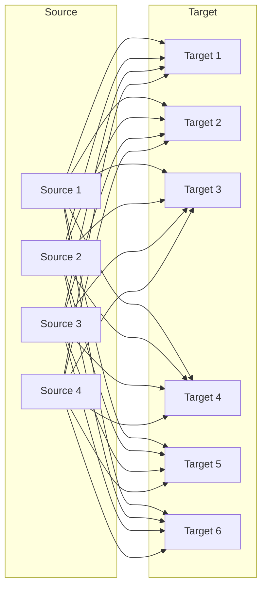
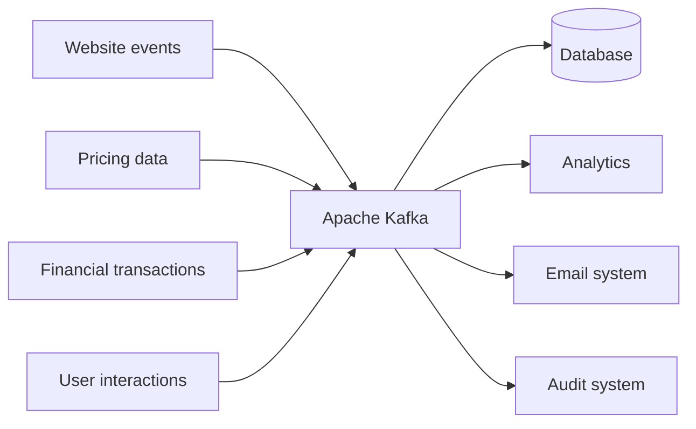

# Kafka Trong 5 Phút: Vì Sao Công Ty Nào Lớn Lên Cũng Cần Nó?

Bài trước bạn đã biết mình sẽ học gì và học với ai. Giờ là câu hỏi lớn nhất của cả khóa: Kafka sinh ra để giải bài toán gì mà database hay API thông thường bó tay? Câu trả lời nằm ở một phép nhân đơn giản mà hậu quả của nó thì không đơn giản chút nào.

---

## 1. Điểm Xuất Phát: Một Source, Một Target Thì Quá Dễ

Hãy tưởng tượng công ty bạn có một **source system** — ví dụ một database — và một bộ phận khác muốn lấy dữ liệu đó đưa sang **target system** của họ.

Luồng xử lý lúc này rất ngây thơ: ai đó viết một đoạn code, **extract** dữ liệu ra, **transform** cho đúng định dạng, rồi **load** vào đích. Xong. Không cần Kafka, không cần gì cả.

Vấn đề là công ty không đứng yên. Nó lớn lên, và bài toán tích hợp dữ liệu lớn lên cùng nó.

## 2. Bài Toán N×M: Khi Tích Hợp Bùng Nổ Theo Cấp Số Nhân

Sau một thời gian, bạn không còn 1 source và 1 target nữa. Bạn có **nhiều source systems** và **nhiều target systems**, mà source nào cũng phải chia sẻ dữ liệu cho target nào.

Giả sử có **4 source** và **6 target**. Bạn phải viết bao nhiêu tích hợp? Không phải 4 + 6 = 10, mà là 4 × 6 = **24 integrations**.

*4 source × 6 target = 24 mũi tên chằng chịt. Cứ thêm một hệ thống mới là thêm cả chùm tích hợp mới.*

Con số 24 mới chỉ là bề nổi. Mỗi tích hợp trong đó lại kéo theo bốn loại đau đầu, nhân lên theo từng mũi tên:

1. **Protocol** — dữ liệu vận chuyển bằng gì? TCP, HTTP, REST, FTP, JDBC... mỗi hệ thống một kiểu, mỗi kiểu một thư viện, một cách debug khác nhau.
2. **Data format** — dữ liệu parse ra sao? Binary, CSV, JSON, Avro, Protobuf... chỉ cần một bên đổi format là đầu bên kia vỡ.
3. **Data schema và evolution** — chuyện gì xảy ra khi hình dạng dữ liệu ở source hoặc target thay đổi? Thêm một cột, đổi tên một field, là cả chuỗi tích hợp rung rinh.
4. **Tải lên source system** — mỗi target kết nối vào là source phải chịu thêm connection và request để phục vụ extract. Source càng hot càng dễ sập vì bị "bám" quá nhiều.

Analogy gần gũi: kiểu tích hợp trực tiếp này giống như trong xóm, nhà nào muốn gửi đồ cho nhà nào cũng phải tự chạy xe tới tận nơi. 10 nhà thì còn chạy được, 100 nhà thì cả xóm chỉ còn thấy xe chạy vòng vòng, không ai làm ăn gì nữa.

## 3. Kafka Đứng Giữa Để Decouple: Ai Cũng Chỉ Cần Biết Một Người

Cách giải là đặt **Apache Kafka** vào giữa. Source và target vẫn còn đó, nhưng chúng không nói chuyện trực tiếp với nhau nữa.

Luật chơi mới cực kỳ đơn giản:

* **Source system** chỉ có một trách nhiệm: gửi dữ liệu vào Kafka — thao tác này gọi là **producing**. Kafka trở thành nơi chứa **data stream** của toàn bộ dữ liệu từ mọi source.
* **Target system** khi cần dữ liệu thì tap vào Kafka để lấy — gọi là **consuming**. Không cần biết dữ liệu gốc từ database nào, format gốc ra sao, chỉ cần biết đọc từ Kafka.

Đặt vào ví dụ cụ thể cho dễ hình dung:

* Source có thể là **website events**, **pricing data**, **financial transactions**, **user interactions** — tất cả đều là dữ liệu sinh ra theo thời gian thực, tức **data streams**.
* Target có thể là **database**, **hệ thống analytics**, **hệ thống email**, **hệ thống audit**.

Mỗi bên giờ chỉ cần biết cách nói chuyện với Kafka, thay vì phải biết cách nói chuyện với tất cả các bên còn lại. Thêm một source mới? Chỉ cần nối vào Kafka. Thêm một target mới? Chỉ cần đọc từ Kafka. Số tích hợp tăng theo phép cộng, không còn theo phép nhân.

## 4. Vì Sao Lại Là Kafka Mà Không Phải Hàng Đợi Khác?

Kafka do **LinkedIn** tạo ra dưới dạng open source, nay được duy trì bởi các ông lớn như **Confluent, IBM, Cloudera, LinkedIn**. Nhưng "con nhà nòi" không phải lý do người ta chọn nó. Người ta chọn vì bốn đặc tính kiến trúc:

1. **Distributed, resilient, fault tolerant.** Kafka là hệ phân tán chịu lỗi. Ý nghĩa thực tế: bạn có thể **upgrade, bảo trì Kafka mà không phải hạ toàn bộ hệ thống**. Broker này restart thì broker khác vẫn phục vụ.
2. **Horizontal scalability.** Thêm **Broker** vào cluster theo thời gian, scale tới **hàng trăm brokers**. Hết tải thì thêm máy, không cần đập đi viết lại.
3. **Throughput khổng lồ + latency thấp.** Hàng **triệu messages mỗi giây** (Twitter là ví dụ ở quy mô đó), độ trễ đôi khi đo được **dưới 10ms**. Đó là lý do Kafka được gọi là **real-time system**.
4. **Adoption rộng khắp.** Hơn **2.000 công ty** công khai đang dùng, **80% Fortune 100** có Kafka trong stack: LinkedIn, Airbnb, Netflix, Uber, Walmart... Nhưng bạn không cần là tập đoàn khổng lồ mới dùng được — cluster 3 brokers trên laptop cũng chạy tốt để học.

## 5. Kafka Được Dùng Vào Việc Gì Trong Thực Tế?

Các use case đời đầu: **messaging system**, **activity tracking**, gom **metrics** từ nhiều nơi, gom **application logs**.

Về sau mở rộng thêm:

* **Stream processing** (qua Streams API — sẽ học ở phần sau).
* **Decouple system dependencies và microservices**.
* **Tích hợp big data**: Spark, Flink, Storm, Hadoop.
* **Pub/sub cho microservices**.

Ba ví dụ cụ thể để thấy Kafka chỉ là "đường ống", nghiệp vụ nằm ở hai đầu:

* **Netflix** dùng Kafka để đưa ra **recommendation real-time** ngay trong lúc bạn đang xem phim.
* **Uber** dùng Kafka gom dữ liệu user, taxi, trip theo thời gian thực để **dự báo nhu cầu và tính giá real-time**.
* **LinkedIn** dùng Kafka để **chống spam** và thu thập user interactions nhằm gợi ý kết nối tốt hơn.

Trong cả ba câu chuyện, Kafka không gợi ý phim, không tính giá cuốc xe, không kết bạn hộ bạn. Nó chỉ làm một việc: **transportation mechanism** — cho phép luồng dữ liệu khổng lồ chảy trong công ty mà không nghẽn.

## Cạm Bẫy Thường Gặp

* **Tưởng Kafka là database.** Sai. Kafka không query được bằng SQL, không update từng record. Nó là append-only log có thời hạn, đọc bằng Consumer chứ không phải SELECT.
* **Tưởng đặt Kafka vào là hết phải lo schema.** Không. Kafka nhận mọi format (JSON, Avro, binary...) mà không kiểm tra. Nếu source đổi schema bừa bãi, target vẫn vỡ như thường — chỉ là vỡ ở phía đọc Kafka thay vì vỡ ở connection trực tiếp. Muốn quản schema tử tế phải dùng thêm Schema Registry.
* **Nhầm "real-time" với "nhanh bằng mọi giá".** Latency dưới 10ms là năng lực của Kafka, không phải cam kết mặc định cho mọi cấu hình. Bật batch lớn, replication kỹ, acks=all thì latency sẽ đổi lấy durability — bài Producer acks sau này sẽ mổ xẻ tradeoff này.
* **Thấy công ty lớn dùng thì bê nguyên kiến trúc về startup 5 người.** Netflix chạy hàng trăm brokers không có nghĩa bạn cũng cần thế để học. Bắt đầu từ 1–3 brokers, hiểu đúng bản chất rồi hãy scale.

## Kết Luận

Tóm lại một câu: **tích hợp trực tiếp bùng nổ theo N×M và kéo theo bốn nỗi đau protocol, format, schema evolution, tải source — Kafka đứng giữa để decouple, source chỉ produce, target chỉ consume, còn Kafka lo chuyện vận chuyển real-time ở quy mô triệu message/giây.**

Bài tiếp theo chúng ta sẽ mở bản đồ toàn khóa: đi từ Kafka theory tới dựng cluster trên máy, gõ CLI, viết Producer/Consumer Java đầu tiên, rồi tới Connect, Streams, Schema Registry và kiến trúc enterprise.
