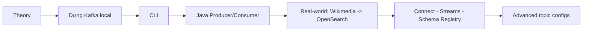

# Bản Đồ Toàn Khóa Kafka for Beginners: 4 Giờ Nền Tảng Rồi Mới Tới Thực Chiến

Bài trước bạn đã thấy Kafka sinh ra để đập tan bài toán tích hợp N×M. Bài này chúng ta trải bản đồ ra bàn: khóa học này đi qua những chặng nào, mỗi chặng cho bạn cái gì, bạn cần chuẩn bị gì trước khi lên đường, và học xong beginner thì đi đâu tiếp.

---

## 1. Học Thuyết Trước, Chạm Tay Ngay Sau: Logic Của Khóa Học

Khóa này thuộc **Part 1 – Fundamentals**, khoảng **4 giờ content**, đi theo đúng thứ tự một engineer tiếp cận hệ thống mới: hiểu rồi mới sờ.

1. **Kafka theory end-to-end.** Kafka cluster là gì, Broker làm gì, Producer đưa dữ liệu từ source system vào cluster ra sao, Consumer lấy dữ liệu ra gửi tới target system thế nào, cluster được quản lý bằng Zookeeper hay KRaft mode mới. Đây chính là phần Theory bạn đang đọc.
2. **Dựng Kafka trên máy mình.** Hướng dẫn riêng cho **Linux, Windows, Mac**. Không học chay trên slide.
3. **Kafka CLI.** Dùng command line để tạo Topic, produce, consume, quan sát cluster từ terminal.
4. **Lập trình Java.** Viết code thật giao tiếp với Kafka — Producer đầu tiên, Consumer đầu tiên.

Analogy quen thuộc: giống như học nấu phở — phải biết xương, bánh, gia vị là gì (theory), rồi mới vào bếp hầm xương (dựng máy), nếm thử (CLI), rồi tự nấu một nồi hoàn chỉnh (Java).

## 2. Qua Được Nền Tảng Thì Tới Kiến Trúc Thật

Hết Part 1, khóa học không dừng ở "hello world". Nó đẩy bạn sang các phần gắn với đời thật:

* **Real-world architecture.** Viết một **Producer phức tạp hơn: Wikimedia producer bằng Java** (nguồn event thật chảy liên tục) và một **Consumer phức tạp hơn: OpenSearch consumer bằng Java** (đổ dữ liệu vào hệ thống search thật).
* **Extended APIs.** Làm quen **Kafka Connect, Kafka Streams, Confluent Schema Registry** — ba mảnh ghép biến Kafka từ "đường ống" thành hệ sinh thái.
* **Case studies enterprise.** Xem Kafka được dùng trong kiến trúc doanh nghiệp và các use case thực tế ra sao.
* **Part 3 – Advanced.** Cấu hình Topic nâng cao và các lecture chuyên sâu bổ sung dần.

Nói ngắn gọn: nửa đầu cho bạn **hiểu đúng**, nửa sau cho bạn **làm được việc thật**.

## 3. Cần Chuẩn Bị Gì? Ít Hơn Bạn Tưởng

Đây là **beginner's course** — bạn không cần biết Kafka từ trước. Nhưng có ba điều kiện cần nói thẳng:

1. **Biết dùng command line.** Không cần pro, nhưng phải mở được terminal và gõ lệnh cơ bản. Thầy sẽ đi chậm, nhưng nếu chưa bao giờ chạm terminal thì bạn sẽ đuối.
2. **Biết một chút Java hoặc lập trình nói chung.** Khóa dùng **Java 11** để viết Producer/Consumer. Nếu không biết Java vẫn theo được: tải code mẫu về, chạy theo, tập trung nghe phần cấu hình Kafka. Nhưng biết Java thì lợi thế rõ rệt.
3. **Ưu tiên Linux và Mac.** Hai hệ này chạy Kafka mượt nhất. Dùng **Windows** vẫn được — thầy có hướng dẫn và lưu ý riêng cho Windows — nhưng chuẩn bị tinh thần sẽ gặp vài đoạn lắt léo hơn.

Và điều kiện thứ tư, quan trọng nhất mà transcript nào thầy cũng nhắc: **sẵn sàng học một công nghệ mới hay ho**. Nghe sáo rỗng, nhưng với khóa 4 giờ đặc kiến thức thì thái độ quyết định bạn có tới được bài Streams hay bỏ cuộc ở bài Broker.

## 4. Khóa Này Dành Cho Ai?

* **Developer** muốn học cách viết và chạy application khai thác Kafka.
* **Architect** muốn hiểu vai trò của Kafka trong pipeline enterprise.
* **DevOps** muốn hiểu Topic, Partition và setup multi-broker vận hành ra sao.

Nếu bạn thuộc một trong ba nhóm trên thì đúng chỗ. Nếu bạn tìm khóa dạy vận hành cluster trăm brokers cho ngân hàng thì chưa — đó là chuyện của các volume sau.

## 5. Học Xong Beginner Thì Đi Đâu? Đừng Lạc Trong Series

Thầy nói rất rõ vị trí của khóa này trong **Apache Kafka Series**:

* **Volume 1 (khóa này): Kafka for Beginners** — nền móng, operations cơ bản, viết Producer/Consumer đầu tiên.
* **Hướng developer:** học tiếp **Kafka Connect, Kafka Streams, ksqlDB, Confluent Components**.
* **Hướng admin/operator:** học tiếp **Kafka Security, Kafka Monitoring, Kafka Cluster Setup & Administration**.

Hai chứng chỉ Confluent mà nhiều bạn nhắm tới cũng chia theo hai hướng đó: **Confluent Certification for Developers** và **Confluent Certification for Operators**. Thứ tự chuẩn là Beginners trước — khóa này đủ lớn để bạn hiểu Kafka thật sự — rồi mới rẽ nhánh theo nghề.

## Cạm Bẫy Thường Gặp

* **Nhảy thẳng vào Streams/Connect vì nghe "xịn".** Sai thứ tự. Chưa vững Producer, Consumer Group, Replication mà đụng vào Streams thì chỉ thấy API mà không hiểu chuyện gì chạy bên dưới.
* **Dùng Windows nhưng bỏ qua phần caveat.** Tới lúc lệnh không chạy, path lỗi, lại tưởng Kafka hỏng. Hãy xem kỹ đoạn thầy dặn cho Windows.
* **Không biết Java nên bỏ luôn phần lập trình.** Phí. Cứ tải code, chạy được, đọc config producer/consumer cũng đã hơn người chỉ đọc slide.
* **Học để sưu tầm chứng chỉ mà chưa viết nổi một Producer.** Nhà tuyển dụng hỏi "acks=all khác acks=1 chỗ nào" mà ấp úng thì chứng chỉ nào cũng vô nghĩa.

## Kết Luận

Tóm lại một câu: **đây là Volume 1 cho người mới — 4 giờ fundamentals từ theory tới CLI tới Java, rồi tới kiến trúc thật với Wikimedia/OpenSearch, Connect, Streams, Schema Registry; chỉ cần biết terminal, chút Java 11, ưu tiên Linux/Mac là đủ để bắt đầu.**

Bài tiếp theo chúng ta gặp trực tiếp người dẫn đường: Stephane Maarek là ai, vì sao nên học từ anh, và hai nơi để kết nối với anh trong suốt khóa học.
