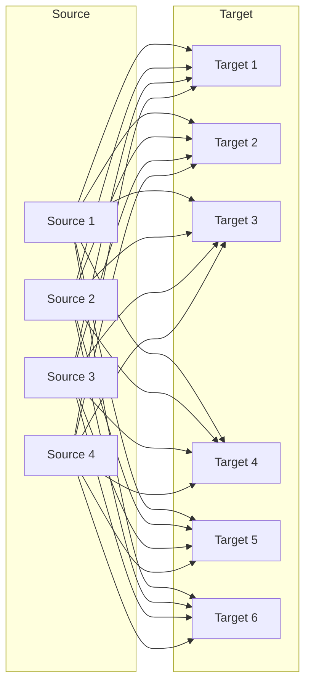
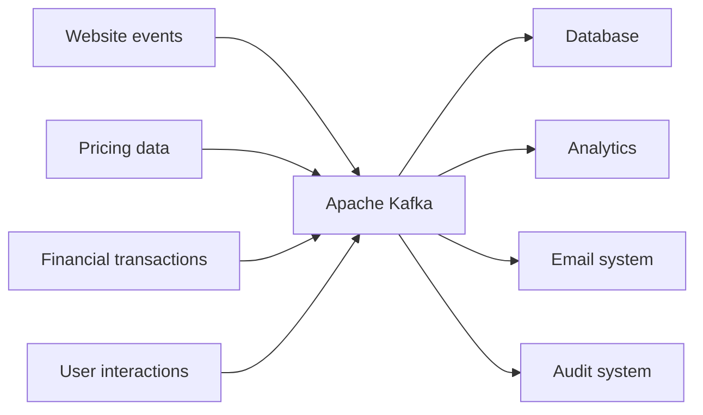

Một công ty có database, và một bộ phận khác muốn lấy dữ liệu từ database đó đưa sang hệ thống của mình. Giai đoạn đầu, việc này đơn giản: ai đó viết một đoạn code, extract dữ liệu ra, transform, rồi load vào đích. Xong.

Vấn đề bắt đầu khi công ty lớn lên.

## Bài toán N×M

Sau một thời gian, bạn không còn một source system và một target system nữa. Bạn có nhiều source, nhiều target, và mọi source đều cần gửi dữ liệu tới mọi target để chia sẻ thông tin. Số tích hợp không tăng theo phép cộng mà theo phép nhân: **4 source system và 6 target system nghĩa là 24 tích hợp phải viết**.

*4 source × 6 target = 24 mũi tên. Chính sự rối rắm của sơ đồ này là nội dung của bài.*

Con số 24 mới chỉ là bề nổi. Mỗi tích hợp trong đó lại mang theo bốn loại khó khăn riêng:

- **Protocol** — dữ liệu được vận chuyển bằng cách nào? TCP, HTTP, REST, FTP, JDBC, mỗi hệ thống một kiểu.
- **Data format** — dữ liệu được parse ra sao? Binary, CSV, JSON, Avro, Protobuf...
- **Schema và evolution** — chuyện gì xảy ra khi hình dạng dữ liệu ở source hoặc target thay đổi?
- **Tải lên source system** — mỗi target kết nối vào là một lần source phải chịu thêm connection và request để phục vụ việc extract.

Nhân bốn khó khăn này với 24 tích hợp, bạn hiểu vì sao kiến trúc kiểu này không đi xa được.

## Kafka giải quyết bằng cách decouple

Cách xử lý là đặt Apache Kafka vào giữa. Source system và target system vẫn còn đó, nhưng chúng không nói chuyện trực tiếp với nhau nữa.

Source system giờ chỉ có một trách nhiệm: gửi dữ liệu vào Kafka — thao tác này gọi là **producing**. Kafka trở thành nơi chứa data stream của toàn bộ dữ liệu từ mọi source system. Còn target system, khi cần dữ liệu, sẽ tap vào Kafka để lấy — gọi là **consuming**.

Đặt vào ví dụ cụ thể: source system của bạn có thể là website events, pricing data, financial transaction, hay user interactions. Tất cả đều sinh ra data stream — dữ liệu được tạo ra theo thời gian thực và đẩy vào Kafka. Còn target system có thể là database, hệ thống analytics, hệ thống email, hệ thống audit.

Mỗi bên giờ chỉ cần biết cách nói chuyện với Kafka, thay vì biết cách nói chuyện với tất cả các bên còn lại.

## Vì sao lại là Kafka?

Kafka do LinkedIn tạo ra dưới dạng dự án mã nguồn mở, và hiện được duy trì chủ yếu bởi các tập đoàn lớn: Confluent, IBM, Cloudera, LinkedIn.

Về kiến trúc, Kafka là hệ phân tán, có khả năng phục hồi và chịu lỗi. Điều này có ý nghĩa thực tế rất cụ thể: bạn có thể upgrade Kafka, bảo trì Kafka mà không phải hạ toàn bộ hệ thống xuống.

Kafka cũng scale ngang được — bạn thêm broker vào cluster theo thời gian, và có thể mở rộng tới hàng trăm broker. Về throughput, Kafka xử lý được hàng triệu message mỗi giây; Twitter là một ví dụ ở quy mô đó. Về hiệu năng, độ trễ thấp, đôi khi đo được dưới 10 millisecond — đây chính là lý do người ta gọi Kafka là hệ thống real time.

Mức độ phổ biến cũng đáng kể: hơn 2.000 công ty công khai đang dùng Kafka, và 80% các công ty trong Fortune 100. Những cái tên lớn gồm LinkedIn, Airbnb, Netflix, Uber, Walmart — nhưng bạn không cần phải là tập đoàn khổng lồ mới dùng được Kafka.

## Kafka được dùng vào việc gì

Các use case đầu tiên của Kafka là làm messaging system, activity tracking, thu thập metrics từ nhiều nơi khác nhau, và gom application log.

Gần đây hơn, Kafka được dùng cho stream processing (qua Streams API), để decouple các phụ thuộc giữa hệ thống và giữa microservice, làm pub/sub cho microservice, và tích hợp với các công nghệ big data như Spark, Flink, Storm, Hadoop.

Một vài ví dụ cụ thể:

- **Netflix** dùng Kafka để đưa ra gợi ý theo thời gian thực ngay trong lúc bạn đang xem phim.
- **Uber** dùng Kafka để thu thập dữ liệu người dùng, taxi và chuyến đi theo thời gian thực, từ đó tính toán và dự báo nhu cầu, cũng như tính giá real time.
- **LinkedIn** dùng Kafka để chống spam và thu thập tương tác người dùng nhằm đưa ra gợi ý kết nối tốt hơn theo thời gian thực.

## Tóm lại

- Kiến trúc tích hợp trực tiếp bùng nổ theo N×M: 4 source và 6 target là 24 tích hợp, mỗi tích hợp lại kéo theo vấn đề protocol, data format, schema evolution và tải lên source.
- Kafka nằm giữa để decouple: source **produce** vào Kafka, target **consume** từ Kafka, không bên nào cần biết về bên kia.
- Điểm mạnh kiến trúc: phân tán, chịu lỗi, bảo trì không cần downtime, scale ngang tới hàng trăm broker, hàng triệu message/giây, độ trễ dưới 10ms.
- Trong tất cả những kiến trúc trên, Kafka chỉ đóng vai trò **cơ chế vận chuyển** — nó cho phép các luồng dữ liệu khổng lồ chảy trong công ty, chứ bản thân nó không xử lý nghiệp vụ.
