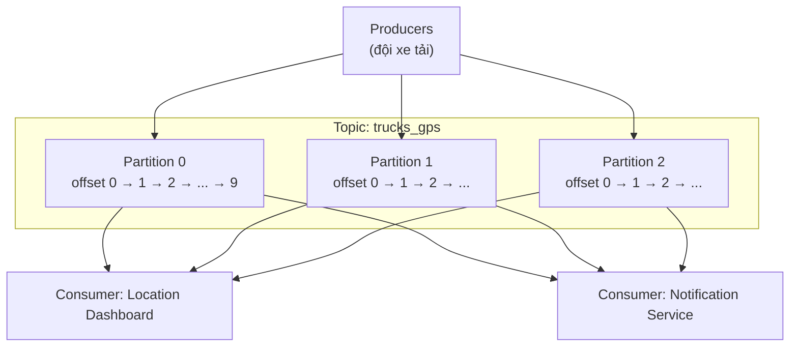

# Topics, Partitions và Offsets: Xương Sống Của Kafka

Nếu database có Table để chứa dữ liệu, thì Kafka có **Topic**. Nhưng khác với Table — bạn không thể `SELECT`, không thể `UPDATE`, không thể `DELETE` trên Topic. Vậy Topic thực sự là gì, và tại sao Kafka lại chia nhỏ nó thành **Partitions** với **Offsets**? Hiểu đúng 3 khái niệm này là bạn đã nắm được 50% kiến trúc Kafka.

---

## 1. Topic: Dòng Chảy Dữ Liệu, Không Phải Bảng Dữ Liệu

**Topic** là một luồng dữ liệu (data stream) có tên trong Kafka cluster. Một cluster có thể chứa bao nhiêu Topic tùy ý: `logs`, `purchases`, `twitter_tweets`, `trucks_gps`... Tên Topic chính là định danh duy nhất của nó.

So sánh nhanh với database để dễ hình dung:

| Table (Database) | Topic (Kafka) |
|---|---|
| Có schema, có constraint | Không kiểm tra dữ liệu — gửi gì cũng nhận |
| Hỗ trợ JSON, text... nhưng thường bị ràng buộc kiểu | Hỗ trợ mọi định dạng: JSON, Avro, text, binary |
| Query được bằng SQL | **Không query được** |
| Ghi + đọc + sửa + xóa | Chỉ **append** (ghi nối tiếp) và đọc lại |

Điểm mấu chốt: chuỗi các message trong một Topic được gọi là **data stream** — và đó chính là lý do Kafka được gọi là *data streaming platform*. Dữ liệu chảy xuyên suốt qua Topic, chứ không nằm yên chờ bạn query.

Bạn đưa dữ liệu vào Topic bằng **Producer**, và đọc dữ liệu ra bằng **Consumer**. Không có con đường nào khác.

## 2. Tại Sao Phải Chia Topic Thành Partitions?

Một Topic có thể được chia thành nhiều **Partition**. Ví dụ một Topic có 3 partitions: partition `0`, `1`, `2` (đánh số từ 0). Message gửi vào Topic sẽ rơi vào một trong các partition này.



Tại sao lại phức tạp hóa như vậy thay vì để tất cả message trong một hàng đợi duy nhất?

Câu trả lời của một System Engineer là hai chữ: **khả năng mở rộng (scalability)** và **song song hóa (parallelism)**.

* Một partition đơn lẻ bị giới hạn bởi tốc độ ghi/đọc của một máy (broker). Chia thành 10, 100 partitions nghĩa là bạn có thể dàn trải tải ghi và tải đọc ra nhiều máy, nhiều consumer cùng đọc song song.
* Nhiều consumer groups khác nhau có thể cùng đọc một Topic mà không ảnh hưởng lẫn nhau (xem sơ đồ: Dashboard và Notification Service cùng đọc `trucks_gps`).

Việc chọn bao nhiêu partition là đủ (3, 10 hay 100) là một quyết định thiết kế quan trọng — sẽ có bài riêng về cách chọn partition count và replication factor sau.

## 3. Offset: "Số Thứ Tự" Chỉ Có Ý Nghĩa Trong Partition Của Nó

Mỗi message khi được ghi vào một partition sẽ nhận một id tăng dần bắt đầu từ `0, 1, 2, ...`. Id này gọi là **Offset**.

Ba tính chất của Offset bạn phải khắc cốt ghi tâm:

1. **Thứ tự trong partition được đảm bảo.** Message có offset `3` luôn đứng sau offset `2` trong cùng partition, và consumer đọc theo đúng thứ tự offset.
2. **Offset chỉ có ý nghĩa cục bộ (local).** Offset `3` ở partition `0` và offset `3` ở partition `1` là hai message hoàn toàn khác nhau, không liên quan gì đến nhau.
3. **Offset không bao giờ tái sử dụng.** Kể cả khi message cũ đã bị xóa do hết hạn lưu trữ, offset vẫn tiếp tục tăng. Không có chuyện "lấp chỗ trống".

Hệ quả trực tiếp: **thứ tự message chỉ được đảm bảo *trong* một partition, không đảm bảo *giữa các* partitions.** Đây là một trong những hiểu lầm phổ biến nhất khi mới học Kafka. Nếu nghiệp vụ của bạn bắt buộc có thứ tự toàn cục (ví dụ lịch sử giao dịch của một tài khoản), bạn phải dồn chúng về cùng một partition — bằng cách dùng **Key**, sẽ học ở bài Producer ngay sau.

Mặc định, nếu message không có key, Producer gán nó vào một partition **ngẫu nhiên** (thực tế là round-robin / sticky — chi tiết ở bài Partitioner).

## 4. Ví Dụ Thực Tế: Đội Xe Tải `trucks_gps`

Hãy tưởng tượng bạn quản lý một đội xe tải, mỗi xe gắn một thiết bị GPS báo vị trí về Kafka mỗi 20 giây. Mỗi message trông như thế này:

```json
{ "truck_id": "truck_42", "lat": 10.762622, "lon": 106.660172, "ts": "2026-09-16T07:00:20Z" }
```

Bạn tạo một Topic tên `trucks_gps` với 10 partitions. Luồng chảy như sau:

1. Hàng trăm xe (producers) liên tục append message vào Topic.
2. Hai hệ thống cùng đọc **chung một luồng dữ liệu** mà không tranh chấp nhau:
   * **Location Dashboard**: đọc stream để vẽ vị trí real-time của toàn bộ đội xe lên bản đồ.
   * **Notification Service**: đọc cùng stream đó để gửi SMS cho khách khi xe giao hàng gần tới.

Đây chính là sức mạnh của mô hình log tập trung: một dòng dữ liệu, nhiều consumer độc lập.

---

## 5. Bốn Tính Chất "Luật Sắt" Của Topic

1. **Immutable (bất biến).** Một khi message đã ghi vào partition thì không thể sửa, không thể xóa riêng lẻ. Muốn "sửa" thì chỉ có cách ghi thêm một message mới.
2. **Lưu trữ có thời hạn.** Dữ liệu không ở lại mãi. Mặc định Kafka giữ **7 ngày** (1 tuần), sau đó tự động xóa — và hoàn toàn có thể cấu hình lại theo nhu cầu.
3. **Thứ tự chỉ trong partition.** Đã nói ở trên, nhưng đáng nhắc lại lần nữa vì quan trọng.
4. **Partition càng nhiều, song song càng cao — nhưng không miễn phí.** Mỗi partition tốn tài nguyên (file handle, memory, replication). Đừng tạo 1000 partitions "cho chắc".

## Cạm Bẫy Thường Gặp

* **Coi Offset như id toàn cục.** Sai. Offset `100` ở partition `0` không hề "mới hơn" offset `50` ở partition `1`. Muốn biết message nào mới hơn phải nhìn timestamp trong payload, không nhìn offset cross-partition.
* **Mang tư duy database vào Kafka: đòi UPDATE/DELETE một message.** Không làm được. Kafka là append-only log. Muốn "quên" dữ liệu cũ thì chờ retention xóa, muốn "đính chính" thì ghi message bù, hoặc dùng log compaction (học ở phần Advanced).
* **Tưởng dữ liệu tồn tại mãi mãi.** Mặc định 7 ngày là mất. Nếu cần lưu dài hạn, phải đổ sang hệ thống khác (S3, HDFS, database) bằng Kafka Connect hoặc consumer riêng.
* **Cần thứ tự toàn cục nhưng lại để message tràn ngẫu nhiên qua nhiều partitions.** Muốn giữ thứ tự cho một thực thể (một xe, một user, một đơn hàng) thì bắt buộc phải dùng key để pin về cùng partition.

## Kết Luận

Tóm lại một câu: **Topic là dòng dữ liệu bất biến, được chia thành nhiều Partitions để mở rộng song song, mỗi message trong partition được đánh số thứ tự bằng Offset.**

Bài tiếp theo chúng ta sẽ trả lời câu hỏi còn bỏ ngỏ: ai quyết định message rơi vào partition nào, và **Key** điều khiển việc đó ra sao — qua nhân vật **Producer**.
