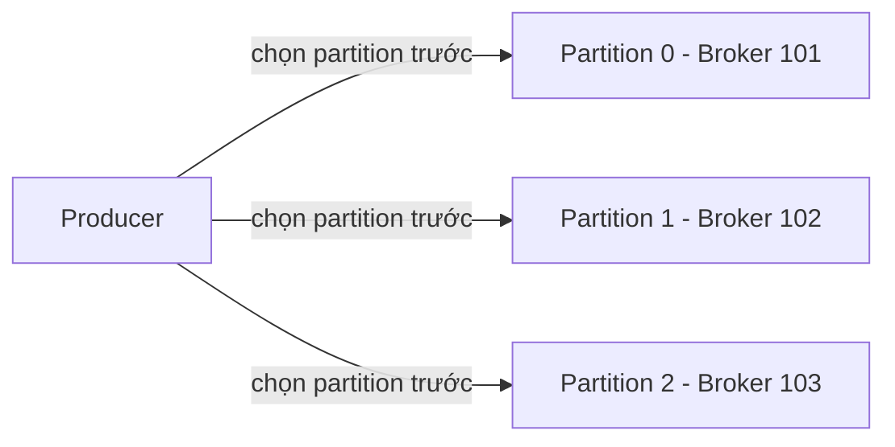
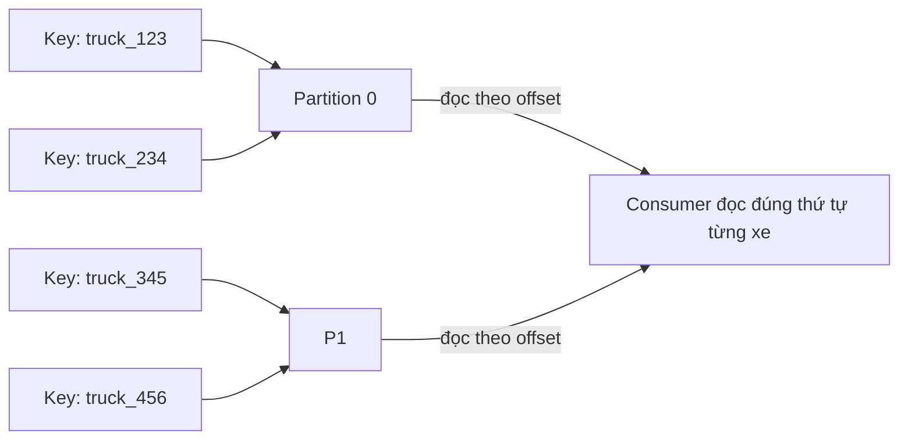

# Producer Và Message Key: Ai Quyết Định Message Rơi Vào Partition Nào?

Bài trước bạn đã hiểu Topic được chia thành Partitions, mỗi message mang một Offset. Câu hỏi còn bỏ ngỏ là: ai là người chia message vào từng partition, và làm sao để giữ đúng thứ tự cho những message cần đi cùng nhau? Câu trả lời nằm ở nhân vật **Producer** và vũ khí lợi hại nhất của nó: **Key**.

---

## 1. Producer Là Gì Và Vì Sao Chính Nó Chọn Partition?

**Producer** là chương trình ghi dữ liệu vào Topic. Nếu Topic là dòng sông thì Producer là người mở van cho nước chảy vào.

Điểm nhiều người hiểu sai: họ tưởng Kafka server (Broker) nhận message rồi mới quyết định cất vào partition nào. **Sai.** Chính **Producer quyết định trước** message sẽ vào partition nào, rồi mới gửi thẳng tới Broker đang giữ partition đó.

Luồng chuẩn như sau:



Hệ quả của thiết kế này rất lớn:

* Producer biết trước cần nói chuyện với Broker nào, không cần hỏi vòng vo.
* Nhiều Producer cùng ghi vào nhiều Partition khác nhau tạo ra **load balancing** — đây chính là lý do Kafka scale được: càng nhiều partition, càng nhiều Producer ghi song song.
* Nếu Broker giữ partition đó chết, Producer tự biết đường **recover** — chi tiết cơ chế recover sẽ học ở phần lập trình, ở đây bạn chỉ cần nhớ Producer đủ thông minh để tự tìm đường khác.

Analogy kiểu Việt Nam: Producer giống như nhân viên bưu điện phân loại thư. Không phải xe tải (Broker) tự quyết thư nào lên xe nào, mà nhân viên phân loại (Producer) đã dán nhãn tỉnh nào đi xe nào từ trước, xe chỉ việc chở.

## 2. Trường Hợp 1: Key Bằng Null — Chia Đều Round-Robin

Mỗi message Kafka đều có thể gắn một **Key** — và Key là **optional**. Key có thể là string, number, binary, bất cứ gì bạn muốn.

Lấy ví dụ Producer ghi vào Topic A có 2 partitions:

* Nếu **key = null** (tức bạn không gửi key), message sẽ được rải **round-robin**: cái vào partition 0, cái vào partition 1, cái lại về partition 0, cứ thế xoay vòng.
* Kết quả là tải được chia đều — đúng nghĩa load balancing.

Cách này hợp khi bạn không quan tâm thứ tự giữa các message, chỉ cần chúng vào Topic nhanh và đều. Ví dụ log hệ thống, metrics — message nào cũng như nhau, rơi đâu cũng được.

## 3. Trường Hợp 2: Có Key — Cùng Key Thì Chung Partition

Đây là tính chất quan trọng nhất của cả bài, phải nhớ kỹ:

> **Mọi message có cùng Key sẽ luôn rơi vào cùng một Partition, nhờ chiến lược hashing.**

Vì sao tính chất này tồn tại? Vì Kafka chỉ đảm bảo thứ tự **trong** một partition (bài trước đã học). Nên khi bạn cần thứ tự cho một thực thể cụ thể, bạn phải dồn mọi message của thực thể đó về chung một partition — và Key chính là công cụ để làm việc đó.

Ví dụ kinh điển trong khóa học: đội xe tải.

* Bạn muốn vị trí của **từng xe** phải theo đúng thứ tự thời gian. Xe 123 lúc 7h ở đâu, 7h20 ở đâu — đảo lộn là dashboard vẽ sai đường.
* Giải pháp: lấy **`truck_id` làm Key**. `truck_id = 123` luôn vào partition 0, `truck_id = 234` cũng có thể vào partition 0, còn `truck_id = 345` hay `456` luôn vào partition 1.
* Key nào rơi vào partition nào là do hàm hash quyết định (mục 5), nhưng một khi đã rơi thì **mãi mãi ở đó** chừng nào số partition không đổi. Đọc lại partition đó là bạn có toàn bộ lịch sử của chiếc xe theo đúng thứ tự.



## 4. Giải Phẫu Một Kafka Message: Không Chỉ Có Value

Khi Producer tạo message, nó không chỉ có nội dung. Một Kafka message đầy đủ gồm:

| Thành phần | Mô tả |
|---|---|
| **Key** | Có thể null, lưu ở dạng binary. Dùng để định tuyến partition. |
| **Value** | Nội dung message, cũng có thể null nhưng thường thì có. Cũng lưu dạng binary. |
| **Compression** | Có muốn nén cho nhẹ không? Tùy chọn `gzip`, `snappy`, `lz4`, `zstd`. |
| **Headers** | Danh sách key-value pairs optional đi kèm message. |
| **Partition + Offset** | Partition đích và Offset sau khi ghi thành công. |
| **Timestamp** | Do hệ thống hoặc do user tự set. |

Nhớ bảng này vì sang bài Consumer bạn sẽ thấy phía đọc phải bóc tách đúng từng phần này ra.

## 5. Serializer: Biến Object Thành Bytes Vì Kafka Chỉ Ăn Bytes

Đây là điểm làm nên sự "khó tính mà hay" của Kafka: **Kafka chỉ nhận dãy bytes từ Producer và chỉ trả dãy bytes cho Consumer**. Nó không biết Java object là gì, String là gì.

Nên trước khi gửi, Producer phải làm **serialization** — biến object trong ngôn ngữ lập trình thành bytes.

Ví dụ cụ thể:

* Key object là số `123`, value object là chuỗi `"hello world"` — cả hai đều chưa phải bytes.
* Bạn khai báo `key.serializer` là **IntegerSerializer**, `value.serializer` là **StringSerializer** — hai serializer này hoàn toàn có thể khác nhau.
* Producer dùng đúng serializer đó biến `123` thành biểu diễn binary của số, biến `"hello world"` thành dãy bytes của chuỗi. Lúc này message mới đủ điều kiện bay vào Kafka.

```java
// Minh họa ý tưởng, không phải code chạy ngay
props.put("key.serializer", "IntegerSerializer");   // key 123 -> bytes
props.put("value.serializer", "StringSerializer");  // "hello world" -> bytes
```

Kafka đính kèm sẵn nhiều serializer thông dụng: **String** (kể cả JSON dưới dạng String), **Integer, Float, Avro, Protobuf**... Bạn chỉ việc chọn, không cần tự viết trừ khi có format đặc biệt.

## 6. Deep Dive Cho Người Tò Mò: Partitioner Và Thuật Toán Murmur2

Đoạn này hơi nâng cao, không hiểu cũng không sao — nhưng ai thích đào sâu thì đây là đáp án cho câu hỏi "hash bằng gì?".

Trong Producer có một đoạn logic gọi là **Kafka Partitioner**: nhận một record, trả về partition đích. Luồng là `send(record) -> partitioner chọn partition -> gửi vào Kafka`.

Với default partitioner, Key được hash bằng thuật toán **murmur2**. Công thức tư tưởng (không cần thuộc lòng):

```text
targetPartition = murmur2(keyBytes) % số_partition
```

Nghĩa là: lấy dãy bytes của Key, chạy murmur2 ra một con số, chia lấy dư cho số partition. Cùng Key thì cùng bytes, cùng hash, cùng số dư — nên cùng partition. Đó là toàn bộ "phép màu" đằng sau tính chất ở mục 3.

Điều cần khắc cốt ghi tâm sau deep dive này chỉ có một câu: **Producer là kẻ chọn partition bằng cách hash Key, không phải Broker.**

## Cạm Bẫy Thường Gặp

* **Tưởng Broker chia partition, Producer chỉ việc ném.** Ngược lại hoàn toàn. Debug sai partition mà đi soi Broker là lạc đường — phải soi Key và Partitioner ở Producer.
* **Cần thứ tự mà để Key null.** Key null là round-robin, message của cùng một user/đơn hàng/xe sẽ tung tóe khắp partitions, mất thứ tự. Cần ordering theo thực thể nào thì lấy ID của thực thể đó làm Key.
* **Đổi số partition của Topic đang chạy mà tưởng Key mapping giữ nguyên.** Số partition đổi thì phép chia lấy dư đổi, Key cũ có thể rơi sang partition mới. Đừng tăng partition của Topic đang cần ordering mà không tính trước.
* **Key serializer và value serializer lẫn lộn.** Key là Integer mà khai String serializer (hoặc ngược lại) thì Consumer bên kia dùng deserializer đúng cũng không giải mã nổi.
* **Nhồi mọi thứ vào Key vì tưởng Key càng chi tiết càng tốt.** Key chỉ nên là định danh của thực thể cần ordering (truck_id, user_id, order_id). Nhồi cả payload vào Key vừa tốn hash vừa khó quản.

## Kết Luận

Tóm lại một câu: **Producer là người quyết định message vào partition nào — không Key thì rải đều round-robin để cân tải, có Key thì cùng Key về chung partition nhờ hash murmur2 để giữ thứ tự, và mọi object trước khi gửi đều phải serialize thành bytes.**

Bài tiếp theo chúng ta đổi phe: message đã nằm yên trong partition, giờ **Consumer** đọc nó ra sao, và quá trình **deserialization** đảo ngược lại những gì Producer đã làm như thế nào.
