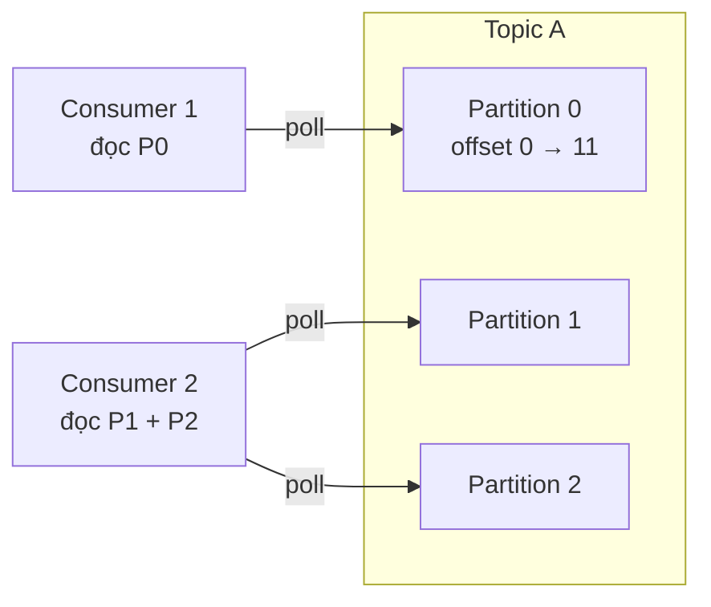
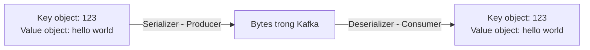

# Consumer Và Deserialization: Người Đọc Thầm Lặng Của Dòng Dữ Liệu

Bài trước bạn đã thấy Producer quyết định message rơi vào partition nào và serialize object thành bytes ra sao. Bài này chúng ta đổi phe: message đã nằm yên trong partition, giờ **Consumer** lôi nó ra thế nào, và làm sao biến bytes vô hồn trở lại thành object có nghĩa?

---

## 1. Consumer Không Được Đút Tận Miệng: Mô Hình Pull

Điểm đầu tiên phải găm vào đầu: Consumer Kafka dùng **pull model (poll model)**, không phải push.

* Consumer **chủ động request** dữ liệu từ Broker: "cho tôi message từ offset X trở đi".
* Broker trả response về. Broker **không bao giờ tự đẩy** dữ liệu xuống Consumer.

Vì sao thiết kế vậy? Vì chỉ Consumer mới biết mình xử lý nhanh hay chậm. Mô hình pull cho phép Consumer mệt thì poll thưa ra, khỏe thì poll dồn dập — Broker không cần lo Consumer có bị ngộp hay không. Đây là khác biệt căn bản với nhiều hệ messaging push kiểu cũ.

Luồng chuẩn với Topic A có 3 partitions:



Một Consumer có thể đọc một partition (Consumer 1 đọc P0), cũng có thể đọc nhiều partitions (Consumer 2 đọc cả P1 lẫn P2). Và giống Producer, Consumer **tự biết phải hỏi Broker nào** để lấy đúng partition mình cần. Broker chết thì Consumer tự biết đường recover — chi tiết cơ chế sẽ học ở phần lập trình.

Analogy kiểu Việt Nam: Broker giống như quán cơm treo bảng "tự phục vụ". Quán không bưng cơm tới tận bàn (push), mà bạn phải tự cầm khay ra quầy múc (pull). Ăn nhanh thì ra múc liên tục, ăn chậm thì ngồi nghỉ — quán không quan tâm.

## 2. Thứ Tự Đọc: Trong Partition Thì Chuẩn, Khác Partition Thì Hên Xui

Dữ liệu đọc ra luôn đi từ **offset thấp tới offset cao trong từng partition**: 0, 1, 2, 3...

* Consumer 1 đọc P0 từ offset 0 tới offset 11 theo đúng thứ tự ghi.
* Consumer 2 đọc P1 theo thứ tự của P1, đọc P2 theo thứ tự của P2.

Nhưng — nhắc lại lần thứ ba vì quá quan trọng — **không có đảm bảo thứ tự giữa các partitions khác nhau**. Message ở P1 offset 5 và message ở P2 offset 5 không có quan hệ trước-sau gì cả. Nếu nghiệp vụ cần thứ tự, quay lại bài Producer: dồn chúng về cùng partition bằng Key.

## 3. Deserialization: Hành Trình Ngược Của Serialization

Nhớ ở bài Producer: Kafka chỉ lưu **bytes**. Producer serialize object thành bytes trước khi gửi. Giờ Consumer nhận về cũng chỉ là bytes — key dạng binary, value dạng binary — phải **deserialize** ngược lại thành object thì code của bạn mới dùng được.

Ví dụ đối xứng hoàn hảo với bài trước:

* Key nhận về là bytes, nhưng Consumer **biết trước** key gốc là Integer nên dùng **IntegerDeserializer** để biến bytes thành số `123`.
* Value nhận về là bytes, Consumer biết trước value là String nên dùng **StringDeserializer** để biến bytes thành chuỗi `"hello world"`.

```java
// Minh họa ý tưởng đối xứng với phía Producer
props.put("key.deserializer", "IntegerDeserializer");   // bytes -> 123
props.put("value.deserializer", "StringDeserializer");  // bytes -> "hello world"
```

Kafka đính kèm sẵn cả bộ deserializer thông dụng, mirror với serializer: **String (kể cả JSON), Integer, Float, Avro, Protobuf**... Producer dùng serializer nào thì Consumer phải dùng deserializer đó — đây là một "hợp đồng ngầm" giữa hai phe.



## 4. Luật Sắt: Đừng Đổi Kiểu Dữ Liệu Giữa Chừng

Đây là chỗ nhiều team trả giá đắt. Trong suốt **vòng đời của một Topic** (từ lúc tạo tới lúc xóa), bạn **tuyệt đối không được đổi kiểu dữ liệu** mà Producer gửi vào.

Vì sao? Vì Consumer đã code cứng theo format cũ: key là Integer, value là String. Ngày đẹp trời Producer đổi sang gửi Float và Avro, Consumer vẫn dùng deserializer cũ sẽ giải mã sai, crash, hoặc tệ hơn là ra dữ liệu rác mà không báo lỗi.

Muốn đổi format thì con đường đúng là:

1. **Tạo Topic mới** với format mới tùy ý.
2. **Sửa Consumer** để đọc từ Topic mới bằng deserializer mới.

Nghe tốn công nhưng đó là cái giá của hợp đồng lỏng lẻo kiểu bytes. Muốn quản chặt hơn thì phải dùng thêm **Schema Registry** — sẽ học ở phần API mở rộng.

Analogy gần gũi: Topic giống như đường ống nước mía. Hôm nay bạn cho nước mía chảy qua, máy ép (Consumer) chỉnh để ép mía. Mai bạn đổi sang cho nước phở chảy qua cùng đường ống mà không báo, máy vẫn ép kiểu mía thì chỉ có toang. Muốn bán phở thì lắp đường ống mới.

## Cạm Bẫy Thường Gặp

* **Tưởng Broker push dữ liệu xuống.** Sai. Consumer phải poll. Viết code mà ngồi chờ "sao Broker chưa gửi gì" là hiểu sai bản chất — phải kiểm tra vòng poll của mình.
* **Đòi thứ tự cross-partition.** Consumer 2 đọc P1 và P2 thì thứ tự giữa hai luồng đó không có ý nghĩa. Cần ordering thì fix từ phía Producer bằng Key, Consumer không cứu được.
* **Serializer một đằng, deserializer một nẻo.** Producer gửi Avro mà Consumer dùng StringDeserializer thì chỉ có rác. Hai phe phải khớp nhau như chìa và ổ.
* **Đổi schema giữa chừng trên Topic đang chạy.** Kiểu "thêm một field chắc không sao đâu" — với JSON String thì có thể thoát, với Avro/Protobuf chặt chẽ thì Consumer cũ vỡ ngay. Muốn đổi thì tạo Topic mới.
* **Một Consumer ôm quá nhiều partition nặng.** Đọc được nhiều partition không có nghĩa nên ôm hết. Ôm nhiều thì poll chậm, lag tăng — đó chính là lý do bài sau sinh ra Consumer Group để chia việc.

## Kết Luận

Tóm lại một câu: **Consumer dùng mô hình pull để chủ động xin dữ liệu từ Broker theo đúng thứ tự offset trong từng partition, rồi dùng deserializer khớp với serializer của Producer để biến bytes trở lại thành object — và đừng bao giờ đổi kiểu dữ liệu giữa vòng đời Topic.**

Bài tiếp theo chúng ta scale Consumer lên: một mình đọc không kịp thì chia việc cho cả nhóm ra sao — qua nhân vật **Consumer Group** và cơ chế **Consumer Offset** giúp đọc lại đúng chỗ sau khi crash.
