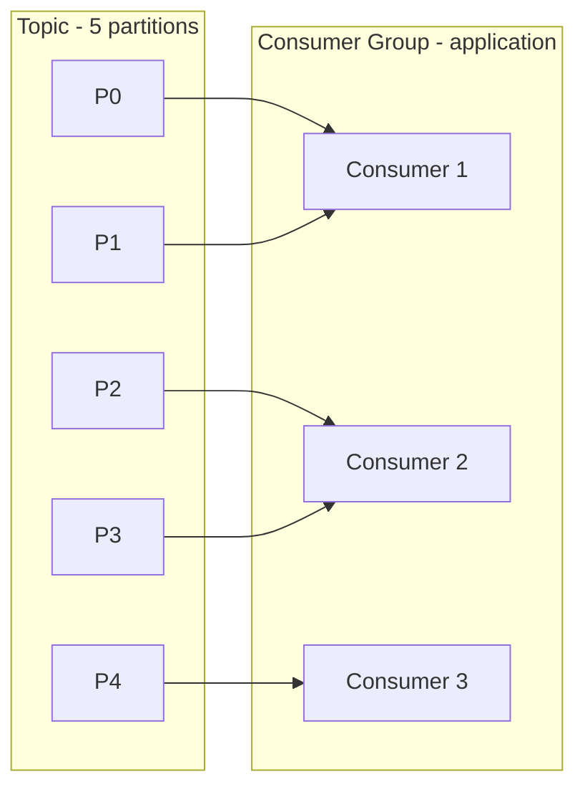
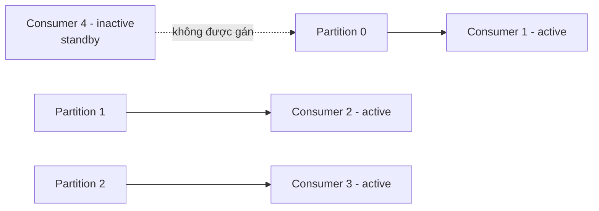
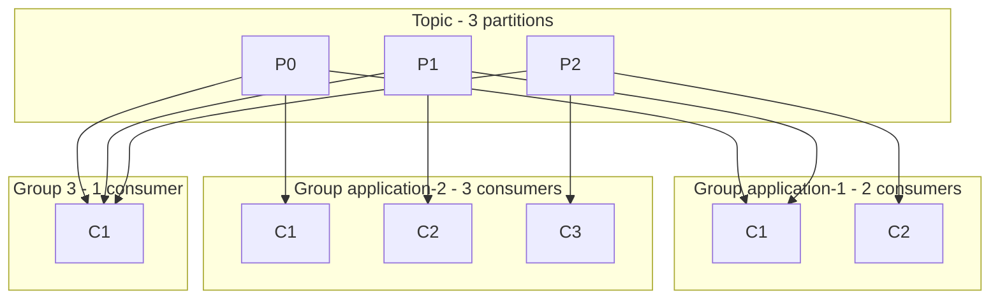
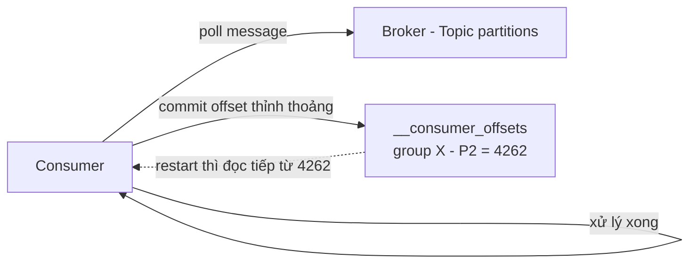

# Consumer Group Và Consumer Offset: Chia Việc Để Đọc Song Song, Ghi Nhớ Để Không Mất Dấu

Bài trước bạn đã biết một Consumer đơn lẻ pull dữ liệu và deserialize ra sao. Nhưng một mình nó đọc 5 partitions thì sớm muộn cũng đuối. Bài này trả lời hai câu hỏi sống còn khi scale: chia việc đọc cho nhiều Consumer thế nào cho đúng, và crash giữa chừng thì đọc lại từ đâu?

---

## 1. Vấn Đề: Một Consumer Không Nuốt Nổi Cả Topic

Hãy tưởng tượng Topic `trucks_gps` có 5 partitions, message đổ về mỗi giây hàng nghìn cái. Một Consumer đơn đọc cả 5 partitions thì:

* Poll chậm, xử lý không kịp, **lag** phình to.
* Muốn nhanh hơn thì chỉ còn cách tăng sức một máy — scale dọc, sớm chạm trần.

Cách của dân distributed system: đừng nuôi một người khổng lồ, hãy chia việc cho cả nhóm cùng đọc. Nhóm đó gọi là **Consumer Group**.

## 2. Consumer Group Là Gì? Luật Chia Partition

**Consumer Group** là tập hợp nhiều Consumer cùng nhau đọc một Topic như một khối thống nhất. Mỗi Consumer trong group có ID riêng, nhưng chúng khai chung một `group.id`.

Luật chia việc rất nghiêm, phải thuộc lòng:

> **Trong một group, mỗi Partition tại một thời điểm chỉ được gán cho đúng một Consumer.**

Ví dụ: Topic 5 partitions, group `application` có 3 consumers:

* Consumer 1 đọc partition 0 và 1.
* Consumer 2 đọc partition 2 và 3.
* Consumer 3 đọc partition 4.



Cả group cộng lại đọc **toàn bộ Topic**, không partition nào bị bỏ sót, không partition nào bị hai Consumer cùng group giành nhau.

Analogy kiểu Việt Nam: Topic là mâm cỗ 5 món, group là bàn 3 người. Mỗi món chỉ một người gắp tại một thời điểm cho khỏi đánh nhau, nhưng cả bàn cộng lại thì vét sạch mâm. Muốn ăn nhanh hơn thì thêm người, thêm đũa.

## 3. Thừa Consumer Thì Sao? Kẻ Ngồi Chơi Là Chuyện Bình Thường

Câu hỏi phỏng vấn kinh điển: Topic 3 partitions mà group có 4 consumers thì sao?

* Consumer 1 đọc partition 0.
* Consumer 2 đọc partition 1.
* Consumer 3 đọc partition 2.
* Consumer 4 **inactive** — ngồi standby, không đọc partition nào.



Đây là hành vi **bình thường**, không phải bug. Consumer 4 không hề "phụ" Consumer 1 đọc partition 0 cho nhanh. Nó chỉ ngồi chờ: khi một trong ba Consumer kia chết, nó mới được giao việc (rebalance — chi tiết ở phần nâng cao).

Hệ quả thiết kế rút ra ngay:

* Số Consumer active tối đa trong một group **bằng số Partition** của Topic.
* Muốn tăng song song thì phải tăng Partition trước, thêm Consumer sau. Thêm Consumer mà không thêm Partition là nuôi người ngồi chơi.

## 4. Nhiều Groups Trên Một Topic: Một Dòng Dữ Liệu, Nhiều Kẻ Đọc Độc Lập

Luật exclusive ở mục 2 chỉ áp dụng **trong** một group. **Giữa** các groups thì thoải mái: bao nhiêu group cùng đọc một Topic cũng được, mỗi group nhận đủ toàn bộ dữ liệu.

Ví dụ Topic 3 partitions:

* Group `application-1` có 2 consumers: consumer 1 đọc 2 partitions, consumer 2 đọc 1 partition.
* Group `application-2` có 3 consumers: mỗi consumer đọc đúng 1 partition.
* Group 3 chỉ có 1 consumer: một mình ôm cả 3 partitions.



Quay lại ví dụ đội xe tải ở bài Topic: `location service` cần stream GPS để vẽ dashboard, `notification service` cần cùng stream đó để gửi SMS. Mỗi service là **một Consumer Group riêng** (`group.id` khác nhau). Hai service đọc độc lập, service này lag hay crash không ảnh hưởng service kia.

Trong code Java, khai báo group chỉ bằng một property duy nhất:

```java
// Minh họa ý tưởng, chi tiết code ở phần lập trình
props.put("group.id", "location-service");      // group 1
props.put("group.id", "notification-service");  // group 2
```

Cùng Topic, khác `group.id` là hai thế giới đọc độc lập.

## 5. Consumer Offset: Dấu Trang Sách Để Crash Rồi Đọc Tiếp

Chia việc xong thì câu hỏi tiếp theo là: Consumer đọc tới đâu rồi, crash thì nhớ thế nào để đọc tiếp?

Kafka lưu câu trả lời trong một **internal Topic** tên `__consumer_offsets` (có hai dấu gạch dưới ở đầu — dấu hiệu của Topic nội bộ). Mỗi group, mỗi partition có một offset đã commit: "group này đã đọc tới offset X của partition Y".

Luồng chuẩn:

1. Consumer poll message về, xử lý.
2. Thỉnh thoảng Consumer **commit offset** — báo cho Broker: "tôi đã xử lý xong tới đây, ghi hộ vào `__consumer_offsets`".
3. Consumer tiếp tục poll từ offset tiếp theo trở đi.

Ví dụ Topic đã ghi tới offset 4258, Consumer commit dần lên 4262. Nếu Consumer chết rồi sống lại, Broker tra `__consumer_offsets` và bảo: "partition 2 này lần trước đọc tới 4262 rồi, giờ chỉ gửi từ 4262 trở đi". Nhờ vậy mà có khả năng **replay từ chỗ crash**, không phải đọc lại từ đầu cũng không bị mất đoạn giữa.



Analogy gần gũi: đọc truyện dài 4000 chương mà không kẹp bookmark thì cúp điện là mất dấu. Commit offset chính là kẹp bookmark mỗi vài chục chương. Cúp điện (crash) thì mở đúng chỗ bookmark đọc tiếp.

## 6. Deep Dive: Ba Ngữ Nghĩa Giao Hàng — At Least Once, At Most Once, Exactly Once

Tùy **khi nào** bạn commit offset mà rơi vào một trong ba delivery semantics. Đây mới là giới thiệu, phần lập trình sẽ mổ xẻ kỹ, nhưng phải nắm khung từ bây giờ:

### 6.1. At least once: thà trùng còn hơn mất

* Commit offset **sau khi xử lý xong** message.
* Nếu xử lý xong nhưng chưa kịp commit đã crash, restart sẽ đọc lại message đó.
* Hệ quả: message có thể bị xử lý **trùng**. Code xử lý của bạn phải **idempotent** — xử lý lại cũng không gây hại (cộng tiền 2 lần là toang, nhưng ghi đè trạng thái thì không sao).

Đây là **mặc định của Java Consumer** (auto-commit theo chế độ at-least-once). Đa số hệ thống chọn chế độ này rồi tự lo idempotency.

### 6.2. At most once: thà mất còn hơn trùng

* Commit offset **ngay khi vừa nhận** message, chưa xử lý.
* Nếu xử lý lỗi sau đó, message đã bị đánh dấu "đọc rồi" nên **không bao giờ được đọc lại** — mất luôn.
* Dùng khi mất vài message không sao (metrics, log sampling) nhưng trùng thì chết.

### 6.3. Exactly once: chỉ một lần duy nhất — khó nhất

* Muốn mỗi message được xử lý **đúng một lần**.
* Có hai đường:
  * **Kafka -> Kafka**: đọc từ Topic này, ghi ra Topic khác thì dùng **Transactional API** (rất dễ nếu dùng Kafka Streams API).
  * **Kafka -> hệ thống ngoài**: bắt buộc phải viết **idempotent consumer** phía nhận.
* Đừng mơ exactly-once "miễn phí" chỉ bằng cách chỉnh commit. Nó là cả thiết kế end-to-end.

Tóm gọn để nhớ:

| Chế độ | Commit khi nào? | Rủi ro | Khi nào dùng? |
|---|---|---|---|
| At least once | Sau khi xử lý | Trùng message | Mặc định, xử lý idempotent được |
| At most once | Ngay khi nhận | Mất message | Mất ít không sao, sợ trùng |
| Exactly once | Transactional / idempotent end-to-end | Phức tạp | Cần đúng một lần thật sự |

## Cạm Bẫy Thường Gặp

* **Thêm Consumer vô tội vạ mà không tăng Partition.** Consumer thừa ngồi inactive, tốn tài nguyên mà throughput không nhích. Muốn song song hơn thì tăng partition trước.
* **Hai service khác nhau mà dùng chung `group.id`.** Chúng sẽ giành partition của nhau thay vì mỗi service nhận đủ dữ liệu. Mỗi service độc lập phải có `group.id` riêng.
* **Không commit offset bao giờ.** Restart là đọc lại từ đầu (hoặc từ latest tùy config), hoặc tệ hơn là không biết mình đang ở đâu. Commit thưa quá thì replay lại nhiều, commit dày quá thì tốn overhead — phải cân.
* **Chọn at-least-once mà code không idempotent.** Trùng message là chắc chắn sẽ xảy ra trong đời thực (crash, rebalance). Không lo idempotency từ đầu thì tới lúc trùng là trừ tiền khách hai lần.
* **Tưởng exactly-once chỉ là một flag config.** Không có flag thần kỳ nào cả. Exactly-once là kiến trúc: transactional + idempotent consumer + hệ downstream hợp tác.

## Kết Luận

Tóm lại một câu: **Consumer Group chia partitions cho các Consumer đọc song song theo luật mỗi partition một chủ, nhiều groups đọc độc lập trên cùng Topic nhờ `group.id` khác nhau, và cơ chế commit offset vào `__consumer_offsets` cho phép đọc tiếp sau crash với ba ngữ nghĩa at-least-once, at-most-once, exactly-once tùy thời điểm commit.**

Bài tiếp theo chúng ta xuống tầng hạ tầng: những partitions này thực sự nằm trên máy nào — qua nhân vật **Broker**, khái niệm **bootstrap server** và cơ chế client tự khám phá cả cluster chỉ từ một địa chỉ duy nhất.
