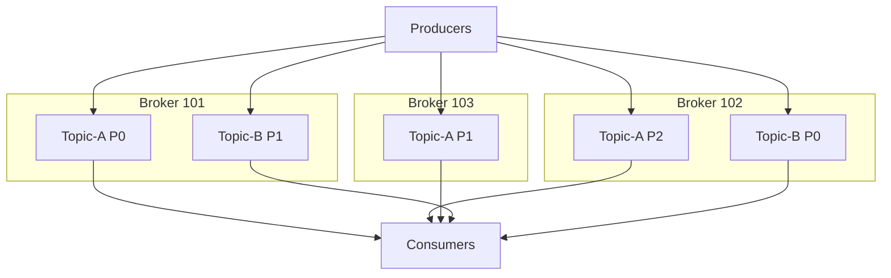
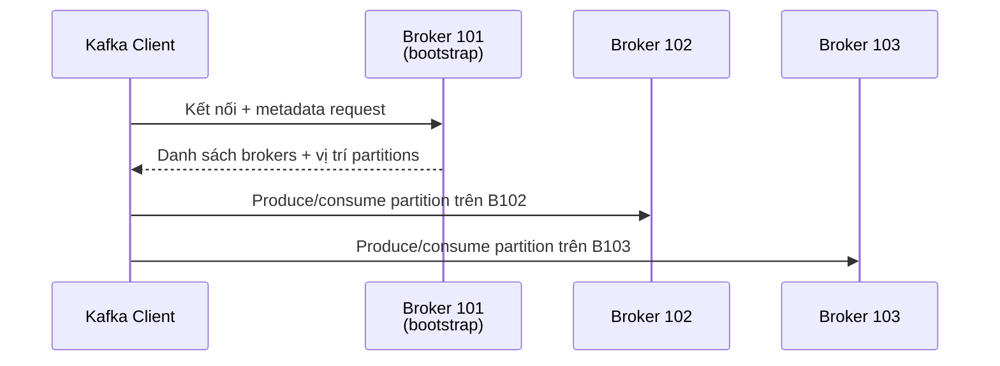

# Broker Và Topic: Dữ Liệu Của Bạn Thực Sự Nằm Trên Máy Nào?

Bài trước bạn đã thấy Consumer Group chia partitions cho nhau đọc. Nhưng những partitions đó nằm ở đâu trên ổ cứng của ai? Bài này xuống tầng hạ tầng, gặp nhân vật giữ dữ liệu thật sự: **Broker**, và hiểu vì sao client chỉ cần biết một địa chỉ mà nói chuyện được với cả cluster.

---

## 1. Broker Là Gì? Chỉ Là Server Nhưng Có Tên Riêng

**Kafka cluster** là tập hợp nhiều **Kafka Broker**. Broker thực chất chỉ là **server** — máy chạy Kafka — nhưng trong thế giới Kafka người ta gọi là Broker vì nó làm nghề "môi giới": **nhận dữ liệu từ Producer, gửi dữ liệu cho Consumer**.

Mỗi Broker có một định danh duy nhất là **ID số nguyên**: Broker 101, 102, 103... Con số bắt đầu từ 100 trong khóa này chỉ là quy ước cho dễ nói (đỡ nhầm với số partition 0, 1, 2), không phải luật của Kafka.

Hai sự thật nền phải nhớ:

* Mỗi Broker **chỉ chứa một số partitions nhất định**, không Broker nào ôm hết dữ liệu.
* Muốn bắt đầu thì **3 brokers** là con số đẹp. Cluster lớn có thể lên **hơn 100 brokers**.

## 2. Partition Nằm Rải Khắp Brokers: Horizontal Scaling Là Đây

Lấy ví dụ cụ thể: **Topic-A có 3 partitions**, **Topic-B có 2 partitions**, cluster có 3 brokers 101, 102, 103. Kafka rải partitions ra như sau (thứ tự rải là ngẫu nhiên, không theo quy luật đẹp đẽ nào):

* Broker 101 giữ **Topic-A partition 0** và **Topic-B partition 1**.
* Broker 102 giữ **Topic-A partition 2** và **Topic-B partition 0**.
* Broker 103 giữ **Topic-A partition 1**, và **không có partition nào của Topic-B** — chuyện hoàn toàn bình thường, vì 2 partitions của Topic-B đã có chỗ cả rồi.

Đây chính là sức mạnh của Kafka: **dữ liệu phân tán trên toàn cluster**, không máy nào giữ hết. Thêm partition, thêm Broker thì dữ liệu càng rải mỏng — đó là **horizontal scaling**. Mỗi Broker chỉ lo phần dữ liệu của mình, không gánh hộ ai.

Nhớ kỹ câu này: **Broker không có toàn bộ dữ liệu, Broker chỉ có đúng phần dữ liệu nó phải giữ.**

## 3. Bootstrap Server: Chỉ Cần Biết Một Địa Chỉ, Tự Khám Phá Cả Cluster

Đây là cơ chế "thông minh" nhất của Kafka client mà người mới hay bỡ ngỡ.

Mỗi Broker trong cluster đều được gọi là **bootstrap server**. Bạn sẽ thấy tham số `bootstrap.servers` xuất hiện trong mọi đoạn code Java và lệnh CLI — giờ bạn biết nó từ đâu ra.

Cơ chế hoạt động với cluster 5 brokers (lấy Broker 101 làm ví dụ, nhưng thực ra Broker nào cũng làm bootstrap được):

1. **Client chỉ kết nối tới một Broker** (ví dụ Broker 101), kèm một **metadata request**.
2. Broker 101 trả về **danh sách toàn bộ brokers trong cluster**, kèm metadata quan trọng: **Broker nào giữ partition nào**.
3. Nhờ danh sách đó, client **tự kết nối tới đúng Broker mình cần** để produce hoặc consume — không cần bạn khai báo từng Broker thủ công.

Sở dĩ làm được vậy vì **mỗi Broker đều nắm metadata của cả cluster**: biết hết Broker nào, Topic nào, Partition nào ở đâu. Client hỏi một người mà biết tin cả làng.

Analogy kiểu Việt Nam: cluster Kafka giống như khu chợ đầu mối có 5 cổng. Bạn chỉ cần biết đường tới một cổng (bootstrap), bảo vệ ở cổng đó đưa cho bạn sơ đồ toàn chợ: sạp nào bán gì, nằm dãy nào. Từ đó bạn tự đi thẳng tới sạp cần mua, không cần ai dắt tay từng bước.

## Cạm Bẫy Thường Gặp

* **Tưởng phải khai báo hết mọi Broker cho client.** Không cần. Khai một vài bootstrap servers là đủ, client tự khám phá phần còn lại. Khai hết vừa thừa vừa giòn — mai thêm Broker lại phải sửa config.
* **Tưởng mỗi Broker giữ bản sao toàn bộ dữ liệu.** Sai hoàn toàn (chừng nào chưa bật replication — bài sau). Mặc định mỗi Broker chỉ giữ partitions được giao. Broker chết mà không có replica là mất phần dữ liệu đó.
* **Thấy Broker 103 không có Topic-B mà tưởng cluster lỗi.** Bình thường. Số partition ít hơn số Broker thì có Broker "thất nghiệp" với Topic đó, không sao cả.
* **Nhầm ID Broker với số Partition.** Hai hệ đánh số độc lập. Broker 101/102/103 và partition 0/1/2 không liên quan gì nhau — thầy đánh Broker từ 100 chỉ để bạn đỡ nhầm.

## Kết Luận

Tóm lại một câu: **Broker là server giữ một phần partitions được rải đều khắp cluster để scale ngang, và nhờ cơ chế bootstrap server mà client chỉ cần biết một địa chỉ là tự khám phá toàn bộ cluster.**

Bài tiếp theo chúng ta vá lỗ hổng lớn nhất của bài này: Broker chết thì phần dữ liệu trên nó đi đâu — qua cơ chế **Topic Replication**, **Leader**, **ISR** và tính năng đọc từ replica gần nhất từ Kafka 2.4.
