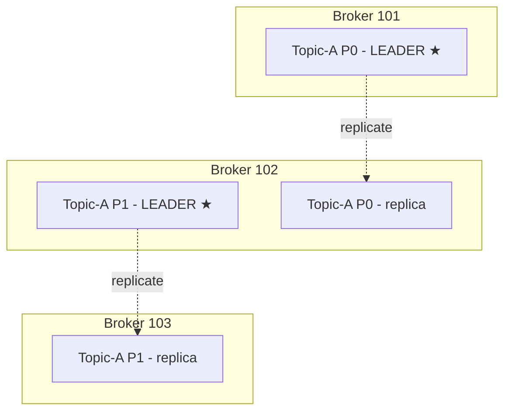
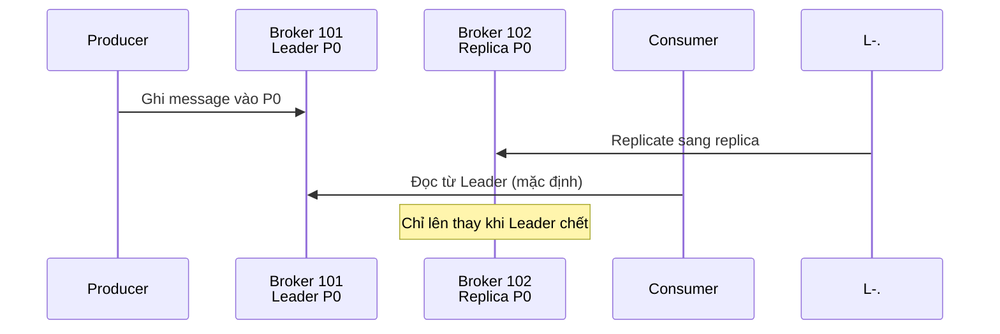

# Topic Replication: Broker Chết Thì Dữ Liệu Đi Đâu?

Bài trước bạn đã thấy partitions rải đều khắp brokers để scale ngang. Nhưng rải không mà không sao lưu thì Broker chết là mất dữ liệu. Bài này vá đúng lỗ hổng đó: **replication factor**, **leader**, **ISR**, và câu hỏi Producer/Consumer thực sự nói chuyện với ai.

---

## 1. Vấn Đề: Không Replica Thì Mất Một Broker Là Mất Dữ Liệu

Khi tự vọc trên máy cá nhân, Topic với **replication factor = 1** (mỗi partition một bản duy nhất) là đủ. Nhưng production thì khác: server nào cũng có ngày bảo trì hoặc lăn ra chết vì lý do trời ơi. Không có bản sao, Broker chết là partition trên nó biến mất theo.

Giải pháp của Kafka: mỗi partition có thêm **bản sao (replica)** nằm trên Broker khác. Chuẩn production là replication factor **2 hoặc 3, phổ biến nhất là 3**: chết 1–2 Brokers vẫn còn bản sao phục vụ.

## 2. Ví Dụ Cầm Tay: Topic-A, 2 Partitions, Replication Factor 2

Lấy cluster 3 brokers 101, 102, 103. Tạo **Topic-A: 2 partitions, replication factor = 2**.

Bước 1 — đặt bản chính:

* Partition 0 của Topic-A nằm trên **Broker 101**.
* Partition 1 của Topic-A nằm trên **Broker 102**.

Bước 2 — nhân bản bằng cơ chế replication:

* Bản sao của partition 0 được copy sang **Broker 102**.
* Bản sao của partition 1 được copy sang **Broker 103**.

Tổng cộng 2 partitions × replication 2 = **4 đơn vị dữ liệu** rải trên 3 brokers, và các Broker đang **replicate dữ liệu cho nhau**.

Giờ giả sử **Broker 102 chết**: Broker 101 vẫn còn partition 0, Broker 103 vẫn còn partition 1. **Cả hai partitions đều còn bản sống trong cluster.** Đó chính là ý nghĩa của replication factor 2: **chịu được 1 Broker chết mà không mất dữ liệu**.

Analogy kiểu Việt Nam: giống như photo sổ đỏ làm 2 bản, gửi mỗi bản cho một người họ hàng khác nhau giữ. Cháy nhà một người thì vẫn còn bản kia. Replication factor 3 tức là photo 3 bản, cháy 2 nhà vẫn còn 1 bản.

## 3. Leader Và Replica: Chỉ Một Người Được Nhận Khách

Có bản sao thì phải có quy định ai là chính, ai là phụ. Kafka gọi đó là **Leader**:

* Tại một thời điểm, mỗi partition chỉ có **đúng một Leader**, nằm trên một Broker duy nhất.
* Trong ví dụ trên: Broker 101 là **Leader của partition 0** ★, Broker 102 là **Leader của partition 1** ★. Các bản còn lại chỉ là replica đứng chờ.

Luật sắt thứ nhất — phía ghi: **Producer chỉ được gửi dữ liệu tới Broker đang là Leader của partition đó.** Muốn ghi partition 0 thì phải nói chuyện với Broker 101, không được ném sang Broker 102 dù nó cũng có bản sao.

Luật sắt thứ hai — phía đọc (mặc định): **Consumer mặc định cũng chỉ đọc từ Leader.** Consumer muốn đọc partition 0 thì hỏi Broker 101. Bản replica trên Broker 102 tồn tại chỉ để **dự phòng**: Broker 101 chết thì nó lên thay làm Leader mới, Producer và Consumer chuyển sang nói chuyện với nó.

## 4. ISR: Replica Nào Đủ Tư Cách Lên Thay?

Không phải bản sao nào cũng ngang nhau. Nếu replica chép chậm, tụt hậu xa so với Leader thì lúc Leader chết mà đôn nó lên sẽ mất dữ liệu mới nhất.

Kafka phân loại bằng khái niệm **ISR — In-Sync Replica**: replica nào **replicate kịp thời, đồng bộ với Leader** thì được phong ISR; con nào tụt lại thì thành **out-of-sync replica**, không đủ tư cách lên thay (và cũng không được tính vào các đảm bảo durability ở bài acks sau).

Nhớ gọn: **Leader + ISR = đội hình chính thức**. Mất Leader thì chỉ ISR mới được bầu lên thay.

## 5. Tính Năng Mới Từ Kafka 2.4: Đọc Từ Replica Gần Nhất

Mặc định "chỉ đọc từ Leader" tồn tại từ đầu và vẫn là default tới nay. Nhưng từ **Kafka 2.4**, có thêm tính năng **Consumer Replica Fetching (fetch from follower)**: Consumer được phép đọc từ **replica gần nhất** thay vì bắt buộc đọc Leader.

Vì sao cần? Hai lý do thực tế:

1. **Giảm latency**: Consumer đứng cạnh Broker 102 mà Leader ở Broker 101 xa tít thì đọc ngay bản sao bên cạnh cho nhanh.
2. **Giảm chi phí network trên cloud**: đọc trong cùng datacenter/zone thì rẻ, kéo xuyên zone thì tốn tiền. Đọc replica cùng zone tiết kiệm thấy rõ.

Luồng khi bật tính năng này: Producer vẫn ghi vào Leader (Broker 101) → Leader replicate sang ISR (Broker 102) → Consumer đọc thẳng từ replica trên Broker 102. Chi tiết cấu hình sẽ học ở phần lập trình, ở đây bạn chỉ cần biết tính năng này tồn tại từ 2.4 và vì sao nó ra đời.

Lưu ý của thầy cho người học version mới: nhiều công ty vẫn chạy Kafka cũ, nên thầy luôn ghi chú tính năng xuất hiện từ version nào. Bạn dùng Kafka 3.x thì cứ yên tâm là có Replica Fetching, nhưng đi phỏng vấn hay đọc tài liệu cũ thì phải biết default gốc là "chỉ đọc Leader".

## Cạm Bẫy Thường Gặp

* **Chạy production với replication factor = 1.** Học trên laptop thì được, production thì đó là vé một chiều tới mất dữ liệu. Chuẩn là 3.
* **Tưởng Producer ghi vào replica nào cũng được.** Sai. Chỉ Leader mới nhận ghi. Ghi nhầm chỗ là lỗi, không phải "rồi nó tự đồng bộ".
* **Tưởng Consumer đọc gộp từ mọi replica cho nhanh.** Mặc định chỉ đọc Leader. Muốn đọc replica gần nhất phải chủ động bật fetch-from-follower từ 2.4 trở lên.
* **Nhầm mọi replica đều là ISR.** Replica tụt hậu thì out-of-sync, không được bầu làm Leader, không được tính vào đảm bảo acks=all. Giám sát ISR tụt là việc của admin.
* **Đặt bản chính và bản sao cùng một rack/máy vật lý.** Cháy rack là mất cả chính lẫn sao. Production tử tế phải rải replica khác rack/zone — chủ đề của phần vận hành.

## Kết Luận

Tóm lại một câu: **replication factor tạo bản sao partitions trên Broker khác để chịu được Broker chết, mỗi partition chỉ có một Leader nhận ghi (và mặc định nhận đọc), replica đồng bộ kịp thời gọi là ISR mới đủ tư cách lên thay, còn từ Kafka 2.4 Consumer có thể đọc từ replica gần nhất để giảm latency và chi phí.**

Bài tiếp theo chúng ta khép lại bộ ba Producer–Broker–độ bền: Producer xác nhận ghi thành công kiểu gì qua ba mức **acks = 0, 1, all**, và công thức tính Topic chịu được bao nhiêu Broker chết từ replication factor N.
