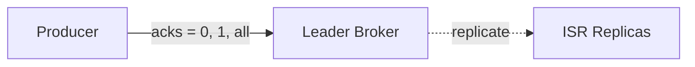

# Producer Acknowledgements Và Topic Durability: Ghi Tới Đâu Thì Yên Tâm Tới Đó?

Bài trước bạn đã hiểu replication, Leader và ISR. Bài này trả lời câu hỏi tiếp theo rất thực tế: Producer gửi message đi rồi, làm sao biết Broker đã ghi thành công chưa — và "thành công" ở đây có mấy cấp độ chắc chắn? Đây mới chỉ là giới thiệu, phần producer nâng cao sẽ mổ xẻ kỹ, nhưng khung tư duy phải nắm từ bây giờ.

---

## 1. Acks Là Gì? Ba Mức Cam Kết Từ Broker

Khi Producer gửi dữ liệu vào Broker giữ partition, nó có quyền đòi **acknowledgement** — xác nhận "tôi đã ghi xong". Mức đòi hỏi được chỉnh bằng tham số `acks`, có ba nấc:

### 1.1. `acks = 0`: gửi rồi kệ, mất thì thôi

* Producer **không chờ, không hỏi** xác nhận. Bắn message đi là coi như xong.
* Nhanh nhất, nhưng nếu Broker chết đúng lúc đó thì **mất dữ liệu mà không ai hay**. Producer còn không biết để gửi lại.

### 1.2. `acks = 1`: Leader nhận là đủ

* Producer chờ **Leader của partition xác nhận** đã ghi. (Nhớ bài trước: chỉ Leader mới nhận ghi.)
* An toàn hơn 0, nhưng vẫn **có thể mất dữ liệu trong khe hở**: Leader vừa ack xong chưa kịp replicate sang ISR đã chết → message đó bốc hơi dù Producer tưởng đã an toàn.
* Chi tiết khe hở này sẽ mổ ở phần nâng cao, ở đây bạn chỉ cần nhớ `acks = 1` không phải đảm bảo tuyệt đối.

### 1.3. `acks = all`: cả Leader lẫn ISR cùng gật đầu

* Producer đòi **Leader + toàn bộ ISR** (in-sync replicas) xác nhận đã ghi.
* Đây là mức **đảm bảo không mất dữ liệu** trong các điều kiện chuẩn (cụ thể điều kiện gì thì phần nâng cao sẽ chốt).
* Cái giá là **latency cao nhất**: phải chờ replicate xong mới được ack.

Tóm gọn để dán lên tường:

| Mức acks | Chờ ai? | Tốc độ | Độ an toàn |
|---|---|---|---|
| `0` | Không chờ ai | Nhanh nhất | Có thể mất, không hay biết |
| `1` | Leader | Trung bình | Mất ít, vẫn có khe hở |
| `all` | Leader + mọi ISR | Chậm nhất | Không mất (trong điều kiện chuẩn) |

Analogy kiểu Việt Nam: gửi tiền về quê có ba cách. `acks = 0` là nhét tiền vào phong bì thả ở bến xe, không hỏi ai — nhanh nhưng mất thì chịu. `acks = 1` là đưa cho anh xe ôm quen, anh gật đầu "em cầm rồi" — khá yên tâm nhưng xe anh hỏng giữa đường thì tiền vẫn mất. `acks = all` là đưa anh xe ôm, chờ anh gọi về nhà xác nhận "người nhà nhận tiền rồi" mới cúp máy — chậm nhất nhưng chắc nhất.

## 2. Topic Durability: Replication Factor N Chịu Được N−1 Broker Chết

Hiểu acks xong thì khái niệm **topic durability** (độ bền Topic) trở nên obvious.

Quy tắc vàng:

> **Topic có replication factor = N thì chịu được tối đa N−1 Brokers chết mà vẫn còn đủ dữ liệu.**

Ví dụ trong transcript: cluster 3 brokers, replication factor 2. Mất Broker 102 thì partition 0 còn trên Broker 101, partition 1 còn trên Broker 103 — dữ liệu vẫn đầy đủ. Tổng quát: replication 3 thì chết 2 Brokers vẫn còn 1 bản sống ở đâu đó trong cluster.

Nói cách khác: **acks quyết định "ghi chắc tới đâu", replication factor quyết định "chịu đòn tới đâu"**. Hai thứ cộng lại mới thành durability hoàn chỉnh — và mối quan hệ sâu giữa chúng (vì sao `acks = all` + replication 3 mới là combo chuẩn production) sẽ học kỹ ở phần producer nâng cao.

## Cạm Bẫy Thường Gặp

* **Bật `acks = all` rồi tưởng miễn nhiễm mọi thảm họa.** Sai. `acks = all` chỉ chờ ISR hiện tại, mà ISR rớt hết còn 1 thì đảm bảo cũng mỏng đi. Durability là combo acks + replication + min ISR, không phải một flag.
* **Dùng `acks = 0` cho dữ liệu quan trọng vì thấy "nhanh".** Đơn hàng, thanh toán mà chơi `acks = 0` thì mất message là mất tiền thật. `acks = 0` chỉ dành cho dữ liệu mất được: metrics sampling, log debug.
* **Dùng `acks = 1` rồi tưởng đã an toàn tuyệt đối.** Khe hở Leader-ack-xong-chưa-replicate-kịp là có thật. Dữ liệu không mất được thì phải lên `all`.
* **Nhầm replication factor cao thì tự động an toàn.** Replication 3 mà Producer chơi `acks = 1` thì lúc Leader chết đúng khe hở vẫn mất. Phải chỉnh cả hai đầu.

## Kết Luận

Tóm lại một câu: **Producer đòi xác nhận ghi qua ba mức `acks = 0` (không chờ), `1` (chờ Leader), `all` (chờ Leader + ISR) — càng chờ kỹ càng chậm mà càng chắc, và Topic replication factor N thì chịu được N−1 Brokers chết.**

Bài tiếp theo chúng ta lùi lại nhìn người quản lý thầm lặng đứng sau mọi Broker, Leader election và metadata: **Zookeeper** — nó làm gì, vì sao sắp bị thay thế, và tuyệt đối đừng bao giờ nối client thẳng vào nó.
