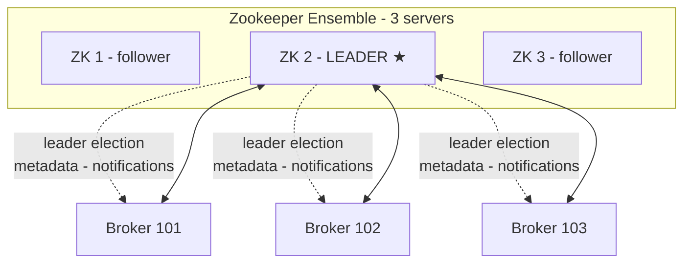

# Zookeeper: Người Quản Lý Thầm Lặng Sắp Về Hưu Của Kafka

Bài trước bạn đã nắm acks và durability. Bài này gặp nhân vật đứng sau sân khấu từ ngày Kafka ra đời: **Zookeeper** — kẻ giữ danh sách Broker, tổ chức bầu Leader, phát thông báo thay đổi. Nó sắp về hưu, nhưng production ngoài kia vẫn đầy Zookeeper, nên không thể không học.

---

## 1. Zookeeper Là Gì Và Vì Sao Kafka Cần Nó?

**Zookeeper** là một phần mềm riêng, chạy kèm Kafka từ thuở sơ khai. Mọi phiên bản Kafka **2.x trở về trước (tới 2.8) không thể chạy thiếu Zookeeper**: không start Zookeeper thì đừng mơ start được Kafka.

Nó làm ba việc chính cho cluster:

1. **Giữ danh sách Brokers.** Broker nào sống, Broker nào chết, Zookeeper nắm hết.
2. **Tổ chức leader election.** Broker chết thì partition mất Leader — Zookeeper đứng ra dàn xếp bầu Leader mới từ các replica.
3. **Phát thông báo thay đổi.** Topic mới được tạo, Broker lên/xuống, Topic bị xóa... Zookeeper gửi notification tới các Broker để cả làng cập nhật metadata.

Nói gọn: Broker lo dữ liệu, Zookeeper lo **metadata và điều phối**. Broker hỏi Zookeeper để biết "làng mình giờ có ai, ai làm Leader".

## 2. Luật Lẻ Của Zookeeper: Số Server Luôn Lẻ

Zookeeper theo thiết kế chạy với **số server lẻ**: 1, 3, 5 hoặc 7 — hiếm khi hơn 7. Lý do là cơ chế bầu cử cần đa số tuyệt đối (quorum): 3 servers chịu được 1 chết, 5 chịu được 2 chết. Chạy số chẵn vừa tốn máy vừa không tăng khả năng chịu lỗi tương xứng.

Bản thân Zookeeper cũng có khái niệm **Leader và follower** riêng: **một Leader nhận write, còn lại phục vụ read**. Trong sơ đồ trên, ZK 2 là Leader, ZK 1 và ZK 3 là follower. Đừng nhầm Leader của Zookeeper với Leader của Kafka partition — hai cuộc bầu cử độc lập ở hai tầng khác nhau.

## 3. Hiểu Lầm Kinh Điển: Zookeeper Không Giữ Consumer Offset Nữa

Đây là chỗ thầy nhấn mạnh vì "không biết bao nhiêu người vẫn trả lời sai": ở Kafka **rất cũ**, Consumer lưu offset đã đọc vào Zookeeper. Nhưng từ **Kafka 0.10 trở đi**, offset chuyển sang internal Topic **`__consumer_offsets`** như bạn đã học ở bài Consumer Group.

> **Zookeeper hiện tại không giữ bất kỳ consumer data nào.**

Đi phỏng vấn mà trả lời "offset lưu trên Zookeeper" là lộ ngay mình đọc tài liệu từ thập kỷ trước. Nhớ mốc: **0.10 = offset rời Zookeeper về Kafka**.

## 4. Lộ Trình Khai Tử: Từ Zookeeper Sang KRaft

Ngay từ **Kafka 3.x**, Kafka đã có thể chạy độc lập không cần Zookeeper bằng cơ chế **Kafka Raft (KRaft)**. Và theo lộ trình, **Kafka 4.x sẽ bỏ Zookeeper hoàn toàn**.

Nghĩa là cộng đồng đang ở giai đoạn chuyển giao: cluster mới thì tiến tới KRaft, cluster cũ ngoài production thì vẫn đầy Zookeeper. Đó chính là lý do bài này tồn tại — bạn **vẫn phải học Zookeeper** vì đi làm thật sẽ gặp nó dài dài.

Muốn đọc sâu thì Google **`KIP-500`** — proposal khai tử Zookeeper của dự án Kafka. (Chi tiết KRaft học ngay bài sau.)

## 5. Luật Sắt Cho Developer Hiện Đại: Đừng Bao giờ Nối Client Vào Zookeeper

Đây là lời dặn thầy nói với giọng "sẽ giận nếu bạn làm sai", nên deserves hẳn một mục riêng.

Ngày xưa (thời tiền sử của Kafka), Producer nối vào Zookeeper, Consumer nối vào Zookeeper, admin client cũng nối vào Zookeeper. Giờ thì **tất cả Kafka clients và CLI tools đã được migrate sang chỉ nói chuyện với Kafka Broker**:

* Producer → Broker. Consumer → Broker. Admin → Broker.
* Ngay cả lệnh `kafka-topics` từ **Kafka 2.0/2.2** đã chuyển sang trỏ Broker thay vì Zookeeper.

Quy định cho developer hiện đại:

1. **Không bao giờ dùng Zookeeper làm connection endpoint trong code hay CLI.** Chỉ trỏ `bootstrap.servers` về Broker.
2. **Bảo vệ Zookeeper**: nếu còn dùng, chỉ cho Broker nối vào, cấm client nối trực tiếp — vì Zookeeper **kém secure hơn Kafka**. Mở cửa cho client là mở thêm mặt tấn công.

Khi nào được bỏ Zookeeper? Lời khuyên của thầy ở thời điểm ghi hình: chừng nào **Kafka 4.0 chưa ra và ổn định**, production vẫn nên giữ Zookeeper cho Broker. Còn vọc vãnh học tập thì thầy sẽ demo cả cách start Kafka không Zookeeper ở phần hands-on — nhưng nhớ tag "chưa production-ready ở thời điểm đó".

Analogy kiểu Việt Nam: Zookeeper giống như bác tổ trưởng dân phố sắp nghỉ hưu. Mọi giấy tờ hộ khẩu (metadata), bầu tổ phó mới (leader election), loa phường thông báo (notifications) đều qua tay bác. Phường đã có hệ thống số mới (KRaft) nhưng sổ giấy của bác vẫn đầy ngoài thực tế, nên bạn phải biết bác làm gì — chỉ có điều đừng tới nhà riêng của bác (nối client) mà giải quyết việc, hãy ra ủy ban (Broker) theo quy trình mới.

## Cạm Bẫy Thường Gặp

* **Nối Producer/Consumer thẳng vào Zookeeper.** Lỗi thời từ nhiều major version trước. Mọi client hiện đại chỉ nối Broker.
* **Trả lời phỏng vấn rằng offset lưu trên Zookeeper.** Sai từ Kafka 0.10. Offset nằm ở `__consumer_offsets`.
* **Tưởng bỏ Zookeeper là xong chuyện bảo mật.** Ngược lại: chừng nào còn Zookeeper là còn một mặt tấn công kém secure hơn Kafka — phải khóa nó chỉ nhận Broker.
* **Chạy số Zookeeper chẵn "cho đối xứng".** Chẵn không tăng fault tolerance mà chỉ tốn máy. Cứ 1, 3, 5, 7.
* **Thấy KRaft mới thì xóa Zookeeper khỏi cluster production cũ ngay.** Đừng. Lộ trình migrate phải chờ version ổn định — bài sau sẽ nói rõ mốc nào production-ready.

## Kết Luận

Tóm lại một câu: **Zookeeper là lớp điều phối metadata, bầu Leader và phát thông báo cho Kafka từ thuở sơ khai — không giữ consumer offset từ 0.10, client hiện đại tuyệt đối không nối vào nó, và nó đang trên đường về hưu khi Kafka 4.x tới.**

Bài tiếp theo chúng ta gặp người kế nhiệm: **KRaft (KIP-500)** — vì sao Kafka muốn xóa Zookeeper, kiến trúc gọn lại ra sao, và mốc version nào mới dám dùng production.
