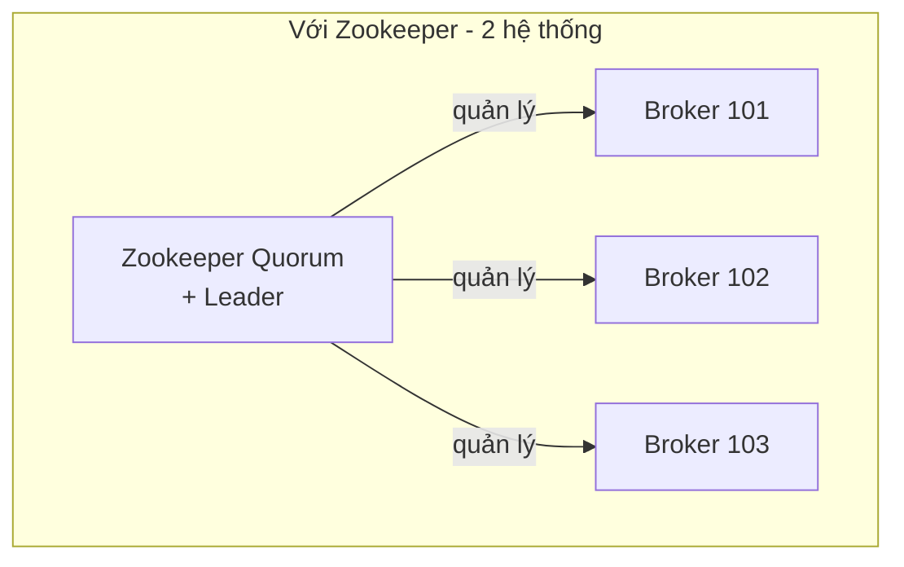
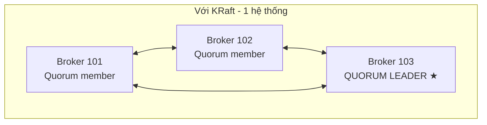

# Kafka KRaft: Khi Kafka Tự Quản Mình, Không Cần Zookeeper Nữa

Bài trước bạn đã gặp Zookeeper — bác tổ trưởng sắp về hưu. Bài này gặp người kế nhiệm: **KRaft**, chế độ Kafka tự quản metadata bằng chính giao thức Raft của mình. Vì sao phải thay, thay thì được gì, và bao giờ mới dám dùng production?

---

## 1. Vấn Đề Của Zookeeper: Càng To Càng Đuối

Zookeeper làm tốt ở quy mô vừa, nhưng khi cluster phình tới **hơn 100.000 partitions** thì Kafka + Zookeeper bắt đầu lộ vấn đề scaling. Metadata đồng bộ giữa hai hệ thống riêng biệt vừa chậm vừa phức tạp, vận hành phải nuôi hai cụm, bảo mật phải lo hai nơi.

Năm **2020**, dự án Kafka khởi động **`KIP-500`**: xóa dependency Zookeeper, đưa quản lý metadata vào chính Kafka bằng giao thức đồng thuận **Raft** — gọi là **KRaft (Kafka Raft)**.

## 2. KRaft Mang Lại Những Gì?

Bỏ một hệ thống riêng đi thì lợi ích tới theo chùm:

1. **Scale lên hàng triệu partitions.** Không còn nút thắt Zookeeper, trần scaling bay từ 100.000 lên **hàng triệu partitions**.
2. **Một hệ thống duy nhất để nuôi.** Deploy, monitor, support, administer — tất cả chỉ còn Kafka. Hết cảnh nửa đêm Zookeeper dở chứng mà Kafka vô can.
3. **Một mô hình security duy nhất.** Trước đây phải lo security Kafka **và** security Zookeeper (mà Zookeeper lại kém secure hơn). Giờ chỉ còn một.
4. **Một process duy nhất để start.** Hết cảnh start Zookeeper xong mới được start Kafka.
5. **Controller shutdown và recovery nhanh hơn rõ rệt.** Blog benchmark của dự án cho thấy cả thời gian shutdown có kiểm soát lẫn recovery sau shutdown đột ngột đều **cải thiện đáng kể** so với mode Zookeeper.

Nhìn hai sơ đồ là thấy ngay sự gọn gàng: không còn tầng Zookeeper đứng ngoài, chỉ còn các Broker tự bầu **Quorum Leader** trong nội bộ.

## 3. Mốc Version Phải Nhớ: Khi Nào Dám Dùng Production?

Đây là phần dễ trả lời sai nhất, vì mốc thay đổi theo thời gian. Theo transcript của khóa học:

* **Kafka 3.x (từ 3.0)**: đã có KRaft để vọc — nhưng **chưa production-ready**.
* **Kafka 3.3.1** (qua **`KIP-833`**): KRaft mới chính thức **production-ready**.
* **Kafka 4.0**: chỉ còn KRaft, **không hỗ trợ Zookeeper nữa**.

Quy ra hành động: học và lab thì bật KRaft thoải mái (khóa này có hướng dẫn launch cluster ở KRaft mode), nhưng quyết định production thì nhìn version mình đang chạy mà đối chiếu ba mốc trên. Đừng nghe "KRaft hay lắm" rồi bê vào cluster công ty đang chạy Kafka 3.0.

Analogy kiểu Việt Nam: Zookeeper là ban quản lý khu trọ thuê ngoài — thu tiền, giữ chìa khóa, hòa giải tranh chấp. KRaft là khu trọ tự quản: cư dân (Broker) tự bầu tổ trưởng (Quorum Leader), tự giữ sổ sách. Bớt một tầng trung gian thì ít cãi nhau hơn, nhưng ngày đầu tự quản mà chưa có quy chế (version chưa ready) thì cũng loạn — phải chờ quy chế chín (3.3.1) mới dám giao nhà.

## Cạm Bẫy Thường Gặp

* **Bật KRaft trên version chưa ready rồi chạy production.** Có từ 3.0 không có nghĩa production được từ 3.0. Mốc production-ready là 3.3.1.
* **Tưởng KRaft chỉ là "tắt Zookeeper đi".** Không. Metadata, leader election, controller — tất cả được viết lại trên Raft bên trong Kafka. Đây là thay tim, không phải gỡ phụ kiện.
* **Migrate cluster Zookeeper cũ sang KRaft kiểu "xóa đi cài lại".** Migration có quy trình riêng, bridge mode riêng (ngoài phạm vi bài này). Đừng tự ý đập cluster production để "lên KRaft cho hiện đại".
* **Quên KRaft không xóa nhu cầu hiểu Zookeeper.** Cluster cũ ngoài kia vẫn đầy Zookeeper (bài trước). Hiểu cả hai mới đi làm được.

## Kết Luận

Tóm lại một câu: **KRaft (KIP-500) thay Zookeeper bằng Raft nội bộ để Kafka scale tới hàng triệu partitions, gọn thành một hệ thống, một security, một process — có từ Kafka 3.0, production-ready từ 3.3.1 (KIP-833), và thành bắt buộc ở Kafka 4.0.**

Bài tiếp theo chúng ta khép lại toàn bộ phần Theory: điểm lại một lượt từ Broker, Topic, Replication tới Producer acks, Consumer Group, Zookeeper và KRaft trước khi xắn tay dựng Kafka trên máy.
