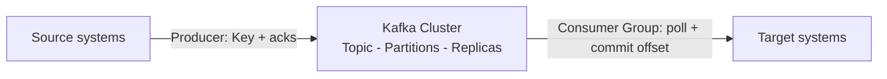

# Theory Roundup: Gói Toàn Bộ Lý Thuyết Kafka Trong Một Bài

Từ bài Topic đầu tiên tới bài KRaft vừa rồi, bạn đã đi hết một vòng lý thuyết. Bài này không dạy gì mới — nó là tấm bản đồ thu nhỏ để bạn kiểm tra xem mình có thủng lỗ nào không trước khi xắn tay dựng Kafka trên máy.

---

## 1. Cluster, Broker, Topic, Partition, Replication: Bộ Khung Hạ Tầng

Một **Kafka cluster** gồm nhiều **Broker** (ví dụ 9 brokers trong hình của thầy). Trong cluster đó:

* **Topic** là dòng dữ liệu có tên, chia thành nhiều **Partitions**, mỗi message mang **Offset** tăng dần trong partition của nó (bài 007).
* Mỗi partition có **replication factor** — số bản sao nằm trên các Broker khác nhau. Trong các bản sao, một bản là **partition Leader**, các bản đồng bộ kịp thời gọi là **ISR (in-sync replicas)** (bài 012).
* Kafka dùng internal Topic **`__consumer_offsets`** để ghi nhớ mỗi Consumer Group đã đọc tới đâu (bài 010).

Nhớ quan hệ nhân quả: Partition cho **scale ngang**, Replication cho **chịu lỗi**, Leader + ISR cho **đồng thuận ai phục vụ đọc/ghi**.

## 2. Producer: Đưa Dữ Liệu Vào Với Đúng Thứ Tự Và Đúng Độ Chắc

Producer lấy dữ liệu từ source system, **tự chọn partition** rồi gửi vào Kafka:

* **Không Key** → rải **round-robin** đều khắp partitions.
* **Có Key** → cùng Key về chung partition (**key-based ordering**), giữ thứ tự cho từng thực thể như `truck_id` (bài 008).
* Mức chắc chắn của cú ghi chỉnh bằng **acks = 0, 1, all**: không chờ, chờ Leader, hay chờ Leader + mọi ISR. Càng chờ kỹ càng chậm mà càng chắc (bài 013).

## 3. Consumer: Đọc Theo Nhóm, Nhớ Vị Trí, Chọn Ngữ Nghĩa

Consumer lấy dữ liệu từ cluster ra gửi tới target system, hoạt động theo ba nguyên tắc:

* **Consumer Group**: nhiều Consumer chia partitions đọc song song, mỗi partition một chủ; nhiều groups đọc độc lập trên cùng Topic nhờ `group.id` khác nhau (bài 010).
* **Offset commit** vào `__consumer_offsets` để crash rồi đọc tiếp đúng chỗ (bài 010).
* Ba **delivery semantics** tùy thời điểm commit: **at least once** (thà trùng), **at most once** (thà mất), **exactly once** (transactional/idempotent, khó nhất) (bài 010).
* Phía đọc dùng **deserializer** mirror với **serializer** phía ghi — và đừng đổi kiểu dữ liệu giữa vòng đời Topic (bài 009).

## 4. Ai Điều Phối? Từ Zookeeper Sang KRaft

* **Zookeeper**: người quản lý metadata, bầu Leader, phát notification từ thuở sơ khai; chạy số server lẻ, có Leader/follower riêng; **không giữ consumer offset từ Kafka 0.10**; client hiện đại tuyệt đối không nối vào (bài 014).
* **KRaft (KIP-500)**: Kafka tự quản bằng Raft nội bộ, scale tới hàng triệu partitions, một hệ thống, một security — có từ 3.0, production-ready từ 3.3.1 (KIP-833), bắt buộc ở 4.0 (bài 015).

## Cạm Bẫy Thường Gặp

* **Học rời rạc từng bài mà không nối lại.** Triệu chứng: hỏi "acks=all liên quan gì tới ISR?" thì ấp úng. Dùng sơ đồ ở mục 2 để nối Producer–Broker–Consumer thành một luồng duy nhất.
* **Nhầm "hiểu" với "làm được".** Đọc roundup thấy cái gì cũng quen không có nghĩa là dựng được cluster. Bài sau là hands-on — đừng đọc tiếp theory mãi.
* **Bỏ qua mốc version.** Replica fetching từ 2.4, offset rời Zookeeper từ 0.10, KRaft ready từ 3.3.1 — tài liệu cũ và phỏng vấn rất thích hỏi mấy mốc này.

## Kết Luận

Tóm lại một câu: **cluster chứa Broker giữ partitions có replica với Leader/ISR, Producer chọn partition bằng Key và chọn độ chắc bằng acks, Consumer chia việc theo Group và nhớ vị trí bằng offset commit, cả cụm do Zookeeper điều phối và đang chuyển sang KRaft — đó là toàn bộ theory trong một hơi thở.**

Bài tiếp theo (ngoài phạm vi Theory) chúng ta rời slide, bắt tay dựng Kafka thật trên máy và dùng CLI chọc vào cluster lần đầu tiên.
