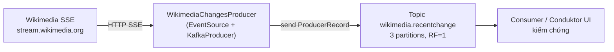

# Wikimedia Stream + Dựng Project Producer: Lấy Dữ Liệu Thật Từ Wikipedia Real-Time

Producer demo kiểu `send("hello")` thì học config nào cũng trừu tượng. Muốn cảm nhận `acks`, `retries`, `batch.size`, `linger.ms` thì cần một nguồn dữ liệu thật: throughput cao, chảy liên tục, JSON text. Stream `recentchange` của Wikimedia chính là nguyên liệu đó — và bài này dựng toàn bộ project Java để đọc nó.

---

## 1. Vấn đề: Producer Cần Gì Để Học Config Nghiêm Túc?

Ba yêu cầu cho một project demo Producer đạt chuẩn:

1. **Dữ liệu thật, vô hạn, tốc độ cao.** Có như vậy mới thấy khác biệt giữa `linger.ms=0` và `linger.ms=20`, giữa `compression.type=none` và `snappy`.
2. **Không phải tự bịa message.** Dữ liệu bịa thường đều nhau, ngắn, không nén được — đo throughput sẽ sai lệch.
3. **Chuẩn SSE (Server-Sent Events) dễ đọc từ Java.** Chỉ cần một HTTP client giữ connection mở, mỗi event là một JSON.

Wikimedia cung cấp đúng thứ đó: endpoint public stream mọi sửa đổi trên mọi wiki (Wikipedia, Wikidata...) theo thời gian thực, trung bình khoảng ~20-30 event/giây, cao điểm hơn nhiều. Không cần API key, mở trình duyệt cũng xem được.

## 2. Cơ Chế: Wikimedia RecentChange Stream Hoạt Động Ra Sao?

### 2.1. Bản chất là SSE trên HTTP

Endpoint:

```text
https://stream.wikimedia.org/v2/stream/recentchange
```

Khác với REST thông thường (request → response rồi đóng), SSE giữ một HTTP connection mở rất lâu. Server cứ có thay đổi mới là đẩy một event dạng:

```text
event: message
data: {"$schema":"/mediawiki/recentchange/1.0.0","type":"edit","title":"...","user":"...","bot":false,"server_name":"en.wikipedia.org", ...}
```

Mỗi `data:` là một JSON hoàn chỉnh: loại thay đổi (`edit`, `new`, `categorize`, `log`), tên bài, user, bot hay không, wiki nào, độ lớn edit, timestamp. Bạn có thể hình dung nó như một topic Kafka public mà Wikimedia đã host sẵn cho cả thế giới đọc.

### 2.2. Vì sao stream này lý tưởng cho Kafka Producer?

- **Throughput cao và biến động:** lúc yên ắng vài msg/s, lúc cao điểm hàng chục msg/s — đủ để batching và compression phát huy.
- **Message dạng JSON text lặp cấu trúc:** field lặp lại nhiều (`server_name`, `type`, `user`...) nên nén rất tốt, demo `compression.type` sẽ thấy khác biệt rõ.
- **Vô hạn:** chạy 10 phút hay 10 tiếng đều có dữ liệu, phù hợp để đo throughput, test `retries`, `buffer.memory`.
- **Có thể phân tích tiếp:** ở phần Kafka Streams sau này, chính stream này sẽ dùng để tính thống kê (bao nhiêu edit/giây, wiki nào sôi động nhất, bot vs người...). Học một nguồn, dùng cho nhiều phần.

### 2.3. Kiến trúc project sẽ dựng



Hai thư viện Java đảm nhận hai nửa:

| Thư viện | Vai trò |
|---|---|
| `kafka-clients` + `slf4j` | Gửi record vào Kafka (nửa Producer) |
| `okhttp3` + `okhttp-eventsource` | Đọc SSE stream từ Wikimedia (nửa Source) |

## 3. Config Và Dependency Chi Tiết

Bài này chưa tuning Producer, nhưng dependency phải đúng ngay từ đầu. Dưới đây là từng dependency trong `build.gradle` và vì sao cần nó.

### 3.1. `org.apache.kafka:kafka-clients`

Ý nghĩa: client chính thức của Kafka, chứa `KafkaProducer`, `ProducerRecord`, `ProducerConfig`.
Giá trị mẫu: dùng version khớp broker local. Ví dụ broker 3.1.x thì client `3.1.0`; broker 2.8 thì client `2.8.0` (version client quyết định default safe hay không — chi tiết ở bài 070).
Khi nào dùng: bắt buộc, mọi Producer đều cần.

### 3.2. `org.slf4j:slf4j-api` + `slf4j-simple`

Ý nghĩa: logging facade + implementation đơn giản để thấy log config Producer khi khởi động và log message đang gửi.
Khi nào dùng: luôn thêm trong project học tập. Production có thể thay `slf4j-simple` bằng Logback/Log4j2.

### 3.3. `com.squareup.okhttp3:okhttp`

Ý nghĩa: HTTP client giữ connection SSE mở lâu dài.
Giá trị mẫu: `4.9.3` — version đã kiểm chứng tương thích với `okhttp-eventsource`.
Khi nào dùng: bắt buộc để `okhttp-eventsource` chạy được.

### 3.4. `com.launchdarkly:okhttp-eventsource`

Ý nghĩa: wrapper SSE trên OkHttp, cung cấp interface `EventHandler` (`onOpen`, `onMessage`, `onError`...) và class `EventSource.Builder`. Bạn chỉ cần implement `onMessage` để `producer.send()`.
Giá trị mẫu: `2.5.0`.
Khi nào dùng: bắt buộc cho nguồn Wikimedia SSE. Nếu nguồn của bạn là file/DB/API REST thì không cần.

### 3.5. File `build.gradle` hoàn chỉnh để tra cứu

```groovy
dependencies {
    implementation 'org.apache.kafka:kafka-clients:3.1.0'
    implementation 'org.slf4j:slf4j-api:1.7.36'
    implementation 'org.slf4j:slf4j-simple:1.7.36'
    implementation 'com.squareup.okhttp3:okhttp:4.9.3'
    implementation 'com.launchdarkly:okhttp-eventsource:2.5.0'
}
```

> Giữ nguyên version mẫu nếu bạn muốn chạy đúng như demo. Nâng client lên 3.x mới hơn cũng được, nhưng đừng hạ client xuống 2.8 mà không đọc bài Safe Producer (070) trước — default `acks` và `enable.idempotence` sẽ đổi.

## 4. Code Ví Dụ: Tạo Module Và Class Khung

### 4.1. Tạo module Gradle mới

Trong IntelliJ: chuột phải vào project gốc → New → Module → Gradle, SDK 11, tên gợi ý `kafka-producer-wikimedia`. Sau khi tạo sẽ có sẵn `build.gradle` và cây `src/main/java`.

### 4.2. Thêm dependencies và sync

Paste khối dependencies ở mục 3.5 vào `build.gradle` của module, rồi nhấn con voi Gradle (Reload) để pull thư viện. Nếu không sync, import `KafkaProducer` và `EventSource` ở bước sau sẽ đỏ.

### 4.3. Tạo class khung để kiểm tra setup

Package và class theo chuẩn demo:

```java
package io.conduktor.demos.kafka.wikimedia;

public class WikimediaChangesProducer {
    public static void main(String[] args) throws InterruptedException {
        System.out.println("Wikimedia producer setup OK");
    }
}
```

Bấm Run. Nếu in ra dòng trên không lỗi `ClassNotFoundException` là dependencies đã về đủ. Bài sau sẽ thay thân `main` bằng `KafkaProducer` + `EventSource` thật.

```bash
# Kiểm tra nhanh stream có sống không (không cần Java)
curl -N https://stream.wikimedia.org/v2/stream/recentchange | head -n 20
```

Nếu `curl` thấy event `data:` chảy liên tục là nguồn ổn. Nếu mạng công ty chặn SSE, hãy xử lý proxy/VPN trước khi đổ lỗi cho code.

## 5. Safe / High-Throughput Preset Liên Quan

Bài này chưa áp preset nào — Producer còn chưa tồn tại. Nhưng hãy chốt trước quy ước dùng xuyên suốt section:

```java
// Bài 064-065: chạy mặc định trước để thấy baseline
// props chỉ có BOOTSTRAP_SERVERS_CONFIG + KEY/VALUE_SERIALIZER_CLASS_CONFIG

// Bài 070-071 (Safe): thêm acks=all + enable.idempotence=true + retries=Integer.MAX_VALUE
// Bài 072-074 (Throughput): thêm compression.type=snappy + linger.ms=20 + batch.size=32*1024
```

Đừng trộn cả hai preset ngay từ đầu. Mạch học đúng là: chạy trần → đo → safe hóa → tăng tốc. Mỗi preset thêm vào phải thấy log config đổi tương ứng.

## 6. Cạm Bẫy Thường Gặp

- **Nhầm source directory khi tạo class.** Project nhiều module dễ tạo class nhầm vào module `kafka-basics` thay vì `kafka-producer-wikimedia`. Triệu chứng: chạy vẫn bản cũ. Cách tránh: kiểm tra đường dẫn file chứa đúng tên module trước khi code.
- **Quên sync Gradle sau khi thêm dependency.** Import `okhttp3` hay `EventSource` đỏ lòe dù đã paste đúng. Nhấn Reload Gradle rồi mới sửa code.
- **Lệch version OkHttp vs EventSource.** `okhttp-eventsource` 2.5.0 đi với OkHttp 4.x. Nâng OkHttp lên 5.x đơn lẻ dễ vỡ API. Giữ đúng cặp `4.9.3` + `2.5.0` cho chắc.
- **Dùng JDK quá mới/cũ.** Module demo dùng SDK 11. JDK 8 thiếu API, JDK 21 có thể cảnh báo module. Thống nhất JDK 11 hoặc 17 cho cả project.
- **Mạng chặn SSE.** Chạy ở mạng công ty có firewall chặn stream dài, `EventSource` cứ `onError` rồi reconnect. Test bằng `curl -N` trước để loại trừ nguyên nhân mạng.
- **Tạo topic muộn.** Bài này chưa cần topic, nhưng từ bài 065 bắt buộc có topic `wikimedia.recentchange`. Tạo trước từ Conduktor UI (3 partitions, RF=1) để bài sau không gián đoạn.

## Kết Luận

Tóm lại một câu: **Wikimedia `recentchange` là một SSE stream JSON real-time lý tưởng cho demo Producer, và project Java cần đúng năm dependency (`kafka-clients`, `slf4j`, `okhttp`, `okhttp-eventsource`) sync sạch trước khi viết một dòng Producer nào.**

Bài tiếp theo chúng ta sẽ viết hai class cốt lõi: `WikimediaChangesProducer` (giữ `KafkaProducer` + `EventSource`) và `WikimediaChangeHandler` (mỗi `onMessage` là một `producer.send()`), nối stream Wikimedia vào topic `wikimedia.recentchange`.
