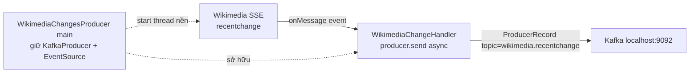

# Nối Wikimedia SSE Vào Kafka: Viết Producer Thật Đầu Tiên

Bài trước đã có project khung và stream Wikimedia chảy róc rách. Bài này biến khung đó thành Producer thật: một đầu đọc SSE vô hạn, một đầu `producer.send()` bất đồng bộ vào topic `wikimedia.recentchange`. Hiểu xong hai class này, bạn đã nắm mẫu chuẩn của mọi streaming producer: source → handler → Kafka.

---

## 1. Vấn đề: Làm Sao Vừa Đọc Stream Vô Hạn Vừa Gửi Kafka Không Block Nhau?

SSE stream không bao giờ kết thúc. Nếu đọc nó ngay trên main thread theo kiểu vòng lặp blocking, bạn không còn thread nào để quản lý lifecycle, graceful shutdown, hay chạy thêm logic khác.

Giải pháp chuẩn gồm hai mảnh ghép:

1. **`WikimediaChangesProducer` (main):** giữ `KafkaProducer`, định nghĩa topic, dựng `EventSource`, start nó trên thread nền, rồi block main thread có thời hạn để tiến trình không thoát.
2. **`WikimediaChangeHandler` (callback):** implement interface `EventHandler` của thư viện `okhttp-eventsource`. Mỗi khi SSE có event, thư viện gọi `onMessage()` trên thread nền — việc của bạn chỉ là `producer.send()`.

Luồng dữ liệu:



Điểm mấu chốt của Distributed Systems ở đây: **producer.send() là async, non-blocking.** Handler cứ nhận event là ném vào send buffer rồi quay lại ngay, không đợi broker ack. Nhờ vậy dù Wikimedia bắn ~30 msg/s, một thread nền duy nhất vẫn nuốt kịp.

## 2. Cơ Chế: EventHandler Có 5 Callback, Nhưng Chỉ 2 Cái Quan Trọng

Interface `EventHandler` bắt bạn implement 5 phương thức:

| Callback | Khi nào được gọi | Việc cần làm trong demo này |
|---|---|---|
| `onOpen()` | SSE connection vừa mở thành công | Không làm gì (có thể log một dòng) |
| `onMessage(String event, MessageEvent messageEvent)` | Mỗi event SSE tới — **trái tim của pipeline** | `producer.send(new ProducerRecord<>(topic, messageEvent.getData()))` + `log.info` |
| `onComment(String comment)` | Server gửi comment giữ connection (heartbeat) | Bỏ qua |
| `onError(Throwable t)` | Lỗi đọc stream, rớt mạng... | `log.error` để thấy và debug |
| `onClosed()` | Stream bị đóng | `producer.close()` để flush và giải phóng |

Vì handler chạy ở thread khác với main, `KafkaProducer` và `topic` phải được **tiêm qua constructor**. `KafkaProducer` là thread-safe nên share một instance giữa các thread là an toàn và đúng best practice — tuyệt đối không `new KafkaProducer` trong mỗi `onMessage`.

Một chi tiết nữa: `EventSource` sau `start()` chạy ở thread nền riêng. Nếu `main()` return ngay, JVM thấy không còn non-daemon thread quan trọng sẽ thoát và kéo theo thread nền. Vì vậy phải block main lại, đơn giản nhất là:

```java
TimeUnit.MINUTES.sleep(10); // chạy 10 phút rồi tự thoát
```

Bản production sẽ thay bằng `CountDownLatch` + shutdown hook, nhưng với bài lab, sleep 10 phút là đủ rõ ràng và dễ hiểu.

## 3. Config Chi Tiết: Ba Dòng Bắt Buộc Của Mọi Producer

Bài này chạy baseline, chưa tuning safe/throughput. Chỉ ba config nền:

### 3.1. `bootstrap.servers`

- **Ý nghĩa:** địa chỉ broker để client lần đầu kết nối và lấy metadata cluster.
- **Giá trị mẫu:** `127.0.0.1:9092` — broker local dựng ở bài 062.
- **Khi nào dùng:** bắt buộc, mọi Producer đều phải có. Production thay bằng danh sách 2-3 broker `broker1:9092,broker2:9092`.

### 3.2. `key.serializer` = `StringSerializer`

- **Ý nghĩa:** cách serialize key thành byte trước khi gửi. Demo này gửi key `null` (không key) nên serializer ít được dùng, nhưng vẫn phải khai báo.
- **Giá trị mẫu:** `org.apache.kafka.common.serialization.StringSerializer`.
- **Khi nào dùng:** khi key và value đều là String JSON thô. Khi chuyển sang Avro sẽ đổi thành KafkaAvroSerializer.

### 3.3. `value.serializer` = `StringSerializer`

- **Ý nghĩa:** cách serialize value. Ở đây value chính là chuỗi JSON `messageEvent.getData()` lấy nguyên từ Wikimedia, không transform gì.
- **Giá trị mẫu:** `StringSerializer`.
- **Khi nào dùng:** giữ nguyên cho toàn bộ section này. Mọi bài tuning sau đều giả định value là JSON text.

> Các config như `acks`, `retries`, `enable.idempotence`, `compression.type`, `linger.ms`, `batch.size` lúc này để default của client. Log khởi động sẽ in ra để bạn đối chiếu ở bài 066.

## 4. Code Ví Dụ: Hai Class Hoàn Chỉnh

### 4.1. `WikimediaChangesProducer.java` — main

```java
package io.conduktor.demos.kafka.wikimedia;

import org.apache.kafka.clients.producer.KafkaProducer;
import org.apache.kafka.clients.producer.ProducerConfig;
import org.apache.kafka.common.serialization.StringSerializer;
import com.launchdarkly.eventsource.EventHandler;
import com.launchdarkly.eventsource.EventSource;

import java.net.URI;
import java.util.Properties;
import java.util.concurrent.TimeUnit;

public class WikimediaChangesProducer {

    public static void main(String[] args) throws InterruptedException {
        String bootstrapServers = "127.0.0.1:9092";
        String topic = "wikimedia.recentchange";

        // 1. Producer properties - baseline, chưa tuning
        Properties props = new Properties();
        props.setProperty(ProducerConfig.BOOTSTRAP_SERVERS_CONFIG, bootstrapServers);
        props.setProperty(ProducerConfig.KEY_SERIALIZER_CLASS_CONFIG, StringSerializer.class.getName());
        props.setProperty(ProducerConfig.VALUE_SERIALIZER_CLASS_CONFIG, StringSerializer.class.getName());

        // 2. KafkaProducer - thread-safe, share cho handler
        KafkaProducer<String, String> producer = new KafkaProducer<>(props);

        // 3. EventHandler nhận producer + topic qua constructor
        String url = "https://stream.wikimedia.org/v2/stream/recentchange";
        EventHandler eventHandler = new WikimediaChangeHandler(producer, topic);

        // 4. EventSource chạy ở thread nền
        EventSource.Builder builder = new EventSource.Builder(eventHandler, URI.create(url));
        EventSource eventSource = builder.build();

        // 5. Start và block main 10 phút
        eventSource.start();
        TimeUnit.MINUTES.sleep(10);
    }
}
```

### 4.2. `WikimediaChangeHandler.java` — callback

```java
package io.conduktor.demos.kafka.wikimedia;

import com.launchdarkly.eventsource.EventHandler;
import com.launchdarkly.eventsource.MessageEvent;
import org.apache.kafka.clients.producer.KafkaProducer;
import org.apache.kafka.clients.producer.ProducerRecord;
import org.slf4j.Logger;
import org.slf4j.LoggerFactory;

public class WikimediaChangeHandler implements EventHandler {

    private final KafkaProducer<String, String> kafkaProducer;
    private final String topic;
    private final Logger log = LoggerFactory.getLogger(WikimediaChangeHandler.class.getSimpleName());

    public WikimediaChangeHandler(KafkaProducer<String, String> kafkaProducer, String topic) {
        this.kafkaProducer = kafkaProducer;
        this.topic = topic;
    }

    @Override
    public void onOpen() {
        // stream vừa mở, không cần làm gì
    }

    @Override
    public void onClosed() {
        kafkaProducer.close();
    }

    @Override
    public void onMessage(String event, MessageEvent messageEvent) {
        log.info(messageEvent.getData());
        // key = null -> phân phối theo Sticky Partitioner (bài 075)
        kafkaProducer.send(new ProducerRecord<>(topic, messageEvent.getData()));
    }

    @Override
    public void onComment(String comment) {
        // heartbeat của SSE, bỏ qua
    }

    @Override
    public void onError(Throwable t) {
        log.error("Error in stream reading", t);
    }
}
```

Đọc xuôi code main: tạo producer → gói vào handler → gói handler + URL vào EventSource → start → ngủ 10 phút. Đọc xuôi handler: mỗi message tới → log ra để mắt thấy → `send()` async vào Kafka. Không callback, không `.get()`, không retry tay — cố ý giữ đơn giản để baseline ở bài sau đo throughput thuần.

## 5. Safe / High-Throughput Preset Liên Quan

Bài này **chưa áp preset nào**, và đó là chủ ý. Hãy coi đây là bản baseline:

```java
// Baseline bài 064: chỉ 3 dòng, mọi thứ khác là default của client version bạn dùng
// Kafka 3.x default: acks=all, enable.idempotence=true  -> khá safe sẵn
// Kafka 2.8 default: acks=1, enable.idempotence=false    -> chưa safe, sẽ fix ở bài 071
```

Khi chạy, log khởi động sẽ in toàn bộ producer config (`acks = -1`, `batch.size = 16384`, `linger.ms = 0`, `compression.type = none`...). Hãy chụp lại hoặc nhớ các giá trị này — bài 066 sẽ mổ từng dòng, bài 070-074 sẽ đổi chúng và bạn sẽ thấy log đổi theo.

## 6. Cạm Bẫy Thường Gặp

- **Tạo nhầm class vào module khác.** Kiểm tra package `io.conduktor.demos.kafka.wikimedia` nằm đúng module `kafka-producer-wikimedia`. Sai module là chạy nhầm code cũ mà không biết.
- **Import nhầm `EventHandler`.** Phải là `com.launchdarkly.eventsource.EventHandler`, không phải handler của OkHttp hay Kafka. Import sai là `@Override` báo đỏ hàng loạt.
- **`new KafkaProducer` trong `onMessage`.** Mỗi message một producer = rò rỉ connection + TCP + thread, chạy vài phút là OOM. Luôn tạo một lần ở main và tiêm vào.
- **Quên block main thread.** Không có `sleep`/`latch`, `main` return ngay, JVM thoát, EventSource chưa kịp đọc event nào. Triệu chứng: chạy xong trong 1 giây, topic rỗng.
- **Quên `producer.close()` khi kết thúc.** Dữ liệu còn nằm trong send buffer chưa flush sẽ mất. Trong demo này `onClosed` đã close, nhưng nếu kill process bằng nút Stop của IDE thì vẫn có thể mất vài record cuối — chấp nhận được ở lab, không chấp nhận ở production (sẽ học flush + callback ở phần nâng cao).
- **Gửi kèm key rỗng `""` thay vì key null.** Hai thứ khác nhau hoàn toàn: key null đi theo Sticky Partitioner, key `""` bị hash về một partition cố định. Demo này muốn phân phối đều nên dùng constructor `ProducerRecord(topic, value)` — key null.

## Kết Luận

Tóm lại một câu: **pipeline Wikimedia = một `KafkaProducer` thread-safe được share qua constructor, một `EventSource` chạy nền, và mỗi `onMessage` là một `send()` async với key null vào `wikimedia.recentchange`.**

Bài tiếp theo chúng ta sẽ bấm Run thật: tạo topic 3 partitions trên Conduktor, xem log event chảy, và kiểm chứng bằng cả UI lẫn `kafka-console-consumer` rằng dữ liệu đã vào Kafka.
