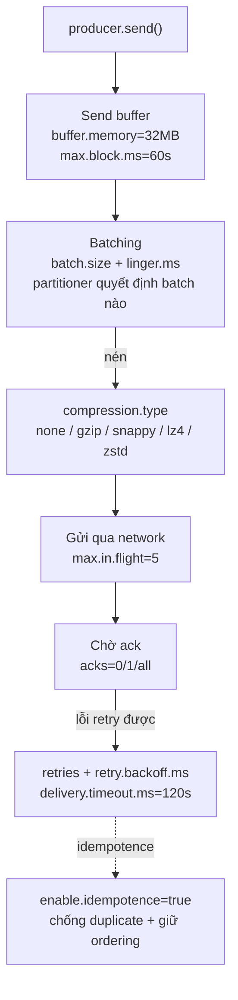

# Bản Đồ Config Producer: Đọc Log Khởi Động Và Biết Cái Nào Đáng Tuning

Bấm Run ở bài trước, thứ đầu tiên tuôn ra không phải JSON Wikimedia mà là hàng chục dòng log `producer config`: `acks = -1`, `batch.size = 16384`, `linger.ms = 0`, `compression.type = none`... Bài này không đi sâu từng cái — việc đó dành cho bài 067 trở đi — mà cho bạn tấm bản đồ: log đó đọc ra sao, config chia mấy nhóm, và thứ tự tuning đúng là gì.

---

## 1. Vấn Đề: Vì Sao Producer Có Tới Hàng Chục Config?

`KafkaProducer` mới nhìn tưởng chỉ cần `bootstrap.servers` + serializer là chạy. Nhưng đằng sau `send()` là cả một hệ thống con: buffer trong RAM, batching theo partition, nén, retry khi lỗi mạng, chờ ack từ broker, giữ thứ tự message. Mỗi hành vi đó là một config. Không hiểu bản đồ mà vặn bừa thì rất dễ rơi vào hai cực: vặn cho nhanh rồi mất dữ liệu, hoặc vặn cho safe rồi throughput tụt một nửa.

Tin tốt: 90% giá trị nằm ở khoảng 10 config. Còn lại để default là ổn cho tới khi bạn thực sự đo được vấn đề.

## 2. Cơ Chế: Đọc Log Khởi Động Như Đọc Hồ Sơ Sức Khỏe

Mỗi lần `new KafkaProducer<>(props)` chạy, client log toàn bộ config effective — tức là giá trị bạn set đè lên default. Đây là thói quen debug số một của dân Kafka: producer có vấn đề gì, việc đầu tiên là mở đoạn log này ra, đừng đoán.

```text
acks = -1
batch.size = 16384
linger.ms = 0
compression.type = none
retries = 2147483647
enable.idempotence = true
max.in.flight.requests.per.connection = 5
delivery.timeout.ms = 120000
retry.backoff.ms = 100
buffer.memory = 33554432
max.block.ms = 60000
bootstrap.servers = [127.0.0.1:9092]
key.serializer = StringSerializer
value.serializer = StringSerializer
```

Ba cột cần nhìn cho mỗi dòng: **tên config** (không bao giờ dịch, viết đúng `linger.ms` chứ không phải `linger_ms`), **giá trị effective**, và **nó thuộc nhóm nào** dưới đây.

### 2.1. Bản đồ ba nhóm config



| Nhóm | Câu hỏi nó trả lời | Config chính | Bài học sâu |
|---|---|---|---|
| **Durability (độ bền)** | Gửi rồi có chắc không mất, không trùng, không lộn thứ tự? | `acks`, `retries`, `enable.idempotence`, `min.insync.replicas` (phía broker/topic) | 067, 068, 069, 070, 071 |
| **Throughput (tốc độ)** | Gửi được bao nhiêu MB/s, tốn bao nhiêu request? | `compression.type`, `linger.ms`, `batch.size`, `partitioner.class` | 072, 073, 074, 075 |
| **Availability (chống kẹt)** | Broker chậm/chết thì producer ứng xử ra sao? | `buffer.memory`, `max.block.ms`, `delivery.timeout.ms` | 076 (+ 068 một phần) |

### 2.2. Thứ tự học đúng: safe trước, nhanh sau

Mạch từ bài 067 tới 076 được xếp có chủ ý, đừng học nhảy:

1. **067 `acks`**: broker xác nhận tới mức nào thì coi là thành công.
2. **068 `retries`**: thất bại tạm thời thì thử lại ra sao, giới hạn ở đâu.
3. **069 `enable.idempotence`**: thử lại thì làm sao không trùng, không lộn thứ tự.
4. **070–071 preset Safe**: chốt một bộ safe chuẩn, áp vào Wikimedia.
5. **072–074 compression + batching**: tăng tốc mà không phá độ safe vừa chốt.
6. **075 partitioner**: message không key đi về đâu, vì sao ảnh hưởng batch.
7. **076 buffer**: khi broker quá tải, producer kẹt ở đâu và bao lâu.

Nguyên tắc vàng xuyên suốt section: **mọi config throughput đều đánh đổi bằng latency hoặc CPU, mọi config safe đều đánh đổi bằng throughput hoặc availability.** Không có bữa trưa miễn phí — chỉ có lựa chọn phù hợp workload.

## 3. Config Chi Tiết: Ba Cái Tên Bạn Sẽ Thấy Đầu Tiên

### 3.1. `acks`

- **Ý nghĩa:** producer chờ xác nhận tới mức nào mới coi `send()` là thành công: `0` (không chờ), `1` (leader ghi xong), `all`/`-1` (tất cả in-sync replica ghi xong).
- **Giá trị mẫu:** log baseline client 3.x in `acks = -1`; client 2.8 in `acks = 1`.
- **Khi nào dùng:** quyết định durability của toàn pipeline. Bài 067 mổ chi tiết, bài 070 chốt khuyến nghị.

### 3.2. `batch.size` + `linger.ms`

- **Ý nghĩa:** gom nhiều record thành một request: `batch.size` (mặc định `16384` byte = 16KB) là trần mỗi batch theo partition, `linger.ms` (mặc định `0`) là thời gian chờ thêm để batch đầy hơn.
- **Giá trị mẫu:** baseline `16384` + `0` nghĩa là gửi ngay khi có thể, batch đầy tới đâu hay tới đó.
- **Khi nào dùng:** bài toán throughput. Bài 073 giải cơ chế, bài 074 áp `32KB + 20ms` vào Wikimedia.

### 3.3. `compression.type`

- **Ý nghĩa:** nén batch trước khi gửi: `none` (default), `gzip`, `snappy`, `lz4`, `zstd` (từ Kafka 2.1).
- **Giá trị mẫu:** baseline `none`. Với JSON Wikimedia lặp cấu trúc, bật nén giảm kích thước request vài lần.
- **Khi nào dùng:** mọi stream text-based throughput cao. Bài 072 so sánh thuật toán, bài 074 chốt `snappy`.

> Các config còn lại trong log (`retries`, `delivery.timeout.ms`, `buffer.memory`...) cứ để đó — mỗi bài sau sẽ gọi đúng tên chúng ra khi cần.

## 4. Code Ví Dụ: In Và Đối Chiếu Config Effective

Không cần code mới. Dùng chính producer bài 064 và đọc log. Nếu muốn in gọn trong code để so sánh trước/sau tuning:

```java
import org.apache.kafka.clients.producer.ProducerConfig;

// Sau khi new KafkaProducer, kiểm tra nhanh 3 giá trị hay bị nhầm nhất
System.out.println("acks=" + props.getProperty(ProducerConfig.ACKS_CONFIG));
System.out.println("compression=" + props.getProperty(ProducerConfig.COMPRESSION_TYPE_CONFIG, "none (default)"));
System.out.println("linger.ms=" + props.getProperty(ProducerConfig.LINGER_MS_CONFIG, "0 (default)"));
```

Mẹo thực hành cho cả section: mỗi lần đổi config, copy đoạn log khởi động vào một file text riêng (`baseline.log`, `safe.log`, `throughput.log`). Tới bài 074 bạn sẽ có ba file để diff — cách học config nhanh nhất là nhìn diff, không phải đọc doc.

```bash
# Đối chứng phía broker: topic có đúng 3 partitions không
kafka-topics.sh --bootstrap-server localhost:9092 --describe --topic wikimedia.recentchange
```

## 5. Safe / High-Throughput Preset Liên Quan

Bài này là bản đồ nên chưa chốt preset — nhưng cho bạn khung để điền dần:

```java
// Nhóm SAFE (bài 070-071 sẽ điền):
// props.setProperty(ProducerConfig.ACKS_CONFIG, "all");
// props.setProperty(ProducerConfig.ENABLE_IDEMPOTENCE_CONFIG, "true");
// props.setProperty(ProducerConfig.RETRIES_CONFIG, Integer.toString(Integer.MAX_VALUE));

// Nhóm THROUGHPUT (bài 072-074 sẽ điền):
// props.setProperty(ProducerConfig.COMPRESSION_TYPE_CONFIG, "snappy");
// props.setProperty(ProducerConfig.LINGER_MS_CONFIG, "20");
// props.setProperty(ProducerConfig.BATCH_SIZE_CONFIG, Integer.toString(32 * 1024));
```

Từ bài 067, mỗi bài sẽ thắp sáng một dòng trong khung này và giải thích vì sao giá trị đó được chọn.

## 6. Cạm Bẫy Thường Gặp

- **Đọc doc của version khác.** Default `acks` và `enable.idempotence` đổi giữa 2.8 và 3.0. Đọc doc mà không check version client mình đang dùng là nguồn gốc của một nửa confusion về producer.
- **Nhầm tên config.** `linger.ms` chứ không phải `linger_ms` hay `linger.millisecond`; `batch.size` chứ không phải `batch_size`; `max.block.ms` chứ không phải `max_block_ms`. Sai một dấu chấm là `setProperty` thành key vô nghĩa, producer lặng lẽ dùng default.
- **Tuning khi chưa có baseline.** Chưa từng chạy mặc định mà đã set `linger.ms=100`, `batch.size=256KB` "cho chắc" — rồi không biết nhanh/chậm là do config hay do mạng. Luôn chạy baseline bài 065 trước.
- **Vặn một config mà không hiểu chùm liên quan.** `acks=all` đi với `min.insync.replicas`; `retries` đi với `delivery.timeout.ms`; `batch.size` đi với `linger.ms` và `compression.type`. Section này cố tình dạy theo chùm — đừng tách lẻ.
- **Copy preset production vào local 1 broker.** `min.insync.replicas=2` + RF=1 là tự sát: producer báo thiếu replica mãi mãi. Preset nào cũng phải xét số broker thực tế.

## Kết Luận

Tóm lại một câu: **log khởi động của producer chính là tài liệu sống — đọc được nó và xếp mỗi config vào đúng nhóm durability / throughput / availability, bạn đã có bản đồ để đi hết section này mà không lạc.**

Bài tiếp theo chúng ta sẽ mổ config durability đầu tiên và quan trọng nhất: `acks` — ba mức `0`, `1`, `all` khác nhau ra sao, mất dữ liệu xảy ra ở chỗ nào, và vì sao production nghiêm túc luôn chốt `acks=all` cùng `min.insync.replicas=2`.
