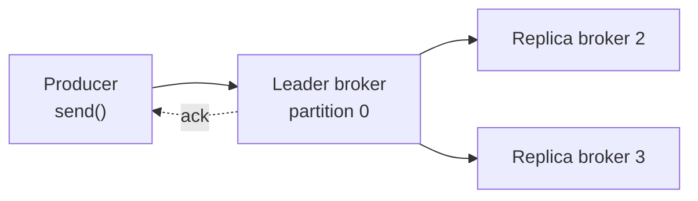

# Acks: Ba Mức Cam Kết Ghi Dữ Liệu Và Cái Giá Của Mất Dữ Liệu

Producer gọi `send()` xong, khi nào mới được coi là thành công? Câu trả lời nằm ở một config duy nhất: `acks`. Hiểu sai config này, bạn sẽ mất dữ liệu mà không hiểu vì sao — hoặc ngược lại, làm hệ thống chậm đi mà không biết mình đang trả giá cho điều gì. Đây là config durability quan trọng nhất của Producer, phải nắm trước mọi tuning khác.

---

## 1. Vấn đề: Gửi Thành Công Nghĩa Là Gì Trong Hệ Phân Tán?

Hãy hình dung luồng ghi của Wikimedia producer vào topic 3 partitions, replication factor 3:



Producer chỉ nói chuyện với leader. Còn việc leader đã replicate sang các replica khác chưa, producer không tự thấy được — nó chỉ biết qua gói ack trả về. Và `acks` chính là núm vặn quyết định leader phải làm tới mức nào mới được trả lời "ok".

Ba nấc, ba triết lý đánh đổi durability lấy latency:

| `acks` | Leader trả ack khi nào | Độ an toàn | Độ trễ |
|---|---|---|---|
| `0` | Gửi đi là coi như xong, không chờ gì | Thấp nhất, mất dữ liệu lặng lẽ | Thấp nhất |
| `1` | Leader ghi vào log local xong | Trung bình, mất nếu leader chết trước khi replicate | Trung bình |
| `all` (`-1`) | Mọi in-sync replica đều ghi xong | Cao nhất | Cao nhất |

## 2. Cơ Chế: Mổ Từng Mức Acks

### 2.1. `acks=0`: Bắn rồi quên

Producer coi message thành công ngay khoảnh khắc gói tin rời khỏi socket, không cần broker xác nhận gì cả. Leader có crash, disk có lỗi, message có rơi — producer không bao giờ biết.

- Ưu điểm duy nhất: throughput cao nhất, overhead network tối thiểu vì bỏ hẳn vòng ack.
- Nhược điểm: mất dữ liệu trong im lặng, không retry được vì không biết lỗi.
- Dùng khi nào: chỉ khi mất vài message không sao — ví dụ metric, log sampling, tracking phụ. Ngay cả thế, nhiều team vẫn tránh `acks=0` vì debug rất khó.

### 2.2. `acks=1`: Leader ghi xong là đủ

Producer chờ leader xác nhận đã ghi vào log của nó. Replication sang follower diễn ra ngầm sau đó, producer không chờ.

Kịch bản mất dữ liệu kinh điển:

1. Producer gửi, leader ghi xong, trả ack.
2. Producer tưởng thành công, đi tiếp.
3. Leader crash ngay sau đó, trước khi kịp replicate sang follower.
4. Follower lên làm leader mới — message kia bốc hơi vĩnh viễn.

Đây từng là default của Kafka 1.0 tới 2.8. Nó là điểm cân bằng "tạm ổn" ngày xưa, nhưng với yêu cầu durability hiện nay thì không còn đủ cho dữ liệu quan trọng.

### 2.3. `acks=all` (`-1`): Mọi in-sync replica đều phải có dữ liệu

Đây là mức đảm bảo cao nhất. Producer chỉ nhận ack khi leader và toàn bộ replica đang in-sync (ISR) đều đã ghi.

Ví dụ cluster 3 broker, replication factor 3, partition 0 do broker 101 làm leader:

1. Producer gửi tới leader 101.
2. Leader forward sang replica 102 và 103.
3. Cả hai replica ghi xong, ack về leader.
4. Leader tổng hợp rồi mới ack về producer.

Giá phải trả là latency cao hơn (thêm một vòng network leader → replica) và availability phụ thuộc vào số replica sống. Bù lại, chỉ cần còn đủ ISR thì dữ liệu không mất kể cả khi leader chết ngay sau ack.

> `all` và `-1` là cùng một giá trị. Trong log bạn sẽ thấy `acks = -1`, trong code nên viết `"all"` cho dễ đọc.

## 3. Config Chi Tiết: `acks` Không Đi Một Mình

### 3.1. `acks`

- **Ý nghĩa:** mức xác nhận ghi mà producer yêu cầu.
- **Giá trị:** `0` | `1` | `all` (`-1`). Default: `1` ở client 1.0–2.8, `all` từ client 3.0 trở đi.
- **Khi nào dùng:** dữ liệu quan trọng (đơn hàng, edit Wikimedia cần phân tích chính xác) luôn `all`. Metric phụ, log sampling mới cân nhắc `0`. Hầu như không còn lý do dùng `1` cho code mới.

### 3.2. `min.insync.replicas` (config phía broker/topic, không phải producer)

- **Ý nghĩa:** số replica in-sync tối thiểu phải có thì leader mới được chấp nhận write với `acks=all`. Là "ngưỡng an toàn" của phía server.
- **Giá trị mẫu:** default `1` (chỉ cần leader sống là ghi được — thực chất không khác `acks=1` là mấy). Production khuyến nghị `2` đi với `replication.factor=3`.
- **Khi nào dùng:** luôn set ở mức topic hoặc broker khi đã chọn `acks=all`. Ví dụ `min.insync.replicas=2` nghĩa là leader + ít nhất 1 follower phải ack. Nếu chỉ còn mình leader sống, broker thà trả lỗi `NotEnoughReplicasException` để producer retry, còn hơn nhận ghi rồi mất.

### 3.3. Công thức availability: chịu được mấy broker chết?

Với `acks=all`, replication factor `N`, `min.insync.replicas=M`:

```text
Số broker được phép down mà topic vẫn ghi được = N - M
```

| Cấu hình | Chịu được | Nhận xét |
|---|---|---|
| RF=3, M=1 | 2 broker down | Ghi được nhiều nhất, nhưng còn 1 replica thì durability yếu |
| RF=3, M=2 | 1 broker down | **Combo phổ biến nhất:** vừa bền vừa còn HA |
| RF=3, M=3 | 0 broker down | Một broker hắt hơi là topic ngừng ghi — sai thiết kế Kafka |

Ví dụ M=2, RF=3 mà broker 102 và 103 cùng down: producer gửi tới leader 101, leader thấy chỉ còn 1 ISR trong khi yêu cầu 2, bèn từ chối và ném exception. Producer (có `retries`) sẽ thử lại sau — thà chậm còn hơn mất.

Với `acks=0` hoặc `acks=1`, chỉ cần còn 1 ISR (chính leader) là ghi được — availability cao nhất nhưng durability thấp nhất.

## 4. Code Ví Dụ

```java
import org.apache.kafka.clients.producer.ProducerConfig;
import java.util.Properties;

Properties props = new Properties();
props.setProperty(ProducerConfig.BOOTSTRAP_SERVERS_CONFIG, "127.0.0.1:9092");
props.setProperty(ProducerConfig.KEY_SERIALIZER_CLASS_CONFIG,
        "org.apache.kafka.common.serialization.StringSerializer");
props.setProperty(ProducerConfig.VALUE_SERIALIZER_CLASS_CONFIG,
        "org.apache.kafka.common.serialization.StringSerializer");

// Durability: mức cao nhất, dùng cho dữ liệu quan trọng
props.setProperty(ProducerConfig.ACKS_CONFIG, "all"); // tương đương "-1"
```

Kiểm tra phía server cho topic lab (local 1 broker nên M phải là 1):

```bash
# Xem replication và ISR hiện tại
kafka-topics.sh --bootstrap-server localhost:9092 --describe --topic wikimedia.recentchange

# Ví dụ production: tạo topic RF=3, min ISR=2
kafka-topics.sh --bootstrap-server localhost:9092 --create --topic orders \
  --partitions 6 --replication-factor 3 \
  --config min.insync.replicas=2
```

> Trên local 1 broker, đừng set `min.insync.replicas=2` — mọi write `acks=all` sẽ thất bại vì không bao giờ đủ 2 ISR. Đây là lỗi phổ biến nhất khi bê preset production về local.

## 5. Safe / High-Throughput Preset Liên Quan

Bài này chốt dòng đầu tiên của preset Safe (chi tiết đầy đủ ở bài 070):

```java
// SAFE baseline - dòng 1/6:
props.setProperty(ProducerConfig.ACKS_CONFIG, "all");

// Đi kèm phía broker/topic (production):
// replication.factor=3, min.insync.replicas=2
// Local 1 broker: replication.factor=1, min.insync.replicas=1
```

Chưa đụng tới throughput. `acks=all` tăng latency một chút so với `acks=1` — phần tăng tốc (compression, batching) ở bài 072–074 sẽ bù lại mà không hy sinh durability này.

## 6. Cạm Bẫy Thường Gặp

- **Tưởng `acks=all` nghĩa là mọi replica trên cluster.** Sai. Chỉ là mọi replica **in-sync** của partition đó. Replica đang lag quá xa bị đá khỏi ISR thì không tính — đó là lý do cần monitor ISR shrink.
- **Set `acks=all` mà quên `min.insync.replicas`.** Default M=1 khiến `acks=all` nearly vô nghĩa khi chỉ còn leader: vẫn ack dù không còn bản copy nào khác. Combo đúng luôn là cặp đôi.
- **Nhầm `all` với `-1` là hai chế độ khác nhau.** Chúng là một. Log in `-1`, code viết `"all"` — đừng set hai lần rồi tưởng có hai lớp bảo vệ.
- **Đòi `acks=0` cho nhanh rồi bất ngờ khi mất log.** `acks=0` không retry được (không biết lỗi mà retry). Mất là mất lặng lẽ, không metric, không alert.
- **Giữ `acks=1` vì "trước giờ vẫn chạy".** Đó là default cũ (1.0–2.8), không phải best practice hiện tại. Client 3.0+ đã chuyển default sang `all` — hãy theo.
- **Bê `min.insync.replicas=2` về local 1 broker.** Producer fail 100% request với `NotEnoughReplicasException`. Local luôn M=1.
- **Hiểu nhầm availability:** `acks=all` + M=2 + RF=3 mà chết 2 broker thì topic **ngừng ghi** (fail fast) — đó là chủ ý để bảo vệ dữ liệu, không phải bug. Muốn ghi tiếp thì chấp nhận hạ M, và chấp nhận rủi ro.

## Kết Luận

Tóm lại một câu: **`acks` quyết định producer chờ tới đâu (`0` không chờ, `1` chờ leader, `all` chờ mọi ISR), và `acks=all` chỉ thực sự an toàn khi đi cùng `min.insync.replicas=2` trên `replication.factor=3` — combo chuẩn của mọi pipeline không được phép mất dữ liệu.**

Bài tiếp theo chúng ta xử lý nửa còn lại của durability: khi broker trả lỗi tạm thời (leader đang chuyển, replica chưa đủ...), producer tự thử lại ra sao — qua `retries`, `retry.backoff.ms` và `delivery.timeout.ms`.
