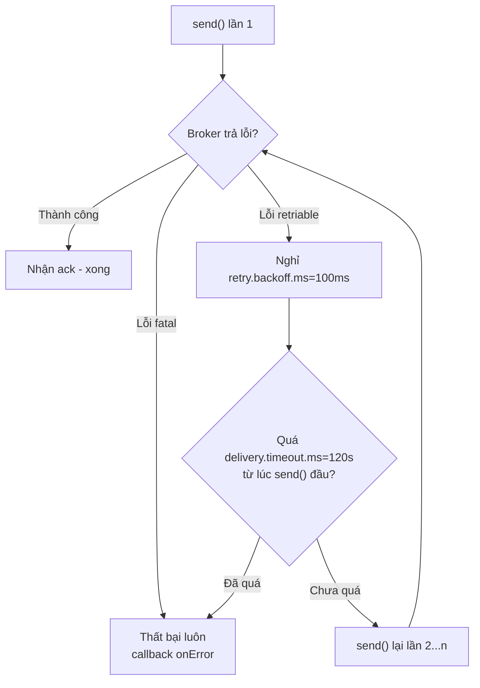

# Producer Retries: Thất Bại Tạm Thời Thì Thử Lại Ra Sao Mà Không Mất Dữ Liệu?

Bài trước chốt `acks=all` để không mất dữ liệu khi broker trả ack. Nhưng nếu broker trả *lỗi* thì sao? Leader đang chuyển, replica chưa đủ (`NotEnoughReplicasException`), network chập chờn — rất nhiều lỗi chỉ tồn tại vài trăm mili-giây. Không retry là mất dữ liệu oan. Retry bừa thì treo hoặc lộn thứ tự. Bài này giải quyết đúng bài toán đó.

---

## 1. Vấn đề: Lỗi Nào Đáng Retry, Lỗi Nào Nên Thất Bại Luôn?

Khi `producer.send()` thất bại, Kafka chia lỗi làm hai loại:

| Loại | Ví dụ | Ứng xử đúng |
|---|---|---|
| **Retriable (tạm thời)** | `NotEnoughReplicasException`, `LeaderNotAvailable`, `NetworkException` | Tự thử lại sau một khoảng nghỉ — lần sau có thể thành công |
| **Non-retriable (vĩnh viễn)** | `SerializationException`, `RecordTooLargeException`, `AuthorizationException` | Thất bại luôn, gọi callback lỗi — retry 100 lần cũng vậy |

Nếu developer phải tự `try/catch` + `while retry` cho mọi `send()` như code thô dưới đây, pipeline nào cũng đầy bug:

```java
// ĐỪNG làm thế này - code retry tay vừa rối vừa sai ordering
try {
    producer.send(record).get();
} catch (Exception e) {
    Thread.sleep(100);
    producer.send(record).get(); // retry tay: block, mất async, dễ duplicate
}
```

Producer của Kafka đã tích hợp sẵn cơ chế retry async. Việc của bạn chỉ là hiểu ba núm vặn: thử lại bao nhiêu lần, nghỉ bao lâu giữa các lần, và giới hạn tổng thời gian là bao nhiêu.

## 2. Cơ Chế: Vòng Đời Của Một Record Khi Gặp Lỗi Retriable



Điểm mấu chốt:

1. **Retry là async và trong suốt.** Thread gọi `send()` không block. Record lỗi nằm lại trong buffer, tới lượt sẽ gửi lại.
2. **Từ Kafka 2.1, trần retry không còn là số lần mà là thời gian.** `delivery.timeout.ms=120000` (2 phút) bao trùm toàn bộ: gửi lần đầu, mọi lần retry, mọi khoảng nghỉ. Hết 2 phút chưa ack thì record thất bại, dù `retries` còn dư.
3. **Trước Kafka 2.0, `retries` default = 0.** Nghĩa là lỗi retriable cũng mất luôn nếu bạn không set tay. Từ client 2.1+, `retries` default là `Integer.MAX_VALUE` (gần như vô hạn) và `delivery.timeout.ms` làm người gác cổng. Đây là lý do version client quan trọng tới vậy.

### 2.1. Sơ đồ timeout bao trùm (rất hay bị hiểu sai)

Nhiều người tưởng có nhiều timeout độc lập: `request.timeout.ms`, `retry.backoff.ms`, `linger.ms`... Thực tế từ Kafka 2.1:

```text
|---- send() ---- retry 1 ---- backoff ---- retry 2 ---- backoff ---- ... ----|
|<---------------------- delivery.timeout.ms = 120s ------------------------->|
    Tất cả phải xong trong 120s, nếu không record bị đánh fail.
```

Đừng cố nhớ từng timeout con. Chỉ nhớ một câu: **`delivery.timeout.ms` là deadline tối thượng từ lúc `send()` tới lúc nhận ack.**

## 3. Config Chi Tiết: Bốn Cái Tên Phải Thuộc

### 3.1. `retries`

- **Ý nghĩa:** số lần thử lại tối đa cho lỗi retriable.
- **Giá trị mẫu:** `0` ở client ≤ 2.0 (nguy hiểm); `2147483647` (`Integer.MAX_VALUE`) ở client ≥ 2.1 và khi bật idempotence.
- **Khi nào dùng:** luôn để `MAX_VALUE` cho dữ liệu quan trọng. Trần thực tế do `delivery.timeout.ms` quyết định, nên số lớn không có nghĩa là treo vô hạn.

```java
props.setProperty(ProducerConfig.RETRIES_CONFIG, Integer.toString(Integer.MAX_VALUE));
```

### 3.2. `retry.backoff.ms`

- **Ý nghĩa:** thời gian nghỉ giữa hai lần retry liên tiếp.
- **Giá trị mẫu:** `100` (ms) — default hợp lý cho hầu hết workload.
- **Khi nào dùng:** giữ default. Tăng lên (ví dụ 300–1000ms) nếu broker đang quá tải và bạn muốn giảm áp lực retry dồn dập; giảm xuống chỉ khi đã đo latency retry là bottleneck — hiếm.

### 3.3. `delivery.timeout.ms`

- **Ý nghĩa:** deadline tổng từ lúc `send()` tới lúc phải nhận ack, bao gồm mọi retry và backoff. Hết deadline → record fail, callback nhận `TimeoutException`.
- **Giá trị mẫu:** `120000` (2 phút).
- **Khi nào dùng:** giữ 120s cho pipeline chuẩn. Giảm (ví dụ 30s) nếu bạn muốn fail fast để chuyển sang dead-letter queue sớm; tăng nếu network xuyên region chậm và retry cần nhiều thời gian hơn.

### 3.4. `max.in.flight.requests.per.connection`

- **Ý nghĩa:** số batch được phép "đang bay" (đã gửi chưa ack) trên mỗi connection tới broker. Giá trị càng cao, throughput càng tốt vì pipeline không phải chờ.
- **Giá trị mẫu:** `5` (default hiện đại).
- **Khi nào dùng — và cái bẫy ordering:** ở client cũ (chưa có idempotence), retry + `max.in.flight > 1` gây **lộn thứ tự**. Ví dụ batch 1 lỗi đang retry, batch 2 thành công trước → message sau lại commit trước message trước. Fix thời đó là hạ về `1` (đánh đổi throughput). Từ Kafka 1.0+ với `enable.idempotence=true`, giữ `5` vẫn đảm bảo ordering — chi tiết ở bài 069.

```text
Client cũ, retries + max.in.flight=5, chưa idempotence:
Batch1 (msg 1,2) lỗi -> đang retry ... Batch2 (msg 3,4) thành công trước
=> Kafka commit 3,4 trước 1,2 => LỘN THỨ TỰ nếu dùng key ordering.

Fix cũ: max.in.flight=1 (chậm). Fix mới: enable.idempotence=true (nhanh + đúng).
```

## 4. Code Ví Dụ: Retry Đúng Chuẩn Cho Wikimedia Producer

```java
import org.apache.kafka.clients.producer.ProducerConfig;
import java.util.Properties;

Properties props = new Properties();
props.setProperty(ProducerConfig.BOOTSTRAP_SERVERS_CONFIG, "127.0.0.1:9092");
props.setProperty(ProducerConfig.KEY_SERIALIZER_CLASS_CONFIG,
        "org.apache.kafka.common.serialization.StringSerializer");
props.setProperty(ProducerConfig.VALUE_SERIALIZER_CLASS_CONFIG,
        "org.apache.kafka.common.serialization.StringSerializer");

// Durability từ bài 067
props.setProperty(ProducerConfig.ACKS_CONFIG, "all");

// Retry: cho thử lại tới khi hết deadline 2 phút
props.setProperty(ProducerConfig.RETRIES_CONFIG, Integer.toString(Integer.MAX_VALUE));
props.setProperty(ProducerConfig.RETRY_BACKOFF_MS_CONFIG, "100");
props.setProperty(ProducerConfig.DELIVERY_TIMEOUT_MS_CONFIG, "120000");

// Giữ pipeline đầy mà vẫn đúng thứ tự (nhờ idempotence ở bài sau)
props.setProperty(ProducerConfig.MAX_IN_FLIGHT_REQUESTS_PER_CONNECTION, "5");
```

Test nhanh trên local: dựng 1 broker, set topic `min.insync.replicas=1`, kill broker vài giây rồi bật lại trong lúc producer chạy. Với config trên, producer tự retry và không mất record nào (kiểm chứng bằng đếm record trước/sau). Với `retries=0`, số record hụt đúng bằng số gửi trong lúc broker chết.

## 5. Safe / High-Throughput Preset Liên Quan

Bài này chốt dòng 2–4 của preset Safe:

```java
// SAFE preset (điền tiếp sau bài 067):
props.setProperty(ProducerConfig.ACKS_CONFIG, "all");                                    // bài 067
props.setProperty(ProducerConfig.RETRIES_CONFIG, Integer.toString(Integer.MAX_VALUE)); // bài này
props.setProperty(ProducerConfig.DELIVERY_TIMEOUT_MS_CONFIG, "120000");                // bài này
props.setProperty(ProducerConfig.MAX_IN_FLIGHT_REQUESTS_PER_CONNECTION, "5");         // bài này
// Còn thiếu: enable.idempotence=true -> bài 069
```

Chưa đụng throughput. Retry nhiều hơn không làm nhanh hơn — nó chỉ làm *bền* hơn. Phần tăng tốc ở bài 072–074.

## 6. Cạm Bẫy Thường Gặp

- **Dùng client cũ mà tưởng retry default đã lớn.** Client ≤ 2.0: `retries=0`. Lỗi retriable nhỏ cũng mất dữ liệu. Luôn check version client trước khi tin default.
- **Set `retries` lớn mà không hiểu `delivery.timeout.ms`.** Tưởng retry vô hạn là treo vô hạn. Thực tế deadline 120s sẽ fail record — hãy xử lý fail trong callback (log, DLQ), đừng tưởng retry là bảo hiểm tuyệt đối.
- **Hạ `max.in.flight` về 1 "cho chắc" trên client mới.** Lỗi thời. Với idempotence, `5` vừa nhanh vừa giữ ordering. Hạ về 1 là tự bóp throughput 5 lần không cần thiết.
- **Retry lỗi non-retriable.** `RecordTooLargeException` retry 1000 lần vẫn fail, chỉ tốn tài nguyên và che lấp bug config. Hãy phân biệt hai loại lỗi trong callback và alert riêng.
- **Để `delivery.timeout.ms` quá ngắn trên network chậm.** Xuyên region latency cao + `acks=all` + retry → 30s có thể không đủ, record fail oan hàng loạt. Đo p99 latency trước khi hạ deadline.
- **Quên callback lỗi nên retry fail trong im lặng.** `send(record)` không callback thì record hết deadline rớt đi mà log không có gì. Production luôn dùng `send(record, callback)` để đếm và xử lý fail.

## Kết Luận

Tóm lại một câu: **lỗi tạm thời thì producer tự retry theo `retries` + `retry.backoff.ms`, nhưng tất cả bị chặn bởi deadline `delivery.timeout.ms=120s`, và muốn retry nhiều mà không lộn thứ tự thì phải có idempotence.**

Bài tiếp theo chúng ta giải quyết hệ quả của retry: gửi lại thì broker commit trùng thì sao — qua `enable.idempotence`, cơ chế producer ID + sequence number giúp Kafka nhận diện và loại bỏ duplicate.
