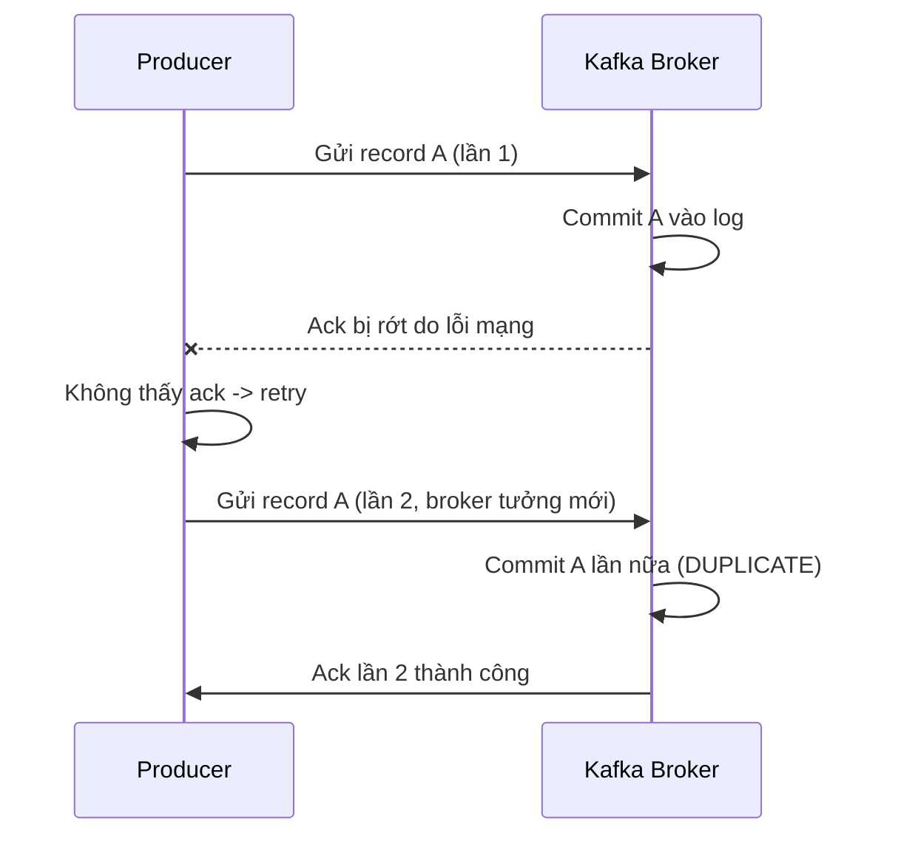
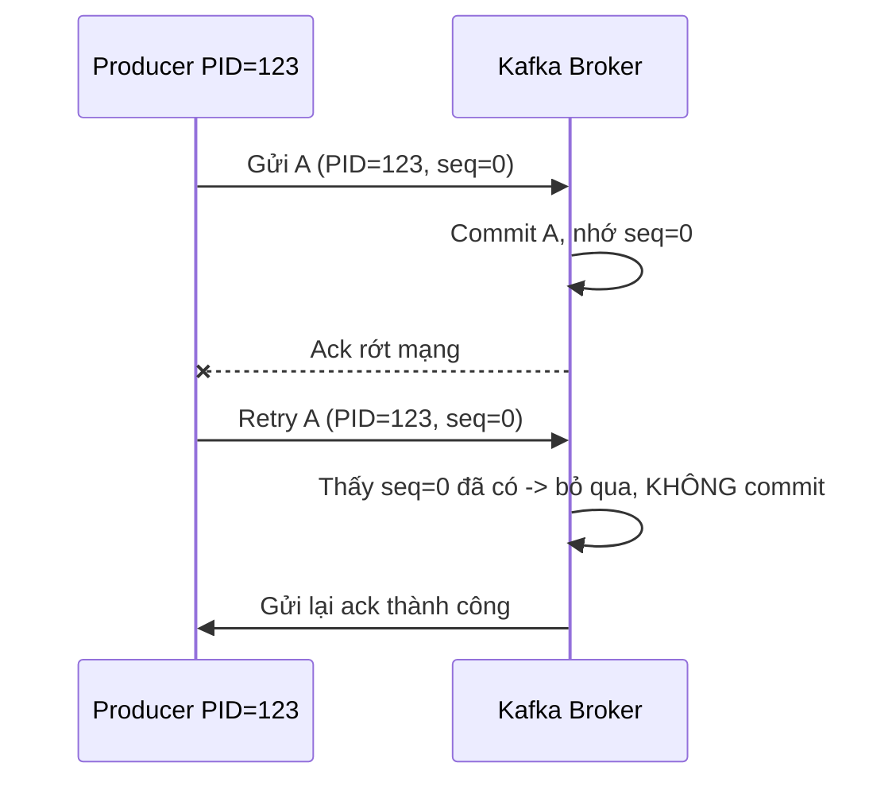

# Idempotent Producer: Retry Bao Nhiêu Lần Cũng Không Trùng, Không Lộn Thứ Tự

Bài trước cho producer retry thoải mái. Nhưng retry sinh ra hai con quái: duplicate (gửi lại thì broker commit hai lần) và reorder (batch sau về đích trước batch đang retry). Bài này diệt cả hai bằng một config duy nhất: `enable.idempotence=true`. Đây là mảnh ghép cuối cùng của durability.

---

## 1. Vấn đề: Vì Sao Retry Lại Đẻ Ra Duplicate?

Kịch bản kinh điển với network chập chờn:



Từ góc nhìn producer: chỉ một request thành công. Từ góc nhìn Kafka: hai message giống hệt nhau nằm trong log. Consumer đọc lên thấy hai event Wikimedia trùng nhau — phân tích sai, đếm sai, tiền sai nếu là đơn hàng.

Trước Kafka 0.11, đây là bài toán không có lời giải ở tầng producer. Developer phải tự chống trùng ở consumer (dedup bằng ID) — tốn kém và dễ sót.

## 2. Cơ Chế: Producer ID + Sequence Number

Idempotent producer giải quyết bằng cách đánh số từng record, để broker nhận diện request gửi lại.

Khi bật `enable.idempotence=true`, broker cấp cho mỗi producer một **Producer ID (PID)** duy nhất, và producer đánh **sequence number** tăng dần cho từng record trên từng partition (0, 1, 2...).



Ba hệ quả:

1. **Hết duplicate:** cùng PID + cùng sequence mà tới lần hai thì broker biết là retry, chỉ trả ack chứ không ghi thêm.
2. **Giữ ordering ngay cả khi retry + `max.in.flight=5`:** broker từ chối sequence tới sai thứ tự, buộc producer gửi lại đúng thứ tự. Đây là đề tài KIP-5494 — từ Kafka 1.0, giữ `max.in.flight=5` vẫn đúng thứ tự khi đã idempotent.
3. **Phạm vi đảm bảo:** exactly-once *trên một partition, trong một session producer*. Restart producer (PID mới) hoặc gửi cross-partition thì không đảm bảo. Muốn exactly-once end-to-end (Kafka → Kafka) phải dùng transactions — ra ngoài phạm vi section này.

## 3. Config Chi Tiết: Một Config Bật, Ba Config Ăn Theo

### 3.1. `enable.idempotence`

- **Ý nghĩa:** bật chế độ producer幂等 — mỗi record có PID + sequence, broker dedup request retry.
- **Giá trị mẫu:** `true` (khuyến nghị mọi pipeline quan trọng). Default: `false` ở client < 3.0, `true` từ client 3.0.
- **Khi nào dùng:** luôn bật, trừ khi bạn đo được overhead không chấp nhận được (hiếm) hoặc broker quá cũ (< 0.11, không hỗ trợ).

### 3.2. Ba config bị ép khi bật idempotence

Kafka tự ép (override cả giá trị bạn set sai) để idempotence có ý nghĩa:

| Config | Bị ép về | Vì sao |
|---|---|---|
| `acks` | `all` | Không chờ đủ ISR thì dedup vô nghĩa khi leader đổi |
| `retries` | `Integer.MAX_VALUE` | Idempotence sinh ra để retry an toàn — tắt retry là phản chủ |
| `max.in.flight.requests.per.connection` | `5` (Kafka ≥ 1.0) hoặc `1` (Kafka 0.11) | 5 là mức tối đa vẫn giữ ordering được nhờ sequence |

Thực tế trong log khởi động client 3.x bạn sẽ thấy cả ba giá trị này xuất hiện cùng nhau — đó là dấu hiệu idempotence đang hoạt động.

### 3.3. Điều kiện tiên quyết

- Broker ≥ 0.11 (idempotence mới tồn tại). Production hiện nay toàn 2.x–3.x nên coi như luôn đủ.
- `max.in.flight ≤ 5`. Set 6 trở lên producer sẽ ném `ConfigException` khi idempotence bật — đây là guardrail có chủ ý.

## 4. Code Ví Dụ: Bật Idempotence Cho Wikimedia Producer

```java
import org.apache.kafka.clients.producer.ProducerConfig;
import java.util.Properties;

Properties props = new Properties();
props.setProperty(ProducerConfig.BOOTSTRAP_SERVERS_CONFIG, "127.0.0.1:9092");
props.setProperty(ProducerConfig.KEY_SERIALIZER_CLASS_CONFIG,
        "org.apache.kafka.common.serialization.StringSerializer");
props.setProperty(ProducerConfig.VALUE_SERIALIZER_CLASS_CONFIG,
        "org.apache.kafka.common.serialization.StringSerializer");

// Mảnh ghép durability cuối cùng: bật là tự có acks=all + retries=MAX + ordering
props.setProperty(ProducerConfig.ENABLE_IDEMPOTENCE_CONFIG, "true");
```

Trên client ≥ 3.0 dòng này là tùy chọn (đã default `true`), nhưng **hãy viết tường minh**. Lý do: người đọc code biết ngay pipeline này yêu cầu no-duplicate; người chạy client cũ được bảo vệ; diff config giữa các môi trường rõ ràng.

Kiểm chứng nhanh: bật idempotence, kill broker vài giây giữa lúc producer chạy, đếm record + check trùng bằng consumer. Không idempotence: có duplicate sau mỗi lần retry qua network lỗi. Có idempotence: số lượng khớp, không trùng.

## 5. Safe / High-Throughput Preset Liên Quan

Bài này hoàn thiện preset Safe (full ở bài 070, áp code ở bài 071):

```java
// SAFE preset - đã đủ 5 dòng sau bài này:
props.setProperty(ProducerConfig.ACKS_CONFIG, "all");                                    // 067
props.setProperty(ProducerConfig.RETRIES_CONFIG, Integer.toString(Integer.MAX_VALUE)); // 068
props.setProperty(ProducerConfig.DELIVERY_TIMEOUT_MS_CONFIG, "120000");                // 068
props.setProperty(ProducerConfig.MAX_IN_FLIGHT_REQUESTS_PER_CONNECTION, "5");         // 068
props.setProperty(ProducerConfig.ENABLE_IDEMPOTENCE_CONFIG, "true");                   // bài này
// Phía broker/topic (production): replication.factor=3, min.insync.replicas=2
```

Từ đây, mọi tuning throughput (072–074) đều phải giữ nguyên 5 dòng này — tăng tốc mà phá idempotence là quay về thời duplicate.

## 6. Cạm Bẫy Thường Gặp

- **Tưởng idempotence là exactly-once toàn pipeline.** Không phải. Nó chỉ chống duplicate do *retry* trong một session producer, một partition. Consumer crash rồi đọc lại từ offset cũ vẫn thấy lại message — đó là at-least-once ở tầng consumer, phải xử lý bằng commit offset + dedup nghiệp vụ.
- **Restart producer rồi tưởng sequence còn tiếp tục.** PID mới = sequence đếm lại từ 0. Record đang bay lúc crash có thể duplicate sau restart. Muốn qua restart vẫn exactly-once phải dùng `transactional.id` + transactions.
- **Set `max.in.flight > 5` kèm idempotence.** Producer từ chối khởi động. Muốn tăng parallel thì tăng số partition + số producer instance, không vặn con số này.
- **Bật idempotence trên broker < 0.11.** Client báo lỗi unsupported. Nâng broker trước, hoặc chấp nhận hạ `max.in.flight=1` + dedup tay ở consumer như thời cổ.
- **Dùng key ordering mà không bật idempotence.** Mọi đảm bảo "cùng key về cùng partition theo thứ tự" tan vỡ ngay lần retry đầu tiên có `max.in.flight > 1`. Cứ key ordering là phải idempotence — không ngoại lệ.
- **Quên rằng idempotence không bảo vệ khỏi bug code.** Gọi `send()` hai lần trong code (không phải retry) thì là hai record khác sequence — broker commit cả hai đúng luật. Chống duplicate nghiệp vụ (user double-click) vẫn cần key + dedup ở consumer/service.

## Kết Luận

Tóm lại một câu: **`enable.idempotence=true` gắn PID + sequence number vào từng record để broker loại bỏ request retry trùng lặp và giữ đúng thứ tự với `max.in.flight=5` — mảnh ghép cuối biến retry từ con dao hai lưỡi thành bảo hiểm an toàn.**

Bài tiếp theo chúng ta gom cả bốn bài durability (067–069) thành một preset Safe duy nhất, dạng bảng tra cứu: Kafka 3.0 default đã safe ra sao, Kafka ≤ 2.8 phải set tay những gì.
