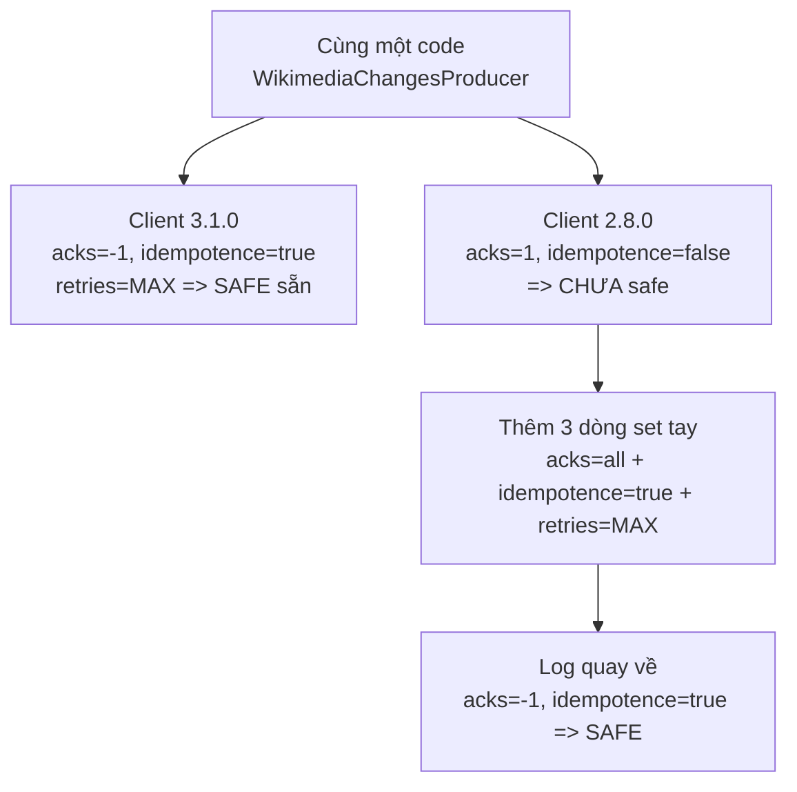

# Áp Safe Preset Vào Wikimedia Producer: Nhìn Log Để Tin, Đừng Tin Mặc Định

Bài 070 đã chốt preset Safe trên giấy. Bài này áp nó vào code Wikimedia thật: thêm ba dòng, chạy lại, đọc log xác nhận từng giá trị đổi. Mục tiêu không phải học config mới, mà là rèn thói quen của senior: mọi preset chỉ có giá trị khi log effective xác nhận nó đã vào.

---

## 1. Vấn đề: Default Safe Của Client 3.x Có Đủ Để Tin?

Project Wikimedia đang dùng `kafka-clients:3.1.0`. Mở log khởi động bạn sẽ thấy:

```text
acks = -1
enable.idempotence = true
retries = 2147483647
max.in.flight.requests.per.connection = 5
delivery.timeout.ms = 120000
```

Nhìn qua tưởng đã safe sẵn, khỏi làm gì. Nhưng có ba rủi ro:

1. Ngày mai ai đó hạ client về `2.8.0` (vì dependency chung công ty), default lật về `acks=1`, `enable.idempotence=false` mà code không báo gì.
2. Người đọc code không biết pipeline này yêu cầu durability — tưởng default ngẫu nhiên.
3. Môi trường khác (staging, prod) dùng client khác, hành vi khác.

Vì vậy nguyên tắc: **dù default đã đúng, vẫn set tường minh ba dòng safe trong code.** Giá phải trả là ba dòng lặp lại; lợi ích là pipeline tự bảo vệ khỏi mọi thay đổi version vô tình.

## 2. Cơ chế: Chuyện Gì Xảy Ra Khi Đổi Version Client?

Thí nghiệm trong bài gốc làm đúng một việc: giữ nguyên code, chỉ đổi version `kafka-clients` trong `build.gradle` từ `3.1.0` xuống `2.8.0`, sync Gradle, chạy lại và đọc log.



Kết quả chứng minh hai điều:

- Default nằm ở **client**, không nằm ở broker. Broker 3.x không cứu được client 2.8.
- Ba dòng set tay có tác dụng thật: log sau khi thêm hiện `acks = -1`, `enable.idempotence = true`, `retries = 2147483647` dù client vẫn là 2.8.

Còn một config không thấy trong log producer: `min.insync.replicas`. Vì đó là config **phía broker/topic**, muốn kiểm tra phải vào Conduktor UI: Brokers → chọn broker → Configuration → tìm `min.insync.replicas`. Trên local 1 broker, giá trị là `1`. Đừng đổi lên 2 — mọi write `acks=all` sẽ fail vì không bao giờ đủ 2 ISR.

## 3. Config chi tiết: Ba dòng phải thêm và vì sao từng dòng

### 3.1. `enable.idempotence`

- **Ý nghĩa:** bật PID + sequence number để broker dedup retry và giữ ordering. Đã mổ ở bài 069.
- **Giá trị mẫu:** `true`.
- **Khi nào dùng:** luôn set tường minh trong mọi producer quan trọng, kể cả khi client 3.x đã default `true`. Đây là dòng quan trọng nhất trong ba dòng vì nó tự ép `acks=all` + `retries=MAX` nếu bạn quên.

### 3.2. `acks`

- **Ý nghĩa:** mức ack yêu cầu: `all` mới coi là thành công. Đã mổ ở bài 067.
- **Giá trị mẫu:** `all` (log sẽ hiện `-1`, là một).
- **Khi nào dùng:** set tường minh để khóa durability, không phụ thuộc version. Viết `"all"` trong code cho dễ đọc thay vì `"-1"`.

### 3.3. `retries`

- **Ý nghĩa:** số lần retry lỗi retriable. Đã mổ ở bài 068.
- **Giá trị mẫu:** `Integer.MAX_VALUE` (log hiện `2147483647`).
- **Khi nào dùng:** set tường minh trên client cũ. Trên client mới có idempotence thì giá trị này đã đúng sẵn, nhưng viết ra để người sau không phải đoán.

### 3.4. Hai giá trị giữ nguyên không cần set (nhưng phải biết)

- **`max.in.flight.requests.per.connection = 5`:** đúng sẵn trên cả hai version khi đã idempotent. Không cần set tay trừ khi ai đó đã vặn sai trước đó.
- **`delivery.timeout.ms = 120000`:** default hợp lý, giữ nguyên cho lab này.

## 4. Code ví dụ: Thêm safe config vào WikimediaChangesProducer

### 4.1. Đổi version client để thấy vấn đề (thí nghiệm, làm một lần)

```groovy
// build.gradle - thử hạ để thấy default đổi (xong thì trả về 3.1.0)
dependencies {
    implementation 'org.apache.kafka:kafka-clients:2.8.0'
}
```

Sync Gradle (con voi Reload), chạy producer rồi Stop ngay — chỉ cần đọc log khởi động, không cần đợi data. Bạn sẽ thấy `acks = 1`, `enable.idempotence = false`.

### 4.2. Thêm khối safe vào code (giữ lại vĩnh viễn)

```java
import org.apache.kafka.clients.producer.KafkaProducer;
import org.apache.kafka.clients.producer.ProducerConfig;
import org.apache.kafka.common.serialization.StringSerializer;
import java.util.Properties;

Properties props = new Properties();
props.setProperty(ProducerConfig.BOOTSTRAP_SERVERS_CONFIG, "127.0.0.1:9092");
props.setProperty(ProducerConfig.KEY_SERIALIZER_CLASS_CONFIG, StringSerializer.class.getName());
props.setProperty(ProducerConfig.VALUE_SERIALIZER_CLASS_CONFIG, StringSerializer.class.getName());

// ===== SAFE producer configs - bắt buộc cho Kafka client <= 2.8,
// ===== vô hại (giữ nguyên) trên client >= 3.0
props.setProperty(ProducerConfig.ENABLE_IDEMPOTENCE_CONFIG, "true");
props.setProperty(ProducerConfig.ACKS_CONFIG, "all");
props.setProperty(ProducerConfig.RETRIES_CONFIG, Integer.toString(Integer.MAX_VALUE));
// max.in.flight=5 và delivery.timeout.ms=120000 giữ default là đủ

KafkaProducer<String, String> producer = new KafkaProducer<>(props);
```

Chạy lại trên client 2.8, log phải hiện:

```text
acks = -1
enable.idempotence = true
retries = 2147483647
delivery.timeout.ms = 120000
max.in.flight.requests.per.connection = 5
```

Đủ năm dòng là preset đã vào. Xong thí nghiệm thì nâng client về `3.1.0`, sync lại, chạy tiếp — code giữ nguyên, log vẫn đúng.

### 4.3. Kiểm tra phía broker trên Conduktor UI

```text
Conduktor -> Brokers -> broker-1 -> Configuration -> tìm min.insync.replicas
Local 1 broker: min.insync.replicas = 1 (đúng, không đổi)
Production 3 broker: min.insync.replicas = 2 (set ở mức topic)
```

```bash
# Đối chứng bằng CLI nếu thích
kafka-topics.sh --bootstrap-server localhost:9092 --describe --topic wikimedia.recentchange
```

## 5. Safe / High-throughput preset tóm tắt

Bài này chốt khối Safe trong code Wikimedia, giữ nguyên tới hết section:

```java
// SAFE - đã áp vào WikimediaChangesProducer từ bài này:
props.setProperty(ProducerConfig.ENABLE_IDEMPOTENCE_CONFIG, "true");
props.setProperty(ProducerConfig.ACKS_CONFIG, "all");
props.setProperty(ProducerConfig.RETRIES_CONFIG, Integer.toString(Integer.MAX_VALUE));
// + default: delivery.timeout.ms=120000, max.in.flight=5
// + broker local: RF=1, min.insync.replicas=1
// + broker prod:  RF=3, min.insync.replicas=2
```

Chưa có throughput. Mọi bài 072–074 chỉ được **thêm** config, không được xóa hay hạ ba dòng này.

## 6. Pitfalls thường gặp

- **Hạ client để test rồi quên nâng về.** Chạy 2.8 dài ngày với safe set tay thì vẫn ổn, nhưng mất các cải tiến khác của 3.x. Thí nghiệm xong phải trả version về.
- **Quên sync Gradle sau khi đổi version.** Code vẫn chạy bằng jar cũ trong cache, log không đổi, tưởng "đổi version không ảnh hưởng". Luôn Reload Gradle và nhìn dòng version trong log khởi động.
- **Set `retries` kiểu int thay vì String.** `props.setProperty` nhận String. Phải `Integer.toString(Integer.MAX_VALUE)`, truyền int trực tiếp là lỗi compile.
- **Viết `acks = -1` trong code.** Chạy đúng nhưng người sau khó đọc. Viết `"all"`, để log hiện `-1` là việc của client.
- **Đổi `min.insync.replicas` lên 2 trên local.** Producer fail 100% với `NotEnoughReplicasException`. Nhắc lại lần ba vì lỗi này cực phổ biến: M không bao giờ vượt số broker thực tế.
- **Tạo class/handler mới mà quên copy khối safe sang.** Project nhiều module, copy producer sang service khác hay rớt config. Giải pháp lâu dài: tách hàm `createSafeProducerProps()` dùng chung, hoặc dùng config management tập trung.

## Kết luận

Tóm lại một câu: **dù client 3.x đã safe sẵn, vẫn viết tường minh `enable.idempotence=true` + `acks=all` + `retries=MAX` vào code, rồi đọc log effective để xác nhận — đó là cách biến durability từ may mắn version thành cam kết code.**

Bài tiếp theo chúng ta đổi hướng từ bền sang nhanh: `compression.type` — một dòng config giảm kích thước request vài lần, cứu throughput cho mọi stream JSON text như Wikimedia, với chi phí chỉ là chút CPU.
