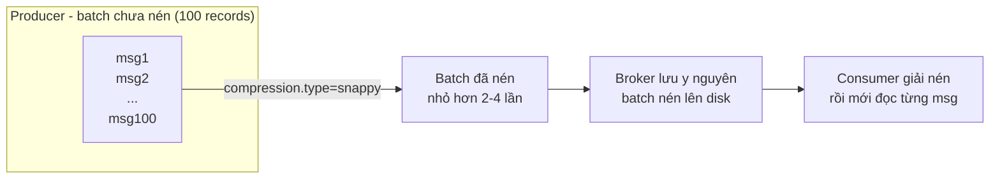

# Nén Message Ở Producer: Một Dòng Config Tăng Vài Lần Throughput

Producer đã safe (bài 070-071). Giờ tới lượt tăng tốc mà không phá độ safe đó. Vũ khí rẻ nhất, hiệu quả nhất cho mọi stream JSON text như Wikimedia: `compression.type`. Một dòng config, request nhỏ đi vài lần, disk đỡ tốn, throughput tăng — chi phí chỉ là chút CPU.

---

## 1. Vấn đề: JSON Text Vừa To Vừa Lặp, Gửi Trần Là Lãng Phí

Mỗi event Wikimedia là một JSON vài trăm byte tới vài KB, với các field lặp đi lặp lại (`server_name`, `type`, `user`, `bot`, `$schema`...). Gửi trần (`compression.type=none`) nghĩa là:

- Mỗi request qua network mang toàn bộ chữ lặp đó.
- Broker lưu y nguyên lên disk — disk đầy nhanh, retention ngắn lại.
- Throughput bị chặn bởi network và disk, không phải CPU.

Trong khi đó CPU của producer và consumer hiện nay gần như luôn dư. Đánh đổi chút CPU lấy vài lần băng thông là món hời nhất trong mọi tuning producer — đó là lý do senior nào cũng bật compression đầu tiên khi nhận stream text-based throughput cao.

## 2. Cơ chế: Nén Theo Batch, Không Nén Từng Message

Điểm mấu chốt hay bị hiểu sai: Kafka **không nén từng message, mà nén cả batch**.



Hệ quả trực tiếp:

1. **Batch càng to, nén càng tốt.** Thuật toán nén sống bằng dữ liệu lặp — 100 JSON giống cấu trúc nén tốt hơn 10 JSON rất nhiều. Đây là lý do compression đi cặp với `linger.ms` + `batch.size` (bài 073).
2. **Broker không cần giải nén.** Với default `compression.type=producer` ở phía broker, broker nhận batch nén là ghi thẳng lên disk, không tốn CPU. Consumer mới là bên giải nén khi đọc.
3. **Consumer không cần config gì thêm.** Dù producer bật `snappy`, `gzip` hay `lz4`, consumer tự nhận diện và giải nén trong suốt — đã kiểm chứng ở bài 074.

### 2.1. Nén ở producer vs nén ở broker: chọn bên nào?

| Chế độ (config phía broker/topic `compression.type`) | Chuyện gì xảy ra | Nhận xét |
|---|---|---|
| `producer` (default) | Broker giữ nguyên batch producer gửi, không đụng tới | **Khuyến nghị.** CPU nén nằm ở producer (scale ngang được), broker nhẹ |
| `none` | Broker giải nén mọi batch gửi tới rồi lưu trần | Tốn CPU vô ích, mất hết lợi ích — tránh |
| `gzip` / `snappy` / `lz4` / `zstd` cụ thể | Nếu trùng thuật toán producer → giữ nguyên; khác → broker giải nén rồi nén lại | Tốn CPU broker. Chỉ dùng khi không kiểm soát được producer mà vẫn muốn data trên disk được nén |

Nguyên tắc: **nén ở producer, để broker ở `producer`.** Chỉ bật nén phía broker khi có producer "hoang" không sửa được code.

## 3. Config chi tiết: Bốn Thuật Toán Và Khi Nào Dùng Cái Nào

### 3.1. `compression.type` (producer config)

- **Ý nghĩa:** thuật toán nén batch trước khi gửi.
- **Giá trị mẫu:** `none` (default) | `gzip` | `snappy` | `lz4` | `zstd` (từ Kafka 2.1).
- **Khi nào dùng:** mọi stream text-based (JSON, log, CSV) throughput cao đều nên bật. Dữ liệu đã nén sẵn (JPEG, protobuf nén, file zip) thì bật cũng vô ích — bỏ qua.

| Thuật toán | Tốc độ | Tỉ lệ nén | Khi nào chọn |
|---|---|---|---|
| `snappy` | Rất nhanh | Trung bình (~2-3x với JSON) | **Default khuyến nghị.** Cân bằng CPU/nén tốt nhất cho streaming |
| `lz4` | Nhanh nhất | Tương đương snappy | Thay snappy khi đã đo thấy nhanh hơn trên data của bạn |
| `gzip` | Chậm | Cao (~3-4x) | Network/disk cực đắt, CPU dư nhiều, chịu được latency nén |
| `zstd` | Khá nhanh | Cao nhất | Kafka ≥ 2.1, muốn nén tốt mà CPU vừa phải — đáng benchmark |
| `none` | — | Không nén | Dữ liệu đã nén sẵn, hoặc lab baseline |

> Bài lab Wikimedia chốt `snappy` — không phải vì nó luôn thắng, mà vì nó là điểm bắt đầu an toàn nhất. Production hãy benchmark 10 phút mỗi thuật toán trên data thật rồi mới chốt.

### 3.2. `compression.type` (broker/topic config) — đừng nhầm hai cái trùng tên

- **Ý nghĩa:** chính sách nén ở phía server, áp cho cả topic hoặc cả broker.
- **Giá trị mẫu:** `producer` (default — giữ nguyên).
- **Khi nào dùng:** để yên `producer` khi mọi producer đã tự nén. Chỉ set cụ thể (`lz4`...) khi muốn ép nén cho topic nhận từ producer không kiểm soát được, và chấp nhận broker tốn CPU.

## 4. Code ví dụ

```java
import org.apache.kafka.clients.producer.ProducerConfig;
import java.util.Properties;

Properties props = new Properties();
props.setProperty(ProducerConfig.BOOTSTRAP_SERVERS_CONFIG, "127.0.0.1:9092");
props.setProperty(ProducerConfig.KEY_SERIALIZER_CLASS_CONFIG,
        "org.apache.kafka.common.serialization.StringSerializer");
props.setProperty(ProducerConfig.VALUE_SERIALIZER_CLASS_CONFIG,
        "org.apache.kafka.common.serialization.StringSerializer");

// SAFE preset giữ nguyên (bài 070-071)
props.setProperty(ProducerConfig.ACKS_CONFIG, "all");
props.setProperty(ProducerConfig.ENABLE_IDEMPOTENCE_CONFIG, "true");
props.setProperty(ProducerConfig.RETRIES_CONFIG, Integer.toString(Integer.MAX_VALUE));

// THROUGHPUT - dòng 1/3: nén snappy cho JSON Wikimedia
props.setProperty(ProducerConfig.COMPRESSION_TYPE_CONFIG, "snappy");
```

Đối chứng phía broker rằng data vẫn đọc bình thường (không cần đổi gì ở consumer):

```bash
kafka-console-consumer.sh --bootstrap-server localhost:9092 --topic wikimedia.recentchange
```

Consumer in ra JSON nguyên vẹn dù producer đã nén — bằng chứng nén/giải nén trong suốt.

## 5. Safe / High-Throughput preset tóm tắt

```java
// SAFE (giữ nguyên từ bài 070-071):
// acks=all, enable.idempotence=true, retries=MAX,
// delivery.timeout.ms=120000, max.in.flight=5

// THROUGHPUT (bài này thêm dòng 1/3):
props.setProperty(ProducerConfig.COMPRESSION_TYPE_CONFIG, "snappy");
// Còn thiếu: linger.ms + batch.size -> bài 073-074
```

Thứ tự cố ý: bật nén trước, tăng batch sau — vì batch to làm nén tốt hơn nữa (hiệu ứng cộng hưởng ở bài sau).

## 6. Cạm bẫy thường gặp

- **Bật nén cho dữ liệu đã nén rồi.** Ảnh JPEG, video, file gzip bỏ vào Kafka mà bật `gzip` lần nữa: CPU tốn, size không giảm, đôi khi còn tăng. Đo trước trên data thật.
- **Chọn `gzip` vì "nén tốt nhất" mà không đo CPU.** Producer mobile/edge CPU yếu + `gzip` = latency gửi tăng vọt, throughput tụt. Nén mạnh nhất không phải lựa chọn tốt nhất.
- **Set nhầm `compression.type` ở broker thành `none`.** Mọi batch nén từ producer bị broker giải ra rồi lưu trần: tốn CPU broker mà mất hết lợi ích disk/network. Broker cứ để `producer`.
- **Kỳ vọng nén cứu được `RecordTooLargeException`.** Giới hạn `max.request.size` (default ~1MB) tính trên **dữ liệu chưa nén hay đã nén tùy version/config** — đừng trông chờ nén để nhét message khổng lồ. Message to thì chia nhỏ hoặc tăng limit, không phải bật nén.
- **Đo hiệu quả nén trên 10 message.** Batch nhỏ thì thuật toán nào cũng nén kém. Benchmark đúng: chạy ít nhất vài nghìn message với `linger.ms` + `batch.size` thực tế rồi so dung lượng topic và throughput.
- **Quên consumer cũng tốn CPU giải nén.** Hệ consumer yếu (container 0.5 CPU) + data nén `zstd` nặng + throughput cao = consumer lag. Nén là hợp đồng giữa producer và consumer — nâng một đầu phải kiểm tra đầu kia.

## Kết luận

Tóm lại một câu: **với stream JSON text như Wikimedia, `compression.type=snappy` ở producer (giữ broker ở `producer`) là tuning rẻ nhất — request nhỏ đi vài lần, disk nhẹ đi, consumer không cần đổi gì, giá chỉ là chút CPU hai đầu.**

Bài tiếp theo chúng ta khuếch đại hiệu quả nén lên nhiều lần nữa bằng cách làm batch to ra: `linger.ms` (chờ thêm vài mili-giây để gom) và `batch.size` (trần mỗi batch) — cặp config throughput kinh điển của mọi producer.
