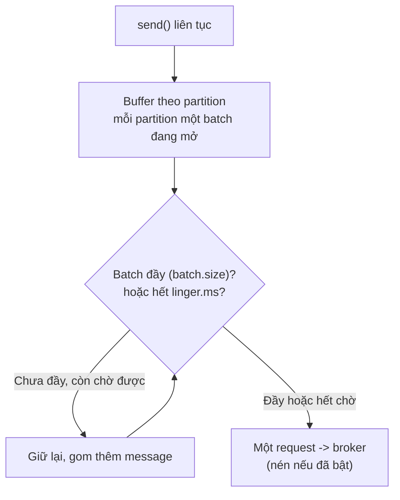

# linger.ms Và batch.size: Đổi Vài Mili-Giây Latency Lấy Vài Lần Throughput

Bài trước bật nén nhưng batch vẫn nhỏ thì nén chẳng được bao nhiêu. Bài này giải quyết đúng việc đó: làm batch to ra bằng hai núm vặn `linger.ms` và `batch.size`. Đây là cặp config throughput kinh điển — hiểu được nó là hiểu được vì sao Kafka nhanh.

---

## 1. Vấn đề: Gửi Ngay Thì Nhanh Nhưng Tốn, Gom Lại Thì Rẻ Nhưng Chậm?

Mặc định `linger.ms=0` nghĩa là `send()` xong là producer cố gửi đi càng sớm càng tốt. Với Wikimedia ~30 msg/s, mỗi request mang được vài message — thậm chí 1 message/request lúc vắng. Hậu quả:

- Số request/s cao → overhead TCP + header + ack trên mỗi request lớn.
- Mỗi batch nhỏ → compression (bài 072) không có gì để nén.
- Broker xử lý hàng nghìn request nhỏ thay vì hàng chục request lớn.

Ngược lại, nếu gom quá lâu (linger hàng trăm ms, batch hàng MB) thì latency tăng, RAM phình, message to hơn batch bị gửi lẻ. Bài toán là tìm điểm ngọt: chờ thêm *một chút* để batch đầy hơn, mà latency tăng không đáng kể.

## 2. Cơ chế: Smart Batching Của Kafka Hoạt Động Ra Sao?

### 2.1. Batching nền đã có sẵn, hai config chỉ khuếch đại nó

Ngay cả với `linger.ms=0`, Kafka vẫn batch một cách tự nhiên: trong lúc 5 request đang bay (`max.in.flight=5`) chưa ack, các `send()` mới tới phải xếp hàng — và chúng được gom thành batch tiếp theo. Đây gọi là smart batching: bận thì tự gom, rảnh thì gửi ngay, latency thấp mà throughput vẫn tốt.

`linger.ms` và `batch.size` can thiệp vào quá trình đó:



### 2.2. Minh họa với `linger.ms=5`

Producer nhận message 1, 2, 3 vào batch đang mở của partition 0. Thay vì gửi ngay, nó chờ tới 5ms. Trong 5ms đó message 4...20 tới thêm, tất cả vào cùng một batch. Hết 5ms → một request duy nhất mang 20 message. Không có linger, 20 message đó có thể đã thành 5-10 request.

### 2.3. Vai trò từng núm

- **`linger.ms` (default `0`):** thời gian tối đa chờ thêm message để làm đầy batch. Tăng lên 5–20ms: thêm vài ms latency ở phân vị thấp, đổi lại batch đầy hơn, request ít hơn, nén tốt hơn.
- **`batch.size` (default `16384` byte = 16KB):** trần kích thước mỗi batch **tính riêng cho từng partition**. Batch đầy trước khi hết linger thì gửi luôn, không chờ nữa. Message đơn lẻ to hơn `batch.size` thì không batch — gửi thẳng.

Hai núm này ràng buộc nhau: `linger.ms` cao mà `batch.size` vẫn 16KB thì batch đầy nhanh rồi gửi, chờ thêm vô ích. Muốn batch to thật phải tăng cả hai.

## 3. Config chi tiết: Ý nghĩa, Giá trị, Khi nào dùng

### 3.1. `linger.ms`

- **Ý nghĩa:** producer chờ tối đa bao lâu để gom thêm message vào batch trước khi gửi.
- **Giá trị mẫu:** `0` (default, gửi ngay) → lab này `20`; production throughput cao thường `5`–`100`.
- **Khi nào dùng:** tăng khi producer có throughput cao và chịu được thêm vài chục ms latency (streaming, log, event). Giữ `0` khi từng mili-giây đều quan trọng (giao dịch real-time, alert) — lúc đó chấp nhận request nhỏ.

### 3.2. `batch.size`

- **Ý nghĩa:** số byte tối đa trong một batch của một partition. Batch là đơn vị của một request và một lần nén.
- **Giá trị mẫu:** `16384` (16KB default) → lab này `32768` (32KB); production hay dùng `32KB`–`128KB`.
- **Khi nào dùng:** tăng cùng `linger.ms` khi message nhỏ và nhiều (JSON vài trăm byte như Wikimedia). Cẩn thận vì batch cấp phát **theo partition**: topic 100 partitions × batch 128KB = buffer tiềm năng hàng chục MB chỉ cho batch. Monitor metric `batch-size-avg` của producer để biết batch thực tế đầy tới đâu — tăng trần mà batch trung bình vẫn 5KB nghĩa là thiếu linger hoặc thiếu tải, không phải thiếu trần.

### 3.3. Công thức phối hợp chuẩn

```text
Muốn throughput cao: linger.ms=5-20 + batch.size=32-64KB + compression=snappy/lz4
Muốn latency thấp nhất: linger.ms=0 + batch.size=default + compression=none hoặc snappy
Không bao giờ: linger.ms=100 + batch.size=1MB "cho chắc" mà không đo - RAM và latency trả giá trước, lợi ích chưa chắc có.
```

## 4. Code ví dụ: Khối config throughput 2/3 (áp thật ở bài sau)

```java
import org.apache.kafka.clients.producer.ProducerConfig;
import java.util.Properties;

Properties props = new Properties();
props.setProperty(ProducerConfig.BOOTSTRAP_SERVERS_CONFIG, "127.0.0.1:9092");
props.setProperty(ProducerConfig.KEY_SERIALIZER_CLASS_CONFIG,
        "org.apache.kafka.common.serialization.StringSerializer");
props.setProperty(ProducerConfig.VALUE_SERIALIZER_CLASS_CONFIG,
        "org.apache.kafka.common.serialization.StringSerializer");

// SAFE giữ nguyên (070-071)
props.setProperty(ProducerConfig.ACKS_CONFIG, "all");
props.setProperty(ProducerConfig.ENABLE_IDEMPOTENCE_CONFIG, "true");
props.setProperty(ProducerConfig.RETRIES_CONFIG, Integer.toString(Integer.MAX_VALUE));

// THROUGHPUT: nén (072) + batch (bài này)
props.setProperty(ProducerConfig.COMPRESSION_TYPE_CONFIG, "snappy");
props.setProperty(ProducerConfig.LINGER_MS_CONFIG, "20");
props.setProperty(ProducerConfig.BATCH_SIZE_CONFIG, Integer.toString(32 * 1024));
```

Đối chiếu sau khi chạy: log phải hiện `linger.ms = 20`, `batch.size = 32768`, `compression.type = snappy`. Ba dòng này luôn đi cùng nhau — thấy một mà thiếu hai là preset dở dang.

## 5. Safe / High-Throughput preset tóm tắt

```java
// SAFE (giữ nguyên):
// acks=all, enable.idempotence=true, retries=MAX,
// delivery.timeout.ms=120000, max.in.flight=5

// THROUGHPUT (bài này hoàn thiện 3/3 cùng bài 072):
props.setProperty(ProducerConfig.COMPRESSION_TYPE_CONFIG, "snappy"); // 072
props.setProperty(ProducerConfig.LINGER_MS_CONFIG, "20");            // bài này
props.setProperty(ProducerConfig.BATCH_SIZE_CONFIG, Integer.toString(32 * 1024)); // bài này
```

Bài 074 sẽ dán nguyên khối này vào Wikimedia producer và chạy đo thật.

## 6. Cạm bẫy thường gặp

- **Tăng `linger.ms` rồi than producer chậm.** Đúng luật: mỗi record gánh thêm đúng `linger.ms` latency ở chiều gửi. Chấp nhận được cho streaming (20ms chẳng ai cảm nhận), không chấp nhận cho alert cháy nhà. Chọn theo SLA, không theo thói quen.
- **Tăng `batch.size` mà quên `linger.ms`.** Trần cao nhưng không chờ thì batch vẫn gửi non — giống xây bể lớn mà xả van liên tục. Hai núm phải đi cùng nhau.
- **Tăng `linger.ms` mà quên `batch.size`.** Chờ 50ms nhưng trần 16KB đầy sau 5ms thì 45ms còn lại chờ vô ích. Dấu hiệu: metric `batch-size-avg` bằng đúng `batch.size` mà throughput chưa tăng — hãy nâng trần.
- **Set `batch.size` khổng lồ trên topic nhiều partition.** 500 partitions × 256KB = 128MB buffer tiềm năng chỉ cho batch mở, chưa kể `buffer.memory`. Công thức kiểm tra: `batch.size × số partition producer ghi tới ≤ 1/3 buffer.memory`.
- **Message to hơn batch rồi tưởng batching hỏng.** Message 100KB với `batch.size=16KB` luôn đi một mình một request — đúng thiết kế, không phải bug. Muốn gom message to thì nâng trần lên trên kích thước message điển hình.
- **Đo throughput bằng mắt nhìn log.** Log `INFO` mỗi message làm producer chậm đi hàng chục lần, che lấp mọi hiệu quả batching. Benchmark thật phải tắt log per-message (hoặc log sampling), đo bằng metric/JMX.

## Kết luận

Tóm lại một câu: **`linger.ms` cho producer thêm vài mili-giây để gom, `batch.size` nới trần mỗi batch theo partition — cặp đôi này biến hàng nghìn request nhỏ thành hàng chục request lớn, và là đòn bẩy khuếch đại compression lên nhiều lần.**

Bài tiếp theo chúng ta dán cả ba dòng throughput (`snappy` + `linger.ms=20` + `batch.size=32KB`) vào Wikimedia producer, chạy thật và xác nhận consumer đọc bình thường không cần đổi gì.
