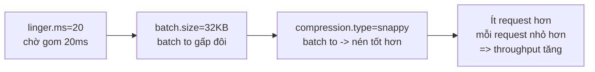

# High-Throughput Producer: Áp Snappy + Linger + Batch Vào Wikimedia Và Đo Thật

Ba bài lý thuyết vừa rồi cho ba mảnh: `compression.type` (072), `linger.ms` + `batch.size` (073). Bài này là bài thợ: dán cả ba vào Wikimedia producer, chạy thật, đọc log xác nhận, và chứng minh consumer không cần đổi gì. Đây cũng là preset throughput chuẩn để bạn copy cho mọi stream JSON text sau này.

---

## 1. Vấn đề: Lý Thuyết Đúng Nhưng Chưa Vào Code Thì Chưa Tính

Trước khi tuning, log baseline của Wikimedia producer hiện:

```text
batch.size = 16384
linger.ms = 0
compression.type = none
partitioner.class = org.apache.kafka.clients.producer.internals.DefaultPartitioner
```

Dịch ra: mỗi batch tối đa 16KB, không chờ gom (gửi ngay), không nén. Với JSON Wikimedia vài trăm byte/message, mỗi request mang được ít message, request/s cao, nén không có, disk và network gánh đủ. Producer vẫn chạy được (bài 065 đã chứng minh), nhưng đắt đỏ.

Mục tiêu bài này: với tối đa 20ms latency thêm vào, biến hàng nghìn request nhỏ thành hàng chục request lớn, nhỏ đi vài lần nhờ nén — mà phía consumer không hề biết.

## 2. Cơ Chế: Ba Dòng Này Cộng Hưởng Ra Sao?

Ba config không cộng tuyến tính mà khuếch đại lẫn nhau:



1. `linger.ms=20` cho producer 20ms để gom thêm message vào batch đang mở của từng partition.
2. `batch.size=32KB` nới trần để batch có chỗ chứa số message gom thêm đó (trần cũ 16KB sẽ đầy sớm, phí mất thời gian chờ).
3. `compression.type=snappy` nén cả batch to đó — batch càng to, tỉ lệ nén càng cao vì JSON lặp cấu trúc.

Bỏ một trong ba là mất cộng hưởng: có linger mà không nới batch thì batch đầy sớm; có batch to mà không linger thì batch gửi non; có cả hai mà không nén thì request to nhưng vẫn nặng.

### 2.1. Vì sao chọn đúng số này?

| Config | Baseline | Tuning | Vì sao số này |
|---|---|---|---|
| `compression.type` | `none` | `snappy` | JSON text: cân bằng CPU/nén tốt nhất, an toàn làm default |
| `linger.ms` | `0` | `20` | Đủ gom ở ~30 msg/s mà latency thêm không đáng kể cho streaming |
| `batch.size` | `16384` (16KB) | `32768` (32KB) | Gấp đôi default: batch to hơn rõ rệt mà RAM thêm không đáng kể |

Đây là điểm bắt đầu, không phải đáp án cuối. Production phải benchmark `linger.ms` 5/20/50 và `batch.size` 32/64KB trên data thật rồi chốt. Nhưng nếu chưa biết bắt đầu từ đâu, bắt đầu từ ba số này.

## 3. Config Chi Tiết: Nhắc Lại Một Dòng Mỗi Cái Để Tra Cứu

### 3.1. `compression.type`

- **Ý nghĩa:** thuật toán nén batch trước khi gửi. Đã mổ ở bài 072.
- **Giá trị mẫu:** `snappy` cho Wikimedia và mọi JSON/log text.
- **Khi nào dùng:** luôn bật cho stream text throughput cao; bỏ qua cho dữ liệu đã nén sẵn.

### 3.2. `linger.ms`

- **Ý nghĩa:** chờ tối đa bao lâu để gom thêm message. Đã mổ ở bài 073.
- **Giá trị mẫu:** `20` cho lab này; production streaming thường `5`–`100`.
- **Khi nào dùng:** tăng khi chịu được thêm vài chục ms latency; giữ `0` cho real-time nghiêm ngặt.

### 3.3. `batch.size`

- **Ý nghĩa:** trần byte mỗi batch theo partition. Đã mổ ở bài 073.
- **Giá trị mẫu:** `32 * 1024` (32KB) cho lab này.
- **Khi nào dùng:** tăng cùng `linger.ms` khi message nhỏ và nhiều; kiểm tra `batch.size × số partition ≤ 1/3 buffer.memory`.

### 3.4. `partitioner.class` (chỉ quan sát, chưa đổi)

- **Ý nghĩa:** class quyết định record vào partition nào.
- **Giá trị mẫu:** `org.apache.kafka.clients.producer.internals.DefaultPartitioner` — bản 2.4+ đã là sticky partitioner cho key null.
- **Khi nào dùng:** để default. Bài 075 sẽ mổ vì sao default này đã tối ưu cho Wikimedia (key null).

## 4. Code Ví Dụ: Dán Preset Vào WikimediaChangesProducer

### 4.1. Khối code hoàn chỉnh

```java
import org.apache.kafka.clients.producer.KafkaProducer;
import org.apache.kafka.clients.producer.ProducerConfig;
import org.apache.kafka.common.serialization.StringSerializer;
import java.util.Properties;

Properties props = new Properties();
props.setProperty(ProducerConfig.BOOTSTRAP_SERVERS_CONFIG, "127.0.0.1:9092");
props.setProperty(ProducerConfig.KEY_SERIALIZER_CLASS_CONFIG, StringSerializer.class.getName());
props.setProperty(ProducerConfig.VALUE_SERIALIZER_CLASS_CONFIG, StringSerializer.class.getName());

// ===== SAFE preset - giữ nguyên từ bài 070-071, không được xóa =====
props.setProperty(ProducerConfig.ACKS_CONFIG, "all");
props.setProperty(ProducerConfig.ENABLE_IDEMPOTENCE_CONFIG, "true");
props.setProperty(ProducerConfig.RETRIES_CONFIG, Integer.toString(Integer.MAX_VALUE));
// ===================================================================

// ===== HIGH-THROUGHPUT preset - thêm mới ở bài này =====
props.setProperty(ProducerConfig.COMPRESSION_TYPE_CONFIG, "snappy");
props.setProperty(ProducerConfig.LINGER_MS_CONFIG, "20");
props.setProperty(ProducerConfig.BATCH_SIZE_CONFIG, Integer.toString(32 * 1024));
// =======================================================

KafkaProducer<String, String> producer = new KafkaProducer<>(props);
```

Lưu ý code: `32 * 1024` phải bọc `Integer.toString(...)` vì `setProperty` nhận String. Trong transcript gốc có chỗ đọc nhầm `32 * 124` — giá trị đúng là `32 * 1024 = 32768`.

### 4.2. Quy trình chạy và đối chiếu (làm đúng thứ tự)

1. Start một console consumer trước để hứng data mới:

```bash
kafka-console-consumer.sh --bootstrap-server localhost:9092 --topic wikimedia.recentchange
```

2. Run producer, để chạy 1–2 phút, rồi Stop.
3. Mở log khởi động, xác nhận ba dòng:

```text
batch.size = 32768
compression.type = snappy
linger.ms = 20
```

4. Nhìn sang consumer: JSON vẫn hiện nguyên vẹn, không lỗi, không cần config gì thêm. Đây là bằng chứng nén + batch trong suốt với consumer.
5. (Tùy chọn) Mở class `DefaultPartitioner` trong IDE, tìm `StickyPartitionCache` — bằng chứng producer đang dùng sticky partitioner cho key null (chi tiết bài 075).

## 5. Safe / High-Throughput Preset Tóm Tắt (Bảng Tra Cứu Nhanh)

Đây là một trong hai bài phải trình bày preset rõ ràng. Dưới đây là toàn bộ config Wikimedia sau bài này:

```java
// ===== WIKIMEDIA PRODUCER - FULL PRESET sau bài 074 =====
// --- SAFE (bài 070-071) ---
// acks=all, enable.idempotence=true, retries=Integer.MAX_VALUE,
// delivery.timeout.ms=120000 (default), max.in.flight.requests.per.connection=5 (default)
// --- HIGH-THROUGHPUT (bài này) ---
// compression.type=snappy, linger.ms=20, batch.size=32768 (32KB)
// --- CHƯA ĐỔI ---
// partitioner.class=DefaultPartitioner (sticky, default tốt),
// buffer.memory=33554432 (32MB default), max.block.ms=60000 (default)
// --- BROKER LOCAL ---
// replication.factor=1, min.insync.replicas=1 (prod: 3 và 2)
```

| Nhóm | Config | Giá trị |
|---|---|---|
| Safe | `acks` | `all` |
| Safe | `enable.idempotence` | `true` |
| Safe | `retries` | `2147483647` |
| Throughput | `compression.type` | `snappy` |
| Throughput | `linger.ms` | `20` |
| Throughput | `batch.size` | `32768` |

Từ đây tới hết section, mọi bài sau (075–076) chỉ giải thích thêm hành vi, không đổi số trong bảng này.

## 6. Cạm Bẫy Thường Gặp

- **Copy nhầm `32 * 124`.** Lỗi đọc trong video gốc. `32 * 124 = 3968` byte còn nhỏ hơn default 16KB — tuning ngược. Luôn là `32 * 1024`.
- **Quên `Integer.toString` cho `batch.size`.** `setProperty` nhận String; truyền int là lỗi compile. `linger.ms` viết `"20"` trực tiếp được vì đã là String.
- **Đo throughput bằng mắt nhìn log INFO.** Log mỗi message làm producer chậm hàng chục lần, che hết hiệu quả batching. Benchmark thật: hạ log xuống WARN hoặc log sampling (1/1000), đo bằng metric producer hoặc tốc độ tăng của topic.
- **Đổi config mà không restart producer.** Producer đọc props một lần lúc `new KafkaProducer`. Sửa code mà bấm Run lại bản cũ (nhầm module như bài 063) thì log vẫn số cũ — luôn đối chiếu log sau mỗi lần đổi.
- **Hết hồn vì latency tăng 20ms.** Đúng thiết kế: mỗi record gánh thêm tối đa `linger.ms`. Với dashboard phân tích Wikimedia thì 20ms vô hình; với alert real-time thì cân nhắc lại. Tuning nào cũng có giá — quan trọng là trả đúng chỗ.
- **Bật throughput rồi quên safe.** Thứ tự đúng: safe trước (070–071), nhanh sau (072–074). Ai đó "dọn code" xóa ba dòng safe vì "default đã đúng" là quay về rủi ro version. Hai khối phải sống cùng nhau.

## Kết Luận

Tóm lại một câu: **dán `compression.type=snappy` + `linger.ms=20` + `batch.size=32KB` lên trên preset Safe, chạy lại thấy log đổi đúng ba dòng và consumer đọc bình thường — bạn đã có một Wikimedia producer vừa bền vừa nhanh, giá chỉ là 20ms latency.**

Bài tiếp theo chúng ta trả lời câu hỏi còn bỏ ngỏ từ bài 064: message key null dàn đều 3 partitions bằng cơ chế nào — qua `DefaultPartitioner`, round-robin cũ và sticky partitioner mới nhanh hơn ra sao.
